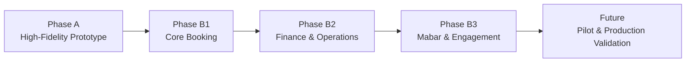
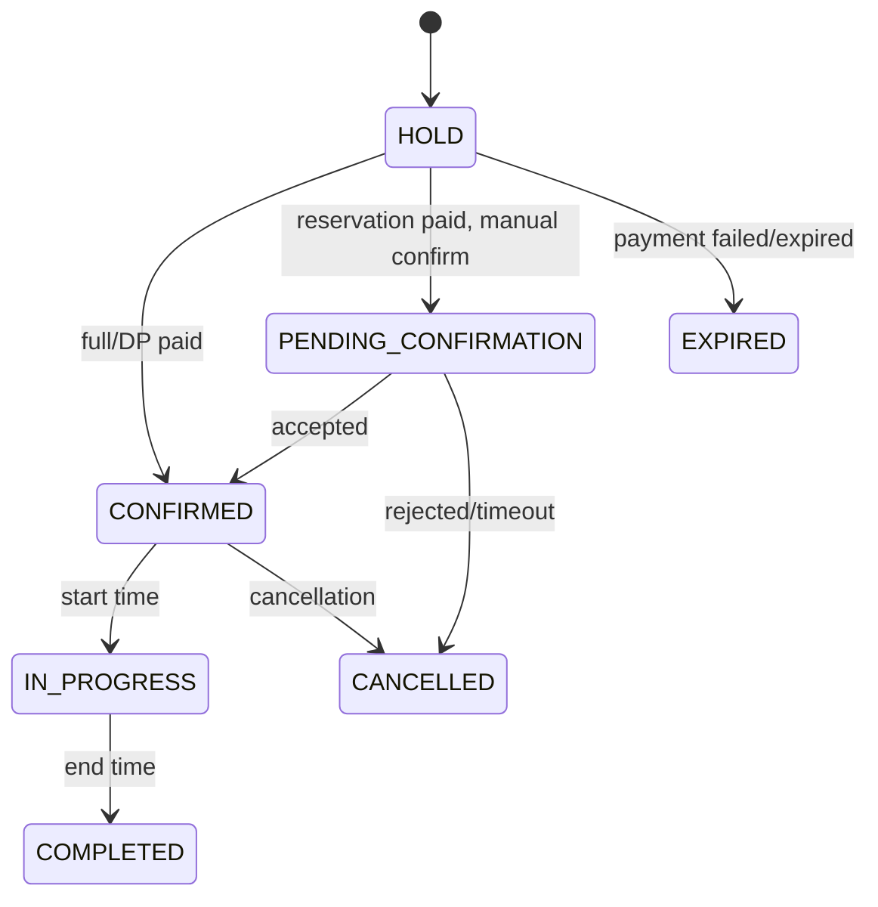
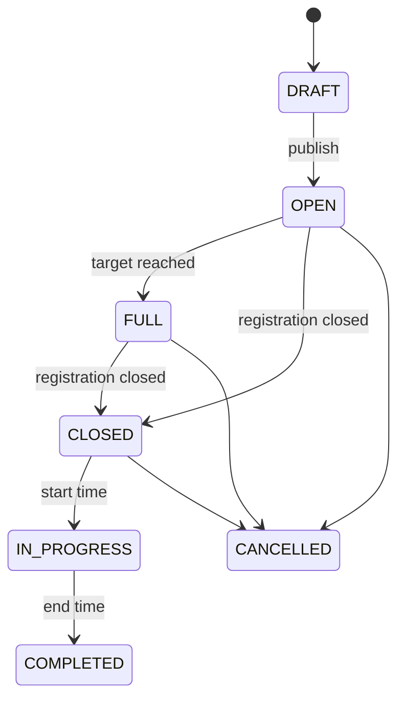
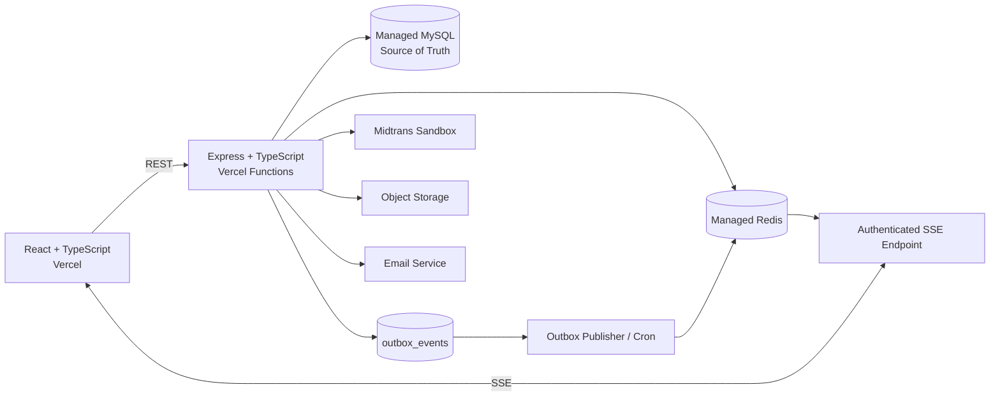

# LapanganGo Business Requirements Document (BRD)

**LapanganGo - Marketplace Booking Lapangan Multi-Tenant**

Baseline bisnis untuk prototype, demo sandbox, dan arah pengembangan setelah validasi pengguna.

| Fase | Fokus |
|---|---|
| Phase A | High-Fidelity Interactive Prototype |
| Phase B1 | Core Booking |
| Phase B2 | Finance and Operations |
| Phase B3 | Mabar and Engagement |

> [!IMPORTANT]
> **Batas penggunaan**
>
> Dokumen ini adalah baseline produk untuk prototype dan demo sandbox. Pembayaran, saldo owner, settlement, dan payout pada Phase B tidak memindahkan uang nyata serta tidak boleh diklaim production-ready.

## Kontrol Dokumen

| **Elemen**          | **Nilai**                                                                                  |
|---------------------|--------------------------------------------------------------------------------------------|
| Pemilik dokumen     | Project Owner / Product Lead                                                               |
| Versi               | 1.0                                                                                        |
| Status              | Baseline kebutuhan disetujui                                                               |
| Ruang lingkup       | Phase A, Phase B1, Phase B2, Phase B3                                                      |
| Sumber              | Keputusan interview kebutuhan 1-150                                                        |
| Stack baseline      | React + TypeScript; Express + TypeScript; MySQL; Redis; Midtrans Sandbox; Vercel; Tailwind |
| Batas produksi      | Belum production-ready; pembayaran dan payout Phase B adalah sandbox/simulasi              |
| Mekanisme perubahan | Change request dengan analisis dampak bisnis, produk, data, keamanan, dan fase             |

> [!NOTE]
> **Change control**
>
> Keputusan pada baseline ini tidak diubah secara diam-diam. Perubahan scope, aturan bisnis, state transition, atau data model wajib dicatat sebagai change request beserta dampak fase, risiko, dan acceptance criteria.

## Daftar Isi

- [1. Ringkasan Eksekutif](#1-ringkasan-eksekutif)
- [2. Konteks dan Masalah Bisnis](#2-konteks-dan-masalah-bisnis)
- [3. Visi, Sasaran, dan Ukuran Keberhasilan](#3-visi-sasaran-dan-ukuran-keberhasilan)
  - [3.1 Visi Produk](#31-visi-produk)
  - [3.2 Sasaran Bisnis](#32-sasaran-bisnis)
  - [3.3 Ukuran Keberhasilan Baseline](#33-ukuran-keberhasilan-baseline)
- [4. Stakeholder dan Peran](#4-stakeholder-dan-peran)
  - [4.1 Prinsip Akun dan Workspace](#41-prinsip-akun-dan-workspace)
- [5. Model Operasi Multi-Tenant](#5-model-operasi-multi-tenant)
  - [5.1 Business Workspace](#51-business-workspace)
- [6. Ruang Lingkup dan Tahapan Delivery](#6-ruang-lingkup-dan-tahapan-delivery)
  - [6.1 Gate Antar Fase](#61-gate-antar-fase)
- [7. Kapabilitas Bisnis Utama](#7-kapabilitas-bisnis-utama)
- [8. Onboarding dan Verifikasi Owner](#8-onboarding-dan-verifikasi-owner)
  - [8.1 Kandidat Dokumen untuk Production](#81-kandidat-dokumen-untuk-production)
- [9. Model Pendapatan, Harga, dan Promo](#9-model-pendapatan-harga-dan-promo)
  - [9.1 Model Pendapatan](#91-model-pendapatan)
  - [9.2 Resolusi Harga](#92-resolusi-harga)
  - [9.3 Promo](#93-promo)
  - [9.4 Pajak](#94-pajak)
- [10. Booking, Ketersediaan, dan Operasional Venue](#10-booking-ketersediaan-dan-operasional-venue)
  - [10.1 Model Venue dan Lapangan](#101-model-venue-dan-lapangan)
  - [10.2 Availability](#102-availability)
  - [10.3 Booking Window dan Closure](#103-booking-window-dan-closure)
  - [10.4 Booking Offline](#104-booking-offline)
- [11. Pembayaran, Refund, Ledger, dan Payout](#11-pembayaran-refund-ledger-dan-payout)
  - [11.1 Metode Pembayaran](#111-metode-pembayaran)
  - [11.2 Refund dan Reschedule](#112-refund-dan-reschedule)
  - [11.3 Ledger dan Earning](#113-ledger-dan-earning)
  - [11.4 Arah Production](#114-arah-production)
- [12. Mabar](#12-mabar)
- [13. Customer Experience, Trust, dan Support](#13-customer-experience-trust-dan-support)
  - [13.1 Discovery dan Engagement](#131-discovery-dan-engagement)
  - [13.2 Review](#132-review)
  - [13.3 Notifikasi dan Support](#133-notifikasi-dan-support)
- [14. Data, Keamanan, dan Real-Time](#14-data-keamanan-dan-real-time)
  - [14.1 Prinsip Data](#141-prinsip-data)
  - [14.2 Keamanan Baseline](#142-keamanan-baseline)
  - [14.3 Real-Time](#143-real-time)
- [15. Risiko, Asumsi, dan Ketergantungan](#15-risiko-asumsi-dan-ketergantungan)
  - [15.1 Ketergantungan Eksternal](#151-ketergantungan-eksternal)
- [16. Out of Scope dan Arah Masa Depan](#16-out-of-scope-dan-arah-masa-depan)
  - [16.1 Trigger Menuju Production](#161-trigger-menuju-production)
- [17. Governance, QA Gate, dan Readiness](#17-governance-qa-gate-dan-readiness)
  - [17.1 Governance](#171-governance)
  - [17.2 Seed Data Demo](#172-seed-data-demo)
  - [17.3 Master Business Acceptance](#173-master-business-acceptance)
- [18. Glosarium dan Traceability](#18-glosarium-dan-traceability)
  - [18.1 Traceability Keputusan Interview](#181-traceability-keputusan-interview)

## 1. Ringkasan Eksekutif

LapanganGo adalah marketplace booking lapangan olahraga yang menghubungkan customer dengan organisasi pemilik venue. Produk dibangun ulang dari nol sebagai sistem multi-tenant: satu organisasi dapat mengelola banyak venue, setiap venue memiliki beberapa lapangan, dan operasional dapat dijalankan oleh owner serta staff dengan permission yang terkontrol.

Tahap awal tidak langsung diarahkan ke transaksi uang nyata. Strategi delivery dimulai dari prototype high-fidelity, dilanjutkan demo terintegrasi menggunakan Midtrans Sandbox, ledger simulasi, saldo owner virtual, dan payout simulasi. Pilot atau production baru dipertimbangkan setelah demo memperoleh calon pengguna dan pendapatan dapat menutup biaya infrastruktur yang lebih permanen.

| Kolom 1 | Kolom 2 | Kolom 3 |
| --- | --- | --- |
| **PRINSIP UTAMA**<br>**0 double booking**<br>Satu slot aktif hanya dapat dialokasikan ke satu booking. | **NILAI OWNER**<br>**Tanpa spreadsheet**<br>Jadwal, booking, pembayaran, dan laporan dikelola dalam aplikasi. | **NILAI CUSTOMER**<br>**Self-service**<br>Customer dapat mencari, memesan, membayar, dan mengelola booking sendiri. |



Gambar 1. Strategi delivery LapanganGo dari prototype menuju validasi bisnis.

> [!NOTE]
> **Keputusan strategis**
>
> Phase A dan Phase B adalah alat validasi produk serta portofolio teknis. KYC production, uang nyata, payout nyata, dan kepatuhan operasional merchant tidak termasuk sampai ada keputusan go-to-production.

## 2. Konteks dan Masalah Bisnis

Pasar venue olahraga sering bergantung pada komunikasi WhatsApp, telepon, catatan manual, dan spreadsheet. Customer tidak selalu mengetahui jadwal yang benar-benar tersedia, sedangkan owner harus menyatukan booking dari beberapa kanal. Kondisi ini menciptakan risiko double booking, kehilangan pendapatan, pencatatan pembayaran yang tidak konsisten, dan ketergantungan pada individu tertentu.

| **Masalah**                             | **Dampak**                                                  | **Respons LapanganGo**                                               |
|-----------------------------------------|-------------------------------------------------------------|----------------------------------------------------------------------|
| Ketersediaan tidak transparan           | Customer bertanya berulang dan gagal memperoleh slot.       | Pencarian berbasis tanggal/jam dengan status slot terkini.           |
| Booking tersebar di banyak kanal        | Jadwal online dan offline dapat bertabrakan.                | Satu sumber ketersediaan untuk booking online dan offline.           |
| Operasional owner manual                | Rekonsiliasi, laporan, dan tindak lanjut lambat.            | Dashboard workflow, kalender, ledger, export, dan audit log.         |
| Pembayaran dan refund tidak terstruktur | Sengketa sulit dijelaskan.                                  | Payment attempt, snapshot harga, refund policy, dan ledger terpisah. |
| Sulit mencari teman bermain             | Lapangan tidak penuh dan customer kesulitan membentuk grup. | Mabar dari booking terkonfirmasi, seat hold, dan waitlist.           |
| Platform sulit dimonetisasi secara adil | Owner baru enggan membayar sebelum ada manfaat.             | Komisi trial 0%, komisi normal configurable, subscription ditunda.   |

> [!WARNING]
> **Problem statement**
>
> LapanganGo harus membuat ketersediaan dapat dipercaya, transaksi dapat dijelaskan, dan operasional venue dapat dijalankan tanpa spreadsheet - tanpa menjadikan fitur real-time atau Redis sebagai sumber kebenaran bisnis.

## 3. Visi, Sasaran, dan Ukuran Keberhasilan

### 3.1 Visi Produk

Menjadi platform operasional dan discovery venue olahraga yang membuat customer dapat memesan secara mandiri, owner dapat mengelola bisnis secara terukur, dan komunitas dapat membentuk aktivitas Mabar dengan risiko transaksi yang terkendali.

### 3.2 Sasaran Bisnis

- Mengurangi friksi customer dalam menemukan venue, jadwal, harga, dan metode pembayaran.

- Menghilangkan double booking melalui alokasi slot transaksional yang sama untuk kanal online dan offline.

- Memberi owner alat untuk mengelola venue, lapangan, harga, staff, booking, pembayaran, refund, dan laporan.

- Membangun model komisi yang dapat dikonfigurasi per tenant serta dapat diuji tanpa uang nyata.

- Memvalidasi Mabar sebagai engagement loop tanpa langsung menerapkan arus dana peserta yang nyata.

- Menyediakan demo teknis yang dapat berkembang ke VPS atau arsitektur always-on tanpa rewrite domain inti.

### 3.3 Ukuran Keberhasilan Baseline

| **ID** | **Ukuran**             | **Definisi Keberhasilan**                                                                            |
|--------|------------------------|------------------------------------------------------------------------------------------------------|
| KPI-01 | Integritas slot        | Tidak ada dua booking aktif yang memiliki court slot yang sama.                                      |
| KPI-02 | Self-service customer  | Alur cari -> pilih slot -> checkout -> hasil transaksi selesai tanpa bantuan admin.               |
| KPI-03 | Operasional owner      | Owner dapat mengelola jadwal, booking, pembayaran, dan laporan tanpa spreadsheet.                    |
| KPI-04 | Traceability finansial | Gross, diskon, komisi, fee, hak owner, refund, dan payout dapat dijelaskan oleh snapshot + ledger.   |
| KPI-05 | Tenant isolation       | Pengguna tidak dapat membaca atau mengubah data tenant/venue yang tidak berhak diakses.              |
| KPI-06 | Ketahanan event        | Webhook/event duplikat atau tidak berurutan tidak menggandakan state atau ledger.                    |
| KPI-07 | Real-time UX           | Perubahan slot dan operasional utama terlihat tanpa refresh, dengan fallback REST saat stream gagal. |

> [!NOTE]
> **Target komersial belum dipaksakan**
>
> Jumlah venue, customer, dan booking awal belum ditetapkan karena wilayah peluncuran belum dipilih. Target akuisisi ditentukan setelah prototype diuji dan calon venue pertama teridentifikasi.

## 4. Stakeholder dan Peran

| **Stakeholder**         | **Kepentingan**                                          | **Tanggung Jawab Utama**                                                                              |
|-------------------------|----------------------------------------------------------|-------------------------------------------------------------------------------------------------------|
| Customer                | Menemukan dan memesan lapangan; mengikuti Mabar.         | Menjaga data akun, membayar, mengikuti kebijakan, check-in, memberi review valid.                     |
| Primary Owner           | Mengelola organisasi, venue, keuangan, dan risiko.       | Mengatur tenant, rekening payout, owner/co-owner, kebijakan, serta otorisasi sensitif.                |
| Owner / Business Member | Mengelola satu atau lebih venue.                         | Mengatur venue, lapangan, jadwal, harga, promo, booking, serta laporan sesuai permission.             |
| Staff Venue             | Menjalankan operasional harian.                          | Booking offline, konfirmasi, check-in, pelunasan di lokasi, dan tindakan sesuai assignment.           |
| Admin Apps              | Menjaga platform, master data, verifikasi, dan sengketa. | Verifikasi tenant/venue, komisi, template kebijakan, promo platform, audit, support, dan konfigurasi. |
| Platform Operator       | Mengelola teknologi dan reliabilitas.                    | Deploy, monitoring, incident response, backup, secret, dan integrasi provider.                        |
| Payment Provider        | Menyediakan simulasi payment pada Phase B.               | Midtrans Sandbox; provider status diterjemahkan ke state internal.                                    |

### 4.1 Prinsip Akun dan Workspace

- Satu identitas dapat menggunakan Mode Customer dan memiliki membership pada satu atau lebih tenant.

- Satu pengguna dapat menjadi Primary Owner pada beberapa tenant, tetapi setiap tenant harus melalui verifikasi admin.

- Admin platform memakai login serta route terpisah dari customer/business workspace.

- Staff menggunakan aplikasi bisnis yang sama dengan owner; menu dan data dibatasi oleh permission serta venue assignment.

- Mode UI aktif hanya satu pada satu waktu agar navigasi tidak membingungkan.

## 5. Model Operasi Multi-Tenant

```text
Platform LapanganGo
├── Tenant / Organisasi A
│ ├── Venue A1
│ │ ├── Lapangan 1 - Futsal
│ │ └── Lapangan 2 - Badminton
│ └── Venue A2
└── Tenant / Organisasi B
└── Venue B1
```

Contoh struktur tenant, venue, lapangan, dan olahraga.

| **Aturan**           | **Keputusan Bisnis**                                                                        |
|----------------------|---------------------------------------------------------------------------------------------|
| **Tenant**           | Mewakili satu organisasi/bisnis owner dan dapat memiliki banyak venue.                      |
| **Primary Owner**    | Tepat satu per tenant pada satu waktu; perpindahan ownership wajib diaudit.                 |
| **Keanggotaan**      | Pengguna dapat menjadi anggota beberapa tenant dengan role dan status terpisah.             |
| **Venue assignment** | Staff dapat ditugaskan ke beberapa venue dalam tenant yang sama.                            |
| **Permission**       | Template disediakan platform; owner dapat menyesuaikan permission mulai Phase B2.           |
| **Data isolation**   | Setiap query bisnis harus dibatasi oleh tenant context dan, bila relevan, venue assignment. |
| **Admin override**   | Tindakan admin sensitif memiliki alasan, audit log, dan tidak menghapus riwayat transaksi.  |

### 5.1 Business Workspace

Navigasi business menggunakan workflow: Beranda, Operasional, Kelola Venue, Keuangan, Customer & Pertumbuhan, Tim, dan Pengaturan. Header menyediakan tenant switcher, venue scope selector, pencarian, status koneksi real-time, notifikasi, dan profil.

> [!IMPORTANT]
> **Guardrail multi-tenant**
>
> Menyembunyikan menu bukan kontrol keamanan. Backend tetap memverifikasi user, membership, permission, tenant, venue assignment, dan resource ownership pada setiap write serta read sensitif.

## 6. Ruang Lingkup dan Tahapan Delivery


| **Fase** | **Tujuan**              | **In Scope**                                                                                                                   | **Batas**                                                                           |
|----------|-------------------------|--------------------------------------------------------------------------------------------------------------------------------|-------------------------------------------------------------------------------------|
| Phase A  | Prototype high-fidelity | React + TypeScript; mock data; role switcher; responsive; seluruh alur utama dapat diklik.                                     | Tidak ada backend, MySQL, Redis, Midtrans, upload dokumen asli, atau transaksi.     |
| Phase B1 | Core Booking            | Auth; tenant/venue/court; schedule; pricing; search; booking online/offline; Midtrans Sandbox; hold; check-in; real-time core. | Belum ada finance lengkap, payout, custom permission penuh, atau Mabar operasional. |
| Phase B2 | Finance and Operations  | Komisi; promo; refund; reschedule; ledger; saldo/payout simulasi; permission; notif/email; review; support; export.            | Seluruh nilai finansial tetap sandbox/simulasi.                                     |
| Phase B3 | Mabar and Engagement    | Mabar, participant, seat hold, waitlist, kontribusi simulasi; favorit; viewed history; recommendation sections.                | Tidak ada transfer uang peserta ke creator atau split payment nyata.                |
| Future   | Pilot / production      | Real merchant onboarding, KYC, uang nyata, payout nyata, compliance review, SLA, dan infrastruktur always-on.                  | Hanya dimulai setelah validasi pengguna, legal/provider review, dan biaya tertutup. |

### 6.1 Gate Antar Fase

```text
Phase A selesai
-> QA manual oleh Project Owner
-> Temuan diperbaiki
-> Prototype dinyatakan stabil
-> Phase B1 dimulai
Gate yang sama berlaku:
B1 -> B2 -> B3
```

Automated test tetap wajib pada fase terintegrasi, tetapi keputusan melanjutkan fase berasal dari QA manual dan review acceptance criteria - bukan klaim keberhasilan AI atau implementasi semata.

## 7. Kapabilitas Bisnis Utama

| **ID** | **Kapabilitas** | **Ringkasan**                                                                                                   |
|--------|-----------------|-----------------------------------------------------------------------------------------------------------------|
| CAP-01 | Discovery Venue | Pencarian nama, olahraga, kota, tanggal/jam, harga, indoor/outdoor, fasilitas, rating, payment mode, dan promo. |
| CAP-02 | Venue Catalog   | Profil, galeri, fasilitas, olahraga, lapangan, kebijakan, koordinat, dan publication workflow.                  |
| CAP-03 | Availability    | Jadwal mingguan, exceptions, libur, maintenance, buffer, interval, booking window, dan unified slot allocation. |
| CAP-04 | Pricing         | Base, weekday/weekend, day/time, special date, add-on, snapshot, dan conflict detection.                        |
| CAP-05 | Booking         | Full, DP, pay-at-venue, hold 10 menit, online/offline, check-in, no-show, cancel, reschedule.                   |
| CAP-06 | Payment         | Multiple attempts, provider adapter, webhook verification, payment summary, late-payment handling.              |
| CAP-07 | Promotion       | Platform/owner promo, scope, quota, budget, minimum amount, cap, dan redemption concurrency.                    |
| CAP-08 | Finance         | Commission, earning, double-entry ledger, refund, dispute, balance, payout simulation, export.                  |
| CAP-09 | Workforce       | Membership, venue assignment, role template, custom permission, invitation, audit.                              |
| CAP-10 | Mabar           | Confirmed-booking origin, fixed seat price, capacity, approval, seat hold, waitlist, cancellation.              |
| CAP-11 | Trust           | Review verified booking, moderation, support tickets, reports, owner verification simulation.                   |
| CAP-12 | Real-Time       | SSE updates backed by Redis/outbox, reconnect, resync, and REST fallback.                                       |

## 8. Onboarding dan Verifikasi Owner

Owner mendaftar sendiri dan mengajukan tenant untuk diverifikasi admin. Phase B menggunakan data serta dokumen simulasi agar alur approve, reject, dan revision-required dapat didemonstrasikan tanpa mengumpulkan dokumen pribadi asli.

| **Tahap**        | **Status**          | **Business Rule**                                                               |
|------------------|---------------------|---------------------------------------------------------------------------------|
| Pembuatan tenant | DRAFT               | Owner mengisi profil organisasi dan menyimpan tanpa publikasi.                  |
| Pengajuan        | SUBMITTED           | Data minimum lengkap; sistem mengunci versi pengajuan untuk review.             |
| Review admin     | UNDER_REVIEW        | Admin memeriksa identitas simulasi, hubungan pengelola, data bisnis, dan venue. |
| Perbaikan        | REVISION_REQUIRED   | Admin memberi alasan terstruktur; owner memperbarui lalu submit ulang.          |
| Keputusan        | APPROVED / REJECTED | Approval membuka pengajuan venue; rejection tidak menghapus histori.            |
| Pengawasan       | SUSPENDED           | Admin dapat menangguhkan tenant/venue dengan alasan dan dampak yang terlihat.   |

### 8.1 Kandidat Dokumen untuk Production

Ketika masuk production, daftar dokumen wajib harus divalidasi ulang bersama legal counsel, payment provider, dan pemerintah daerah target. Kandidat data mencakup:

- Identitas penanggung jawab dan bukti hak mengelola venue.

- Data usaha serta perizinan berusaha yang relevan dengan kegiatan venue.

- Data rekening penerima yang dapat diverifikasi.

- Dokumen bangunan/kelaikan secara kondisional berdasarkan jenis venue dan wilayah.

- Persetujuan pemrosesan data, tujuan penggunaan, retensi, akses, dan penghapusan.

> [!NOTE]
> **Data minimization**
>
> KTP, NIB, dokumen bangunan, atau data rekening nyata tidak dikumpulkan pada Phase A/B. Dokumen verifikasi production harus private, memakai signed URL, akses terbatas, audit trail, dan kebijakan retensi.

## 9. Model Pendapatan, Harga, dan Promo

### 9.1 Model Pendapatan

| **Elemen**              | **Keputusan**                                                                                                  |
|-------------------------|----------------------------------------------------------------------------------------------------------------|
| **Strategi awal**       | Komisi per booking; subscription owner ditunda sampai manfaat produk terbukti.                                 |
| **Komisi default**      | Diinput admin secara global; contoh baseline dapat 7%, bukan hard-coded.                                       |
| **Tenant override**     | Admin dapat membuat rate khusus dengan effective date, expiry, alasan, dan audit.                              |
| **Trial**               | 0% sampai batas hari atau completed booking tercapai lebih dahulu; batas configurable.                         |
| **Booking offline**     | 0% komisi, tetapi masuk laporan dan memakai availability yang sama.                                            |
| **Online pay-at-venue** | Menggunakan uang reservasi online sebagai bagian dari harga agar platform memiliki aliran biaya yang tercatat. |
| **Gateway fee**         | Default diambil dari komisi platform; selama trial 0% dapat dibebankan/subsidi per program tenant.             |
| **Pengakuan komisi**    | PENDING setelah pembayaran, EARNED setelah layanan selesai, REVERSED saat refund/koreksi.                      |

### 9.2 Resolusi Harga

```text
Prioritas rule:
1. Special date
2. Day + time
3. Weekday / weekend
4. Base price
Spesifisitas:
Court-specific rule -> venue-wide fallback
Konflik:
Rule dengan level + scope + court + periode aktif yang sama
tidak boleh overlap.
```

Harga final dan seluruh komponen pembentuknya disimpan sebagai snapshot pada booking. Perubahan rule, add-on, komisi, atau promo setelah checkout tidak mengubah transaksi lama.

### 9.3 Promo

| **Jenis**      | **Sumber Dana** | **Dampak Komisi**                                             | **Kontrol**                                                                        |
|----------------|-----------------|---------------------------------------------------------------|------------------------------------------------------------------------------------|
| Owner promo    | Tenant/owner    | Mengurangi hak owner dan dasar komisi.                        | Scope tenant/venue/sport/court, quota, user limit, min amount, cap, period.        |
| Platform promo | Platform        | Tidak mengurangi hak owner atau dasar komisi sebelum subsidi. | Budget total, max per transaction, period, quota, allowed tenant/venue, auto-stop. |

- Satu kode promo per booking.

- Kode case-insensitive.

- Mendukung persentase dan nominal tetap.

- Dapat dibatasi berdasarkan waktu, booking pertama, metode pembayaran, dan scope bisnis.

- Redemption serta budget reservation diproses transaksional untuk mencegah overuse.

- Promo otomatis ditunda; Phase B fokus pada kode promo.

### 9.4 Pajak

Pada Phase A/B, harga dianggap final dan telah mencakup kewajiban pajak yang menjadi tanggung jawab owner. Tidak ada tax engine. Struktur snapshot tetap menyediakan ruang untuk komponen pajak ketika aturan production telah ditentukan.

## 10. Booking, Ketersediaan, dan Operasional Venue

### 10.1 Model Venue dan Lapangan

- Satu venue dapat menawarkan banyak jenis olahraga.

- Jenis olahraga dibuat oleh admin; owner memilih dari master data.

- Satu lapangan fisik hanya memiliki satu jenis olahraga pada baseline.

- Interval booking dipilih owner dari daftar yang dibuat admin.

- Customer dapat memilih beberapa slot berurutan sampai batas durasi lapangan/platform.

- Buffer antarpemesanan dipilih dari opsi admin dan ikut memengaruhi availability.

### 10.2 Availability

| **Sumber**             | **Contoh**                                         | **Dampak**                                    |
|------------------------|----------------------------------------------------|-----------------------------------------------|
| Weekly schedule        | Jam operasional per hari dan lapangan.             | Membentuk slot dasar.                         |
| Special date exception | Jam khusus, tutup, atau override tanggal tertentu. | Menggantikan weekly schedule.                 |
| Court/venue block      | Maintenance, internal event, temporary closure.    | Mencegah slot dipilih.                        |
| Online booking         | Customer checkout dan pembayaran.                  | Hold/confirmed memakai alokasi slot.          |
| Offline booking        | Walk-in, WhatsApp, telepon, social media.          | Memakai alokasi slot yang sama; tanpa komisi. |

> [!NOTE]
> **Aturan integritas**
>
> Availability customer tidak boleh ditentukan hanya dari cache. Keputusan terakhir dibuat melalui transaksi MySQL dan constraint alokasi slot. Redis dipakai untuk lock/optimasi, bukan sumber kebenaran.

### 10.3 Booking Window dan Closure

- Admin menyediakan pilihan maksimal booking ke depan: 7, 14, 30, 60, atau 90 hari.

- Admin menyediakan minimum lead time: tanpa batas, 1, 2, 6, 12, atau 24 jam.

- Owner memilih per venue/lapangan sesuai batas platform.

- Penutupan jadwal yang telah memiliki booking wajib menampilkan booking terdampak; owner memilih reschedule atau cancel.

- Owner tidak dapat menutup jadwal secara diam-diam.

### 10.4 Booking Offline

Booking offline dapat dibuat tanpa akun customer dan mencatat nama, telepon opsional, sumber, waktu, harga, payment status, catatan, staff, serta histori perubahan. Staff boleh menyesuaikan harga hanya dengan permission dan alasan wajib.

## 11. Pembayaran, Refund, Ledger, dan Payout

### 11.1 Metode Pembayaran

| **Mode**     | **Konfirmasi**                        | **Sisa Pembayaran**                         | **Catatan**                                                    |
|--------------|---------------------------------------|---------------------------------------------|----------------------------------------------------------------|
| Full payment | Otomatis setelah webhook tervalidasi. | Tidak ada.                                  | Hold 10 menit; gagal/expired melepaskan slot.                  |
| DP           | Booking confirmed setelah DP paid.    | Online atau di lokasi sesuai setting venue. | Persentase dari opsi admin; summary PARTIALLY_PAID.            |
| Pay at venue | Auto-confirm atau manual-confirm.     | Sisa di venue.                              | Uang reservasi online adalah bagian harga, bukan fee tambahan. |



Gambar 2. Lifecycle utama booking; payment, attendance, refund, earning, dan payout dipisahkan.

### 11.2 Refund dan Reschedule

| **Kondisi**                 | **Baseline**                                                                             |
|-----------------------------|------------------------------------------------------------------------------------------|
| Customer cancel >=24 jam   | Refund 100%.                                                                             |
| Customer cancel 6-24 jam    | Refund 50%.                                                                              |
| Customer cancel <6 jam     | Tidak ada refund.                                                                        |
| Owner cancel / system fault | Harga, service fee, dan payment fee dikembalikan 100% sesuai eksekusi provider.          |
| Reschedule                  | Maksimal sekali, minimal 24 jam; customer membayar selisih atau menerima partial refund. |
| Anti-abuse                  | Hak refund setelah reschedule tidak boleh lebih menguntungkan dari booking awal.         |
| No-show                     | Tidak ada refund; waktu selesai tidak bergeser.                                          |

Admin membuat template kebijakan; owner memilih template, bukan menulis aturan bebas. Refund yang memenuhi policy dapat otomatis, owner menangani pengecualian, dan admin menangani sengketa. Execution dapat berstatus MANUAL_REQUIRED bila channel tidak dapat direfund otomatis.

### 11.3 Ledger dan Earning

```text
Payment verified
-> booking financial snapshot
-> ledger transaction + balanced entries
-> owner earning PENDING
-> commission PENDING
Booking completed + 1 day buffer
-> owner earning AVAILABLE
-> commission EARNED
Refund / correction
-> reversal or negative adjustment
-> original history remains immutable
```

- Refund tidak boleh melebihi amount paid.

- Ledger menggunakan double-entry dan tidak diedit setelah posted.

- Koreksi memakai reversal atau adjustment.

- Payout mingguan otomatis dan manual khusus; minimum payout configurable, default Rp100.000.

- Refund setelah payout menghasilkan negative ledger adjustment yang dipotong dari payout berikutnya.

- Phase B menampilkan saldo/payout sebagai simulasi dan memberi label sandbox secara eksplisit.

### 11.4 Arah Production

Arah production menggunakan model platform partner dan owner/sub-merchant terdaftar, tetapi desain final bergantung pada persetujuan provider, KYC, perjanjian komersial, dan legal review. Platform tidak mengasumsikan dapat menampung serta menyalurkan dana owner tanpa onboarding yang sah.

## 12. Mabar

Mabar adalah aktivitas komunitas yang dibuat customer dari booking lapangan yang sudah CONFIRMED. Booking boleh full, DP, atau pay-at-venue; creator tetap bertanggung jawab atas kewajiban kepada venue.



Gambar 3. Lifecycle Mabar.

| **Area**                  | **Aturan Bisnis**                                                                      |
|---------------------------|----------------------------------------------------------------------------------------|
| **Kapasitas**             | Creator dihitung satu kursi; target tidak melebihi kapasitas lapangan.                 |
| **Harga kursi**           | (Biaya booking bersama + add-on bersama) / target peserta; dikunci saat publish.       |
| **Keuntungan creator**    | Creator boleh subsidi, tetapi tidak boleh menaikkan harga untuk profit.                |
| **Peserta tidak penuh**   | Mabar tetap berjalan; creator menanggung kursi kosong.                                 |
| **Visibility**            | Public/private; auto-join atau approval; private memakai invitation code.              |
| **Seat hold**             | 10 menit; setelah selesai simulasi kontribusi menjadi JOINED.                          |
| **Waitlist**              | FIFO; ketika kursi terbuka peserta pertama memperoleh hold 10 menit.                   |
| **Pembatalan peserta**    | Template admin, creator memilih; removed oleh creator memperoleh refund 100%.          |
| **Creator keluar**        | Harus transfer host ke participant JOINED atau membatalkan Mabar.                      |
| **Booking utama berubah** | Cancel -> Mabar cancelled; reschedule -> participant accept/exit dengan refund 100%. |
| **Komunikasi**            | Description, rules, participant list, announcement, in-app/email; tanpa live chat.     |

> [!IMPORTANT]
> **Batas finansial Mabar**
>
> Pada Phase B3, kontribusi peserta, refund, dan saldo Mabar adalah simulasi. Tidak ada split payment nyata atau transfer dana peserta kepada creator.

## 13. Customer Experience, Trust, dan Support

### 13.1 Discovery dan Engagement

- Infinite scroll 20 venue per batch dengan retry.

- Sorting: relevan, terdekat, harga, rating, paling banyak dipesan, dan terbaru.

- Peta dan fitur venue di dekat customer; pencarian manual tetap tersedia.

- Landing sections: Pilihan LapanganGo, Terdekat, Promo, Populer, dan Venue Terbaru.

- Favorit venue/Mabar, recently viewed, booking history, dan repeat booking dengan harga/jadwal terbaru.

### 13.2 Review

- Hanya customer dengan booking COMPLETED dapat memberi satu review per booking.

- Owner dapat membalas tetapi tidak menghapus.

- Customer dapat edit maksimal tujuh hari dan dapat menghapus review sendiri.

- Review dapat dilaporkan; admin dapat menyembunyikan pelanggaran dengan audit trail.

### 13.3 Notifikasi dan Support

- Phase B memakai in-app dan email.

- Notifikasi transaksi kritis tidak dapat dimatikan; informasi nonkritis dapat dikonfigurasi.

- Reminder dipilih owner dari opsi admin; default 24 jam dan 2 jam sebelum jadwal.

- Form tiket bantuan sederhana dengan kategori pembayaran, booking, refund, venue, Mabar, akun, dan lainnya.

- Hanya tiket transaction dispute yang membekukan earning selama investigasi.

## 14. Data, Keamanan, dan Real-Time



Gambar 4. Arsitektur demo yang disepakati.

### 14.1 Prinsip Data

- MySQL adalah source of truth untuk booking, payment, refund, ledger, dan permission.

- Redis dipakai untuk lock, cache, event distribution, dan optimasi; data kritis tidak hanya disimpan di Redis.

- Media venue berada di object storage; dokumen verifikasi private dengan signed URL.

- Waktu database disimpan UTC; tampilan mengikuti IANA timezone venue.

- Mata uang baseline IDR; struktur disiapkan untuk multi-language tetapi Bahasa Indonesia aktif lebih dahulu.

- Booking/payment/refund/ledger/payout/audit tidak dihapus; koreksi memakai reversal/adjustment.

### 14.2 Keamanan Baseline

| **Kontrol**   | **Kebutuhan**                                                                        |
|---------------|--------------------------------------------------------------------------------------|
| Identity      | Password hashing; email verification; Google optional; admin route terpisah.         |
| Authorization | RBAC + custom permission + tenant isolation + venue assignment.                      |
| Input/API     | Schema validation, rate limiting, consistent errors, secure cookie/token practice.   |
| Payment       | Webhook verification, provider-event idempotency, server-side status reconciliation. |
| Secrets       | Tidak ada secret di frontend/log; environment isolation.                             |
| Audit         | Before/after, actor, tenant, venue, time, IP, user-agent, reason.                    |
| Privacy       | Data minimization, private storage, limited access, retention/anonimization path.    |

### 14.3 Real-Time

```text
Write request -> REST API
Business transaction -> MySQL
Business rows + outbox event -> same commit
Outbox publisher -> Redis
Authenticated SSE -> client notification
Client refetches authoritative resource through REST
```

- Core slot/booking/Mabar updates ditargetkan terlihat maksimal dua detik setelah commit.

- Payment UI ditargetkan maksimal lima detik setelah webhook terverifikasi.

- Client reconnect otomatis, menampilkan status koneksi, dan melakukan full resync.

- Event memiliki event_id, type, resource_id, tenant_id, version, dan occurred_at.

- Realtime failure tidak memblokir booking; REST + refresh tetap berfungsi.

- WebSocket ditunda sampai ada fitur dua arah terus-menerus seperti live chat.

## 15. Risiko, Asumsi, dan Ketergantungan

| **ID** | **Risiko / Asumsi**                        | **Dampak**                            | **Mitigasi**                                                                           |
|--------|--------------------------------------------|---------------------------------------|----------------------------------------------------------------------------------------|
| R-01   | Serverless connection duration/cold start. | SSE reconnect atau latency meningkat. | Reconnect, resync, REST fallback; pindah always-on/VPS ketika layak.                   |
| R-02   | Concurrency slot dan promo.                | Double booking/over-redemption.       | MySQL transaction, unique reservation strategy, locking, tests 50 concurrent requests. |
| R-03   | Provider webhook duplicate/out-of-order.   | State dan ledger ganda.               | Inbox idempotency, monotonic transition, status reconciliation.                        |
| R-04   | 0% trial tidak menutup gateway fee.        | Margin negatif.                       | Admin-configurable owner charge/subsidy budget per program.                            |
| R-05   | Owner tidak merespons pay-at-venue.        | Customer kecewa dan slot tertahan.    | Confirm timeout, auto refund reservation, response quality metric.                     |
| R-06   | Scope Phase B terlalu besar.               | Delivery lambat dan kualitas turun.   | B1/B2/B3 dengan QA gate manual.                                                        |
| R-07   | Dokumen/legal production bervariasi.       | Onboarding tertunda.                  | Phase B memakai simulation; production legal/provider review per market.               |
| R-08   | Mabar menghasilkan sengketa sosial.        | Support load dan trust turun.         | Template policy, host transfer, audit, report, no live money.                          |
| R-09   | Harga rule kompleks.                       | Harga tidak dapat dijelaskan.         | Prioritas tetap, conflict rejection, preview, snapshot.                                |
| R-10   | Tenant leakage.                            | Insiden keamanan kritis.              | Server-side tenant scoping, permission tests, event channel authorization.             |

### 15.1 Ketergantungan Eksternal

- Vercel Functions dan deployment limits.

- Managed MySQL, managed Redis, dan object storage.

- Midtrans Sandbox dan webhook availability.

- Email provider.

- Map/geocoding provider untuk coordinate search.

- Provider KYC/partner capability sebelum production.

## 16. Out of Scope dan Arah Masa Depan

- Uang nyata, payout nyata, onboarding sub-merchant nyata, dan production KYC.

- Upload/verification KTP, NIB, PBG, SLF, atau dokumen legal asli.

- Live chat, WhatsApp notification, push notification, dan native mobile apps.

- Inventory/stok add-on, accounting suite, external accounting integration, dan tax engine.

- AI recommendation, dynamic/surge pricing, multi-currency, dan multi-language aktif.

- Real participant split payment atau transfer kontribusi Mabar kepada creator.

- Owner subscription billing, chargeback automation, SLA production, Kubernetes, dan microservices.

> [!NOTE]
> **Backlog bukan janji fase**
>
> Item out of scope dapat ditambahkan melalui change control. Penambahan sewaktu-waktu harus menetapkan fase, dependensi, data migration, risiko finansial, dan acceptance criteria baru.

### 16.1 Trigger Menuju Production

- Prototype dan B1-B3 lulus QA gate.

- Ada venue/customer yang bersedia melakukan pilot.

- Biaya server always-on/VPS dapat ditutup oleh pendapatan atau anggaran.

- KYC, legal, privacy, refund, pajak, dan settlement ditinjau ulang.

- Provider menyetujui struktur merchant/sub-merchant dan payout.

- Runbook incident, backup/restore, monitoring, support, dan SLA disiapkan.

## 17. Governance, QA Gate, dan Readiness

### 17.1 Governance

| **Artefak**   | **Pemilik**             | **Gate**                                                           |
|---------------|-------------------------|--------------------------------------------------------------------|
| BRD           | Product Owner           | Business scope dan rule disetujui.                                 |
| PRD per fase  | Product + Engineering   | Requirement, acceptance, dependency, out-of-scope jelas.           |
| ERD           | Engineering/Data        | Constraint, ownership, lifecycle, dan migration strategy direview. |
| Design system | Product Design/Frontend | Komponen dinormalisasi, responsive, dan accessible.                |
| Test evidence | Engineering/QA          | Unit, integration, E2E, concurrency, security, dan manual QA.      |
| Release note  | Product/Engineering     | Known limitation dan sandbox boundary terlihat.                    |

### 17.2 Seed Data Demo

Demo baseline memakai 3 tenant, 6 venue, 12 lapangan, 8-10 olahraga, 30 customer, 8 staff, 50 booking, 10 booking offline, variasi full/DP/pay-at-venue, promo/refund, serta beberapa Mabar aktif/penuh/selesai.

### 17.3 Master Business Acceptance

| **ID** | **Acceptance**                                                                          |
|--------|-----------------------------------------------------------------------------------------|
| BA-01  | Maksimal satu booking berhasil untuk 50 request bersamaan pada slot yang sama.          |
| BA-02  | Online dan offline booking selalu berbagi sumber slot.                                  |
| BA-03  | Hold yang tidak dibayar kedaluwarsa setelah 10 menit dan slot kembali tersedia.         |
| BA-04  | Webhook duplicate tidak menggandakan payment, booking transition, earning, atau ledger. |
| BA-05  | Customer menyelesaikan full, DP, dan pay-at-venue tanpa admin.                          |
| BA-06  | Owner menjalankan operasi venue tanpa spreadsheet.                                      |
| BA-07  | Staff hanya melihat tenant, venue, dan menu yang diizinkan.                             |
| BA-08  | Harga/promo/komisi snapshot transaksi lama tidak berubah.                               |
| BA-09  | Refund aggregate tidak melebihi amount paid.                                            |
| BA-10  | Ledger dapat menjelaskan seluruh komponen nilai transaksi.                              |
| BA-11  | Reschedule tidak menghasilkan double booking atau refund abuse.                         |
| BA-12  | Mabar tidak melebihi court capacity atau target seats.                                  |
| BA-13  | Seluruh sensitive action memiliki audit log.                                            |
| BA-14  | Invalid state transition ditolak backend.                                               |
| BA-15  | Sandbox/payment simulation label terlihat jelas.                                        |
| BA-16  | Realtime reconnect/resync dan REST fallback bekerja.                                    |

## 18. Glosarium dan Traceability

| **Istilah**        | **Definisi**                                                                    |
|--------------------|---------------------------------------------------------------------------------|
| Tenant             | Organisasi bisnis owner yang menjadi boundary data dan permission.              |
| Venue              | Lokasi usaha yang memiliki lapangan, fasilitas, kebijakan, dan jadwal.          |
| Court Slot         | Unit interval bookable untuk satu lapangan pada timestamp tertentu.             |
| Hold               | Reservasi sementara slot selama proses pembayaran/konfirmasi.                   |
| Payment Attempt    | Satu percobaan pembayaran spesifik, termasuk DP/pelunasan/reservasi.            |
| Payment Summary    | Ringkasan aggregate pembayaran booking.                                         |
| Financial Snapshot | Nilai immutable yang menjelaskan harga, diskon, komisi, fee, dan hak owner.     |
| Ledger             | Pencatatan double-entry untuk seluruh movement nilai.                           |
| Owner Earning      | Hak owner yang bergerak dari pending sampai paid out/reversed.                  |
| Mabar              | Aktivitas bermain bersama yang berasal dari booking confirmed.                  |
| Outbox             | Event yang ditulis bersama transaksi bisnis lalu dipublikasikan setelah commit. |
| Sandbox            | Lingkungan simulasi tanpa uang nyata.                                           |

### 18.1 Traceability Keputusan Interview

| **Rentang** | **Tema**                                                                                 | **Bagian Dokumen**      |
|-------------|------------------------------------------------------------------------------------------|-------------------------|
| 1-15        | Tujuan, role, masalah, olahraga, booking, payment, refund, payout, Mabar, success.       | Bagian 1-4, 7, 9-12.    |
| 16-30       | Phase A/B, auth, tenant, staff, venue, schedule, pricing.                                | Bagian 5-10.            |
| 31-60       | Role model, commission, payment fee, DP, refund, finance, Mabar.                         | Bagian 9-12.            |
| 61-80       | Trial, promo, reservation, schedule, offline booking, add-on, permission.                | Bagian 5, 9-11.         |
| 81-100      | Verification, search, review, notification, support, dashboard, NFR, regional.           | Bagian 8, 13-14.        |
| 101-125     | State machines, earning/payout, check-in/dispute, complete Mabar rules.                  | Bagian 11-12.           |
| 126-150     | Phasing, financial risk, pricing conflict, routes, design system, real-time, acceptance. | Bagian 6, 9, 14, 16-17. |

> [!TIP]
> **Baseline complete**
>
> BRD ini merangkum keputusan bisnis yang telah disetujui. Detail implementasi, halaman, requirement ID, state transition, event, test, serta data model tersedia pada PRD dan ERD.
