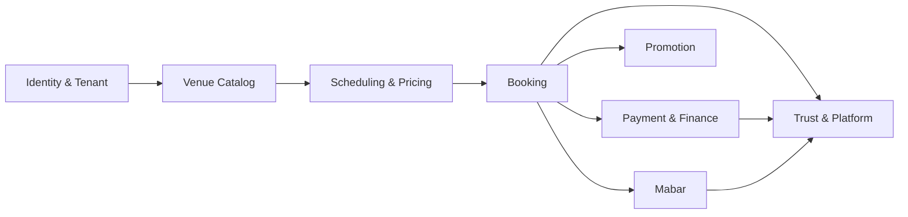
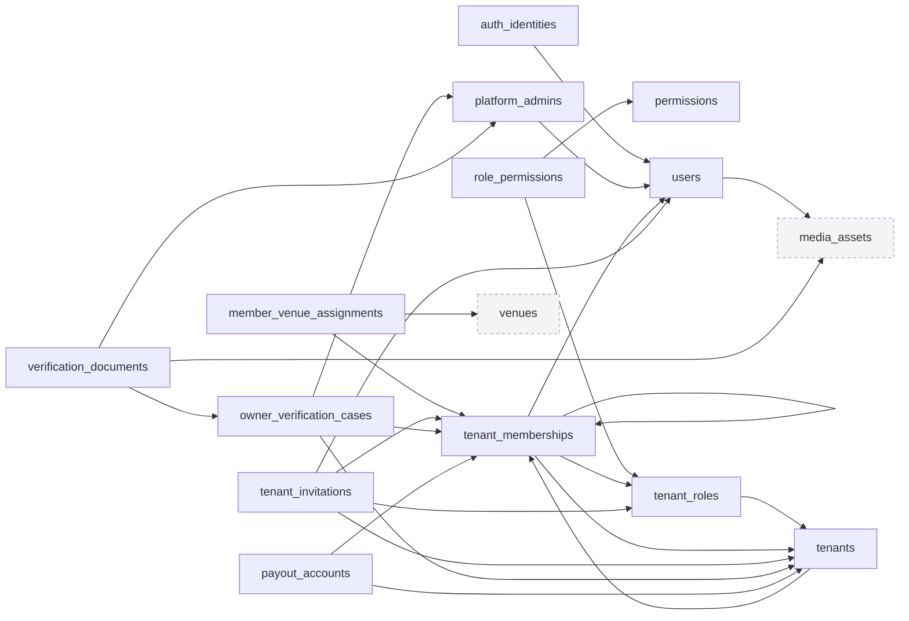
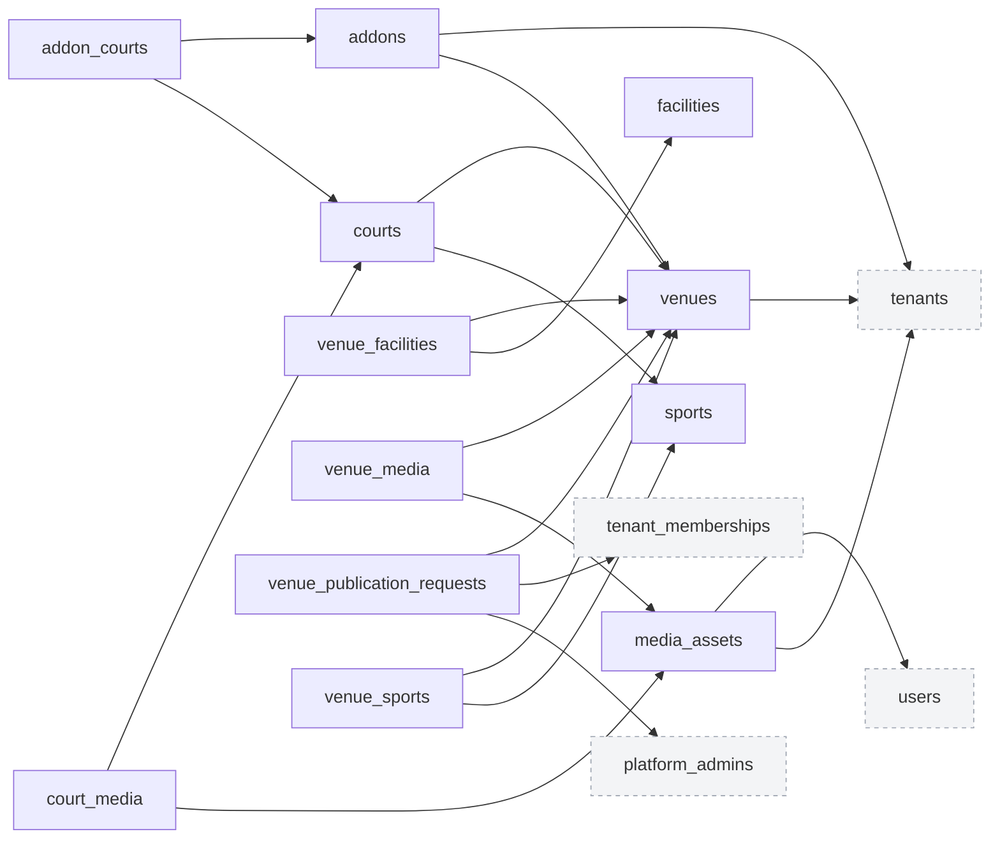
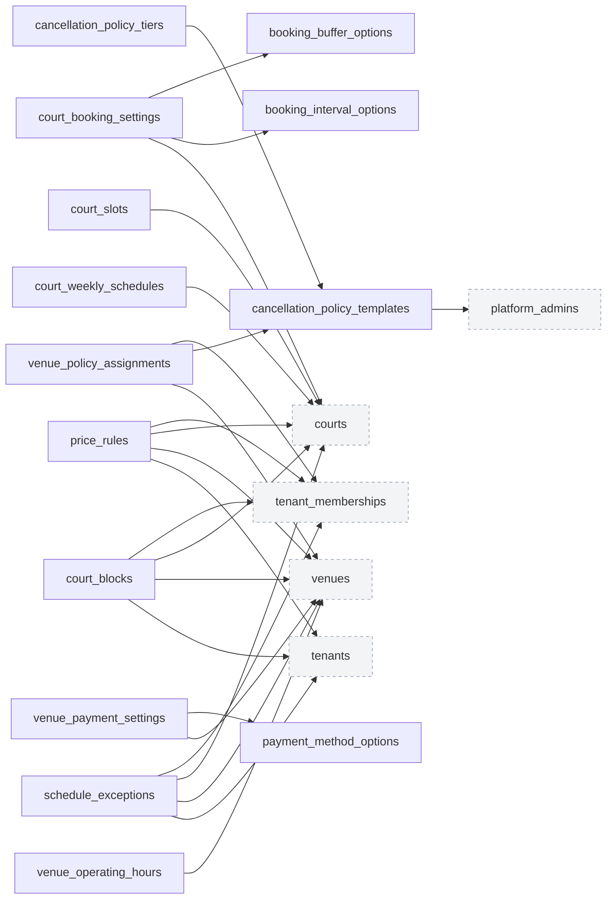
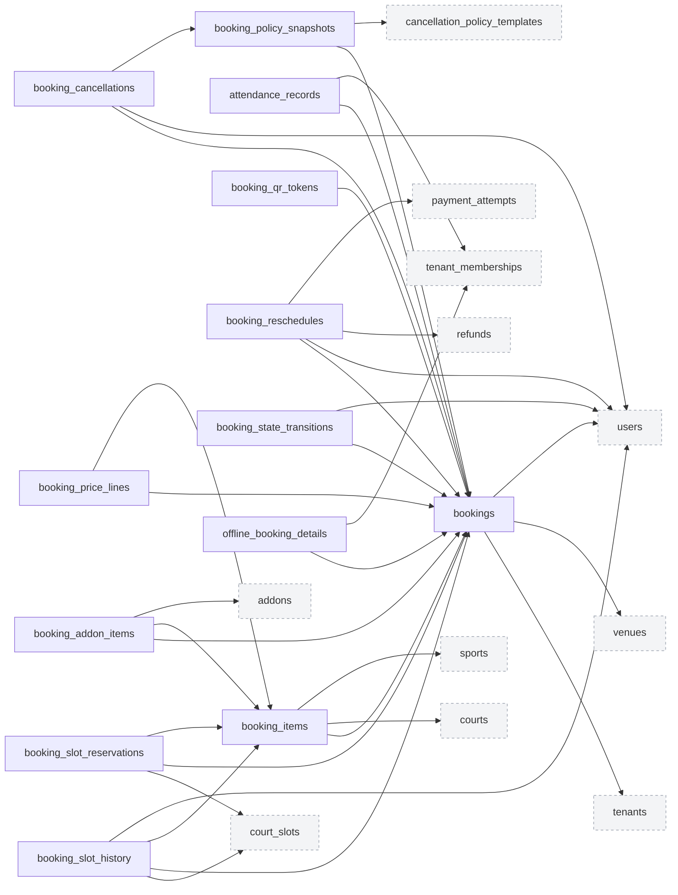
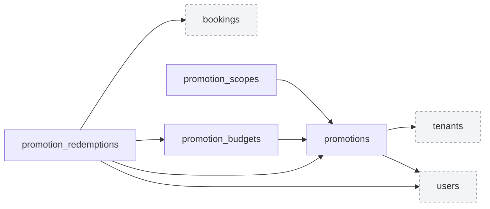
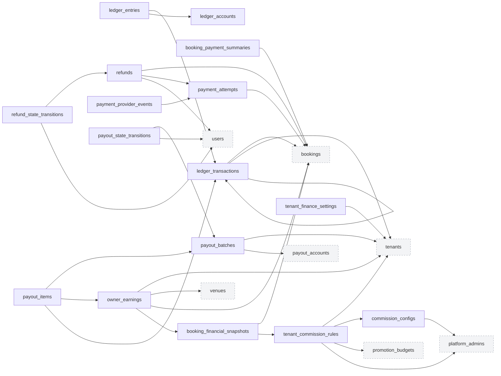
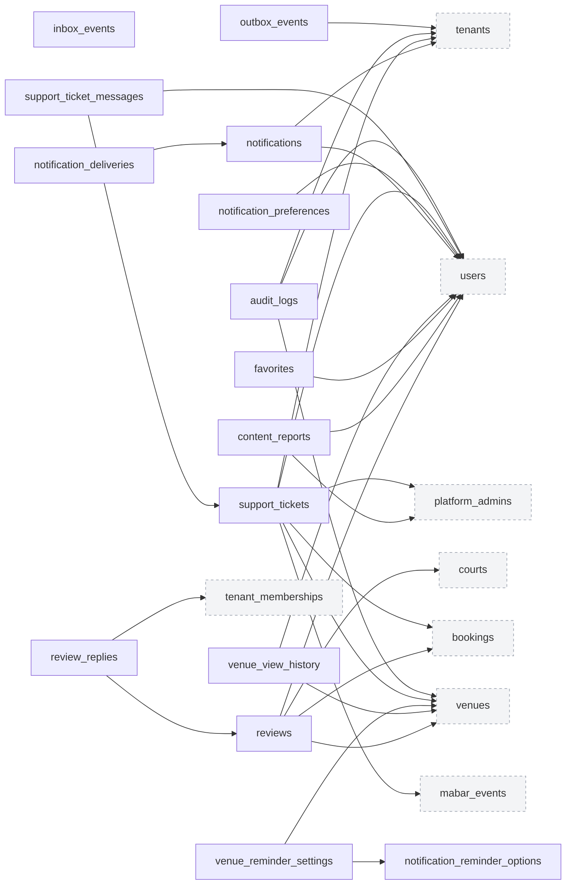
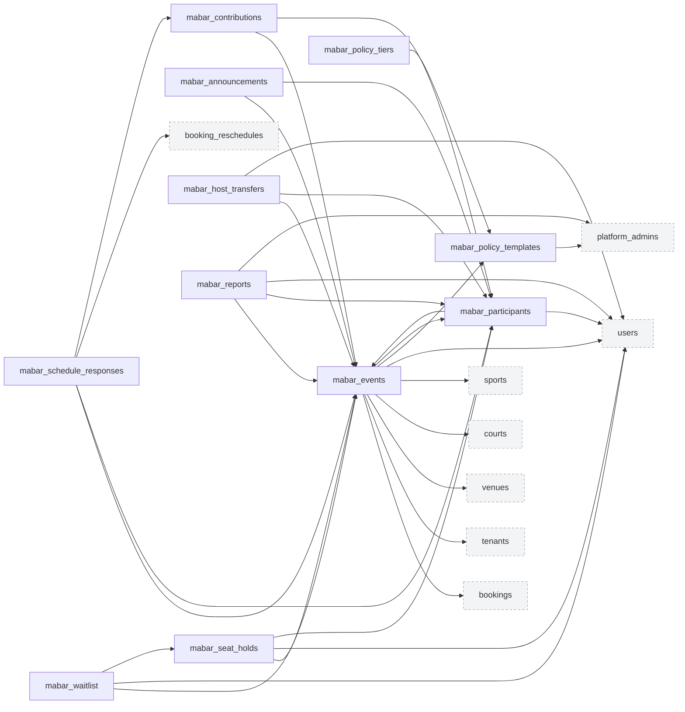

# LapanganGo ERD Phase B dan Data Dictionary

> Catatan 2026-08-27: dokumen panjang ini tetap menyimpan rancangan konseptual B1-B3.
> Tipe `char(26)` di bagian rancangan lama bukan lagi source of truth implementation.
> Schema runtime B1 menggunakan kebijakan numeric ID dan panjang domain yang dijelaskan
> pada [audit schema](phase-b1/DATABASE_SCHEMA_AUDIT_HOLD.md). Migration aktif hanya
> mencakup 54 tabel yang telah mempunyai service/query consumer; tabel B2/B3 dimigrasikan
> bersama implementasi fiturnya.

Dokumen Markdown ini merupakan representasi tekstual dari ERD Phase B dan sumber DBML LapanganGo. Model mencakup **98 tabel** dan **211 foreign-key relationships** untuk Phase B1, B2, dan B3.

> [!IMPORTANT]
> **Batas finansial**
>
> Alur pembayaran, ledger, saldo owner, settlement, kontribusi Mabar, dan payout pada Phase B menggunakan sandbox atau simulasi. Model ini belum menyatakan kesiapan production, KYC nyata, atau perpindahan uang nyata.

## Konvensi Model

- Primary key memakai ID opaque `char(26)` yang kompatibel dengan ULID.
- Nilai uang disimpan sebagai `bigint` dalam satuan rupiah, bukan floating point.
- Timestamp disimpan dalam UTC; timezone venue menggunakan identifier IANA.
- MySQL adalah sumber kebenaran. Redis digunakan untuk lock, cache, pub/sub, dan delivery event.
- Riwayat finansial tidak dihapus; koreksi memakai reversal atau adjustment.
- Table note menggunakan tag `[B1]`, `[B2]`, atau `[B3]` sebagai penanda milestone implementasi.

## Ringkasan Model

| Metrik | Nilai |
|---|---:|
| Total tabel | 98 |
| Total foreign key | 211 |
| Tabel Phase B1 | 47 |
| Tabel Phase B2 | 38 |
| Tabel Phase B3 | 13 |

| Domain | Jumlah Tabel |
|---|---:|
| Identity & Tenant | 13 |
| Venue Catalog | 12 |
| Scheduling & Pricing | 14 |
| Booking | 13 |
| Promotion | 4 |
| Payment & Finance | 16 |
| Trust & Platform | 15 |
| Mabar | 11 |

## Peta Domain



## Critical Invariants

1. `booking_slot_reservations` hanya menyimpan alokasi aktif; primary key `court_slot_id` mencegah double booking.
2. Overlap price rule pada priority dan scope yang sama ditolak di dalam locked transaction.
3. Total debit dan kredit pada setiap ledger transaction harus seimbang.
4. Total refund untuk satu booking tidak boleh melebihi nilai yang telah dibayar.
5. Jumlah participant `JOINED` ditambah seat hold aktif tidak boleh melebihi target Mabar.
6. Tepat satu Primary Owner dan satu host Mabar aktif dipertahankan secara transaksional.

## Indeks Tabel

### Identity & Tenant

- [`users`](#table-users) - **B1** - Identitas pengguna untuk customer, owner, dan staff. Critical: Customer capability melekat pada identity; business access berasal dari membership.
- [`auth_identities`](#table-auth-identities) - **B1** - Tautan akun ke provider login eksternal seperti Google.
- [`platform_admins`](#table-platform-admins) - **B1** - Assignment admin platform yang terpisah dari membership tenant.
- [`tenants`](#table-tenants) - **B1** - Organisasi bisnis owner; boundary utama data dan permission. Critical: primary_owner_membership_id menghindari partial unique untuk role primary owner.
- [`tenant_roles`](#table-tenant-roles) - **B2** - Role template atau custom role dalam satu tenant.
- [`permissions`](#table-permissions) - **B2** - Master permission granular platform untuk business workspace.
- [`role_permissions`](#table-role-permissions) - **B2** - Junction role ke permission.
- [`tenant_memberships`](#table-tenant-memberships) - **B1** - Keanggotaan user pada tenant dengan role dan status.
- [`member_venue_assignments`](#table-member-venue-assignments) - **B1** - Batas venue yang boleh diakses satu membership.
- [`tenant_invitations`](#table-tenant-invitations) - **B2** - Invitation staff/co-owner ke tenant.
- [`owner_verification_cases`](#table-owner-verification-cases) - **B1** - Workflow verifikasi tenant/owner; Phase B memakai data simulasi.
- [`verification_documents`](#table-verification-documents) - **B1** - Metadata dokumen simulasi/private untuk verification case.
- [`payout_accounts`](#table-payout-accounts) - **B2** - Rekening payout tenant; simulasi pada Phase B. Critical: Satu default active per tenant dijaga oleh transaction/service invariant.

### Venue Catalog

- [`sports`](#table-sports) - **B1** - Master jenis olahraga yang dikelola admin.
- [`facilities`](#table-facilities) - **B1** - Master fasilitas venue yang dikelola admin.
- [`media_assets`](#table-media-assets) - **B1** - Metadata object storage untuk media public/private.
- [`venues`](#table-venues) - **B1** - Lokasi venue milik tenant.
- [`venue_sports`](#table-venue-sports) - **B1** - Jenis olahraga yang ditawarkan venue.
- [`venue_facilities`](#table-venue-facilities) - **B1** - Fasilitas yang tersedia pada venue.
- [`venue_media`](#table-venue-media) - **B1** - Urutan dan fungsi media venue.
- [`courts`](#table-courts) - **B1** - Lapangan fisik; satu court satu sport.
- [`court_media`](#table-court-media) - **B1** - Media khusus lapangan.
- [`addons`](#table-addons) - **B1** - Add-on sederhana tanpa inventory.
- [`addon_courts`](#table-addon-courts) - **B1** - Scope add-on ke lapangan tertentu; tanpa row berarti venue-wide.
- [`venue_publication_requests`](#table-venue-publication-requests) - **B1** - Versioned workflow publikasi venue oleh admin.

### Scheduling & Pricing

- [`booking_interval_options`](#table-booking-interval-options) - **B1** - Master pilihan interval booking yang dikelola admin.
- [`booking_buffer_options`](#table-booking-buffer-options) - **B1** - Master pilihan buffer antar-booking.
- [`court_booking_settings`](#table-court-booking-settings) - **B1** - Konfigurasi interval, buffer, duration, dan booking window per court.
- [`venue_operating_hours`](#table-venue-operating-hours) - **B1** - Jam operasional venue per hari.
- [`court_weekly_schedules`](#table-court-weekly-schedules) - **B1** - Rentang bookable mingguan per court.
- [`schedule_exceptions`](#table-schedule-exceptions) - **B1** - Override tanggal khusus untuk venue atau court.
- [`court_blocks`](#table-court-blocks) - **B1** - Blokir UTC untuk maintenance, internal event, atau closure.
- [`court_slots`](#table-court-slots) - **B1** - Unit slot ter-materialisasi untuk alokasi concurrency. Critical: Availability akhir = schedule - blocks - current active reservation.
- [`price_rules`](#table-price-rules) - **B1** - Rule harga base, weekday/weekend, day-time, atau special date. Critical: Overlap pada level/scope sama dicegah melalui transaction + overlap query/lock.
- [`payment_method_options`](#table-payment-method-options) - **B1** - Master metode pembayaran/platform option.
- [`venue_payment_settings`](#table-venue-payment-settings) - **B1** - Payment modes yang diizinkan per venue.
- [`cancellation_policy_templates`](#table-cancellation-policy-templates) - **B2** - Template platform untuk booking cancellation/refund.
- [`cancellation_policy_tiers`](#table-cancellation-policy-tiers) - **B2** - Tier lead time dan refund rate pada template.
- [`venue_policy_assignments`](#table-venue-policy-assignments) - **B2** - Template policy yang dipilih venue.

### Booking

- [`bookings`](#table-bookings) - **B1** - Header booking online/offline.
- [`booking_items`](#table-booking-items) - **B1** - Item lapangan dan rentang waktu dalam booking.
- [`booking_slot_reservations`](#table-booking-slot-reservations) - **B1** - Current active allocation slot; satu row per court_slot. Critical: Row dihapus/replaced secara transaksional ketika released; seluruh histori masuk booking_slot_history. PK court_slot_id adalah guard MySQL no-double-booking.
- [`booking_slot_history`](#table-booking-slot-history) - **B1** - Append-only histori alokasi dan pelepasan court slot.
- [`booking_addon_items`](#table-booking-addon-items) - **B1** - Snapshot add-on yang dipilih pada booking.
- [`offline_booking_details`](#table-offline-booking-details) - **B1** - Data pemesan dan sumber untuk booking offline.
- [`booking_state_transitions`](#table-booking-state-transitions) - **B1** - Append-only transition lifecycle booking.
- [`attendance_records`](#table-attendance-records) - **B1** - Kehadiran terpisah dari booking lifecycle.
- [`booking_reschedules`](#table-booking-reschedules) - **B2** - Histori request dan eksekusi reschedule.
- [`booking_cancellations`](#table-booking-cancellations) - **B2** - Keputusan pembatalan dan refund eligibility snapshot.
- [`booking_qr_tokens`](#table-booking-qr-tokens) - **B1** - Token QR/check-in yang dapat dirotasi dan dicabut.
- [`booking_price_lines`](#table-booking-price-lines) - **B1** - Line-item snapshot harga untuk customer dan explainability.
- [`booking_policy_snapshots`](#table-booking-policy-snapshots) - **B2** - Policy immutable yang berlaku saat booking dibuat/reschedule.

### Promotion

- [`promotions`](#table-promotions) - **B2** - Kode promo owner/platform.
- [`promotion_scopes`](#table-promotion-scopes) - **B2** - Scope promo berdasarkan tenant, venue, sport, court, atau payment method. Critical: Reference polymorphic divalidasi service sesuai scope_type.
- [`promotion_budgets`](#table-promotion-budgets) - **B2** - Budget promo platform dan gateway subsidy program.
- [`promotion_redemptions`](#table-promotion-redemptions) - **B2** - Reservation/consumption promo per booking.

### Payment & Finance

- [`payment_attempts`](#table-payment-attempts) - **B1** - Satu percobaan pembayaran untuk full, DP, balance, atau reservation.
- [`payment_provider_events`](#table-payment-provider-events) - **B1** - Inbox event khusus payment provider untuk verification dan idempotency.
- [`booking_payment_summaries`](#table-booking-payment-summaries) - **B1** - Aggregate payment/refund per booking.
- [`refunds`](#table-refunds) - **B2** - Refund decision dan provider/manual execution. Critical: Service invariant: successful/processing aggregate <= booking paid amount.
- [`refund_state_transitions`](#table-refund-state-transitions) - **B2** - Append-only lifecycle refund.
- [`commission_configs`](#table-commission-configs) - **B2** - Versi konfigurasi komisi default platform.
- [`tenant_commission_rules`](#table-tenant-commission-rules) - **B2** - Override commission/trial/gateway funding per tenant.
- [`booking_financial_snapshots`](#table-booking-financial-snapshots) - **B2** - Immutable financial calculation for a booking/version.
- [`ledger_accounts`](#table-ledger-accounts) - **B2** - Chart of accounts untuk platform/tenant dan clearing. Critical: owner_reference_id polymorphic (platform/tenant/provider clearing).
- [`ledger_transactions`](#table-ledger-transactions) - **B2** - Header immutable double-entry transaction.
- [`ledger_entries`](#table-ledger-entries) - **B2** - Debit/credit lines; total debit harus sama dengan total credit. Critical: Exactly one of debit_amount/credit_amount > 0; transaction balanced in domain service + verification query.
- [`owner_earnings`](#table-owner-earnings) - **B2** - Hak owner per booking/financial snapshot.
- [`tenant_finance_settings`](#table-tenant-finance-settings) - **B2** - Payout schedule/minimum dan finance option per tenant.
- [`payout_batches`](#table-payout-batches) - **B2** - Batch payout simulasi per tenant.
- [`payout_items`](#table-payout-items) - **B2** - Earning/adjustment yang dimasukkan ke payout batch.
- [`payout_state_transitions`](#table-payout-state-transitions) - **B2** - Append-only lifecycle payout.

### Trust & Platform

- [`reviews`](#table-reviews) - **B2** - Review terverifikasi dari booking completed.
- [`review_replies`](#table-review-replies) - **B2** - Balasan owner pada review.
- [`content_reports`](#table-content-reports) - **B2** - Laporan content/resource untuk moderasi. Critical: Polymorphic resource; authorization dan existence divalidasi service.
- [`favorites`](#table-favorites) - **B3** - Favorite venue atau Mabar.
- [`venue_view_history`](#table-venue-view-history) - **B3** - Riwayat venue terakhir dilihat.
- [`notifications`](#table-notifications) - **B2** - Notifikasi in-app per user.
- [`notification_preferences`](#table-notification-preferences) - **B2** - Preference noncritical per user/event/channel.
- [`notification_deliveries`](#table-notification-deliveries) - **B2** - Delivery status untuk in-app/email.
- [`notification_reminder_options`](#table-notification-reminder-options) - **B2** - Master offset reminder yang dibuat admin.
- [`venue_reminder_settings`](#table-venue-reminder-settings) - **B2** - Reminder options aktif per venue.
- [`support_tickets`](#table-support-tickets) - **B2** - Tiket bantuan dan sengketa transaksi.
- [`support_ticket_messages`](#table-support-ticket-messages) - **B2** - Message thread pada support ticket.
- [`audit_logs`](#table-audit-logs) - **B1** - Immutable sensitive activity log.
- [`outbox_events`](#table-outbox-events) - **B1** - Transactional outbox untuk SSE/async delivery.
- [`inbox_events`](#table-inbox-events) - **B1** - Idempotency inbox umum untuk event eksternal/internal async.

### Mabar

- [`mabar_policy_templates`](#table-mabar-policy-templates) - **B3** - Template cancellation participant Mabar yang dibuat admin.
- [`mabar_policy_tiers`](#table-mabar-policy-tiers) - **B3** - Tier refund participant berdasarkan lead time.
- [`mabar_events`](#table-mabar-events) - **B3** - Mabar yang berasal dari booking confirmed.
- [`mabar_participants`](#table-mabar-participants) - **B3** - Peserta Mabar termasuk creator/host. Critical: Exactly one current host dijaga transaction/service; creator row dibuat saat event dibuat.
- [`mabar_seat_holds`](#table-mabar-seat-holds) - **B3** - Seat hold aktif selama 10 menit. Critical: Capacity guard dilakukan dengan lock mabar_events + joined_count + active_hold_count.
- [`mabar_waitlist`](#table-mabar-waitlist) - **B3** - FIFO waitlist Mabar.
- [`mabar_contributions`](#table-mabar-contributions) - **B3** - Kontribusi peserta simulasi; tidak memindahkan uang nyata.
- [`mabar_announcements`](#table-mabar-announcements) - **B3** - Pengumuman satu arah dari host.
- [`mabar_host_transfers`](#table-mabar-host-transfers) - **B3** - Histori transfer host.
- [`mabar_schedule_responses`](#table-mabar-schedule-responses) - **B3** - Respons participant terhadap reschedule booking utama.
- [`mabar_reports`](#table-mabar-reports) - **B3** - Laporan Mabar atau peserta khusus moderation.

## Domain: Identity & Tenant



<a id="table-users"></a>
### `users`

- **Fase:** `B1`
- **Tujuan:** Identitas pengguna untuk customer, owner, dan staff. Critical: Customer capability melekat pada identity; business access berasal dari membership.

| Kolom | Tipe | Nullable | Default | Key/Constraint | Referensi |
|---|---|---|---|---|---|
| `id` | `char(26)` | Tidak | `-` | PK | - |
| `email` | `varchar(255)` | Tidak | `-` | UNIQUE | - |
| `phone_e164` | `varchar(32)` | Ya | `-` | UNIQUE | - |
| `full_name` | `varchar(160)` | Tidak | `-` | - | - |
| `password_hash` | `varchar(255)` | Ya | `-` | - | - |
| `avatar_media_id` | `char(26)` | Ya | `-` | - | [`media_assets.id`](#table-media-assets) |
| `email_verified_at` | `datetime(6)` | Ya | `-` | - | - |
| `status` | `varchar(32)` | Tidak | `'ACTIVE'` | - | - |
| `locale` | `varchar(16)` | Tidak | `'id-ID'` | - | - |
| `last_login_at` | `datetime(6)` | Ya | `-` | - | - |
| `deleted_at` | `datetime(6)` | Ya | `-` | - | - |
| `created_at` | `datetime(6)` | Tidak | `CURRENT_TIMESTAMP(6)` | - | - |
| `updated_at` | `datetime(6)` | Tidak | `CURRENT_TIMESTAMP(6)` | - | - |

**Indexes**

| Kolom/Ekspresi | Atribut |
|---|---|
| `status` | `index` |
| `phone_e164` | `index` |

**Relationships**

- Outgoing: `users.avatar_media_id` -> [`media_assets.id`](#table-media-assets)
- Incoming: [`auth_identities.user_id`](#table-auth-identities) -> `users.id`
- Incoming: [`platform_admins.user_id`](#table-platform-admins) -> `users.id`
- Incoming: [`platform_admins.granted_by_user_id`](#table-platform-admins) -> `users.id`
- Incoming: [`tenant_memberships.user_id`](#table-tenant-memberships) -> `users.id`
- Incoming: [`tenant_invitations.accepted_by_user_id`](#table-tenant-invitations) -> `users.id`
- Incoming: [`media_assets.owner_user_id`](#table-media-assets) -> `users.id`
- Incoming: [`bookings.customer_user_id`](#table-bookings) -> `users.id`
- Incoming: [`booking_slot_history.actor_user_id`](#table-booking-slot-history) -> `users.id`
- Incoming: [`booking_state_transitions.actor_user_id`](#table-booking-state-transitions) -> `users.id`
- Incoming: [`booking_reschedules.requested_by_user_id`](#table-booking-reschedules) -> `users.id`
- Incoming: [`booking_cancellations.cancelled_by_user_id`](#table-booking-cancellations) -> `users.id`
- Incoming: [`promotions.created_by_user_id`](#table-promotions) -> `users.id`
- Incoming: [`promotion_redemptions.customer_user_id`](#table-promotion-redemptions) -> `users.id`
- Incoming: [`refunds.requested_by_user_id`](#table-refunds) -> `users.id`
- Incoming: [`refunds.approved_by_user_id`](#table-refunds) -> `users.id`
- Incoming: [`refund_state_transitions.actor_user_id`](#table-refund-state-transitions) -> `users.id`
- Incoming: [`payout_state_transitions.actor_user_id`](#table-payout-state-transitions) -> `users.id`
- Incoming: [`reviews.customer_user_id`](#table-reviews) -> `users.id`
- Incoming: [`content_reports.reporter_user_id`](#table-content-reports) -> `users.id`
- Incoming: [`favorites.user_id`](#table-favorites) -> `users.id`
- Incoming: [`venue_view_history.user_id`](#table-venue-view-history) -> `users.id`
- Incoming: [`notifications.user_id`](#table-notifications) -> `users.id`
- Incoming: [`notification_preferences.user_id`](#table-notification-preferences) -> `users.id`
- Incoming: [`support_tickets.opened_by_user_id`](#table-support-tickets) -> `users.id`
- Incoming: [`support_ticket_messages.sender_user_id`](#table-support-ticket-messages) -> `users.id`
- Incoming: [`audit_logs.actor_user_id`](#table-audit-logs) -> `users.id`
- Incoming: [`mabar_events.creator_user_id`](#table-mabar-events) -> `users.id`
- Incoming: [`mabar_participants.user_id`](#table-mabar-participants) -> `users.id`
- Incoming: [`mabar_seat_holds.user_id`](#table-mabar-seat-holds) -> `users.id`
- Incoming: [`mabar_waitlist.user_id`](#table-mabar-waitlist) -> `users.id`
- Incoming: [`mabar_host_transfers.initiated_by_user_id`](#table-mabar-host-transfers) -> `users.id`
- Incoming: [`mabar_reports.reporter_user_id`](#table-mabar-reports) -> `users.id`

---

<a id="table-auth-identities"></a>
### `auth_identities`

- **Fase:** `B1`
- **Tujuan:** Tautan akun ke provider login eksternal seperti Google.

| Kolom | Tipe | Nullable | Default | Key/Constraint | Referensi |
|---|---|---|---|---|---|
| `id` | `char(26)` | Tidak | `-` | PK | - |
| `user_id` | `char(26)` | Tidak | `-` | - | [`users.id`](#table-users) |
| `provider` | `varchar(32)` | Tidak | `-` | - | - |
| `provider_subject` | `varchar(255)` | Tidak | `-` | - | - |
| `provider_email` | `varchar(255)` | Ya | `-` | - | - |
| `linked_at` | `datetime(6)` | Tidak | `-` | - | - |
| `last_used_at` | `datetime(6)` | Ya | `-` | - | - |
| `created_at` | `datetime(6)` | Tidak | `CURRENT_TIMESTAMP(6)` | - | - |
| `updated_at` | `datetime(6)` | Tidak | `CURRENT_TIMESTAMP(6)` | - | - |

**Indexes**

| Kolom/Ekspresi | Atribut |
|---|---|
| `(provider, provider_subject)` | `unique` |
| `(user_id, provider)` | `index` |

**Relationships**

- Outgoing: `auth_identities.user_id` -> [`users.id`](#table-users)

---

<a id="table-platform-admins"></a>
### `platform_admins`

- **Fase:** `B1`
- **Tujuan:** Assignment admin platform yang terpisah dari membership tenant.

| Kolom | Tipe | Nullable | Default | Key/Constraint | Referensi |
|---|---|---|---|---|---|
| `id` | `char(26)` | Tidak | `-` | PK | - |
| `user_id` | `char(26)` | Tidak | `-` | UNIQUE | [`users.id`](#table-users) |
| `admin_role` | `varchar(40)` | Tidak | `-` | - | - |
| `status` | `varchar(32)` | Tidak | `'ACTIVE'` | - | - |
| `granted_by_user_id` | `char(26)` | Ya | `-` | - | [`users.id`](#table-users) |
| `granted_at` | `datetime(6)` | Tidak | `-` | - | - |
| `revoked_at` | `datetime(6)` | Ya | `-` | - | - |
| `created_at` | `datetime(6)` | Tidak | `CURRENT_TIMESTAMP(6)` | - | - |
| `updated_at` | `datetime(6)` | Tidak | `CURRENT_TIMESTAMP(6)` | - | - |

**Indexes**

| Kolom/Ekspresi | Atribut |
|---|---|
| `(status, admin_role)` | `index` |

**Relationships**

- Outgoing: `platform_admins.user_id` -> [`users.id`](#table-users)
- Outgoing: `platform_admins.granted_by_user_id` -> [`users.id`](#table-users)
- Incoming: [`owner_verification_cases.reviewed_by_admin_id`](#table-owner-verification-cases) -> `platform_admins.id`
- Incoming: [`verification_documents.reviewed_by_admin_id`](#table-verification-documents) -> `platform_admins.id`
- Incoming: [`venue_publication_requests.reviewed_by_admin_id`](#table-venue-publication-requests) -> `platform_admins.id`
- Incoming: [`cancellation_policy_templates.created_by_admin_id`](#table-cancellation-policy-templates) -> `platform_admins.id`
- Incoming: [`commission_configs.created_by_admin_id`](#table-commission-configs) -> `platform_admins.id`
- Incoming: [`tenant_commission_rules.created_by_admin_id`](#table-tenant-commission-rules) -> `platform_admins.id`
- Incoming: [`content_reports.assigned_admin_id`](#table-content-reports) -> `platform_admins.id`
- Incoming: [`support_tickets.assigned_admin_id`](#table-support-tickets) -> `platform_admins.id`
- Incoming: [`mabar_policy_templates.created_by_admin_id`](#table-mabar-policy-templates) -> `platform_admins.id`
- Incoming: [`mabar_reports.assigned_admin_id`](#table-mabar-reports) -> `platform_admins.id`

---

<a id="table-tenants"></a>
### `tenants`

- **Fase:** `B1`
- **Tujuan:** Organisasi bisnis owner; boundary utama data dan permission. Critical: primary_owner_membership_id menghindari partial unique untuk role primary owner.

| Kolom | Tipe | Nullable | Default | Key/Constraint | Referensi |
|---|---|---|---|---|---|
| `id` | `char(26)` | Tidak | `-` | PK | - |
| `name` | `varchar(180)` | Tidak | `-` | - | - |
| `slug` | `varchar(190)` | Tidak | `-` | UNIQUE | - |
| `status` | `varchar(32)` | Tidak | `'DRAFT'` | - | - |
| `primary_owner_membership_id` | `char(26)` | Ya | `-` | - | [`tenant_memberships.id`](#table-tenant-memberships) |
| `business_name` | `varchar(200)` | Ya | `-` | - | - |
| `business_phone` | `varchar(32)` | Ya | `-` | - | - |
| `business_email` | `varchar(255)` | Ya | `-` | - | - |
| `default_timezone` | `varchar(64)` | Tidak | `'Asia/Jakarta'` | - | - |
| `default_currency` | `char(3)` | Tidak | `'IDR'` | - | - |
| `approved_at` | `datetime(6)` | Ya | `-` | - | - |
| `suspended_at` | `datetime(6)` | Ya | `-` | - | - |
| `deleted_at` | `datetime(6)` | Ya | `-` | - | - |
| `created_at` | `datetime(6)` | Tidak | `CURRENT_TIMESTAMP(6)` | - | - |
| `updated_at` | `datetime(6)` | Tidak | `CURRENT_TIMESTAMP(6)` | - | - |

**Indexes**

| Kolom/Ekspresi | Atribut |
|---|---|
| `status` | `index` |
| `name` | `index` |

**Relationships**

- Outgoing: `tenants.primary_owner_membership_id` -> [`tenant_memberships.id`](#table-tenant-memberships)
- Incoming: [`tenant_roles.tenant_id`](#table-tenant-roles) -> `tenants.id`
- Incoming: [`tenant_memberships.tenant_id`](#table-tenant-memberships) -> `tenants.id`
- Incoming: [`tenant_invitations.tenant_id`](#table-tenant-invitations) -> `tenants.id`
- Incoming: [`owner_verification_cases.tenant_id`](#table-owner-verification-cases) -> `tenants.id`
- Incoming: [`payout_accounts.tenant_id`](#table-payout-accounts) -> `tenants.id`
- Incoming: [`media_assets.tenant_id`](#table-media-assets) -> `tenants.id`
- Incoming: [`venues.tenant_id`](#table-venues) -> `tenants.id`
- Incoming: [`addons.tenant_id`](#table-addons) -> `tenants.id`
- Incoming: [`schedule_exceptions.tenant_id`](#table-schedule-exceptions) -> `tenants.id`
- Incoming: [`court_blocks.tenant_id`](#table-court-blocks) -> `tenants.id`
- Incoming: [`price_rules.tenant_id`](#table-price-rules) -> `tenants.id`
- Incoming: [`bookings.tenant_id`](#table-bookings) -> `tenants.id`
- Incoming: [`promotions.tenant_id`](#table-promotions) -> `tenants.id`
- Incoming: [`tenant_commission_rules.tenant_id`](#table-tenant-commission-rules) -> `tenants.id`
- Incoming: [`ledger_transactions.tenant_id`](#table-ledger-transactions) -> `tenants.id`
- Incoming: [`owner_earnings.tenant_id`](#table-owner-earnings) -> `tenants.id`
- Incoming: [`tenant_finance_settings.tenant_id`](#table-tenant-finance-settings) -> `tenants.id`
- Incoming: [`payout_batches.tenant_id`](#table-payout-batches) -> `tenants.id`
- Incoming: [`notifications.tenant_id`](#table-notifications) -> `tenants.id`
- Incoming: [`support_tickets.tenant_id`](#table-support-tickets) -> `tenants.id`
- Incoming: [`audit_logs.tenant_id`](#table-audit-logs) -> `tenants.id`
- Incoming: [`outbox_events.tenant_id`](#table-outbox-events) -> `tenants.id`
- Incoming: [`mabar_events.tenant_id`](#table-mabar-events) -> `tenants.id`

---

<a id="table-tenant-roles"></a>
### `tenant_roles`

- **Fase:** `B2`
- **Tujuan:** Role template atau custom role dalam satu tenant.

| Kolom | Tipe | Nullable | Default | Key/Constraint | Referensi |
|---|---|---|---|---|---|
| `id` | `char(26)` | Tidak | `-` | PK | - |
| `tenant_id` | `char(26)` | Ya | `-` | - | [`tenants.id`](#table-tenants) |
| `name` | `varchar(100)` | Tidak | `-` | - | - |
| `code` | `varchar(80)` | Tidak | `-` | - | - |
| `is_system_template` | `boolean` | Tidak | `false` | - | - |
| `is_primary_owner_role` | `boolean` | Tidak | `false` | - | - |
| `description` | `varchar(500)` | Ya | `-` | - | - |
| `status` | `varchar(32)` | Tidak | `'ACTIVE'` | - | - |
| `created_at` | `datetime(6)` | Tidak | `CURRENT_TIMESTAMP(6)` | - | - |
| `updated_at` | `datetime(6)` | Tidak | `CURRENT_TIMESTAMP(6)` | - | - |

**Indexes**

| Kolom/Ekspresi | Atribut |
|---|---|
| `(tenant_id, code)` | `unique` |
| `(tenant_id, name)` | `index` |

**Relationships**

- Outgoing: `tenant_roles.tenant_id` -> [`tenants.id`](#table-tenants)
- Incoming: [`role_permissions.role_id`](#table-role-permissions) -> `tenant_roles.id`
- Incoming: [`tenant_memberships.role_id`](#table-tenant-memberships) -> `tenant_roles.id`
- Incoming: [`tenant_invitations.role_id`](#table-tenant-invitations) -> `tenant_roles.id`

---

<a id="table-permissions"></a>
### `permissions`

- **Fase:** `B2`
- **Tujuan:** Master permission granular platform untuk business workspace.

| Kolom | Tipe | Nullable | Default | Key/Constraint | Referensi |
|---|---|---|---|---|---|
| `id` | `char(26)` | Tidak | `-` | PK | - |
| `code` | `varchar(120)` | Tidak | `-` | UNIQUE | - |
| `module` | `varchar(80)` | Tidak | `-` | - | - |
| `description` | `varchar(500)` | Tidak | `-` | - | - |
| `is_sensitive` | `boolean` | Tidak | `false` | - | - |
| `status` | `varchar(32)` | Tidak | `'ACTIVE'` | - | - |
| `created_at` | `datetime(6)` | Tidak | `CURRENT_TIMESTAMP(6)` | - | - |
| `updated_at` | `datetime(6)` | Tidak | `CURRENT_TIMESTAMP(6)` | - | - |

**Indexes**

| Kolom/Ekspresi | Atribut |
|---|---|
| `(module, status)` | `index` |

**Relationships**

- Incoming: [`role_permissions.permission_id`](#table-role-permissions) -> `permissions.id`

---

<a id="table-role-permissions"></a>
### `role_permissions`

- **Fase:** `B2`
- **Tujuan:** Junction role ke permission.

| Kolom | Tipe | Nullable | Default | Key/Constraint | Referensi |
|---|---|---|---|---|---|
| `role_id` | `char(26)` | Tidak | `-` | - | [`tenant_roles.id`](#table-tenant-roles) |
| `permission_id` | `char(26)` | Tidak | `-` | - | [`permissions.id`](#table-permissions) |
| `granted_by_membership_id` | `char(26)` | Ya | `-` | - | - |
| `granted_at` | `datetime(6)` | Tidak | `-` | - | - |

**Indexes**

| Kolom/Ekspresi | Atribut |
|---|---|
| `(role_id, permission_id)` | `pk` |
| `permission_id` | `index` |

**Relationships**

- Outgoing: `role_permissions.role_id` -> [`tenant_roles.id`](#table-tenant-roles)
- Outgoing: `role_permissions.permission_id` -> [`permissions.id`](#table-permissions)

---

<a id="table-tenant-memberships"></a>
### `tenant_memberships`

- **Fase:** `B1`
- **Tujuan:** Keanggotaan user pada tenant dengan role dan status.

| Kolom | Tipe | Nullable | Default | Key/Constraint | Referensi |
|---|---|---|---|---|---|
| `id` | `char(26)` | Tidak | `-` | PK | - |
| `tenant_id` | `char(26)` | Tidak | `-` | - | [`tenants.id`](#table-tenants) |
| `user_id` | `char(26)` | Tidak | `-` | - | [`users.id`](#table-users) |
| `role_id` | `char(26)` | Ya | `-` | - | [`tenant_roles.id`](#table-tenant-roles) |
| `membership_type` | `varchar(40)` | Tidak | `-` | - | - |
| `status` | `varchar(32)` | Tidak | `'ACTIVE'` | - | - |
| `joined_at` | `datetime(6)` | Ya | `-` | - | - |
| `invited_by_membership_id` | `char(26)` | Ya | `-` | - | [`tenant_memberships.id`](#table-tenant-memberships) |
| `revoked_at` | `datetime(6)` | Ya | `-` | - | - |
| `created_at` | `datetime(6)` | Tidak | `CURRENT_TIMESTAMP(6)` | - | - |
| `updated_at` | `datetime(6)` | Tidak | `CURRENT_TIMESTAMP(6)` | - | - |

**Indexes**

| Kolom/Ekspresi | Atribut |
|---|---|
| `(tenant_id, user_id)` | `unique` |
| `(user_id, status)` | `index` |
| `(tenant_id, status)` | `index` |

**Relationships**

- Outgoing: `tenant_memberships.tenant_id` -> [`tenants.id`](#table-tenants)
- Outgoing: `tenant_memberships.user_id` -> [`users.id`](#table-users)
- Outgoing: `tenant_memberships.role_id` -> [`tenant_roles.id`](#table-tenant-roles)
- Outgoing: `tenant_memberships.invited_by_membership_id` -> [`tenant_memberships.id`](#table-tenant-memberships)
- Incoming: [`tenant_memberships.invited_by_membership_id`](#table-tenant-memberships) -> `tenant_memberships.id`
- Incoming: [`tenants.primary_owner_membership_id`](#table-tenants) -> `tenant_memberships.id`
- Incoming: [`member_venue_assignments.membership_id`](#table-member-venue-assignments) -> `tenant_memberships.id`
- Incoming: [`member_venue_assignments.assigned_by_membership_id`](#table-member-venue-assignments) -> `tenant_memberships.id`
- Incoming: [`tenant_invitations.invited_by_membership_id`](#table-tenant-invitations) -> `tenant_memberships.id`
- Incoming: [`owner_verification_cases.submitted_by_membership_id`](#table-owner-verification-cases) -> `tenant_memberships.id`
- Incoming: [`payout_accounts.changed_by_membership_id`](#table-payout-accounts) -> `tenant_memberships.id`
- Incoming: [`venue_publication_requests.submitted_by_membership_id`](#table-venue-publication-requests) -> `tenant_memberships.id`
- Incoming: [`schedule_exceptions.created_by_membership_id`](#table-schedule-exceptions) -> `tenant_memberships.id`
- Incoming: [`court_blocks.created_by_membership_id`](#table-court-blocks) -> `tenant_memberships.id`
- Incoming: [`price_rules.created_by_membership_id`](#table-price-rules) -> `tenant_memberships.id`
- Incoming: [`venue_policy_assignments.assigned_by_membership_id`](#table-venue-policy-assignments) -> `tenant_memberships.id`
- Incoming: [`offline_booking_details.created_by_membership_id`](#table-offline-booking-details) -> `tenant_memberships.id`
- Incoming: [`attendance_records.checked_in_by_membership_id`](#table-attendance-records) -> `tenant_memberships.id`
- Incoming: [`attendance_records.no_show_marked_by_membership_id`](#table-attendance-records) -> `tenant_memberships.id`
- Incoming: [`review_replies.tenant_membership_id`](#table-review-replies) -> `tenant_memberships.id`

---

<a id="table-member-venue-assignments"></a>
### `member_venue_assignments`

- **Fase:** `B1`
- **Tujuan:** Batas venue yang boleh diakses satu membership.

| Kolom | Tipe | Nullable | Default | Key/Constraint | Referensi |
|---|---|---|---|---|---|
| `membership_id` | `char(26)` | Tidak | `-` | - | [`tenant_memberships.id`](#table-tenant-memberships) |
| `venue_id` | `char(26)` | Tidak | `-` | - | [`venues.id`](#table-venues) |
| `assigned_by_membership_id` | `char(26)` | Ya | `-` | - | [`tenant_memberships.id`](#table-tenant-memberships) |
| `assigned_at` | `datetime(6)` | Tidak | `-` | - | - |
| `revoked_at` | `datetime(6)` | Ya | `-` | - | - |

**Indexes**

| Kolom/Ekspresi | Atribut |
|---|---|
| `(membership_id, venue_id)` | `pk` |
| `venue_id` | `index` |

**Relationships**

- Outgoing: `member_venue_assignments.membership_id` -> [`tenant_memberships.id`](#table-tenant-memberships)
- Outgoing: `member_venue_assignments.assigned_by_membership_id` -> [`tenant_memberships.id`](#table-tenant-memberships)
- Outgoing: `member_venue_assignments.venue_id` -> [`venues.id`](#table-venues)

---

<a id="table-tenant-invitations"></a>
### `tenant_invitations`

- **Fase:** `B2`
- **Tujuan:** Invitation staff/co-owner ke tenant.

| Kolom | Tipe | Nullable | Default | Key/Constraint | Referensi |
|---|---|---|---|---|---|
| `id` | `char(26)` | Tidak | `-` | PK | - |
| `tenant_id` | `char(26)` | Tidak | `-` | - | [`tenants.id`](#table-tenants) |
| `email` | `varchar(255)` | Tidak | `-` | - | - |
| `role_id` | `char(26)` | Ya | `-` | - | [`tenant_roles.id`](#table-tenant-roles) |
| `token_hash` | `varchar(255)` | Tidak | `-` | UNIQUE | - |
| `status` | `varchar(32)` | Tidak | `'PENDING'` | - | - |
| `expires_at` | `datetime(6)` | Tidak | `-` | - | - |
| `invited_by_membership_id` | `char(26)` | Tidak | `-` | - | [`tenant_memberships.id`](#table-tenant-memberships) |
| `accepted_by_user_id` | `char(26)` | Ya | `-` | - | [`users.id`](#table-users) |
| `accepted_at` | `datetime(6)` | Ya | `-` | - | - |
| `created_at` | `datetime(6)` | Tidak | `CURRENT_TIMESTAMP(6)` | - | - |
| `updated_at` | `datetime(6)` | Tidak | `CURRENT_TIMESTAMP(6)` | - | - |

**Indexes**

| Kolom/Ekspresi | Atribut |
|---|---|
| `(tenant_id, email, status)` | `index` |
| `(expires_at, status)` | `index` |

**Relationships**

- Outgoing: `tenant_invitations.tenant_id` -> [`tenants.id`](#table-tenants)
- Outgoing: `tenant_invitations.role_id` -> [`tenant_roles.id`](#table-tenant-roles)
- Outgoing: `tenant_invitations.invited_by_membership_id` -> [`tenant_memberships.id`](#table-tenant-memberships)
- Outgoing: `tenant_invitations.accepted_by_user_id` -> [`users.id`](#table-users)

---

<a id="table-owner-verification-cases"></a>
### `owner_verification_cases`

- **Fase:** `B1`
- **Tujuan:** Workflow verifikasi tenant/owner; Phase B memakai data simulasi.

| Kolom | Tipe | Nullable | Default | Key/Constraint | Referensi |
|---|---|---|---|---|---|
| `id` | `char(26)` | Tidak | `-` | PK | - |
| `tenant_id` | `char(26)` | Tidak | `-` | - | [`tenants.id`](#table-tenants) |
| `submitted_by_membership_id` | `char(26)` | Tidak | `-` | - | [`tenant_memberships.id`](#table-tenant-memberships) |
| `status` | `varchar(40)` | Tidak | `'DRAFT'` | - | - |
| `version_no` | `int` | Tidak | `1` | - | - |
| `reviewed_by_admin_id` | `char(26)` | Ya | `-` | - | [`platform_admins.id`](#table-platform-admins) |
| `decision_reason_code` | `varchar(80)` | Ya | `-` | - | - |
| `decision_note` | `text` | Ya | `-` | - | - |
| `submitted_at` | `datetime(6)` | Ya | `-` | - | - |
| `reviewed_at` | `datetime(6)` | Ya | `-` | - | - |
| `created_at` | `datetime(6)` | Tidak | `CURRENT_TIMESTAMP(6)` | - | - |
| `updated_at` | `datetime(6)` | Tidak | `CURRENT_TIMESTAMP(6)` | - | - |

**Indexes**

| Kolom/Ekspresi | Atribut |
|---|---|
| `(tenant_id, version_no)` | `unique` |
| `(status, submitted_at)` | `index` |

**Relationships**

- Outgoing: `owner_verification_cases.tenant_id` -> [`tenants.id`](#table-tenants)
- Outgoing: `owner_verification_cases.submitted_by_membership_id` -> [`tenant_memberships.id`](#table-tenant-memberships)
- Outgoing: `owner_verification_cases.reviewed_by_admin_id` -> [`platform_admins.id`](#table-platform-admins)
- Incoming: [`verification_documents.verification_case_id`](#table-verification-documents) -> `owner_verification_cases.id`

---

<a id="table-verification-documents"></a>
### `verification_documents`

- **Fase:** `B1`
- **Tujuan:** Metadata dokumen simulasi/private untuk verification case.

| Kolom | Tipe | Nullable | Default | Key/Constraint | Referensi |
|---|---|---|---|---|---|
| `id` | `char(26)` | Tidak | `-` | PK | - |
| `verification_case_id` | `char(26)` | Tidak | `-` | - | [`owner_verification_cases.id`](#table-owner-verification-cases) |
| `media_asset_id` | `char(26)` | Tidak | `-` | - | [`media_assets.id`](#table-media-assets) |
| `document_type` | `varchar(80)` | Tidak | `-` | - | - |
| `document_number_masked` | `varchar(120)` | Ya | `-` | - | - |
| `status` | `varchar(32)` | Tidak | `'SUBMITTED'` | - | - |
| `review_note` | `varchar(1000)` | Ya | `-` | - | - |
| `reviewed_by_admin_id` | `char(26)` | Ya | `-` | - | [`platform_admins.id`](#table-platform-admins) |
| `reviewed_at` | `datetime(6)` | Ya | `-` | - | - |
| `created_at` | `datetime(6)` | Tidak | `CURRENT_TIMESTAMP(6)` | - | - |
| `updated_at` | `datetime(6)` | Tidak | `CURRENT_TIMESTAMP(6)` | - | - |

**Indexes**

| Kolom/Ekspresi | Atribut |
|---|---|
| `(verification_case_id, document_type)` | `index` |
| `status` | `index` |

**Relationships**

- Outgoing: `verification_documents.verification_case_id` -> [`owner_verification_cases.id`](#table-owner-verification-cases)
- Outgoing: `verification_documents.reviewed_by_admin_id` -> [`platform_admins.id`](#table-platform-admins)
- Outgoing: `verification_documents.media_asset_id` -> [`media_assets.id`](#table-media-assets)

---

<a id="table-payout-accounts"></a>
### `payout_accounts`

- **Fase:** `B2`
- **Tujuan:** Rekening payout tenant; simulasi pada Phase B. Critical: Satu default active per tenant dijaga oleh transaction/service invariant.

| Kolom | Tipe | Nullable | Default | Key/Constraint | Referensi |
|---|---|---|---|---|---|
| `id` | `char(26)` | Tidak | `-` | PK | - |
| `tenant_id` | `char(26)` | Tidak | `-` | - | [`tenants.id`](#table-tenants) |
| `account_holder_name` | `varchar(180)` | Tidak | `-` | - | - |
| `bank_code` | `varchar(40)` | Tidak | `-` | - | - |
| `account_number_ciphertext` | `text` | Tidak | `-` | - | - |
| `account_number_last4` | `char(4)` | Tidak | `-` | - | - |
| `status` | `varchar(32)` | Tidak | `'PENDING'` | - | - |
| `is_default` | `boolean` | Tidak | `false` | - | - |
| `verified_at` | `datetime(6)` | Ya | `-` | - | - |
| `changed_by_membership_id` | `char(26)` | Ya | `-` | - | [`tenant_memberships.id`](#table-tenant-memberships) |
| `disabled_at` | `datetime(6)` | Ya | `-` | - | - |
| `created_at` | `datetime(6)` | Tidak | `CURRENT_TIMESTAMP(6)` | - | - |
| `updated_at` | `datetime(6)` | Tidak | `CURRENT_TIMESTAMP(6)` | - | - |

**Indexes**

| Kolom/Ekspresi | Atribut |
|---|---|
| `(tenant_id, status)` | `index` |
| `(tenant_id, is_default)` | `index` |

**Relationships**

- Outgoing: `payout_accounts.tenant_id` -> [`tenants.id`](#table-tenants)
- Outgoing: `payout_accounts.changed_by_membership_id` -> [`tenant_memberships.id`](#table-tenant-memberships)
- Incoming: [`payout_batches.payout_account_id`](#table-payout-batches) -> `payout_accounts.id`

---

## Domain: Venue Catalog



<a id="table-sports"></a>
### `sports`

- **Fase:** `B1`
- **Tujuan:** Master jenis olahraga yang dikelola admin.

| Kolom | Tipe | Nullable | Default | Key/Constraint | Referensi |
|---|---|---|---|---|---|
| `id` | `char(26)` | Tidak | `-` | PK | - |
| `code` | `varchar(80)` | Tidak | `-` | UNIQUE | - |
| `name` | `varchar(120)` | Tidak | `-` | - | - |
| `slug` | `varchar(140)` | Tidak | `-` | UNIQUE | - |
| `icon_key` | `varchar(120)` | Ya | `-` | - | - |
| `default_capacity` | `int` | Ya | `-` | - | - |
| `status` | `varchar(32)` | Tidak | `'ACTIVE'` | - | - |
| `sort_order` | `int` | Tidak | `0` | - | - |
| `created_at` | `datetime(6)` | Tidak | `CURRENT_TIMESTAMP(6)` | - | - |
| `updated_at` | `datetime(6)` | Tidak | `CURRENT_TIMESTAMP(6)` | - | - |

**Indexes**

| Kolom/Ekspresi | Atribut |
|---|---|
| `(status, sort_order)` | `index` |

**Relationships**

- Incoming: [`venue_sports.sport_id`](#table-venue-sports) -> `sports.id`
- Incoming: [`courts.sport_id`](#table-courts) -> `sports.id`
- Incoming: [`booking_items.sport_id`](#table-booking-items) -> `sports.id`
- Incoming: [`mabar_events.sport_id`](#table-mabar-events) -> `sports.id`

---

<a id="table-facilities"></a>
### `facilities`

- **Fase:** `B1`
- **Tujuan:** Master fasilitas venue yang dikelola admin.

| Kolom | Tipe | Nullable | Default | Key/Constraint | Referensi |
|---|---|---|---|---|---|
| `id` | `char(26)` | Tidak | `-` | PK | - |
| `code` | `varchar(80)` | Tidak | `-` | UNIQUE | - |
| `name` | `varchar(120)` | Tidak | `-` | - | - |
| `icon_key` | `varchar(120)` | Ya | `-` | - | - |
| `status` | `varchar(32)` | Tidak | `'ACTIVE'` | - | - |
| `sort_order` | `int` | Tidak | `0` | - | - |
| `created_at` | `datetime(6)` | Tidak | `CURRENT_TIMESTAMP(6)` | - | - |
| `updated_at` | `datetime(6)` | Tidak | `CURRENT_TIMESTAMP(6)` | - | - |

**Indexes**

| Kolom/Ekspresi | Atribut |
|---|---|
| `(status, sort_order)` | `index` |

**Relationships**

- Incoming: [`venue_facilities.facility_id`](#table-venue-facilities) -> `facilities.id`

---

<a id="table-media-assets"></a>
### `media_assets`

- **Fase:** `B1`
- **Tujuan:** Metadata object storage untuk media public/private.

| Kolom | Tipe | Nullable | Default | Key/Constraint | Referensi |
|---|---|---|---|---|---|
| `id` | `char(26)` | Tidak | `-` | PK | - |
| `owner_user_id` | `char(26)` | Ya | `-` | - | [`users.id`](#table-users) |
| `tenant_id` | `char(26)` | Ya | `-` | - | [`tenants.id`](#table-tenants) |
| `storage_provider` | `varchar(40)` | Tidak | `-` | - | - |
| `bucket_name` | `varchar(120)` | Tidak | `-` | - | - |
| `object_key` | `varchar(500)` | Tidak | `-` | UNIQUE | - |
| `visibility` | `varchar(20)` | Tidak | `-` | - | - |
| `mime_type` | `varchar(100)` | Tidak | `-` | - | - |
| `byte_size` | `bigint` | Tidak | `-` | - | - |
| `checksum_sha256` | `char(64)` | Ya | `-` | - | - |
| `width_px` | `int` | Ya | `-` | - | - |
| `height_px` | `int` | Ya | `-` | - | - |
| `status` | `varchar(32)` | Tidak | `'ACTIVE'` | - | - |
| `deleted_at` | `datetime(6)` | Ya | `-` | - | - |
| `created_at` | `datetime(6)` | Tidak | `CURRENT_TIMESTAMP(6)` | - | - |
| `updated_at` | `datetime(6)` | Tidak | `CURRENT_TIMESTAMP(6)` | - | - |

**Indexes**

| Kolom/Ekspresi | Atribut |
|---|---|
| `(tenant_id, visibility)` | `index` |
| `owner_user_id` | `index` |

**Relationships**

- Outgoing: `media_assets.owner_user_id` -> [`users.id`](#table-users)
- Outgoing: `media_assets.tenant_id` -> [`tenants.id`](#table-tenants)
- Incoming: [`users.avatar_media_id`](#table-users) -> `media_assets.id`
- Incoming: [`verification_documents.media_asset_id`](#table-verification-documents) -> `media_assets.id`
- Incoming: [`venue_media.media_asset_id`](#table-venue-media) -> `media_assets.id`
- Incoming: [`court_media.media_asset_id`](#table-court-media) -> `media_assets.id`

---

<a id="table-venues"></a>
### `venues`

- **Fase:** `B1`
- **Tujuan:** Lokasi venue milik tenant.

| Kolom | Tipe | Nullable | Default | Key/Constraint | Referensi |
|---|---|---|---|---|---|
| `id` | `char(26)` | Tidak | `-` | PK | - |
| `tenant_id` | `char(26)` | Tidak | `-` | - | [`tenants.id`](#table-tenants) |
| `name` | `varchar(180)` | Tidak | `-` | - | - |
| `slug` | `varchar(200)` | Tidak | `-` | UNIQUE | - |
| `description` | `text` | Ya | `-` | - | - |
| `status` | `varchar(40)` | Tidak | `'DRAFT'` | - | - |
| `publication_status` | `varchar(40)` | Tidak | `'PRIVATE'` | - | - |
| `phone_e164` | `varchar(32)` | Ya | `-` | - | - |
| `email` | `varchar(255)` | Ya | `-` | - | - |
| `address_line` | `varchar(500)` | Tidak | `-` | - | - |
| `province_code` | `varchar(20)` | Ya | `-` | - | - |
| `city_code` | `varchar(20)` | Ya | `-` | - | - |
| `district_code` | `varchar(20)` | Ya | `-` | - | - |
| `postal_code` | `varchar(12)` | Ya | `-` | - | - |
| `latitude` | `decimal(10,7)` | Ya | `-` | - | - |
| `longitude` | `decimal(10,7)` | Ya | `-` | - | - |
| `timezone` | `varchar(64)` | Tidak | `'Asia/Jakarta'` | - | - |
| `indoor_outdoor_type` | `varchar(24)` | Tidak | `-` | - | - |
| `parking_info` | `varchar(1000)` | Ya | `-` | - | - |
| `house_rules` | `text` | Ya | `-` | - | - |
| `lateness_policy_text` | `text` | Ya | `-` | - | - |
| `reschedule_policy_text` | `text` | Ya | `-` | - | - |
| `emergency_contact` | `varchar(120)` | Ya | `-` | - | - |
| `published_at` | `datetime(6)` | Ya | `-` | - | - |
| `suspended_at` | `datetime(6)` | Ya | `-` | - | - |
| `deleted_at` | `datetime(6)` | Ya | `-` | - | - |
| `created_at` | `datetime(6)` | Tidak | `CURRENT_TIMESTAMP(6)` | - | - |
| `updated_at` | `datetime(6)` | Tidak | `CURRENT_TIMESTAMP(6)` | - | - |

**Indexes**

| Kolom/Ekspresi | Atribut |
|---|---|
| `(tenant_id, status)` | `index` |
| `(city_code, publication_status)` | `index` |
| `(latitude, longitude)` | `index` |

**Relationships**

- Outgoing: `venues.tenant_id` -> [`tenants.id`](#table-tenants)
- Incoming: [`member_venue_assignments.venue_id`](#table-member-venue-assignments) -> `venues.id`
- Incoming: [`venue_sports.venue_id`](#table-venue-sports) -> `venues.id`
- Incoming: [`venue_facilities.venue_id`](#table-venue-facilities) -> `venues.id`
- Incoming: [`venue_media.venue_id`](#table-venue-media) -> `venues.id`
- Incoming: [`courts.venue_id`](#table-courts) -> `venues.id`
- Incoming: [`addons.venue_id`](#table-addons) -> `venues.id`
- Incoming: [`venue_publication_requests.venue_id`](#table-venue-publication-requests) -> `venues.id`
- Incoming: [`venue_operating_hours.venue_id`](#table-venue-operating-hours) -> `venues.id`
- Incoming: [`schedule_exceptions.venue_id`](#table-schedule-exceptions) -> `venues.id`
- Incoming: [`court_blocks.venue_id`](#table-court-blocks) -> `venues.id`
- Incoming: [`price_rules.venue_id`](#table-price-rules) -> `venues.id`
- Incoming: [`venue_payment_settings.venue_id`](#table-venue-payment-settings) -> `venues.id`
- Incoming: [`venue_policy_assignments.venue_id`](#table-venue-policy-assignments) -> `venues.id`
- Incoming: [`bookings.venue_id`](#table-bookings) -> `venues.id`
- Incoming: [`owner_earnings.venue_id`](#table-owner-earnings) -> `venues.id`
- Incoming: [`reviews.venue_id`](#table-reviews) -> `venues.id`
- Incoming: [`venue_view_history.venue_id`](#table-venue-view-history) -> `venues.id`
- Incoming: [`venue_reminder_settings.venue_id`](#table-venue-reminder-settings) -> `venues.id`
- Incoming: [`support_tickets.venue_id`](#table-support-tickets) -> `venues.id`
- Incoming: [`audit_logs.venue_id`](#table-audit-logs) -> `venues.id`
- Incoming: [`mabar_events.venue_id`](#table-mabar-events) -> `venues.id`

---

<a id="table-venue-sports"></a>
### `venue_sports`

- **Fase:** `B1`
- **Tujuan:** Jenis olahraga yang ditawarkan venue.

| Kolom | Tipe | Nullable | Default | Key/Constraint | Referensi |
|---|---|---|---|---|---|
| `venue_id` | `char(26)` | Tidak | `-` | - | [`venues.id`](#table-venues) |
| `sport_id` | `char(26)` | Tidak | `-` | - | [`sports.id`](#table-sports) |
| `enabled_at` | `datetime(6)` | Tidak | `-` | - | - |
| `disabled_at` | `datetime(6)` | Ya | `-` | - | - |

**Indexes**

| Kolom/Ekspresi | Atribut |
|---|---|
| `(venue_id, sport_id)` | `pk` |
| `sport_id` | `index` |

**Relationships**

- Outgoing: `venue_sports.venue_id` -> [`venues.id`](#table-venues)
- Outgoing: `venue_sports.sport_id` -> [`sports.id`](#table-sports)

---

<a id="table-venue-facilities"></a>
### `venue_facilities`

- **Fase:** `B1`
- **Tujuan:** Fasilitas yang tersedia pada venue.

| Kolom | Tipe | Nullable | Default | Key/Constraint | Referensi |
|---|---|---|---|---|---|
| `venue_id` | `char(26)` | Tidak | `-` | - | [`venues.id`](#table-venues) |
| `facility_id` | `char(26)` | Tidak | `-` | - | [`facilities.id`](#table-facilities) |
| `description_override` | `varchar(500)` | Ya | `-` | - | - |
| `status` | `varchar(32)` | Tidak | `'ACTIVE'` | - | - |
| `created_at` | `datetime(6)` | Tidak | `CURRENT_TIMESTAMP(6)` | - | - |
| `updated_at` | `datetime(6)` | Tidak | `CURRENT_TIMESTAMP(6)` | - | - |

**Indexes**

| Kolom/Ekspresi | Atribut |
|---|---|
| `(venue_id, facility_id)` | `pk` |
| `facility_id` | `index` |

**Relationships**

- Outgoing: `venue_facilities.venue_id` -> [`venues.id`](#table-venues)
- Outgoing: `venue_facilities.facility_id` -> [`facilities.id`](#table-facilities)

---

<a id="table-venue-media"></a>
### `venue_media`

- **Fase:** `B1`
- **Tujuan:** Urutan dan fungsi media venue.

| Kolom | Tipe | Nullable | Default | Key/Constraint | Referensi |
|---|---|---|---|---|---|
| `id` | `char(26)` | Tidak | `-` | PK | - |
| `venue_id` | `char(26)` | Tidak | `-` | - | [`venues.id`](#table-venues) |
| `media_asset_id` | `char(26)` | Tidak | `-` | - | [`media_assets.id`](#table-media-assets) |
| `media_role` | `varchar(32)` | Tidak | `-` | - | - |
| `sort_order` | `int` | Tidak | `0` | - | - |
| `caption` | `varchar(500)` | Ya | `-` | - | - |
| `is_active` | `boolean` | Tidak | `true` | - | - |
| `created_at` | `datetime(6)` | Tidak | `CURRENT_TIMESTAMP(6)` | - | - |
| `updated_at` | `datetime(6)` | Tidak | `CURRENT_TIMESTAMP(6)` | - | - |

**Indexes**

| Kolom/Ekspresi | Atribut |
|---|---|
| `(venue_id, media_asset_id)` | `unique` |
| `(venue_id, media_role, sort_order)` | `index` |

**Relationships**

- Outgoing: `venue_media.venue_id` -> [`venues.id`](#table-venues)
- Outgoing: `venue_media.media_asset_id` -> [`media_assets.id`](#table-media-assets)

---

<a id="table-courts"></a>
### `courts`

- **Fase:** `B1`
- **Tujuan:** Lapangan fisik; satu court satu sport.

| Kolom | Tipe | Nullable | Default | Key/Constraint | Referensi |
|---|---|---|---|---|---|
| `id` | `char(26)` | Tidak | `-` | PK | - |
| `venue_id` | `char(26)` | Tidak | `-` | - | [`venues.id`](#table-venues) |
| `sport_id` | `char(26)` | Tidak | `-` | - | [`sports.id`](#table-sports) |
| `name` | `varchar(140)` | Tidak | `-` | - | - |
| `description` | `text` | Ya | `-` | - | - |
| `court_code` | `varchar(60)` | Ya | `-` | - | - |
| `surface_type` | `varchar(80)` | Ya | `-` | - | - |
| `indoor_outdoor_type` | `varchar(24)` | Tidak | `-` | - | - |
| `capacity` | `int` | Ya | `-` | - | - |
| `status` | `varchar(32)` | Tidak | `'ACTIVE'` | - | - |
| `sort_order` | `int` | Tidak | `0` | - | - |
| `deleted_at` | `datetime(6)` | Ya | `-` | - | - |
| `created_at` | `datetime(6)` | Tidak | `CURRENT_TIMESTAMP(6)` | - | - |
| `updated_at` | `datetime(6)` | Tidak | `CURRENT_TIMESTAMP(6)` | - | - |

**Indexes**

| Kolom/Ekspresi | Atribut |
|---|---|
| `(venue_id, name)` | `unique` |
| `(venue_id, status)` | `index` |
| `sport_id` | `index` |

**Relationships**

- Outgoing: `courts.venue_id` -> [`venues.id`](#table-venues)
- Outgoing: `courts.sport_id` -> [`sports.id`](#table-sports)
- Incoming: [`court_media.court_id`](#table-court-media) -> `courts.id`
- Incoming: [`addon_courts.court_id`](#table-addon-courts) -> `courts.id`
- Incoming: [`court_booking_settings.court_id`](#table-court-booking-settings) -> `courts.id`
- Incoming: [`court_weekly_schedules.court_id`](#table-court-weekly-schedules) -> `courts.id`
- Incoming: [`schedule_exceptions.court_id`](#table-schedule-exceptions) -> `courts.id`
- Incoming: [`court_blocks.court_id`](#table-court-blocks) -> `courts.id`
- Incoming: [`court_slots.court_id`](#table-court-slots) -> `courts.id`
- Incoming: [`price_rules.court_id`](#table-price-rules) -> `courts.id`
- Incoming: [`booking_items.court_id`](#table-booking-items) -> `courts.id`
- Incoming: [`reviews.court_id`](#table-reviews) -> `courts.id`
- Incoming: [`mabar_events.court_id`](#table-mabar-events) -> `courts.id`

---

<a id="table-court-media"></a>
### `court_media`

- **Fase:** `B1`
- **Tujuan:** Media khusus lapangan.

| Kolom | Tipe | Nullable | Default | Key/Constraint | Referensi |
|---|---|---|---|---|---|
| `id` | `char(26)` | Tidak | `-` | PK | - |
| `court_id` | `char(26)` | Tidak | `-` | - | [`courts.id`](#table-courts) |
| `media_asset_id` | `char(26)` | Tidak | `-` | - | [`media_assets.id`](#table-media-assets) |
| `sort_order` | `int` | Tidak | `0` | - | - |
| `caption` | `varchar(500)` | Ya | `-` | - | - |
| `is_active` | `boolean` | Tidak | `true` | - | - |
| `created_at` | `datetime(6)` | Tidak | `CURRENT_TIMESTAMP(6)` | - | - |
| `updated_at` | `datetime(6)` | Tidak | `CURRENT_TIMESTAMP(6)` | - | - |

**Indexes**

| Kolom/Ekspresi | Atribut |
|---|---|
| `(court_id, media_asset_id)` | `unique` |
| `(court_id, sort_order)` | `index` |

**Relationships**

- Outgoing: `court_media.court_id` -> [`courts.id`](#table-courts)
- Outgoing: `court_media.media_asset_id` -> [`media_assets.id`](#table-media-assets)

---

<a id="table-addons"></a>
### `addons`

- **Fase:** `B1`
- **Tujuan:** Add-on sederhana tanpa inventory.

| Kolom | Tipe | Nullable | Default | Key/Constraint | Referensi |
|---|---|---|---|---|---|
| `id` | `char(26)` | Tidak | `-` | PK | - |
| `tenant_id` | `char(26)` | Tidak | `-` | - | [`tenants.id`](#table-tenants) |
| `venue_id` | `char(26)` | Tidak | `-` | - | [`venues.id`](#table-venues) |
| `name` | `varchar(140)` | Tidak | `-` | - | - |
| `description` | `varchar(1000)` | Ya | `-` | - | - |
| `unit_name` | `varchar(60)` | Tidak | `-` | - | - |
| `price_amount` | `bigint` | Tidak | `-` | - | - |
| `max_quantity_per_booking` | `int` | Ya | `-` | - | - |
| `is_required` | `boolean` | Tidak | `false` | - | - |
| `status` | `varchar(32)` | Tidak | `'ACTIVE'` | - | - |
| `deleted_at` | `datetime(6)` | Ya | `-` | - | - |
| `created_at` | `datetime(6)` | Tidak | `CURRENT_TIMESTAMP(6)` | - | - |
| `updated_at` | `datetime(6)` | Tidak | `CURRENT_TIMESTAMP(6)` | - | - |

**Indexes**

| Kolom/Ekspresi | Atribut |
|---|---|
| `(venue_id, status)` | `index` |
| `tenant_id` | `index` |

**Relationships**

- Outgoing: `addons.tenant_id` -> [`tenants.id`](#table-tenants)
- Outgoing: `addons.venue_id` -> [`venues.id`](#table-venues)
- Incoming: [`addon_courts.addon_id`](#table-addon-courts) -> `addons.id`
- Incoming: [`booking_addon_items.addon_id`](#table-booking-addon-items) -> `addons.id`

---

<a id="table-addon-courts"></a>
### `addon_courts`

- **Fase:** `B1`
- **Tujuan:** Scope add-on ke lapangan tertentu; tanpa row berarti venue-wide.

| Kolom | Tipe | Nullable | Default | Key/Constraint | Referensi |
|---|---|---|---|---|---|
| `addon_id` | `char(26)` | Tidak | `-` | - | [`addons.id`](#table-addons) |
| `court_id` | `char(26)` | Tidak | `-` | - | [`courts.id`](#table-courts) |

**Indexes**

| Kolom/Ekspresi | Atribut |
|---|---|
| `(addon_id, court_id)` | `pk` |
| `court_id` | `index` |

**Relationships**

- Outgoing: `addon_courts.addon_id` -> [`addons.id`](#table-addons)
- Outgoing: `addon_courts.court_id` -> [`courts.id`](#table-courts)

---

<a id="table-venue-publication-requests"></a>
### `venue_publication_requests`

- **Fase:** `B1`
- **Tujuan:** Versioned workflow publikasi venue oleh admin.

| Kolom | Tipe | Nullable | Default | Key/Constraint | Referensi |
|---|---|---|---|---|---|
| `id` | `char(26)` | Tidak | `-` | PK | - |
| `venue_id` | `char(26)` | Tidak | `-` | - | [`venues.id`](#table-venues) |
| `version_no` | `int` | Tidak | `-` | - | - |
| `submitted_by_membership_id` | `char(26)` | Tidak | `-` | - | [`tenant_memberships.id`](#table-tenant-memberships) |
| `status` | `varchar(40)` | Tidak | `'SUBMITTED'` | - | - |
| `snapshot_json` | `json` | Tidak | `-` | - | - |
| `reviewed_by_admin_id` | `char(26)` | Ya | `-` | - | [`platform_admins.id`](#table-platform-admins) |
| `decision_reason_code` | `varchar(80)` | Ya | `-` | - | - |
| `decision_note` | `text` | Ya | `-` | - | - |
| `submitted_at` | `datetime(6)` | Tidak | `-` | - | - |
| `reviewed_at` | `datetime(6)` | Ya | `-` | - | - |
| `created_at` | `datetime(6)` | Tidak | `CURRENT_TIMESTAMP(6)` | - | - |
| `updated_at` | `datetime(6)` | Tidak | `CURRENT_TIMESTAMP(6)` | - | - |

**Indexes**

| Kolom/Ekspresi | Atribut |
|---|---|
| `(venue_id, version_no)` | `unique` |
| `(status, submitted_at)` | `index` |

**Relationships**

- Outgoing: `venue_publication_requests.venue_id` -> [`venues.id`](#table-venues)
- Outgoing: `venue_publication_requests.submitted_by_membership_id` -> [`tenant_memberships.id`](#table-tenant-memberships)
- Outgoing: `venue_publication_requests.reviewed_by_admin_id` -> [`platform_admins.id`](#table-platform-admins)

---

## Domain: Scheduling & Pricing



<a id="table-booking-interval-options"></a>
### `booking_interval_options`

- **Fase:** `B1`
- **Tujuan:** Master pilihan interval booking yang dikelola admin.

| Kolom | Tipe | Nullable | Default | Key/Constraint | Referensi |
|---|---|---|---|---|---|
| `id` | `char(26)` | Tidak | `-` | PK | - |
| `minutes` | `int` | Tidak | `-` | UNIQUE | - |
| `label` | `varchar(80)` | Tidak | `-` | - | - |
| `status` | `varchar(32)` | Tidak | `'ACTIVE'` | - | - |
| `sort_order` | `int` | Tidak | `0` | - | - |
| `created_at` | `datetime(6)` | Tidak | `CURRENT_TIMESTAMP(6)` | - | - |
| `updated_at` | `datetime(6)` | Tidak | `CURRENT_TIMESTAMP(6)` | - | - |

**Indexes**

| Kolom/Ekspresi | Atribut |
|---|---|
| `(status, sort_order)` | `index` |

**Relationships**

- Incoming: [`court_booking_settings.interval_option_id`](#table-court-booking-settings) -> `booking_interval_options.id`

---

<a id="table-booking-buffer-options"></a>
### `booking_buffer_options`

- **Fase:** `B1`
- **Tujuan:** Master pilihan buffer antar-booking.

| Kolom | Tipe | Nullable | Default | Key/Constraint | Referensi |
|---|---|---|---|---|---|
| `id` | `char(26)` | Tidak | `-` | PK | - |
| `minutes` | `int` | Tidak | `-` | UNIQUE | - |
| `label` | `varchar(80)` | Tidak | `-` | - | - |
| `status` | `varchar(32)` | Tidak | `'ACTIVE'` | - | - |
| `sort_order` | `int` | Tidak | `0` | - | - |
| `created_at` | `datetime(6)` | Tidak | `CURRENT_TIMESTAMP(6)` | - | - |
| `updated_at` | `datetime(6)` | Tidak | `CURRENT_TIMESTAMP(6)` | - | - |

**Indexes**

| Kolom/Ekspresi | Atribut |
|---|---|
| `(status, sort_order)` | `index` |

**Relationships**

- Incoming: [`court_booking_settings.buffer_option_id`](#table-court-booking-settings) -> `booking_buffer_options.id`

---

<a id="table-court-booking-settings"></a>
### `court_booking_settings`

- **Fase:** `B1`
- **Tujuan:** Konfigurasi interval, buffer, duration, dan booking window per court.

| Kolom | Tipe | Nullable | Default | Key/Constraint | Referensi |
|---|---|---|---|---|---|
| `court_id` | `char(26)` | Tidak | `-` | PK | [`courts.id`](#table-courts) |
| `interval_option_id` | `char(26)` | Tidak | `-` | - | [`booking_interval_options.id`](#table-booking-interval-options) |
| `buffer_option_id` | `char(26)` | Tidak | `-` | - | [`booking_buffer_options.id`](#table-booking-buffer-options) |
| `max_duration_minutes` | `int` | Tidak | `-` | - | - |
| `max_advance_days` | `int` | Tidak | `-` | - | - |
| `min_lead_minutes` | `int` | Tidak | `-` | - | - |
| `no_show_grace_minutes` | `int` | Tidak | `15` | - | - |
| `status` | `varchar(32)` | Tidak | `'ACTIVE'` | - | - |
| `created_at` | `datetime(6)` | Tidak | `CURRENT_TIMESTAMP(6)` | - | - |
| `updated_at` | `datetime(6)` | Tidak | `CURRENT_TIMESTAMP(6)` | - | - |

**Indexes**

- Tidak ada secondary index eksplisit pada DBML.

**Relationships**

- Outgoing: `court_booking_settings.court_id` -> [`courts.id`](#table-courts)
- Outgoing: `court_booking_settings.interval_option_id` -> [`booking_interval_options.id`](#table-booking-interval-options)
- Outgoing: `court_booking_settings.buffer_option_id` -> [`booking_buffer_options.id`](#table-booking-buffer-options)

---

<a id="table-venue-operating-hours"></a>
### `venue_operating_hours`

- **Fase:** `B1`
- **Tujuan:** Jam operasional venue per hari.

| Kolom | Tipe | Nullable | Default | Key/Constraint | Referensi |
|---|---|---|---|---|---|
| `id` | `char(26)` | Tidak | `-` | PK | - |
| `venue_id` | `char(26)` | Tidak | `-` | - | [`venues.id`](#table-venues) |
| `day_of_week` | `tinyint` | Tidak | `-` | - | - |
| `is_closed` | `boolean` | Tidak | `false` | - | - |
| `opens_at_local` | `time` | Ya | `-` | - | - |
| `closes_at_local` | `time` | Ya | `-` | - | - |
| `created_at` | `datetime(6)` | Tidak | `CURRENT_TIMESTAMP(6)` | - | - |
| `updated_at` | `datetime(6)` | Tidak | `CURRENT_TIMESTAMP(6)` | - | - |

**Indexes**

| Kolom/Ekspresi | Atribut |
|---|---|
| `(venue_id, day_of_week)` | `unique` |

**Relationships**

- Outgoing: `venue_operating_hours.venue_id` -> [`venues.id`](#table-venues)

---

<a id="table-court-weekly-schedules"></a>
### `court_weekly_schedules`

- **Fase:** `B1`
- **Tujuan:** Rentang bookable mingguan per court.

| Kolom | Tipe | Nullable | Default | Key/Constraint | Referensi |
|---|---|---|---|---|---|
| `id` | `char(26)` | Tidak | `-` | PK | - |
| `court_id` | `char(26)` | Tidak | `-` | - | [`courts.id`](#table-courts) |
| `day_of_week` | `tinyint` | Tidak | `-` | - | - |
| `starts_at_local` | `time` | Tidak | `-` | - | - |
| `ends_at_local` | `time` | Tidak | `-` | - | - |
| `status` | `varchar(32)` | Tidak | `'ACTIVE'` | - | - |
| `created_at` | `datetime(6)` | Tidak | `CURRENT_TIMESTAMP(6)` | - | - |
| `updated_at` | `datetime(6)` | Tidak | `CURRENT_TIMESTAMP(6)` | - | - |

**Indexes**

| Kolom/Ekspresi | Atribut |
|---|---|
| `(court_id, day_of_week, starts_at_local)` | `unique` |
| `(court_id, status)` | `index` |

**Relationships**

- Outgoing: `court_weekly_schedules.court_id` -> [`courts.id`](#table-courts)

---

<a id="table-schedule-exceptions"></a>
### `schedule_exceptions`

- **Fase:** `B1`
- **Tujuan:** Override tanggal khusus untuk venue atau court.

| Kolom | Tipe | Nullable | Default | Key/Constraint | Referensi |
|---|---|---|---|---|---|
| `id` | `char(26)` | Tidak | `-` | PK | - |
| `tenant_id` | `char(26)` | Tidak | `-` | - | [`tenants.id`](#table-tenants) |
| `venue_id` | `char(26)` | Tidak | `-` | - | [`venues.id`](#table-venues) |
| `court_id` | `char(26)` | Ya | `-` | - | [`courts.id`](#table-courts) |
| `local_date` | `date` | Tidak | `-` | - | - |
| `exception_type` | `varchar(40)` | Tidak | `-` | - | - |
| `opens_at_local` | `time` | Ya | `-` | - | - |
| `closes_at_local` | `time` | Ya | `-` | - | - |
| `reason` | `varchar(500)` | Ya | `-` | - | - |
| `status` | `varchar(32)` | Tidak | `'ACTIVE'` | - | - |
| `created_by_membership_id` | `char(26)` | Tidak | `-` | - | [`tenant_memberships.id`](#table-tenant-memberships) |
| `created_at` | `datetime(6)` | Tidak | `CURRENT_TIMESTAMP(6)` | - | - |
| `updated_at` | `datetime(6)` | Tidak | `CURRENT_TIMESTAMP(6)` | - | - |

**Indexes**

| Kolom/Ekspresi | Atribut |
|---|---|
| `(venue_id, local_date, court_id)` | `index` |
| `(tenant_id, local_date)` | `index` |

**Relationships**

- Outgoing: `schedule_exceptions.tenant_id` -> [`tenants.id`](#table-tenants)
- Outgoing: `schedule_exceptions.venue_id` -> [`venues.id`](#table-venues)
- Outgoing: `schedule_exceptions.court_id` -> [`courts.id`](#table-courts)
- Outgoing: `schedule_exceptions.created_by_membership_id` -> [`tenant_memberships.id`](#table-tenant-memberships)

---

<a id="table-court-blocks"></a>
### `court_blocks`

- **Fase:** `B1`
- **Tujuan:** Blokir UTC untuk maintenance, internal event, atau closure.

| Kolom | Tipe | Nullable | Default | Key/Constraint | Referensi |
|---|---|---|---|---|---|
| `id` | `char(26)` | Tidak | `-` | PK | - |
| `tenant_id` | `char(26)` | Tidak | `-` | - | [`tenants.id`](#table-tenants) |
| `venue_id` | `char(26)` | Tidak | `-` | - | [`venues.id`](#table-venues) |
| `court_id` | `char(26)` | Ya | `-` | - | [`courts.id`](#table-courts) |
| `block_type` | `varchar(40)` | Tidak | `-` | - | - |
| `starts_at` | `datetime(6)` | Tidak | `-` | - | - |
| `ends_at` | `datetime(6)` | Tidak | `-` | - | - |
| `reason` | `varchar(1000)` | Tidak | `-` | - | - |
| `status` | `varchar(32)` | Tidak | `'ACTIVE'` | - | - |
| `created_by_membership_id` | `char(26)` | Tidak | `-` | - | [`tenant_memberships.id`](#table-tenant-memberships) |
| `cancelled_at` | `datetime(6)` | Ya | `-` | - | - |
| `created_at` | `datetime(6)` | Tidak | `CURRENT_TIMESTAMP(6)` | - | - |
| `updated_at` | `datetime(6)` | Tidak | `CURRENT_TIMESTAMP(6)` | - | - |

**Indexes**

| Kolom/Ekspresi | Atribut |
|---|---|
| `(venue_id, starts_at, ends_at)` | `index` |
| `(court_id, starts_at)` | `index` |
| `(tenant_id, status)` | `index` |

**Relationships**

- Outgoing: `court_blocks.tenant_id` -> [`tenants.id`](#table-tenants)
- Outgoing: `court_blocks.venue_id` -> [`venues.id`](#table-venues)
- Outgoing: `court_blocks.court_id` -> [`courts.id`](#table-courts)
- Outgoing: `court_blocks.created_by_membership_id` -> [`tenant_memberships.id`](#table-tenant-memberships)

---

<a id="table-court-slots"></a>
### `court_slots`

- **Fase:** `B1`
- **Tujuan:** Unit slot ter-materialisasi untuk alokasi concurrency. Critical: Availability akhir = schedule - blocks - current active reservation.

| Kolom | Tipe | Nullable | Default | Key/Constraint | Referensi |
|---|---|---|---|---|---|
| `id` | `char(26)` | Tidak | `-` | PK | - |
| `court_id` | `char(26)` | Tidak | `-` | - | [`courts.id`](#table-courts) |
| `starts_at` | `datetime(6)` | Tidak | `-` | - | - |
| `ends_at` | `datetime(6)` | Tidak | `-` | - | - |
| `local_date` | `date` | Tidak | `-` | - | - |
| `slot_version` | `bigint` | Tidak | `1` | - | - |
| `generation_source` | `varchar(40)` | Tidak | `-` | - | - |
| `status` | `varchar(32)` | Tidak | `'ACTIVE'` | - | - |
| `created_at` | `datetime(6)` | Tidak | `CURRENT_TIMESTAMP(6)` | - | - |
| `updated_at` | `datetime(6)` | Tidak | `CURRENT_TIMESTAMP(6)` | - | - |

**Indexes**

| Kolom/Ekspresi | Atribut |
|---|---|
| `(court_id, starts_at)` | `unique` |
| `(court_id, local_date)` | `index` |
| `(starts_at, status)` | `index` |

**Relationships**

- Outgoing: `court_slots.court_id` -> [`courts.id`](#table-courts)
- Incoming: [`booking_slot_reservations.court_slot_id`](#table-booking-slot-reservations) -> `court_slots.id`
- Incoming: [`booking_slot_history.court_slot_id`](#table-booking-slot-history) -> `court_slots.id`

---

<a id="table-price-rules"></a>
### `price_rules`

- **Fase:** `B1`
- **Tujuan:** Rule harga base, weekday/weekend, day-time, atau special date. Critical: Overlap pada level/scope sama dicegah melalui transaction + overlap query/lock.

| Kolom | Tipe | Nullable | Default | Key/Constraint | Referensi |
|---|---|---|---|---|---|
| `id` | `char(26)` | Tidak | `-` | PK | - |
| `tenant_id` | `char(26)` | Tidak | `-` | - | [`tenants.id`](#table-tenants) |
| `venue_id` | `char(26)` | Tidak | `-` | - | [`venues.id`](#table-venues) |
| `court_id` | `char(26)` | Ya | `-` | - | [`courts.id`](#table-courts) |
| `rule_type` | `varchar(40)` | Tidak | `-` | - | - |
| `priority_level` | `tinyint` | Tidak | `-` | - | - |
| `amount` | `bigint` | Tidak | `-` | - | - |
| `currency` | `char(3)` | Tidak | `'IDR'` | - | - |
| `day_group` | `varchar(24)` | Ya | `-` | - | - |
| `day_of_week` | `tinyint` | Ya | `-` | - | - |
| `starts_at_local` | `time` | Ya | `-` | - | - |
| `ends_at_local` | `time` | Ya | `-` | - | - |
| `effective_from` | `date` | Ya | `-` | - | - |
| `effective_to` | `date` | Ya | `-` | - | - |
| `special_date` | `date` | Ya | `-` | - | - |
| `status` | `varchar(32)` | Tidak | `'DRAFT'` | - | - |
| `created_by_membership_id` | `char(26)` | Tidak | `-` | - | [`tenant_memberships.id`](#table-tenant-memberships) |
| `activated_at` | `datetime(6)` | Ya | `-` | - | - |
| `deactivated_at` | `datetime(6)` | Ya | `-` | - | - |
| `created_at` | `datetime(6)` | Tidak | `CURRENT_TIMESTAMP(6)` | - | - |
| `updated_at` | `datetime(6)` | Tidak | `CURRENT_TIMESTAMP(6)` | - | - |

**Indexes**

| Kolom/Ekspresi | Atribut |
|---|---|
| `(venue_id, court_id, rule_type, status)` | `index` |
| `(special_date, status)` | `index` |
| `(tenant_id, effective_from)` | `index` |

**Relationships**

- Outgoing: `price_rules.tenant_id` -> [`tenants.id`](#table-tenants)
- Outgoing: `price_rules.venue_id` -> [`venues.id`](#table-venues)
- Outgoing: `price_rules.court_id` -> [`courts.id`](#table-courts)
- Outgoing: `price_rules.created_by_membership_id` -> [`tenant_memberships.id`](#table-tenant-memberships)

---

<a id="table-payment-method-options"></a>
### `payment_method_options`

- **Fase:** `B1`
- **Tujuan:** Master metode pembayaran/platform option.

| Kolom | Tipe | Nullable | Default | Key/Constraint | Referensi |
|---|---|---|---|---|---|
| `id` | `char(26)` | Tidak | `-` | PK | - |
| `code` | `varchar(60)` | Tidak | `-` | UNIQUE | - |
| `name` | `varchar(120)` | Tidak | `-` | - | - |
| `payment_mode` | `varchar(40)` | Tidak | `-` | - | - |
| `provider_channel` | `varchar(80)` | Ya | `-` | - | - |
| `requires_online_amount` | `boolean` | Tidak | `true` | - | - |
| `status` | `varchar(32)` | Tidak | `'ACTIVE'` | - | - |
| `sort_order` | `int` | Tidak | `0` | - | - |
| `created_at` | `datetime(6)` | Tidak | `CURRENT_TIMESTAMP(6)` | - | - |
| `updated_at` | `datetime(6)` | Tidak | `CURRENT_TIMESTAMP(6)` | - | - |

**Indexes**

| Kolom/Ekspresi | Atribut |
|---|---|
| `(payment_mode, status)` | `index` |

**Relationships**

- Incoming: [`venue_payment_settings.payment_method_option_id`](#table-venue-payment-settings) -> `payment_method_options.id`

---

<a id="table-venue-payment-settings"></a>
### `venue_payment_settings`

- **Fase:** `B1`
- **Tujuan:** Payment modes yang diizinkan per venue.

| Kolom | Tipe | Nullable | Default | Key/Constraint | Referensi |
|---|---|---|---|---|---|
| `id` | `char(26)` | Tidak | `-` | PK | - |
| `venue_id` | `char(26)` | Tidak | `-` | - | [`venues.id`](#table-venues) |
| `payment_method_option_id` | `char(26)` | Tidak | `-` | - | [`payment_method_options.id`](#table-payment-method-options) |
| `is_enabled` | `boolean` | Tidak | `true` | - | - |
| `confirmation_mode` | `varchar(24)` | Ya | `-` | - | - |
| `confirmation_timeout_minutes` | `int` | Ya | `-` | - | - |
| `deposit_percent` | `decimal(7,4)` | Ya | `-` | - | - |
| `reservation_percent` | `decimal(7,4)` | Ya | `-` | - | - |
| `balance_payment_mode` | `varchar(40)` | Ya | `-` | - | - |
| `online_balance_deadline_minutes` | `int` | Ya | `-` | - | - |
| `status` | `varchar(32)` | Tidak | `'ACTIVE'` | - | - |
| `created_at` | `datetime(6)` | Tidak | `CURRENT_TIMESTAMP(6)` | - | - |
| `updated_at` | `datetime(6)` | Tidak | `CURRENT_TIMESTAMP(6)` | - | - |

**Indexes**

| Kolom/Ekspresi | Atribut |
|---|---|
| `(venue_id, payment_method_option_id)` | `unique` |
| `(venue_id, is_enabled)` | `index` |

**Relationships**

- Outgoing: `venue_payment_settings.venue_id` -> [`venues.id`](#table-venues)
- Outgoing: `venue_payment_settings.payment_method_option_id` -> [`payment_method_options.id`](#table-payment-method-options)

---

<a id="table-cancellation-policy-templates"></a>
### `cancellation_policy_templates`

- **Fase:** `B2`
- **Tujuan:** Template platform untuk booking cancellation/refund.

| Kolom | Tipe | Nullable | Default | Key/Constraint | Referensi |
|---|---|---|---|---|---|
| `id` | `char(26)` | Tidak | `-` | PK | - |
| `name` | `varchar(140)` | Tidak | `-` | - | - |
| `policy_type` | `varchar(40)` | Tidak | `-` | - | - |
| `description` | `text` | Ya | `-` | - | - |
| `status` | `varchar(32)` | Tidak | `'ACTIVE'` | - | - |
| `version_no` | `int` | Tidak | `1` | - | - |
| `created_by_admin_id` | `char(26)` | Tidak | `-` | - | [`platform_admins.id`](#table-platform-admins) |
| `created_at` | `datetime(6)` | Tidak | `CURRENT_TIMESTAMP(6)` | - | - |
| `updated_at` | `datetime(6)` | Tidak | `CURRENT_TIMESTAMP(6)` | - | - |

**Indexes**

| Kolom/Ekspresi | Atribut |
|---|---|
| `(policy_type, status)` | `index` |
| `(name, version_no)` | `unique` |

**Relationships**

- Outgoing: `cancellation_policy_templates.created_by_admin_id` -> [`platform_admins.id`](#table-platform-admins)
- Incoming: [`cancellation_policy_tiers.template_id`](#table-cancellation-policy-tiers) -> `cancellation_policy_templates.id`
- Incoming: [`venue_policy_assignments.template_id`](#table-venue-policy-assignments) -> `cancellation_policy_templates.id`
- Incoming: [`booking_policy_snapshots.source_template_id`](#table-booking-policy-snapshots) -> `cancellation_policy_templates.id`

---

<a id="table-cancellation-policy-tiers"></a>
### `cancellation_policy_tiers`

- **Fase:** `B2`
- **Tujuan:** Tier lead time dan refund rate pada template.

| Kolom | Tipe | Nullable | Default | Key/Constraint | Referensi |
|---|---|---|---|---|---|
| `id` | `char(26)` | Tidak | `-` | PK | - |
| `template_id` | `char(26)` | Tidak | `-` | - | [`cancellation_policy_templates.id`](#table-cancellation-policy-templates) |
| `min_minutes_before_start` | `int` | Tidak | `-` | - | - |
| `max_minutes_before_start` | `int` | Ya | `-` | - | - |
| `refund_percent` | `decimal(7,4)` | Tidak | `-` | - | - |
| `sort_order` | `int` | Tidak | `-` | - | - |
| `created_at` | `datetime(6)` | Tidak | `CURRENT_TIMESTAMP(6)` | - | - |
| `updated_at` | `datetime(6)` | Tidak | `CURRENT_TIMESTAMP(6)` | - | - |

**Indexes**

| Kolom/Ekspresi | Atribut |
|---|---|
| `(template_id, sort_order)` | `unique` |
| `(template_id, min_minutes_before_start)` | `index` |

**Relationships**

- Outgoing: `cancellation_policy_tiers.template_id` -> [`cancellation_policy_templates.id`](#table-cancellation-policy-templates)

---

<a id="table-venue-policy-assignments"></a>
### `venue_policy_assignments`

- **Fase:** `B2`
- **Tujuan:** Template policy yang dipilih venue.

| Kolom | Tipe | Nullable | Default | Key/Constraint | Referensi |
|---|---|---|---|---|---|
| `id` | `char(26)` | Tidak | `-` | PK | - |
| `venue_id` | `char(26)` | Tidak | `-` | - | [`venues.id`](#table-venues) |
| `policy_type` | `varchar(40)` | Tidak | `-` | - | - |
| `template_id` | `char(26)` | Tidak | `-` | - | [`cancellation_policy_templates.id`](#table-cancellation-policy-templates) |
| `effective_from` | `datetime(6)` | Tidak | `-` | - | - |
| `effective_to` | `datetime(6)` | Ya | `-` | - | - |
| `assigned_by_membership_id` | `char(26)` | Tidak | `-` | - | [`tenant_memberships.id`](#table-tenant-memberships) |
| `status` | `varchar(32)` | Tidak | `'ACTIVE'` | - | - |
| `created_at` | `datetime(6)` | Tidak | `CURRENT_TIMESTAMP(6)` | - | - |
| `updated_at` | `datetime(6)` | Tidak | `CURRENT_TIMESTAMP(6)` | - | - |

**Indexes**

| Kolom/Ekspresi | Atribut |
|---|---|
| `(venue_id, policy_type, effective_from)` | `index` |
| `template_id` | `index` |

**Relationships**

- Outgoing: `venue_policy_assignments.venue_id` -> [`venues.id`](#table-venues)
- Outgoing: `venue_policy_assignments.template_id` -> [`cancellation_policy_templates.id`](#table-cancellation-policy-templates)
- Outgoing: `venue_policy_assignments.assigned_by_membership_id` -> [`tenant_memberships.id`](#table-tenant-memberships)

---

## Domain: Booking



<a id="table-bookings"></a>
### `bookings`

- **Fase:** `B1`
- **Tujuan:** Header booking online/offline.

| Kolom | Tipe | Nullable | Default | Key/Constraint | Referensi |
|---|---|---|---|---|---|
| `id` | `char(26)` | Tidak | `-` | PK | - |
| `booking_code` | `varchar(40)` | Tidak | `-` | UNIQUE | - |
| `tenant_id` | `char(26)` | Tidak | `-` | - | [`tenants.id`](#table-tenants) |
| `venue_id` | `char(26)` | Tidak | `-` | - | [`venues.id`](#table-venues) |
| `customer_user_id` | `char(26)` | Ya | `-` | - | [`users.id`](#table-users) |
| `source` | `varchar(40)` | Tidak | `-` | - | - |
| `booking_status` | `varchar(40)` | Tidak | `-` | - | - |
| `attendance_status` | `varchar(32)` | Tidak | `'PENDING'` | - | - |
| `selected_payment_mode` | `varchar(40)` | Tidak | `-` | - | - |
| `hold_expires_at` | `datetime(6)` | Ya | `-` | - | - |
| `confirmation_deadline_at` | `datetime(6)` | Ya | `-` | - | - |
| `confirmed_at` | `datetime(6)` | Ya | `-` | - | - |
| `started_at` | `datetime(6)` | Ya | `-` | - | - |
| `completed_at` | `datetime(6)` | Ya | `-` | - | - |
| `cancelled_at` | `datetime(6)` | Ya | `-` | - | - |
| `expired_at` | `datetime(6)` | Ya | `-` | - | - |
| `state_version` | `bigint` | Tidak | `1` | - | - |
| `sandbox_mode` | `boolean` | Tidak | `true` | - | - |
| `created_at` | `datetime(6)` | Tidak | `CURRENT_TIMESTAMP(6)` | - | - |
| `updated_at` | `datetime(6)` | Tidak | `CURRENT_TIMESTAMP(6)` | - | - |

**Indexes**

| Kolom/Ekspresi | Atribut |
|---|---|
| `(customer_user_id, created_at)` | `index` |
| `(tenant_id, venue_id, booking_status)` | `index` |
| `(hold_expires_at, booking_status)` | `index` |
| `(confirmation_deadline_at, booking_status)` | `index` |

**Relationships**

- Outgoing: `bookings.tenant_id` -> [`tenants.id`](#table-tenants)
- Outgoing: `bookings.venue_id` -> [`venues.id`](#table-venues)
- Outgoing: `bookings.customer_user_id` -> [`users.id`](#table-users)
- Incoming: [`booking_items.booking_id`](#table-booking-items) -> `bookings.id`
- Incoming: [`booking_slot_reservations.booking_id`](#table-booking-slot-reservations) -> `bookings.id`
- Incoming: [`booking_slot_history.booking_id`](#table-booking-slot-history) -> `bookings.id`
- Incoming: [`booking_addon_items.booking_id`](#table-booking-addon-items) -> `bookings.id`
- Incoming: [`offline_booking_details.booking_id`](#table-offline-booking-details) -> `bookings.id`
- Incoming: [`booking_state_transitions.booking_id`](#table-booking-state-transitions) -> `bookings.id`
- Incoming: [`attendance_records.booking_id`](#table-attendance-records) -> `bookings.id`
- Incoming: [`booking_reschedules.booking_id`](#table-booking-reschedules) -> `bookings.id`
- Incoming: [`booking_cancellations.booking_id`](#table-booking-cancellations) -> `bookings.id`
- Incoming: [`booking_qr_tokens.booking_id`](#table-booking-qr-tokens) -> `bookings.id`
- Incoming: [`booking_price_lines.booking_id`](#table-booking-price-lines) -> `bookings.id`
- Incoming: [`booking_policy_snapshots.booking_id`](#table-booking-policy-snapshots) -> `bookings.id`
- Incoming: [`promotion_redemptions.booking_id`](#table-promotion-redemptions) -> `bookings.id`
- Incoming: [`payment_attempts.booking_id`](#table-payment-attempts) -> `bookings.id`
- Incoming: [`booking_payment_summaries.booking_id`](#table-booking-payment-summaries) -> `bookings.id`
- Incoming: [`refunds.booking_id`](#table-refunds) -> `bookings.id`
- Incoming: [`booking_financial_snapshots.booking_id`](#table-booking-financial-snapshots) -> `bookings.id`
- Incoming: [`ledger_transactions.booking_id`](#table-ledger-transactions) -> `bookings.id`
- Incoming: [`owner_earnings.booking_id`](#table-owner-earnings) -> `bookings.id`
- Incoming: [`reviews.booking_id`](#table-reviews) -> `bookings.id`
- Incoming: [`support_tickets.booking_id`](#table-support-tickets) -> `bookings.id`
- Incoming: [`mabar_events.booking_id`](#table-mabar-events) -> `bookings.id`

---

<a id="table-booking-items"></a>
### `booking_items`

- **Fase:** `B1`
- **Tujuan:** Item lapangan dan rentang waktu dalam booking.

| Kolom | Tipe | Nullable | Default | Key/Constraint | Referensi |
|---|---|---|---|---|---|
| `id` | `char(26)` | Tidak | `-` | PK | - |
| `booking_id` | `char(26)` | Tidak | `-` | - | [`bookings.id`](#table-bookings) |
| `court_id` | `char(26)` | Tidak | `-` | - | [`courts.id`](#table-courts) |
| `sport_id` | `char(26)` | Tidak | `-` | - | [`sports.id`](#table-sports) |
| `starts_at` | `datetime(6)` | Tidak | `-` | - | - |
| `ends_at` | `datetime(6)` | Tidak | `-` | - | - |
| `slot_count` | `int` | Tidak | `-` | - | - |
| `status` | `varchar(32)` | Tidak | `'ACTIVE'` | - | - |
| `created_at` | `datetime(6)` | Tidak | `CURRENT_TIMESTAMP(6)` | - | - |
| `updated_at` | `datetime(6)` | Tidak | `CURRENT_TIMESTAMP(6)` | - | - |

**Indexes**

| Kolom/Ekspresi | Atribut |
|---|---|
| `booking_id` | `index` |
| `(court_id, starts_at, ends_at)` | `index` |

**Relationships**

- Outgoing: `booking_items.booking_id` -> [`bookings.id`](#table-bookings)
- Outgoing: `booking_items.court_id` -> [`courts.id`](#table-courts)
- Outgoing: `booking_items.sport_id` -> [`sports.id`](#table-sports)
- Incoming: [`booking_slot_reservations.booking_item_id`](#table-booking-slot-reservations) -> `booking_items.id`
- Incoming: [`booking_slot_history.booking_item_id`](#table-booking-slot-history) -> `booking_items.id`
- Incoming: [`booking_addon_items.booking_item_id`](#table-booking-addon-items) -> `booking_items.id`
- Incoming: [`booking_price_lines.booking_item_id`](#table-booking-price-lines) -> `booking_items.id`

---

<a id="table-booking-slot-reservations"></a>
### `booking_slot_reservations`

- **Fase:** `B1`
- **Tujuan:** Current active allocation slot; satu row per court_slot. Critical: Row dihapus/replaced secara transaksional ketika released; seluruh histori masuk booking_slot_history. PK court_slot_id adalah guard MySQL no-double-booking.

| Kolom | Tipe | Nullable | Default | Key/Constraint | Referensi |
|---|---|---|---|---|---|
| `court_slot_id` | `char(26)` | Tidak | `-` | PK | [`court_slots.id`](#table-court-slots) |
| `booking_id` | `char(26)` | Tidak | `-` | - | [`bookings.id`](#table-bookings) |
| `booking_item_id` | `char(26)` | Tidak | `-` | - | [`booking_items.id`](#table-booking-items) |
| `reservation_kind` | `varchar(24)` | Tidak | `-` | - | - |
| `expires_at` | `datetime(6)` | Ya | `-` | - | - |
| `allocated_at` | `datetime(6)` | Tidak | `-` | - | - |
| `state_version` | `bigint` | Tidak | `-` | - | - |

**Indexes**

| Kolom/Ekspresi | Atribut |
|---|---|
| `booking_id` | `index` |
| `booking_item_id` | `index` |
| `expires_at` | `index` |

**Relationships**

- Outgoing: `booking_slot_reservations.court_slot_id` -> [`court_slots.id`](#table-court-slots)
- Outgoing: `booking_slot_reservations.booking_id` -> [`bookings.id`](#table-bookings)
- Outgoing: `booking_slot_reservations.booking_item_id` -> [`booking_items.id`](#table-booking-items)

---

<a id="table-booking-slot-history"></a>
### `booking_slot_history`

- **Fase:** `B1`
- **Tujuan:** Append-only histori alokasi dan pelepasan court slot.

| Kolom | Tipe | Nullable | Default | Key/Constraint | Referensi |
|---|---|---|---|---|---|
| `id` | `char(26)` | Tidak | `-` | PK | - |
| `court_slot_id` | `char(26)` | Tidak | `-` | - | [`court_slots.id`](#table-court-slots) |
| `booking_id` | `char(26)` | Tidak | `-` | - | [`bookings.id`](#table-bookings) |
| `booking_item_id` | `char(26)` | Tidak | `-` | - | [`booking_items.id`](#table-booking-items) |
| `action` | `varchar(40)` | Tidak | `-` | - | - |
| `reservation_kind` | `varchar(24)` | Ya | `-` | - | - |
| `reason_code` | `varchar(80)` | Ya | `-` | - | - |
| `actor_user_id` | `char(26)` | Ya | `-` | - | [`users.id`](#table-users) |
| `occurred_at` | `datetime(6)` | Tidak | `-` | - | - |
| `metadata_json` | `json` | Ya | `-` | - | - |

**Indexes**

| Kolom/Ekspresi | Atribut |
|---|---|
| `(court_slot_id, occurred_at)` | `index` |
| `(booking_id, occurred_at)` | `index` |

**Relationships**

- Outgoing: `booking_slot_history.court_slot_id` -> [`court_slots.id`](#table-court-slots)
- Outgoing: `booking_slot_history.booking_id` -> [`bookings.id`](#table-bookings)
- Outgoing: `booking_slot_history.booking_item_id` -> [`booking_items.id`](#table-booking-items)
- Outgoing: `booking_slot_history.actor_user_id` -> [`users.id`](#table-users)

---

<a id="table-booking-addon-items"></a>
### `booking_addon_items`

- **Fase:** `B1`
- **Tujuan:** Snapshot add-on yang dipilih pada booking.

| Kolom | Tipe | Nullable | Default | Key/Constraint | Referensi |
|---|---|---|---|---|---|
| `id` | `char(26)` | Tidak | `-` | PK | - |
| `booking_id` | `char(26)` | Tidak | `-` | - | [`bookings.id`](#table-bookings) |
| `booking_item_id` | `char(26)` | Ya | `-` | - | [`booking_items.id`](#table-booking-items) |
| `addon_id` | `char(26)` | Tidak | `-` | - | [`addons.id`](#table-addons) |
| `name_snapshot` | `varchar(140)` | Tidak | `-` | - | - |
| `unit_snapshot` | `varchar(60)` | Tidak | `-` | - | - |
| `unit_price_amount` | `bigint` | Tidak | `-` | - | - |
| `quantity` | `int` | Tidak | `-` | - | - |
| `line_total_amount` | `bigint` | Tidak | `-` | - | - |
| `is_shared_for_mabar` | `boolean` | Tidak | `false` | - | - |
| `created_at` | `datetime(6)` | Tidak | `CURRENT_TIMESTAMP(6)` | - | - |
| `updated_at` | `datetime(6)` | Tidak | `CURRENT_TIMESTAMP(6)` | - | - |

**Indexes**

| Kolom/Ekspresi | Atribut |
|---|---|
| `booking_id` | `index` |
| `addon_id` | `index` |

**Relationships**

- Outgoing: `booking_addon_items.booking_id` -> [`bookings.id`](#table-bookings)
- Outgoing: `booking_addon_items.booking_item_id` -> [`booking_items.id`](#table-booking-items)
- Outgoing: `booking_addon_items.addon_id` -> [`addons.id`](#table-addons)

---

<a id="table-offline-booking-details"></a>
### `offline_booking_details`

- **Fase:** `B1`
- **Tujuan:** Data pemesan dan sumber untuk booking offline.

| Kolom | Tipe | Nullable | Default | Key/Constraint | Referensi |
|---|---|---|---|---|---|
| `booking_id` | `char(26)` | Tidak | `-` | PK | [`bookings.id`](#table-bookings) |
| `customer_name` | `varchar(180)` | Tidak | `-` | - | - |
| `customer_phone_e164` | `varchar(32)` | Ya | `-` | - | - |
| `offline_source` | `varchar(40)` | Tidak | `-` | - | - |
| `payment_method_text` | `varchar(100)` | Ya | `-` | - | - |
| `payment_status_text` | `varchar(40)` | Ya | `-` | - | - |
| `notes` | `text` | Ya | `-` | - | - |
| `created_by_membership_id` | `char(26)` | Tidak | `-` | - | [`tenant_memberships.id`](#table-tenant-memberships) |
| `price_adjustment_reason` | `varchar(1000)` | Ya | `-` | - | - |
| `created_at` | `datetime(6)` | Tidak | `CURRENT_TIMESTAMP(6)` | - | - |
| `updated_at` | `datetime(6)` | Tidak | `CURRENT_TIMESTAMP(6)` | - | - |

**Indexes**

- Tidak ada secondary index eksplisit pada DBML.

**Relationships**

- Outgoing: `offline_booking_details.booking_id` -> [`bookings.id`](#table-bookings)
- Outgoing: `offline_booking_details.created_by_membership_id` -> [`tenant_memberships.id`](#table-tenant-memberships)

---

<a id="table-booking-state-transitions"></a>
### `booking_state_transitions`

- **Fase:** `B1`
- **Tujuan:** Append-only transition lifecycle booking.

| Kolom | Tipe | Nullable | Default | Key/Constraint | Referensi |
|---|---|---|---|---|---|
| `id` | `char(26)` | Tidak | `-` | PK | - |
| `booking_id` | `char(26)` | Tidak | `-` | - | [`bookings.id`](#table-bookings) |
| `from_status` | `varchar(40)` | Ya | `-` | - | - |
| `to_status` | `varchar(40)` | Tidak | `-` | - | - |
| `event_type` | `varchar(80)` | Tidak | `-` | - | - |
| `actor_type` | `varchar(40)` | Tidak | `-` | - | - |
| `actor_user_id` | `char(26)` | Ya | `-` | - | [`users.id`](#table-users) |
| `reason_code` | `varchar(80)` | Ya | `-` | - | - |
| `reason_note` | `text` | Ya | `-` | - | - |
| `state_version` | `bigint` | Tidak | `-` | - | - |
| `occurred_at` | `datetime(6)` | Tidak | `-` | - | - |

**Indexes**

| Kolom/Ekspresi | Atribut |
|---|---|
| `(booking_id, state_version)` | `unique` |
| `(to_status, occurred_at)` | `index` |

**Relationships**

- Outgoing: `booking_state_transitions.booking_id` -> [`bookings.id`](#table-bookings)
- Outgoing: `booking_state_transitions.actor_user_id` -> [`users.id`](#table-users)

---

<a id="table-attendance-records"></a>
### `attendance_records`

- **Fase:** `B1`
- **Tujuan:** Kehadiran terpisah dari booking lifecycle.

| Kolom | Tipe | Nullable | Default | Key/Constraint | Referensi |
|---|---|---|---|---|---|
| `id` | `char(26)` | Tidak | `-` | PK | - |
| `booking_id` | `char(26)` | Tidak | `-` | UNIQUE | [`bookings.id`](#table-bookings) |
| `attendance_status` | `varchar(32)` | Tidak | `'PENDING'` | - | - |
| `checked_in_at` | `datetime(6)` | Ya | `-` | - | - |
| `checked_in_by_membership_id` | `char(26)` | Ya | `-` | - | [`tenant_memberships.id`](#table-tenant-memberships) |
| `no_show_marked_at` | `datetime(6)` | Ya | `-` | - | - |
| `no_show_marked_by_membership_id` | `char(26)` | Ya | `-` | - | [`tenant_memberships.id`](#table-tenant-memberships) |
| `notes` | `varchar(1000)` | Ya | `-` | - | - |
| `created_at` | `datetime(6)` | Tidak | `CURRENT_TIMESTAMP(6)` | - | - |
| `updated_at` | `datetime(6)` | Tidak | `CURRENT_TIMESTAMP(6)` | - | - |

**Indexes**

- Tidak ada secondary index eksplisit pada DBML.

**Relationships**

- Outgoing: `attendance_records.booking_id` -> [`bookings.id`](#table-bookings)
- Outgoing: `attendance_records.checked_in_by_membership_id` -> [`tenant_memberships.id`](#table-tenant-memberships)
- Outgoing: `attendance_records.no_show_marked_by_membership_id` -> [`tenant_memberships.id`](#table-tenant-memberships)

---

<a id="table-booking-reschedules"></a>
### `booking_reschedules`

- **Fase:** `B2`
- **Tujuan:** Histori request dan eksekusi reschedule.

| Kolom | Tipe | Nullable | Default | Key/Constraint | Referensi |
|---|---|---|---|---|---|
| `id` | `char(26)` | Tidak | `-` | PK | - |
| `booking_id` | `char(26)` | Tidak | `-` | - | [`bookings.id`](#table-bookings) |
| `requested_by_user_id` | `char(26)` | Tidak | `-` | - | [`users.id`](#table-users) |
| `status` | `varchar(40)` | Tidak | `-` | - | - |
| `old_starts_at` | `datetime(6)` | Tidak | `-` | - | - |
| `old_ends_at` | `datetime(6)` | Tidak | `-` | - | - |
| `new_starts_at` | `datetime(6)` | Tidak | `-` | - | - |
| `new_ends_at` | `datetime(6)` | Tidak | `-` | - | - |
| `price_difference_amount` | `bigint` | Tidak | `0` | - | - |
| `original_refund_policy_json` | `json` | Tidak | `-` | - | - |
| `effective_refund_policy_json` | `json` | Tidak | `-` | - | - |
| `payment_attempt_id` | `char(26)` | Ya | `-` | - | [`payment_attempts.id`](#table-payment-attempts) |
| `refund_id` | `char(26)` | Ya | `-` | - | [`refunds.id`](#table-refunds) |
| `completed_at` | `datetime(6)` | Ya | `-` | - | - |
| `reason` | `varchar(1000)` | Ya | `-` | - | - |
| `created_at` | `datetime(6)` | Tidak | `CURRENT_TIMESTAMP(6)` | - | - |
| `updated_at` | `datetime(6)` | Tidak | `CURRENT_TIMESTAMP(6)` | - | - |

**Indexes**

| Kolom/Ekspresi | Atribut |
|---|---|
| `(booking_id, created_at)` | `index` |
| `status` | `index` |

**Relationships**

- Outgoing: `booking_reschedules.booking_id` -> [`bookings.id`](#table-bookings)
- Outgoing: `booking_reschedules.requested_by_user_id` -> [`users.id`](#table-users)
- Outgoing: `booking_reschedules.refund_id` -> [`refunds.id`](#table-refunds)
- Outgoing: `booking_reschedules.payment_attempt_id` -> [`payment_attempts.id`](#table-payment-attempts)
- Incoming: [`mabar_schedule_responses.reschedule_id`](#table-mabar-schedule-responses) -> `booking_reschedules.id`

---

<a id="table-booking-cancellations"></a>
### `booking_cancellations`

- **Fase:** `B2`
- **Tujuan:** Keputusan pembatalan dan refund eligibility snapshot.

| Kolom | Tipe | Nullable | Default | Key/Constraint | Referensi |
|---|---|---|---|---|---|
| `id` | `char(26)` | Tidak | `-` | PK | - |
| `booking_id` | `char(26)` | Tidak | `-` | - | [`bookings.id`](#table-bookings) |
| `cancelled_by_type` | `varchar(40)` | Tidak | `-` | - | - |
| `cancelled_by_user_id` | `char(26)` | Ya | `-` | - | [`users.id`](#table-users) |
| `reason_code` | `varchar(80)` | Tidak | `-` | - | - |
| `reason_note` | `text` | Ya | `-` | - | - |
| `lead_time_minutes` | `int` | Ya | `-` | - | - |
| `policy_snapshot_id` | `char(26)` | Ya | `-` | - | [`booking_policy_snapshots.id`](#table-booking-policy-snapshots) |
| `eligible_refund_percent` | `decimal(7,4)` | Tidak | `0` | - | - |
| `eligible_refund_amount` | `bigint` | Tidak | `0` | - | - |
| `cancelled_at` | `datetime(6)` | Tidak | `-` | - | - |
| `created_at` | `datetime(6)` | Tidak | `CURRENT_TIMESTAMP(6)` | - | - |
| `updated_at` | `datetime(6)` | Tidak | `CURRENT_TIMESTAMP(6)` | - | - |

**Indexes**

| Kolom/Ekspresi | Atribut |
|---|---|
| `(booking_id, cancelled_at)` | `index` |
| `reason_code` | `index` |

**Relationships**

- Outgoing: `booking_cancellations.booking_id` -> [`bookings.id`](#table-bookings)
- Outgoing: `booking_cancellations.cancelled_by_user_id` -> [`users.id`](#table-users)
- Outgoing: `booking_cancellations.policy_snapshot_id` -> [`booking_policy_snapshots.id`](#table-booking-policy-snapshots)

---

<a id="table-booking-qr-tokens"></a>
### `booking_qr_tokens`

- **Fase:** `B1`
- **Tujuan:** Token QR/check-in yang dapat dirotasi dan dicabut.

| Kolom | Tipe | Nullable | Default | Key/Constraint | Referensi |
|---|---|---|---|---|---|
| `id` | `char(26)` | Tidak | `-` | PK | - |
| `booking_id` | `char(26)` | Tidak | `-` | - | [`bookings.id`](#table-bookings) |
| `token_hash` | `varchar(255)` | Tidak | `-` | UNIQUE | - |
| `status` | `varchar(32)` | Tidak | `'ACTIVE'` | - | - |
| `expires_at` | `datetime(6)` | Tidak | `-` | - | - |
| `used_at` | `datetime(6)` | Ya | `-` | - | - |
| `revoked_at` | `datetime(6)` | Ya | `-` | - | - |
| `created_at` | `datetime(6)` | Tidak | `CURRENT_TIMESTAMP(6)` | - | - |
| `updated_at` | `datetime(6)` | Tidak | `CURRENT_TIMESTAMP(6)` | - | - |

**Indexes**

| Kolom/Ekspresi | Atribut |
|---|---|
| `(booking_id, status)` | `index` |
| `(expires_at, status)` | `index` |

**Relationships**

- Outgoing: `booking_qr_tokens.booking_id` -> [`bookings.id`](#table-bookings)

---

<a id="table-booking-price-lines"></a>
### `booking_price_lines`

- **Fase:** `B1`
- **Tujuan:** Line-item snapshot harga untuk customer dan explainability.

| Kolom | Tipe | Nullable | Default | Key/Constraint | Referensi |
|---|---|---|---|---|---|
| `id` | `char(26)` | Tidak | `-` | PK | - |
| `booking_id` | `char(26)` | Tidak | `-` | - | [`bookings.id`](#table-bookings) |
| `booking_item_id` | `char(26)` | Ya | `-` | - | [`booking_items.id`](#table-booking-items) |
| `line_type` | `varchar(40)` | Tidak | `-` | - | - |
| `reference_type` | `varchar(40)` | Ya | `-` | - | - |
| `reference_id` | `char(26)` | Ya | `-` | - | - |
| `label` | `varchar(200)` | Tidak | `-` | - | - |
| `quantity` | `decimal(12,4)` | Tidak | `1` | - | - |
| `unit_amount` | `bigint` | Tidak | `-` | - | - |
| `line_amount` | `bigint` | Tidak | `-` | - | - |
| `funding_source` | `varchar(32)` | Ya | `-` | - | - |
| `sort_order` | `int` | Tidak | `-` | - | - |
| `metadata_json` | `json` | Ya | `-` | - | - |
| `created_at` | `datetime(6)` | Tidak | `CURRENT_TIMESTAMP(6)` | - | - |
| `updated_at` | `datetime(6)` | Tidak | `CURRENT_TIMESTAMP(6)` | - | - |

**Indexes**

| Kolom/Ekspresi | Atribut |
|---|---|
| `(booking_id, sort_order)` | `index` |
| `(line_type, reference_id)` | `index` |

**Relationships**

- Outgoing: `booking_price_lines.booking_id` -> [`bookings.id`](#table-bookings)
- Outgoing: `booking_price_lines.booking_item_id` -> [`booking_items.id`](#table-booking-items)

---

<a id="table-booking-policy-snapshots"></a>
### `booking_policy_snapshots`

- **Fase:** `B2`
- **Tujuan:** Policy immutable yang berlaku saat booking dibuat/reschedule.

| Kolom | Tipe | Nullable | Default | Key/Constraint | Referensi |
|---|---|---|---|---|---|
| `id` | `char(26)` | Tidak | `-` | PK | - |
| `booking_id` | `char(26)` | Tidak | `-` | - | [`bookings.id`](#table-bookings) |
| `policy_type` | `varchar(40)` | Tidak | `-` | - | - |
| `source_template_id` | `char(26)` | Ya | `-` | - | [`cancellation_policy_templates.id`](#table-cancellation-policy-templates) |
| `source_version_no` | `int` | Ya | `-` | - | - |
| `snapshot_json` | `json` | Tidak | `-` | - | - |
| `captured_at` | `datetime(6)` | Tidak | `-` | - | - |

**Indexes**

| Kolom/Ekspresi | Atribut |
|---|---|
| `(booking_id, policy_type)` | `unique` |
| `source_template_id` | `index` |

**Relationships**

- Outgoing: `booking_policy_snapshots.booking_id` -> [`bookings.id`](#table-bookings)
- Outgoing: `booking_policy_snapshots.source_template_id` -> [`cancellation_policy_templates.id`](#table-cancellation-policy-templates)
- Incoming: [`booking_cancellations.policy_snapshot_id`](#table-booking-cancellations) -> `booking_policy_snapshots.id`

---

## Domain: Promotion



<a id="table-promotions"></a>
### `promotions`

- **Fase:** `B2`
- **Tujuan:** Kode promo owner/platform.

| Kolom | Tipe | Nullable | Default | Key/Constraint | Referensi |
|---|---|---|---|---|---|
| `id` | `char(26)` | Tidak | `-` | PK | - |
| `owner_type` | `varchar(24)` | Tidak | `-` | - | - |
| `tenant_id` | `char(26)` | Ya | `-` | - | [`tenants.id`](#table-tenants) |
| `created_by_user_id` | `char(26)` | Tidak | `-` | - | [`users.id`](#table-users) |
| `code_normalized` | `varchar(80)` | Tidak | `-` | - | - |
| `name` | `varchar(160)` | Tidak | `-` | - | - |
| `description` | `text` | Ya | `-` | - | - |
| `discount_type` | `varchar(24)` | Tidak | `-` | - | - |
| `discount_value` | `decimal(16,4)` | Tidak | `-` | - | - |
| `max_discount_amount` | `bigint` | Ya | `-` | - | - |
| `min_transaction_amount` | `bigint` | Ya | `-` | - | - |
| `starts_at` | `datetime(6)` | Tidak | `-` | - | - |
| `ends_at` | `datetime(6)` | Tidak | `-` | - | - |
| `active_time_start_local` | `time` | Ya | `-` | - | - |
| `active_time_end_local` | `time` | Ya | `-` | - | - |
| `total_quota` | `int` | Ya | `-` | - | - |
| `per_user_limit` | `int` | Ya | `-` | - | - |
| `first_booking_only` | `boolean` | Tidak | `false` | - | - |
| `funding_source` | `varchar(24)` | Tidak | `-` | - | - |
| `status` | `varchar(32)` | Tidak | `'DRAFT'` | - | - |
| `activated_at` | `datetime(6)` | Ya | `-` | - | - |
| `created_at` | `datetime(6)` | Tidak | `CURRENT_TIMESTAMP(6)` | - | - |
| `updated_at` | `datetime(6)` | Tidak | `CURRENT_TIMESTAMP(6)` | - | - |

**Indexes**

| Kolom/Ekspresi | Atribut |
|---|---|
| `(owner_type, tenant_id, code_normalized)` | `unique` |
| `(status, starts_at, ends_at)` | `index` |
| `(tenant_id, status)` | `index` |

**Relationships**

- Outgoing: `promotions.tenant_id` -> [`tenants.id`](#table-tenants)
- Outgoing: `promotions.created_by_user_id` -> [`users.id`](#table-users)
- Incoming: [`promotion_scopes.promotion_id`](#table-promotion-scopes) -> `promotions.id`
- Incoming: [`promotion_budgets.promotion_id`](#table-promotion-budgets) -> `promotions.id`
- Incoming: [`promotion_redemptions.promotion_id`](#table-promotion-redemptions) -> `promotions.id`

---

<a id="table-promotion-scopes"></a>
### `promotion_scopes`

- **Fase:** `B2`
- **Tujuan:** Scope promo berdasarkan tenant, venue, sport, court, atau payment method. Critical: Reference polymorphic divalidasi service sesuai scope_type.

| Kolom | Tipe | Nullable | Default | Key/Constraint | Referensi |
|---|---|---|---|---|---|
| `id` | `char(26)` | Tidak | `-` | PK | - |
| `promotion_id` | `char(26)` | Tidak | `-` | - | [`promotions.id`](#table-promotions) |
| `scope_type` | `varchar(40)` | Tidak | `-` | - | - |
| `scope_reference_id` | `char(26)` | Ya | `-` | - | - |
| `include_exclude` | `varchar(16)` | Tidak | `'INCLUDE'` | - | - |
| `created_at` | `datetime(6)` | Tidak | `CURRENT_TIMESTAMP(6)` | - | - |
| `updated_at` | `datetime(6)` | Tidak | `CURRENT_TIMESTAMP(6)` | - | - |

**Indexes**

| Kolom/Ekspresi | Atribut |
|---|---|
| `(promotion_id, scope_type, scope_reference_id)` | `unique` |

**Relationships**

- Outgoing: `promotion_scopes.promotion_id` -> [`promotions.id`](#table-promotions)

---

<a id="table-promotion-budgets"></a>
### `promotion_budgets`

- **Fase:** `B2`
- **Tujuan:** Budget promo platform dan gateway subsidy program.

| Kolom | Tipe | Nullable | Default | Key/Constraint | Referensi |
|---|---|---|---|---|---|
| `id` | `char(26)` | Tidak | `-` | PK | - |
| `promotion_id` | `char(26)` | Ya | `-` | - | [`promotions.id`](#table-promotions) |
| `budget_type` | `varchar(40)` | Tidak | `-` | - | - |
| `name` | `varchar(160)` | Tidak | `-` | - | - |
| `period_starts_at` | `datetime(6)` | Tidak | `-` | - | - |
| `period_ends_at` | `datetime(6)` | Tidak | `-` | - | - |
| `total_budget_amount` | `bigint` | Tidak | `-` | - | - |
| `reserved_amount` | `bigint` | Tidak | `0` | - | - |
| `consumed_amount` | `bigint` | Tidak | `0` | - | - |
| `max_subsidy_per_transaction` | `bigint` | Ya | `-` | - | - |
| `status` | `varchar(32)` | Tidak | `'ACTIVE'` | - | - |
| `state_version` | `bigint` | Tidak | `1` | - | - |
| `created_at` | `datetime(6)` | Tidak | `CURRENT_TIMESTAMP(6)` | - | - |
| `updated_at` | `datetime(6)` | Tidak | `CURRENT_TIMESTAMP(6)` | - | - |

**Indexes**

| Kolom/Ekspresi | Atribut |
|---|---|
| `(promotion_id, period_starts_at)` | `index` |
| `(budget_type, status)` | `index` |

**Relationships**

- Outgoing: `promotion_budgets.promotion_id` -> [`promotions.id`](#table-promotions)
- Incoming: [`promotion_redemptions.budget_id`](#table-promotion-redemptions) -> `promotion_budgets.id`
- Incoming: [`tenant_commission_rules.subsidy_budget_id`](#table-tenant-commission-rules) -> `promotion_budgets.id`

---

<a id="table-promotion-redemptions"></a>
### `promotion_redemptions`

- **Fase:** `B2`
- **Tujuan:** Reservation/consumption promo per booking.

| Kolom | Tipe | Nullable | Default | Key/Constraint | Referensi |
|---|---|---|---|---|---|
| `id` | `char(26)` | Tidak | `-` | PK | - |
| `promotion_id` | `char(26)` | Tidak | `-` | - | [`promotions.id`](#table-promotions) |
| `booking_id` | `char(26)` | Tidak | `-` | - | [`bookings.id`](#table-bookings) |
| `customer_user_id` | `char(26)` | Tidak | `-` | - | [`users.id`](#table-users) |
| `budget_id` | `char(26)` | Ya | `-` | - | [`promotion_budgets.id`](#table-promotion-budgets) |
| `status` | `varchar(32)` | Tidak | `-` | - | - |
| `discount_amount` | `bigint` | Tidak | `-` | - | - |
| `funding_source` | `varchar(24)` | Tidak | `-` | - | - |
| `reserved_at` | `datetime(6)` | Tidak | `-` | - | - |
| `consumed_at` | `datetime(6)` | Ya | `-` | - | - |
| `released_at` | `datetime(6)` | Ya | `-` | - | - |
| `expires_at` | `datetime(6)` | Ya | `-` | - | - |
| `created_at` | `datetime(6)` | Tidak | `CURRENT_TIMESTAMP(6)` | - | - |
| `updated_at` | `datetime(6)` | Tidak | `CURRENT_TIMESTAMP(6)` | - | - |

**Indexes**

| Kolom/Ekspresi | Atribut |
|---|---|
| `(promotion_id, booking_id)` | `unique` |
| `(promotion_id, customer_user_id, status)` | `index` |
| `(budget_id, status)` | `index` |

**Relationships**

- Outgoing: `promotion_redemptions.promotion_id` -> [`promotions.id`](#table-promotions)
- Outgoing: `promotion_redemptions.booking_id` -> [`bookings.id`](#table-bookings)
- Outgoing: `promotion_redemptions.customer_user_id` -> [`users.id`](#table-users)
- Outgoing: `promotion_redemptions.budget_id` -> [`promotion_budgets.id`](#table-promotion-budgets)

---

## Domain: Payment & Finance



<a id="table-payment-attempts"></a>
### `payment_attempts`

- **Fase:** `B1`
- **Tujuan:** Satu percobaan pembayaran untuk full, DP, balance, atau reservation.

| Kolom | Tipe | Nullable | Default | Key/Constraint | Referensi |
|---|---|---|---|---|---|
| `id` | `char(26)` | Tidak | `-` | PK | - |
| `booking_id` | `char(26)` | Tidak | `-` | - | [`bookings.id`](#table-bookings) |
| `attempt_type` | `varchar(40)` | Tidak | `-` | - | - |
| `provider` | `varchar(40)` | Tidak | `-` | - | - |
| `provider_order_id` | `varchar(120)` | Tidak | `-` | UNIQUE | - |
| `provider_transaction_id` | `varchar(160)` | Ya | `-` | - | - |
| `idempotency_key` | `varchar(160)` | Tidak | `-` | UNIQUE | - |
| `status` | `varchar(40)` | Tidak | `'CREATED'` | - | - |
| `amount` | `bigint` | Tidak | `-` | - | - |
| `currency` | `char(3)` | Tidak | `'IDR'` | - | - |
| `provider_channel` | `varchar(80)` | Ya | `-` | - | - |
| `expires_at` | `datetime(6)` | Ya | `-` | - | - |
| `paid_at` | `datetime(6)` | Ya | `-` | - | - |
| `failed_at` | `datetime(6)` | Ya | `-` | - | - |
| `failure_code` | `varchar(100)` | Ya | `-` | - | - |
| `sandbox_mode` | `boolean` | Tidak | `true` | - | - |
| `state_version` | `bigint` | Tidak | `1` | - | - |
| `created_at` | `datetime(6)` | Tidak | `CURRENT_TIMESTAMP(6)` | - | - |
| `updated_at` | `datetime(6)` | Tidak | `CURRENT_TIMESTAMP(6)` | - | - |

**Indexes**

| Kolom/Ekspresi | Atribut |
|---|---|
| `(booking_id, attempt_type)` | `index` |
| `(status, expires_at)` | `index` |
| `provider_transaction_id` | `index` |

**Relationships**

- Outgoing: `payment_attempts.booking_id` -> [`bookings.id`](#table-bookings)
- Incoming: [`payment_provider_events.payment_attempt_id`](#table-payment-provider-events) -> `payment_attempts.id`
- Incoming: [`refunds.payment_attempt_id`](#table-refunds) -> `payment_attempts.id`
- Incoming: [`booking_reschedules.payment_attempt_id`](#table-booking-reschedules) -> `payment_attempts.id`

---

<a id="table-payment-provider-events"></a>
### `payment_provider_events`

- **Fase:** `B1`
- **Tujuan:** Inbox event khusus payment provider untuk verification dan idempotency.

| Kolom | Tipe | Nullable | Default | Key/Constraint | Referensi |
|---|---|---|---|---|---|
| `id` | `char(26)` | Tidak | `-` | PK | - |
| `payment_attempt_id` | `char(26)` | Ya | `-` | - | [`payment_attempts.id`](#table-payment-attempts) |
| `provider` | `varchar(40)` | Tidak | `-` | - | - |
| `provider_event_key` | `varchar(200)` | Tidak | `-` | - | - |
| `provider_status` | `varchar(80)` | Ya | `-` | - | - |
| `signature_valid` | `boolean` | Tidak | `-` | - | - |
| `payload_hash` | `char(64)` | Tidak | `-` | - | - |
| `payload_json` | `json` | Tidak | `-` | - | - |
| `received_at` | `datetime(6)` | Tidak | `-` | - | - |
| `processed_at` | `datetime(6)` | Ya | `-` | - | - |
| `processing_status` | `varchar(32)` | Tidak | `'RECEIVED'` | - | - |
| `processing_error` | `text` | Ya | `-` | - | - |

**Indexes**

| Kolom/Ekspresi | Atribut |
|---|---|
| `(provider, provider_event_key)` | `unique` |
| `(payment_attempt_id, received_at)` | `index` |
| `(processing_status, received_at)` | `index` |

**Relationships**

- Outgoing: `payment_provider_events.payment_attempt_id` -> [`payment_attempts.id`](#table-payment-attempts)

---

<a id="table-booking-payment-summaries"></a>
### `booking_payment_summaries`

- **Fase:** `B1`
- **Tujuan:** Aggregate payment/refund per booking.

| Kolom | Tipe | Nullable | Default | Key/Constraint | Referensi |
|---|---|---|---|---|---|
| `booking_id` | `char(26)` | Tidak | `-` | PK | [`bookings.id`](#table-bookings) |
| `payment_status` | `varchar(40)` | Tidak | `'UNPAID'` | - | - |
| `total_due_amount` | `bigint` | Tidak | `-` | - | - |
| `paid_amount` | `bigint` | Tidak | `0` | - | - |
| `refunded_amount` | `bigint` | Tidak | `0` | - | - |
| `balance_due_amount` | `bigint` | Tidak | `-` | - | - |
| `last_paid_at` | `datetime(6)` | Ya | `-` | - | - |
| `state_version` | `bigint` | Tidak | `1` | - | - |
| `created_at` | `datetime(6)` | Tidak | `CURRENT_TIMESTAMP(6)` | - | - |
| `updated_at` | `datetime(6)` | Tidak | `CURRENT_TIMESTAMP(6)` | - | - |

**Indexes**

- Tidak ada secondary index eksplisit pada DBML.

**Relationships**

- Outgoing: `booking_payment_summaries.booking_id` -> [`bookings.id`](#table-bookings)

---

<a id="table-refunds"></a>
### `refunds`

- **Fase:** `B2`
- **Tujuan:** Refund decision dan provider/manual execution. Critical: Service invariant: successful/processing aggregate <= booking paid amount.

| Kolom | Tipe | Nullable | Default | Key/Constraint | Referensi |
|---|---|---|---|---|---|
| `id` | `char(26)` | Tidak | `-` | PK | - |
| `booking_id` | `char(26)` | Tidak | `-` | - | [`bookings.id`](#table-bookings) |
| `payment_attempt_id` | `char(26)` | Ya | `-` | - | [`payment_attempts.id`](#table-payment-attempts) |
| `requested_by_user_id` | `char(26)` | Ya | `-` | - | [`users.id`](#table-users) |
| `approved_by_user_id` | `char(26)` | Ya | `-` | - | [`users.id`](#table-users) |
| `refund_type` | `varchar(40)` | Tidak | `-` | - | - |
| `status` | `varchar(40)` | Tidak | `-` | - | - |
| `reason_code` | `varchar(100)` | Tidak | `-` | - | - |
| `reason_note` | `text` | Ya | `-` | - | - |
| `requested_amount` | `bigint` | Tidak | `-` | - | - |
| `approved_amount` | `bigint` | Ya | `-` | - | - |
| `provider_refund_id` | `varchar(160)` | Ya | `-` | - | - |
| `idempotency_key` | `varchar(160)` | Tidak | `-` | UNIQUE | - |
| `requested_at` | `datetime(6)` | Tidak | `-` | - | - |
| `approved_at` | `datetime(6)` | Ya | `-` | - | - |
| `processed_at` | `datetime(6)` | Ya | `-` | - | - |
| `succeeded_at` | `datetime(6)` | Ya | `-` | - | - |
| `failed_at` | `datetime(6)` | Ya | `-` | - | - |
| `manual_instructions` | `text` | Ya | `-` | - | - |
| `state_version` | `bigint` | Tidak | `1` | - | - |
| `created_at` | `datetime(6)` | Tidak | `CURRENT_TIMESTAMP(6)` | - | - |
| `updated_at` | `datetime(6)` | Tidak | `CURRENT_TIMESTAMP(6)` | - | - |

**Indexes**

| Kolom/Ekspresi | Atribut |
|---|---|
| `(booking_id, status)` | `index` |
| `payment_attempt_id` | `index` |
| `provider_refund_id` | `index` |

**Relationships**

- Outgoing: `refunds.booking_id` -> [`bookings.id`](#table-bookings)
- Outgoing: `refunds.payment_attempt_id` -> [`payment_attempts.id`](#table-payment-attempts)
- Outgoing: `refunds.requested_by_user_id` -> [`users.id`](#table-users)
- Outgoing: `refunds.approved_by_user_id` -> [`users.id`](#table-users)
- Incoming: [`booking_reschedules.refund_id`](#table-booking-reschedules) -> `refunds.id`
- Incoming: [`refund_state_transitions.refund_id`](#table-refund-state-transitions) -> `refunds.id`

---

<a id="table-refund-state-transitions"></a>
### `refund_state_transitions`

- **Fase:** `B2`
- **Tujuan:** Append-only lifecycle refund.

| Kolom | Tipe | Nullable | Default | Key/Constraint | Referensi |
|---|---|---|---|---|---|
| `id` | `char(26)` | Tidak | `-` | PK | - |
| `refund_id` | `char(26)` | Tidak | `-` | - | [`refunds.id`](#table-refunds) |
| `from_status` | `varchar(40)` | Ya | `-` | - | - |
| `to_status` | `varchar(40)` | Tidak | `-` | - | - |
| `actor_user_id` | `char(26)` | Ya | `-` | - | [`users.id`](#table-users) |
| `reason` | `varchar(1000)` | Ya | `-` | - | - |
| `state_version` | `bigint` | Tidak | `-` | - | - |
| `occurred_at` | `datetime(6)` | Tidak | `-` | - | - |

**Indexes**

| Kolom/Ekspresi | Atribut |
|---|---|
| `(refund_id, state_version)` | `unique` |
| `(to_status, occurred_at)` | `index` |

**Relationships**

- Outgoing: `refund_state_transitions.refund_id` -> [`refunds.id`](#table-refunds)
- Outgoing: `refund_state_transitions.actor_user_id` -> [`users.id`](#table-users)

---

<a id="table-commission-configs"></a>
### `commission_configs`

- **Fase:** `B2`
- **Tujuan:** Versi konfigurasi komisi default platform.

| Kolom | Tipe | Nullable | Default | Key/Constraint | Referensi |
|---|---|---|---|---|---|
| `id` | `char(26)` | Tidak | `-` | PK | - |
| `name` | `varchar(160)` | Tidak | `-` | - | - |
| `default_trial_rate` | `decimal(7,4)` | Tidak | `0` | - | - |
| `default_normal_rate` | `decimal(7,4)` | Tidak | `-` | - | - |
| `trial_duration_days` | `int` | Tidak | `-` | - | - |
| `trial_completed_booking_limit` | `int` | Tidak | `-` | - | - |
| `effective_from` | `datetime(6)` | Tidak | `-` | - | - |
| `effective_to` | `datetime(6)` | Ya | `-` | - | - |
| `status` | `varchar(32)` | Tidak | `'ACTIVE'` | - | - |
| `created_by_admin_id` | `char(26)` | Tidak | `-` | - | [`platform_admins.id`](#table-platform-admins) |
| `reason` | `varchar(1000)` | Tidak | `-` | - | - |
| `created_at` | `datetime(6)` | Tidak | `CURRENT_TIMESTAMP(6)` | - | - |
| `updated_at` | `datetime(6)` | Tidak | `CURRENT_TIMESTAMP(6)` | - | - |

**Indexes**

| Kolom/Ekspresi | Atribut |
|---|---|
| `(effective_from, effective_to)` | `index` |
| `status` | `index` |

**Relationships**

- Outgoing: `commission_configs.created_by_admin_id` -> [`platform_admins.id`](#table-platform-admins)
- Incoming: [`tenant_commission_rules.base_config_id`](#table-tenant-commission-rules) -> `commission_configs.id`

---

<a id="table-tenant-commission-rules"></a>
### `tenant_commission_rules`

- **Fase:** `B2`
- **Tujuan:** Override commission/trial/gateway funding per tenant.

| Kolom | Tipe | Nullable | Default | Key/Constraint | Referensi |
|---|---|---|---|---|---|
| `id` | `char(26)` | Tidak | `-` | PK | - |
| `tenant_id` | `char(26)` | Tidak | `-` | - | [`tenants.id`](#table-tenants) |
| `base_config_id` | `char(26)` | Ya | `-` | - | [`commission_configs.id`](#table-commission-configs) |
| `trial_rate` | `decimal(7,4)` | Ya | `-` | - | - |
| `normal_rate` | `decimal(7,4)` | Ya | `-` | - | - |
| `trial_duration_days` | `int` | Ya | `-` | - | - |
| `trial_completed_booking_limit` | `int` | Ya | `-` | - | - |
| `gateway_fee_funding` | `varchar(40)` | Tidak | `-` | - | - |
| `subsidy_budget_id` | `char(26)` | Ya | `-` | - | [`promotion_budgets.id`](#table-promotion-budgets) |
| `effective_from` | `datetime(6)` | Tidak | `-` | - | - |
| `effective_to` | `datetime(6)` | Ya | `-` | - | - |
| `status` | `varchar(32)` | Tidak | `'ACTIVE'` | - | - |
| `created_by_admin_id` | `char(26)` | Tidak | `-` | - | [`platform_admins.id`](#table-platform-admins) |
| `reason` | `varchar(1000)` | Tidak | `-` | - | - |
| `created_at` | `datetime(6)` | Tidak | `CURRENT_TIMESTAMP(6)` | - | - |
| `updated_at` | `datetime(6)` | Tidak | `CURRENT_TIMESTAMP(6)` | - | - |

**Indexes**

| Kolom/Ekspresi | Atribut |
|---|---|
| `(tenant_id, effective_from)` | `index` |
| `(status, effective_from)` | `index` |

**Relationships**

- Outgoing: `tenant_commission_rules.tenant_id` -> [`tenants.id`](#table-tenants)
- Outgoing: `tenant_commission_rules.base_config_id` -> [`commission_configs.id`](#table-commission-configs)
- Outgoing: `tenant_commission_rules.subsidy_budget_id` -> [`promotion_budgets.id`](#table-promotion-budgets)
- Outgoing: `tenant_commission_rules.created_by_admin_id` -> [`platform_admins.id`](#table-platform-admins)
- Incoming: [`booking_financial_snapshots.commission_rule_id`](#table-booking-financial-snapshots) -> `tenant_commission_rules.id`

---

<a id="table-booking-financial-snapshots"></a>
### `booking_financial_snapshots`

- **Fase:** `B2`
- **Tujuan:** Immutable financial calculation for a booking/version.

| Kolom | Tipe | Nullable | Default | Key/Constraint | Referensi |
|---|---|---|---|---|---|
| `id` | `char(26)` | Tidak | `-` | PK | - |
| `booking_id` | `char(26)` | Tidak | `-` | - | [`bookings.id`](#table-bookings) |
| `snapshot_version` | `int` | Tidak | `-` | - | - |
| `currency` | `char(3)` | Tidak | `'IDR'` | - | - |
| `court_gross_amount` | `bigint` | Tidak | `-` | - | - |
| `addon_gross_amount` | `bigint` | Tidak | `-` | - | - |
| `owner_discount_amount` | `bigint` | Tidak | `0` | - | - |
| `platform_discount_amount` | `bigint` | Tidak | `0` | - | - |
| `commission_base_amount` | `bigint` | Tidak | `-` | - | - |
| `commission_rate` | `decimal(7,4)` | Tidak | `-` | - | - |
| `commission_amount` | `bigint` | Tidak | `-` | - | - |
| `gateway_fee_amount` | `bigint` | Tidak | `0` | - | - |
| `gateway_fee_funding` | `varchar(40)` | Tidak | `-` | - | - |
| `owner_entitlement_amount` | `bigint` | Tidak | `-` | - | - |
| `customer_total_amount` | `bigint` | Tidak | `-` | - | - |
| `tax_amount` | `bigint` | Tidak | `0` | - | - |
| `commission_rule_id` | `char(26)` | Ya | `-` | - | [`tenant_commission_rules.id`](#table-tenant-commission-rules) |
| `calculation_json` | `json` | Tidak | `-` | - | - |
| `captured_at` | `datetime(6)` | Tidak | `-` | - | - |

**Indexes**

| Kolom/Ekspresi | Atribut |
|---|---|
| `(booking_id, snapshot_version)` | `unique` |
| `commission_rule_id` | `index` |

**Relationships**

- Outgoing: `booking_financial_snapshots.booking_id` -> [`bookings.id`](#table-bookings)
- Outgoing: `booking_financial_snapshots.commission_rule_id` -> [`tenant_commission_rules.id`](#table-tenant-commission-rules)
- Incoming: [`owner_earnings.financial_snapshot_id`](#table-owner-earnings) -> `booking_financial_snapshots.id`

---

<a id="table-ledger-accounts"></a>
### `ledger_accounts`

- **Fase:** `B2`
- **Tujuan:** Chart of accounts untuk platform/tenant dan clearing. Critical: owner_reference_id polymorphic (platform/tenant/provider clearing).

| Kolom | Tipe | Nullable | Default | Key/Constraint | Referensi |
|---|---|---|---|---|---|
| `id` | `char(26)` | Tidak | `-` | PK | - |
| `owner_type` | `varchar(40)` | Tidak | `-` | - | - |
| `owner_reference_id` | `char(26)` | Ya | `-` | - | - |
| `account_code` | `varchar(80)` | Tidak | `-` | - | - |
| `account_name` | `varchar(160)` | Tidak | `-` | - | - |
| `account_type` | `varchar(40)` | Tidak | `-` | - | - |
| `normal_balance` | `varchar(12)` | Tidak | `-` | - | - |
| `currency` | `char(3)` | Tidak | `'IDR'` | - | - |
| `status` | `varchar(32)` | Tidak | `'ACTIVE'` | - | - |
| `created_at` | `datetime(6)` | Tidak | `CURRENT_TIMESTAMP(6)` | - | - |
| `updated_at` | `datetime(6)` | Tidak | `CURRENT_TIMESTAMP(6)` | - | - |

**Indexes**

| Kolom/Ekspresi | Atribut |
|---|---|
| `(owner_type, owner_reference_id, account_code, currency)` | `unique` |
| `(account_type, status)` | `index` |

**Relationships**

- Incoming: [`ledger_entries.ledger_account_id`](#table-ledger-entries) -> `ledger_accounts.id`

---

<a id="table-ledger-transactions"></a>
### `ledger_transactions`

- **Fase:** `B2`
- **Tujuan:** Header immutable double-entry transaction.

| Kolom | Tipe | Nullable | Default | Key/Constraint | Referensi |
|---|---|---|---|---|---|
| `id` | `char(26)` | Tidak | `-` | PK | - |
| `transaction_code` | `varchar(60)` | Tidak | `-` | UNIQUE | - |
| `business_event_type` | `varchar(80)` | Tidak | `-` | - | - |
| `reference_type` | `varchar(60)` | Tidak | `-` | - | - |
| `reference_id` | `char(26)` | Tidak | `-` | - | - |
| `booking_id` | `char(26)` | Ya | `-` | - | [`bookings.id`](#table-bookings) |
| `tenant_id` | `char(26)` | Ya | `-` | - | [`tenants.id`](#table-tenants) |
| `currency` | `char(3)` | Tidak | `'IDR'` | - | - |
| `status` | `varchar(24)` | Tidak | `'POSTED'` | - | - |
| `posted_at` | `datetime(6)` | Tidak | `-` | - | - |
| `reversal_of_transaction_id` | `char(26)` | Ya | `-` | - | [`ledger_transactions.id`](#table-ledger-transactions) |
| `idempotency_key` | `varchar(160)` | Tidak | `-` | UNIQUE | - |
| `description` | `varchar(1000)` | Ya | `-` | - | - |
| `created_at` | `datetime(6)` | Tidak | `CURRENT_TIMESTAMP(6)` | - | - |
| `updated_at` | `datetime(6)` | Tidak | `CURRENT_TIMESTAMP(6)` | - | - |

**Indexes**

| Kolom/Ekspresi | Atribut |
|---|---|
| `(reference_type, reference_id)` | `index` |
| `(booking_id, posted_at)` | `index` |
| `(tenant_id, posted_at)` | `index` |

**Relationships**

- Outgoing: `ledger_transactions.booking_id` -> [`bookings.id`](#table-bookings)
- Outgoing: `ledger_transactions.tenant_id` -> [`tenants.id`](#table-tenants)
- Outgoing: `ledger_transactions.reversal_of_transaction_id` -> [`ledger_transactions.id`](#table-ledger-transactions)
- Incoming: [`ledger_transactions.reversal_of_transaction_id`](#table-ledger-transactions) -> `ledger_transactions.id`
- Incoming: [`ledger_entries.ledger_transaction_id`](#table-ledger-entries) -> `ledger_transactions.id`
- Incoming: [`payout_items.ledger_transaction_id`](#table-payout-items) -> `ledger_transactions.id`

---

<a id="table-ledger-entries"></a>
### `ledger_entries`

- **Fase:** `B2`
- **Tujuan:** Debit/credit lines; total debit harus sama dengan total credit. Critical: Exactly one of debit_amount/credit_amount > 0; transaction balanced in domain service + verification query.

| Kolom | Tipe | Nullable | Default | Key/Constraint | Referensi |
|---|---|---|---|---|---|
| `id` | `char(26)` | Tidak | `-` | PK | - |
| `ledger_transaction_id` | `char(26)` | Tidak | `-` | - | [`ledger_transactions.id`](#table-ledger-transactions) |
| `ledger_account_id` | `char(26)` | Tidak | `-` | - | [`ledger_accounts.id`](#table-ledger-accounts) |
| `debit_amount` | `bigint` | Tidak | `0` | - | - |
| `credit_amount` | `bigint` | Tidak | `0` | - | - |
| `memo` | `varchar(500)` | Ya | `-` | - | - |
| `line_no` | `int` | Tidak | `-` | - | - |

**Indexes**

| Kolom/Ekspresi | Atribut |
|---|---|
| `(ledger_transaction_id, line_no)` | `unique` |
| `(ledger_account_id, ledger_transaction_id)` | `index` |

**Relationships**

- Outgoing: `ledger_entries.ledger_transaction_id` -> [`ledger_transactions.id`](#table-ledger-transactions)
- Outgoing: `ledger_entries.ledger_account_id` -> [`ledger_accounts.id`](#table-ledger-accounts)

---

<a id="table-owner-earnings"></a>
### `owner_earnings`

- **Fase:** `B2`
- **Tujuan:** Hak owner per booking/financial snapshot.

| Kolom | Tipe | Nullable | Default | Key/Constraint | Referensi |
|---|---|---|---|---|---|
| `id` | `char(26)` | Tidak | `-` | PK | - |
| `tenant_id` | `char(26)` | Tidak | `-` | - | [`tenants.id`](#table-tenants) |
| `venue_id` | `char(26)` | Tidak | `-` | - | [`venues.id`](#table-venues) |
| `booking_id` | `char(26)` | Tidak | `-` | - | [`bookings.id`](#table-bookings) |
| `financial_snapshot_id` | `char(26)` | Tidak | `-` | - | [`booking_financial_snapshots.id`](#table-booking-financial-snapshots) |
| `status` | `varchar(40)` | Tidak | `'PENDING'` | - | - |
| `gross_entitlement_amount` | `bigint` | Tidak | `-` | - | - |
| `reversed_amount` | `bigint` | Tidak | `0` | - | - |
| `available_amount` | `bigint` | Tidak | `0` | - | - |
| `available_at` | `datetime(6)` | Ya | `-` | - | - |
| `reserved_at` | `datetime(6)` | Ya | `-` | - | - |
| `paid_out_at` | `datetime(6)` | Ya | `-` | - | - |
| `state_version` | `bigint` | Tidak | `1` | - | - |
| `created_at` | `datetime(6)` | Tidak | `CURRENT_TIMESTAMP(6)` | - | - |
| `updated_at` | `datetime(6)` | Tidak | `CURRENT_TIMESTAMP(6)` | - | - |

**Indexes**

| Kolom/Ekspresi | Atribut |
|---|---|
| `booking_id` | `unique` |
| `(tenant_id, status, available_at)` | `index` |
| `(venue_id, status)` | `index` |

**Relationships**

- Outgoing: `owner_earnings.tenant_id` -> [`tenants.id`](#table-tenants)
- Outgoing: `owner_earnings.venue_id` -> [`venues.id`](#table-venues)
- Outgoing: `owner_earnings.booking_id` -> [`bookings.id`](#table-bookings)
- Outgoing: `owner_earnings.financial_snapshot_id` -> [`booking_financial_snapshots.id`](#table-booking-financial-snapshots)
- Incoming: [`payout_items.owner_earning_id`](#table-payout-items) -> `owner_earnings.id`

---

<a id="table-tenant-finance-settings"></a>
### `tenant_finance_settings`

- **Fase:** `B2`
- **Tujuan:** Payout schedule/minimum dan finance option per tenant.

| Kolom | Tipe | Nullable | Default | Key/Constraint | Referensi |
|---|---|---|---|---|---|
| `tenant_id` | `char(26)` | Tidak | `-` | PK | [`tenants.id`](#table-tenants) |
| `payout_frequency` | `varchar(32)` | Tidak | `'WEEKLY'` | - | - |
| `payout_day_of_week` | `tinyint` | Ya | `-` | - | - |
| `minimum_payout_amount` | `bigint` | Tidak | `100000` | - | - |
| `manual_payout_enabled` | `boolean` | Tidak | `true` | - | - |
| `earning_buffer_hours` | `int` | Tidak | `24` | - | - |
| `negative_balance_hold` | `boolean` | Tidak | `true` | - | - |
| `created_at` | `datetime(6)` | Tidak | `CURRENT_TIMESTAMP(6)` | - | - |
| `updated_at` | `datetime(6)` | Tidak | `CURRENT_TIMESTAMP(6)` | - | - |

**Indexes**

- Tidak ada secondary index eksplisit pada DBML.

**Relationships**

- Outgoing: `tenant_finance_settings.tenant_id` -> [`tenants.id`](#table-tenants)

---

<a id="table-payout-batches"></a>
### `payout_batches`

- **Fase:** `B2`
- **Tujuan:** Batch payout simulasi per tenant.

| Kolom | Tipe | Nullable | Default | Key/Constraint | Referensi |
|---|---|---|---|---|---|
| `id` | `char(26)` | Tidak | `-` | PK | - |
| `tenant_id` | `char(26)` | Tidak | `-` | - | [`tenants.id`](#table-tenants) |
| `payout_account_id` | `char(26)` | Tidak | `-` | - | [`payout_accounts.id`](#table-payout-accounts) |
| `batch_code` | `varchar(60)` | Tidak | `-` | UNIQUE | - |
| `payout_type` | `varchar(32)` | Tidak | `-` | - | - |
| `status` | `varchar(40)` | Tidak | `'DRAFT'` | - | - |
| `currency` | `char(3)` | Tidak | `'IDR'` | - | - |
| `total_amount` | `bigint` | Tidak | `0` | - | - |
| `scheduled_at` | `datetime(6)` | Ya | `-` | - | - |
| `processing_at` | `datetime(6)` | Ya | `-` | - | - |
| `succeeded_at` | `datetime(6)` | Ya | `-` | - | - |
| `failed_at` | `datetime(6)` | Ya | `-` | - | - |
| `failure_reason` | `text` | Ya | `-` | - | - |
| `sandbox_mode` | `boolean` | Tidak | `true` | - | - |
| `state_version` | `bigint` | Tidak | `1` | - | - |
| `created_at` | `datetime(6)` | Tidak | `CURRENT_TIMESTAMP(6)` | - | - |
| `updated_at` | `datetime(6)` | Tidak | `CURRENT_TIMESTAMP(6)` | - | - |

**Indexes**

| Kolom/Ekspresi | Atribut |
|---|---|
| `(tenant_id, status, scheduled_at)` | `index` |
| `payout_account_id` | `index` |

**Relationships**

- Outgoing: `payout_batches.tenant_id` -> [`tenants.id`](#table-tenants)
- Outgoing: `payout_batches.payout_account_id` -> [`payout_accounts.id`](#table-payout-accounts)
- Incoming: [`payout_items.payout_batch_id`](#table-payout-items) -> `payout_batches.id`
- Incoming: [`payout_state_transitions.payout_batch_id`](#table-payout-state-transitions) -> `payout_batches.id`

---

<a id="table-payout-items"></a>
### `payout_items`

- **Fase:** `B2`
- **Tujuan:** Earning/adjustment yang dimasukkan ke payout batch.

| Kolom | Tipe | Nullable | Default | Key/Constraint | Referensi |
|---|---|---|---|---|---|
| `id` | `char(26)` | Tidak | `-` | PK | - |
| `payout_batch_id` | `char(26)` | Tidak | `-` | - | [`payout_batches.id`](#table-payout-batches) |
| `owner_earning_id` | `char(26)` | Ya | `-` | - | [`owner_earnings.id`](#table-owner-earnings) |
| `ledger_transaction_id` | `char(26)` | Ya | `-` | - | [`ledger_transactions.id`](#table-ledger-transactions) |
| `item_type` | `varchar(40)` | Tidak | `-` | - | - |
| `amount` | `bigint` | Tidak | `-` | - | - |
| `description` | `varchar(500)` | Ya | `-` | - | - |
| `created_at` | `datetime(6)` | Tidak | `CURRENT_TIMESTAMP(6)` | - | - |
| `updated_at` | `datetime(6)` | Tidak | `CURRENT_TIMESTAMP(6)` | - | - |

**Indexes**

| Kolom/Ekspresi | Atribut |
|---|---|
| `(payout_batch_id, owner_earning_id)` | `unique` |
| `owner_earning_id` | `index` |

**Relationships**

- Outgoing: `payout_items.payout_batch_id` -> [`payout_batches.id`](#table-payout-batches)
- Outgoing: `payout_items.owner_earning_id` -> [`owner_earnings.id`](#table-owner-earnings)
- Outgoing: `payout_items.ledger_transaction_id` -> [`ledger_transactions.id`](#table-ledger-transactions)

---

<a id="table-payout-state-transitions"></a>
### `payout_state_transitions`

- **Fase:** `B2`
- **Tujuan:** Append-only lifecycle payout.

| Kolom | Tipe | Nullable | Default | Key/Constraint | Referensi |
|---|---|---|---|---|---|
| `id` | `char(26)` | Tidak | `-` | PK | - |
| `payout_batch_id` | `char(26)` | Tidak | `-` | - | [`payout_batches.id`](#table-payout-batches) |
| `from_status` | `varchar(40)` | Ya | `-` | - | - |
| `to_status` | `varchar(40)` | Tidak | `-` | - | - |
| `actor_user_id` | `char(26)` | Ya | `-` | - | [`users.id`](#table-users) |
| `reason` | `varchar(1000)` | Ya | `-` | - | - |
| `state_version` | `bigint` | Tidak | `-` | - | - |
| `occurred_at` | `datetime(6)` | Tidak | `-` | - | - |

**Indexes**

| Kolom/Ekspresi | Atribut |
|---|---|
| `(payout_batch_id, state_version)` | `unique` |
| `(to_status, occurred_at)` | `index` |

**Relationships**

- Outgoing: `payout_state_transitions.payout_batch_id` -> [`payout_batches.id`](#table-payout-batches)
- Outgoing: `payout_state_transitions.actor_user_id` -> [`users.id`](#table-users)

---

## Domain: Trust & Platform



<a id="table-reviews"></a>
### `reviews`

- **Fase:** `B2`
- **Tujuan:** Review terverifikasi dari booking completed.

| Kolom | Tipe | Nullable | Default | Key/Constraint | Referensi |
|---|---|---|---|---|---|
| `id` | `char(26)` | Tidak | `-` | PK | - |
| `booking_id` | `char(26)` | Tidak | `-` | UNIQUE | [`bookings.id`](#table-bookings) |
| `venue_id` | `char(26)` | Tidak | `-` | - | [`venues.id`](#table-venues) |
| `court_id` | `char(26)` | Ya | `-` | - | [`courts.id`](#table-courts) |
| `customer_user_id` | `char(26)` | Tidak | `-` | - | [`users.id`](#table-users) |
| `rating_overall` | `tinyint` | Tidak | `-` | - | - |
| `rating_cleanliness` | `tinyint` | Ya | `-` | - | - |
| `rating_court_quality` | `tinyint` | Ya | `-` | - | - |
| `rating_facilities` | `tinyint` | Ya | `-` | - | - |
| `rating_service` | `tinyint` | Ya | `-` | - | - |
| `rating_value` | `tinyint` | Ya | `-` | - | - |
| `comment` | `text` | Ya | `-` | - | - |
| `status` | `varchar(32)` | Tidak | `'PUBLISHED'` | - | - |
| `editable_until` | `datetime(6)` | Tidak | `-` | - | - |
| `published_at` | `datetime(6)` | Tidak | `-` | - | - |
| `hidden_at` | `datetime(6)` | Ya | `-` | - | - |
| `deleted_at` | `datetime(6)` | Ya | `-` | - | - |
| `created_at` | `datetime(6)` | Tidak | `CURRENT_TIMESTAMP(6)` | - | - |
| `updated_at` | `datetime(6)` | Tidak | `CURRENT_TIMESTAMP(6)` | - | - |

**Indexes**

| Kolom/Ekspresi | Atribut |
|---|---|
| `(venue_id, status, published_at)` | `index` |
| `(customer_user_id, published_at)` | `index` |

**Relationships**

- Outgoing: `reviews.booking_id` -> [`bookings.id`](#table-bookings)
- Outgoing: `reviews.venue_id` -> [`venues.id`](#table-venues)
- Outgoing: `reviews.court_id` -> [`courts.id`](#table-courts)
- Outgoing: `reviews.customer_user_id` -> [`users.id`](#table-users)
- Incoming: [`review_replies.review_id`](#table-review-replies) -> `reviews.id`

---

<a id="table-review-replies"></a>
### `review_replies`

- **Fase:** `B2`
- **Tujuan:** Balasan owner pada review.

| Kolom | Tipe | Nullable | Default | Key/Constraint | Referensi |
|---|---|---|---|---|---|
| `id` | `char(26)` | Tidak | `-` | PK | - |
| `review_id` | `char(26)` | Tidak | `-` | UNIQUE | [`reviews.id`](#table-reviews) |
| `tenant_membership_id` | `char(26)` | Tidak | `-` | - | [`tenant_memberships.id`](#table-tenant-memberships) |
| `reply_text` | `text` | Tidak | `-` | - | - |
| `status` | `varchar(32)` | Tidak | `'PUBLISHED'` | - | - |
| `published_at` | `datetime(6)` | Tidak | `-` | - | - |
| `edited_at` | `datetime(6)` | Ya | `-` | - | - |
| `deleted_at` | `datetime(6)` | Ya | `-` | - | - |
| `created_at` | `datetime(6)` | Tidak | `CURRENT_TIMESTAMP(6)` | - | - |
| `updated_at` | `datetime(6)` | Tidak | `CURRENT_TIMESTAMP(6)` | - | - |

**Indexes**

- Tidak ada secondary index eksplisit pada DBML.

**Relationships**

- Outgoing: `review_replies.review_id` -> [`reviews.id`](#table-reviews)
- Outgoing: `review_replies.tenant_membership_id` -> [`tenant_memberships.id`](#table-tenant-memberships)

---

<a id="table-content-reports"></a>
### `content_reports`

- **Fase:** `B2`
- **Tujuan:** Laporan content/resource untuk moderasi. Critical: Polymorphic resource; authorization dan existence divalidasi service.

| Kolom | Tipe | Nullable | Default | Key/Constraint | Referensi |
|---|---|---|---|---|---|
| `id` | `char(26)` | Tidak | `-` | PK | - |
| `reporter_user_id` | `char(26)` | Tidak | `-` | - | [`users.id`](#table-users) |
| `resource_type` | `varchar(40)` | Tidak | `-` | - | - |
| `resource_id` | `char(26)` | Tidak | `-` | - | - |
| `reason_code` | `varchar(80)` | Tidak | `-` | - | - |
| `details` | `text` | Ya | `-` | - | - |
| `status` | `varchar(32)` | Tidak | `'OPEN'` | - | - |
| `assigned_admin_id` | `char(26)` | Ya | `-` | - | [`platform_admins.id`](#table-platform-admins) |
| `resolution_code` | `varchar(80)` | Ya | `-` | - | - |
| `resolution_note` | `text` | Ya | `-` | - | - |
| `resolved_at` | `datetime(6)` | Ya | `-` | - | - |
| `created_at` | `datetime(6)` | Tidak | `CURRENT_TIMESTAMP(6)` | - | - |
| `updated_at` | `datetime(6)` | Tidak | `CURRENT_TIMESTAMP(6)` | - | - |

**Indexes**

| Kolom/Ekspresi | Atribut |
|---|---|
| `(resource_type, resource_id, status)` | `index` |
| `(status, created_at)` | `index` |

**Relationships**

- Outgoing: `content_reports.reporter_user_id` -> [`users.id`](#table-users)
- Outgoing: `content_reports.assigned_admin_id` -> [`platform_admins.id`](#table-platform-admins)

---

<a id="table-favorites"></a>
### `favorites`

- **Fase:** `B3`
- **Tujuan:** Favorite venue atau Mabar.

| Kolom | Tipe | Nullable | Default | Key/Constraint | Referensi |
|---|---|---|---|---|---|
| `id` | `char(26)` | Tidak | `-` | PK | - |
| `user_id` | `char(26)` | Tidak | `-` | - | [`users.id`](#table-users) |
| `resource_type` | `varchar(24)` | Tidak | `-` | - | - |
| `resource_id` | `char(26)` | Tidak | `-` | - | - |
| `created_at` | `datetime(6)` | Tidak | `-` | - | - |

**Indexes**

| Kolom/Ekspresi | Atribut |
|---|---|
| `(user_id, resource_type, resource_id)` | `unique` |
| `(resource_type, resource_id)` | `index` |

**Relationships**

- Outgoing: `favorites.user_id` -> [`users.id`](#table-users)

---

<a id="table-venue-view-history"></a>
### `venue_view_history`

- **Fase:** `B3`
- **Tujuan:** Riwayat venue terakhir dilihat.

| Kolom | Tipe | Nullable | Default | Key/Constraint | Referensi |
|---|---|---|---|---|---|
| `id` | `char(26)` | Tidak | `-` | PK | - |
| `user_id` | `char(26)` | Tidak | `-` | - | [`users.id`](#table-users) |
| `venue_id` | `char(26)` | Tidak | `-` | - | [`venues.id`](#table-venues) |
| `viewed_at` | `datetime(6)` | Tidak | `-` | - | - |
| `source` | `varchar(60)` | Ya | `-` | - | - |

**Indexes**

| Kolom/Ekspresi | Atribut |
|---|---|
| `(user_id, viewed_at)` | `index` |
| `(user_id, venue_id, viewed_at)` | `index` |

**Relationships**

- Outgoing: `venue_view_history.user_id` -> [`users.id`](#table-users)
- Outgoing: `venue_view_history.venue_id` -> [`venues.id`](#table-venues)

---

<a id="table-notifications"></a>
### `notifications`

- **Fase:** `B2`
- **Tujuan:** Notifikasi in-app per user.

| Kolom | Tipe | Nullable | Default | Key/Constraint | Referensi |
|---|---|---|---|---|---|
| `id` | `char(26)` | Tidak | `-` | PK | - |
| `user_id` | `char(26)` | Tidak | `-` | - | [`users.id`](#table-users) |
| `tenant_id` | `char(26)` | Ya | `-` | - | [`tenants.id`](#table-tenants) |
| `event_id` | `char(26)` | Ya | `-` | - | - |
| `notification_type` | `varchar(80)` | Tidak | `-` | - | - |
| `title` | `varchar(200)` | Tidak | `-` | - | - |
| `body` | `text` | Tidak | `-` | - | - |
| `resource_type` | `varchar(40)` | Ya | `-` | - | - |
| `resource_id` | `char(26)` | Ya | `-` | - | - |
| `criticality` | `varchar(24)` | Tidak | `-` | - | - |
| `read_at` | `datetime(6)` | Ya | `-` | - | - |
| `expires_at` | `datetime(6)` | Ya | `-` | - | - |
| `created_at` | `datetime(6)` | Tidak | `CURRENT_TIMESTAMP(6)` | - | - |
| `updated_at` | `datetime(6)` | Tidak | `CURRENT_TIMESTAMP(6)` | - | - |

**Indexes**

| Kolom/Ekspresi | Atribut |
|---|---|
| `(user_id, read_at, created_at)` | `index` |
| `(event_id, user_id)` | `unique` |
| `(tenant_id, created_at)` | `index` |

**Relationships**

- Outgoing: `notifications.user_id` -> [`users.id`](#table-users)
- Outgoing: `notifications.tenant_id` -> [`tenants.id`](#table-tenants)
- Incoming: [`notification_deliveries.notification_id`](#table-notification-deliveries) -> `notifications.id`

---

<a id="table-notification-preferences"></a>
### `notification_preferences`

- **Fase:** `B2`
- **Tujuan:** Preference noncritical per user/event/channel.

| Kolom | Tipe | Nullable | Default | Key/Constraint | Referensi |
|---|---|---|---|---|---|
| `id` | `char(26)` | Tidak | `-` | PK | - |
| `user_id` | `char(26)` | Tidak | `-` | - | [`users.id`](#table-users) |
| `notification_type` | `varchar(80)` | Tidak | `-` | - | - |
| `channel` | `varchar(24)` | Tidak | `-` | - | - |
| `is_enabled` | `boolean` | Tidak | `-` | - | - |
| `created_at` | `datetime(6)` | Tidak | `CURRENT_TIMESTAMP(6)` | - | - |
| `updated_at` | `datetime(6)` | Tidak | `CURRENT_TIMESTAMP(6)` | - | - |

**Indexes**

| Kolom/Ekspresi | Atribut |
|---|---|
| `(user_id, notification_type, channel)` | `unique` |

**Relationships**

- Outgoing: `notification_preferences.user_id` -> [`users.id`](#table-users)

---

<a id="table-notification-deliveries"></a>
### `notification_deliveries`

- **Fase:** `B2`
- **Tujuan:** Delivery status untuk in-app/email.

| Kolom | Tipe | Nullable | Default | Key/Constraint | Referensi |
|---|---|---|---|---|---|
| `id` | `char(26)` | Tidak | `-` | PK | - |
| `notification_id` | `char(26)` | Tidak | `-` | - | [`notifications.id`](#table-notifications) |
| `channel` | `varchar(24)` | Tidak | `-` | - | - |
| `status` | `varchar(32)` | Tidak | `-` | - | - |
| `provider_message_id` | `varchar(200)` | Ya | `-` | - | - |
| `attempt_count` | `int` | Tidak | `0` | - | - |
| `last_attempt_at` | `datetime(6)` | Ya | `-` | - | - |
| `delivered_at` | `datetime(6)` | Ya | `-` | - | - |
| `failure_reason` | `text` | Ya | `-` | - | - |
| `created_at` | `datetime(6)` | Tidak | `CURRENT_TIMESTAMP(6)` | - | - |
| `updated_at` | `datetime(6)` | Tidak | `CURRENT_TIMESTAMP(6)` | - | - |

**Indexes**

| Kolom/Ekspresi | Atribut |
|---|---|
| `(notification_id, channel)` | `unique` |
| `(status, last_attempt_at)` | `index` |

**Relationships**

- Outgoing: `notification_deliveries.notification_id` -> [`notifications.id`](#table-notifications)

---

<a id="table-notification-reminder-options"></a>
### `notification_reminder_options`

- **Fase:** `B2`
- **Tujuan:** Master offset reminder yang dibuat admin.

| Kolom | Tipe | Nullable | Default | Key/Constraint | Referensi |
|---|---|---|---|---|---|
| `id` | `char(26)` | Tidak | `-` | PK | - |
| `minutes_before_start` | `int` | Tidak | `-` | UNIQUE | - |
| `label` | `varchar(100)` | Tidak | `-` | - | - |
| `status` | `varchar(32)` | Tidak | `'ACTIVE'` | - | - |
| `sort_order` | `int` | Tidak | `0` | - | - |
| `created_at` | `datetime(6)` | Tidak | `CURRENT_TIMESTAMP(6)` | - | - |
| `updated_at` | `datetime(6)` | Tidak | `CURRENT_TIMESTAMP(6)` | - | - |

**Indexes**

| Kolom/Ekspresi | Atribut |
|---|---|
| `(status, sort_order)` | `index` |

**Relationships**

- Incoming: [`venue_reminder_settings.reminder_option_id`](#table-venue-reminder-settings) -> `notification_reminder_options.id`

---

<a id="table-venue-reminder-settings"></a>
### `venue_reminder_settings`

- **Fase:** `B2`
- **Tujuan:** Reminder options aktif per venue.

| Kolom | Tipe | Nullable | Default | Key/Constraint | Referensi |
|---|---|---|---|---|---|
| `venue_id` | `char(26)` | Tidak | `-` | - | [`venues.id`](#table-venues) |
| `reminder_option_id` | `char(26)` | Tidak | `-` | - | [`notification_reminder_options.id`](#table-notification-reminder-options) |
| `channel` | `varchar(24)` | Tidak | `-` | - | - |
| `is_enabled` | `boolean` | Tidak | `true` | - | - |
| `created_at` | `datetime(6)` | Tidak | `CURRENT_TIMESTAMP(6)` | - | - |
| `updated_at` | `datetime(6)` | Tidak | `CURRENT_TIMESTAMP(6)` | - | - |

**Indexes**

| Kolom/Ekspresi | Atribut |
|---|---|
| `(venue_id, reminder_option_id, channel)` | `pk` |

**Relationships**

- Outgoing: `venue_reminder_settings.venue_id` -> [`venues.id`](#table-venues)
- Outgoing: `venue_reminder_settings.reminder_option_id` -> [`notification_reminder_options.id`](#table-notification-reminder-options)

---

<a id="table-support-tickets"></a>
### `support_tickets`

- **Fase:** `B2`
- **Tujuan:** Tiket bantuan dan sengketa transaksi.

| Kolom | Tipe | Nullable | Default | Key/Constraint | Referensi |
|---|---|---|---|---|---|
| `id` | `char(26)` | Tidak | `-` | PK | - |
| `ticket_code` | `varchar(40)` | Tidak | `-` | UNIQUE | - |
| `opened_by_user_id` | `char(26)` | Tidak | `-` | - | [`users.id`](#table-users) |
| `tenant_id` | `char(26)` | Ya | `-` | - | [`tenants.id`](#table-tenants) |
| `venue_id` | `char(26)` | Ya | `-` | - | [`venues.id`](#table-venues) |
| `booking_id` | `char(26)` | Ya | `-` | - | [`bookings.id`](#table-bookings) |
| `mabar_event_id` | `char(26)` | Ya | `-` | - | [`mabar_events.id`](#table-mabar-events) |
| `category` | `varchar(40)` | Tidak | `-` | - | - |
| `subject` | `varchar(200)` | Tidak | `-` | - | - |
| `status` | `varchar(32)` | Tidak | `'OPEN'` | - | - |
| `priority` | `varchar(24)` | Tidak | `'NORMAL'` | - | - |
| `is_transaction_dispute` | `boolean` | Tidak | `false` | - | - |
| `assigned_admin_id` | `char(26)` | Ya | `-` | - | [`platform_admins.id`](#table-platform-admins) |
| `resolved_at` | `datetime(6)` | Ya | `-` | - | - |
| `resolution_note` | `text` | Ya | `-` | - | - |
| `created_at` | `datetime(6)` | Tidak | `CURRENT_TIMESTAMP(6)` | - | - |
| `updated_at` | `datetime(6)` | Tidak | `CURRENT_TIMESTAMP(6)` | - | - |

**Indexes**

| Kolom/Ekspresi | Atribut |
|---|---|
| `(status, priority, created_at)` | `index` |
| `(booking_id, is_transaction_dispute)` | `index` |
| `(opened_by_user_id, created_at)` | `index` |

**Relationships**

- Outgoing: `support_tickets.opened_by_user_id` -> [`users.id`](#table-users)
- Outgoing: `support_tickets.tenant_id` -> [`tenants.id`](#table-tenants)
- Outgoing: `support_tickets.venue_id` -> [`venues.id`](#table-venues)
- Outgoing: `support_tickets.booking_id` -> [`bookings.id`](#table-bookings)
- Outgoing: `support_tickets.assigned_admin_id` -> [`platform_admins.id`](#table-platform-admins)
- Outgoing: `support_tickets.mabar_event_id` -> [`mabar_events.id`](#table-mabar-events)
- Incoming: [`support_ticket_messages.ticket_id`](#table-support-ticket-messages) -> `support_tickets.id`

---

<a id="table-support-ticket-messages"></a>
### `support_ticket_messages`

- **Fase:** `B2`
- **Tujuan:** Message thread pada support ticket.

| Kolom | Tipe | Nullable | Default | Key/Constraint | Referensi |
|---|---|---|---|---|---|
| `id` | `char(26)` | Tidak | `-` | PK | - |
| `ticket_id` | `char(26)` | Tidak | `-` | - | [`support_tickets.id`](#table-support-tickets) |
| `sender_user_id` | `char(26)` | Tidak | `-` | - | [`users.id`](#table-users) |
| `sender_context` | `varchar(32)` | Tidak | `-` | - | - |
| `message_text` | `text` | Tidak | `-` | - | - |
| `is_internal_note` | `boolean` | Tidak | `false` | - | - |
| `created_at` | `datetime(6)` | Tidak | `-` | - | - |
| `edited_at` | `datetime(6)` | Ya | `-` | - | - |

**Indexes**

| Kolom/Ekspresi | Atribut |
|---|---|
| `(ticket_id, created_at)` | `index` |

**Relationships**

- Outgoing: `support_ticket_messages.ticket_id` -> [`support_tickets.id`](#table-support-tickets)
- Outgoing: `support_ticket_messages.sender_user_id` -> [`users.id`](#table-users)

---

<a id="table-audit-logs"></a>
### `audit_logs`

- **Fase:** `B1`
- **Tujuan:** Immutable sensitive activity log.

| Kolom | Tipe | Nullable | Default | Key/Constraint | Referensi |
|---|---|---|---|---|---|
| `id` | `char(26)` | Tidak | `-` | PK | - |
| `actor_user_id` | `char(26)` | Ya | `-` | - | [`users.id`](#table-users) |
| `actor_context` | `varchar(40)` | Tidak | `-` | - | - |
| `tenant_id` | `char(26)` | Ya | `-` | - | [`tenants.id`](#table-tenants) |
| `venue_id` | `char(26)` | Ya | `-` | - | [`venues.id`](#table-venues) |
| `action` | `varchar(120)` | Tidak | `-` | - | - |
| `resource_type` | `varchar(60)` | Tidak | `-` | - | - |
| `resource_id` | `char(26)` | Ya | `-` | - | - |
| `before_json` | `json` | Ya | `-` | - | - |
| `after_json` | `json` | Ya | `-` | - | - |
| `reason` | `varchar(1000)` | Ya | `-` | - | - |
| `request_id` | `varchar(120)` | Ya | `-` | - | - |
| `ip_address` | `varchar(64)` | Ya | `-` | - | - |
| `user_agent` | `varchar(500)` | Ya | `-` | - | - |
| `occurred_at` | `datetime(6)` | Tidak | `-` | - | - |

**Indexes**

| Kolom/Ekspresi | Atribut |
|---|---|
| `(tenant_id, occurred_at)` | `index` |
| `(resource_type, resource_id, occurred_at)` | `index` |
| `(actor_user_id, occurred_at)` | `index` |

**Relationships**

- Outgoing: `audit_logs.actor_user_id` -> [`users.id`](#table-users)
- Outgoing: `audit_logs.tenant_id` -> [`tenants.id`](#table-tenants)
- Outgoing: `audit_logs.venue_id` -> [`venues.id`](#table-venues)

---

<a id="table-outbox-events"></a>
### `outbox_events`

- **Fase:** `B1`
- **Tujuan:** Transactional outbox untuk SSE/async delivery.

| Kolom | Tipe | Nullable | Default | Key/Constraint | Referensi |
|---|---|---|---|---|---|
| `id` | `char(26)` | Tidak | `-` | PK | - |
| `event_type` | `varchar(120)` | Tidak | `-` | - | - |
| `aggregate_type` | `varchar(60)` | Tidak | `-` | - | - |
| `aggregate_id` | `char(26)` | Tidak | `-` | - | - |
| `tenant_id` | `char(26)` | Ya | `-` | - | [`tenants.id`](#table-tenants) |
| `aggregate_version` | `bigint` | Tidak | `-` | - | - |
| `payload_json` | `json` | Tidak | `-` | - | - |
| `occurred_at` | `datetime(6)` | Tidak | `-` | - | - |
| `status` | `varchar(32)` | Tidak | `'PENDING'` | - | - |
| `available_at` | `datetime(6)` | Tidak | `-` | - | - |
| `attempt_count` | `int` | Tidak | `0` | - | - |
| `published_at` | `datetime(6)` | Ya | `-` | - | - |
| `last_error` | `text` | Ya | `-` | - | - |

**Indexes**

| Kolom/Ekspresi | Atribut |
|---|---|
| `(status, available_at)` | `index` |
| `(aggregate_type, aggregate_id, aggregate_version)` | `unique` |
| `(tenant_id, occurred_at)` | `index` |

**Relationships**

- Outgoing: `outbox_events.tenant_id` -> [`tenants.id`](#table-tenants)

---

<a id="table-inbox-events"></a>
### `inbox_events`

- **Fase:** `B1`
- **Tujuan:** Idempotency inbox umum untuk event eksternal/internal async.

| Kolom | Tipe | Nullable | Default | Key/Constraint | Referensi |
|---|---|---|---|---|---|
| `id` | `char(26)` | Tidak | `-` | PK | - |
| `source` | `varchar(60)` | Tidak | `-` | - | - |
| `event_key` | `varchar(200)` | Tidak | `-` | - | - |
| `event_type` | `varchar(120)` | Ya | `-` | - | - |
| `payload_hash` | `char(64)` | Ya | `-` | - | - |
| `received_at` | `datetime(6)` | Tidak | `-` | - | - |
| `processed_at` | `datetime(6)` | Ya | `-` | - | - |
| `status` | `varchar(32)` | Tidak | `'RECEIVED'` | - | - |
| `result_reference_type` | `varchar(60)` | Ya | `-` | - | - |
| `result_reference_id` | `char(26)` | Ya | `-` | - | - |
| `error_text` | `text` | Ya | `-` | - | - |

**Indexes**

| Kolom/Ekspresi | Atribut |
|---|---|
| `(source, event_key)` | `unique` |
| `(status, received_at)` | `index` |

**Relationships**

- Tidak ada foreign-key relationship eksplisit.

---

## Domain: Mabar



<a id="table-mabar-policy-templates"></a>
### `mabar_policy_templates`

- **Fase:** `B3`
- **Tujuan:** Template cancellation participant Mabar yang dibuat admin.

| Kolom | Tipe | Nullable | Default | Key/Constraint | Referensi |
|---|---|---|---|---|---|
| `id` | `char(26)` | Tidak | `-` | PK | - |
| `name` | `varchar(160)` | Tidak | `-` | - | - |
| `description` | `text` | Ya | `-` | - | - |
| `version_no` | `int` | Tidak | `1` | - | - |
| `status` | `varchar(32)` | Tidak | `'ACTIVE'` | - | - |
| `created_by_admin_id` | `char(26)` | Tidak | `-` | - | [`platform_admins.id`](#table-platform-admins) |
| `created_at` | `datetime(6)` | Tidak | `CURRENT_TIMESTAMP(6)` | - | - |
| `updated_at` | `datetime(6)` | Tidak | `CURRENT_TIMESTAMP(6)` | - | - |

**Indexes**

| Kolom/Ekspresi | Atribut |
|---|---|
| `(name, version_no)` | `unique` |
| `status` | `index` |

**Relationships**

- Outgoing: `mabar_policy_templates.created_by_admin_id` -> [`platform_admins.id`](#table-platform-admins)
- Incoming: [`mabar_policy_tiers.template_id`](#table-mabar-policy-tiers) -> `mabar_policy_templates.id`
- Incoming: [`mabar_events.policy_template_id`](#table-mabar-events) -> `mabar_policy_templates.id`

---

<a id="table-mabar-policy-tiers"></a>
### `mabar_policy_tiers`

- **Fase:** `B3`
- **Tujuan:** Tier refund participant berdasarkan lead time.

| Kolom | Tipe | Nullable | Default | Key/Constraint | Referensi |
|---|---|---|---|---|---|
| `id` | `char(26)` | Tidak | `-` | PK | - |
| `template_id` | `char(26)` | Tidak | `-` | - | [`mabar_policy_templates.id`](#table-mabar-policy-templates) |
| `min_minutes_before_start` | `int` | Tidak | `-` | - | - |
| `max_minutes_before_start` | `int` | Ya | `-` | - | - |
| `refund_percent` | `decimal(7,4)` | Tidak | `-` | - | - |
| `replacement_allows_refund` | `boolean` | Tidak | `false` | - | - |
| `sort_order` | `int` | Tidak | `-` | - | - |
| `created_at` | `datetime(6)` | Tidak | `CURRENT_TIMESTAMP(6)` | - | - |
| `updated_at` | `datetime(6)` | Tidak | `CURRENT_TIMESTAMP(6)` | - | - |

**Indexes**

| Kolom/Ekspresi | Atribut |
|---|---|
| `(template_id, sort_order)` | `unique` |

**Relationships**

- Outgoing: `mabar_policy_tiers.template_id` -> [`mabar_policy_templates.id`](#table-mabar-policy-templates)

---

<a id="table-mabar-events"></a>
### `mabar_events`

- **Fase:** `B3`
- **Tujuan:** Mabar yang berasal dari booking confirmed.

| Kolom | Tipe | Nullable | Default | Key/Constraint | Referensi |
|---|---|---|---|---|---|
| `id` | `char(26)` | Tidak | `-` | PK | - |
| `booking_id` | `char(26)` | Tidak | `-` | UNIQUE | [`bookings.id`](#table-bookings) |
| `tenant_id` | `char(26)` | Tidak | `-` | - | [`tenants.id`](#table-tenants) |
| `venue_id` | `char(26)` | Tidak | `-` | - | [`venues.id`](#table-venues) |
| `court_id` | `char(26)` | Tidak | `-` | - | [`courts.id`](#table-courts) |
| `sport_id` | `char(26)` | Tidak | `-` | - | [`sports.id`](#table-sports) |
| `creator_user_id` | `char(26)` | Tidak | `-` | - | [`users.id`](#table-users) |
| `current_host_participant_id` | `char(26)` | Ya | `-` | - | [`mabar_participants.id`](#table-mabar-participants) |
| `policy_template_id` | `char(26)` | Tidak | `-` | - | [`mabar_policy_templates.id`](#table-mabar-policy-templates) |
| `title` | `varchar(180)` | Tidak | `-` | - | - |
| `description` | `text` | Ya | `-` | - | - |
| `rules_text` | `text` | Ya | `-` | - | - |
| `visibility` | `varchar(24)` | Tidak | `-` | - | - |
| `join_mode` | `varchar(24)` | Tidak | `-` | - | - |
| `invitation_code_hash` | `varchar(255)` | Ya | `-` | - | - |
| `status` | `varchar(32)` | Tidak | `'DRAFT'` | - | - |
| `starts_at` | `datetime(6)` | Tidak | `-` | - | - |
| `ends_at` | `datetime(6)` | Tidak | `-` | - | - |
| `target_participants` | `int` | Tidak | `-` | - | - |
| `court_capacity_snapshot` | `int` | Tidak | `-` | - | - |
| `joined_count` | `int` | Tidak | `0` | - | - |
| `active_hold_count` | `int` | Tidak | `0` | - | - |
| `seat_price_amount` | `bigint` | Tidak | `-` | - | - |
| `creator_subsidy_amount` | `bigint` | Tidak | `0` | - | - |
| `shared_cost_amount` | `bigint` | Tidak | `-` | - | - |
| `level_category` | `varchar(40)` | Ya | `-` | - | - |
| `participant_category` | `varchar(40)` | Ya | `-` | - | - |
| `equipment_note` | `varchar(1000)` | Ya | `-` | - | - |
| `meeting_point` | `varchar(500)` | Ya | `-` | - | - |
| `state_version` | `bigint` | Tidak | `1` | - | - |
| `published_at` | `datetime(6)` | Ya | `-` | - | - |
| `cancelled_at` | `datetime(6)` | Ya | `-` | - | - |
| `created_at` | `datetime(6)` | Tidak | `CURRENT_TIMESTAMP(6)` | - | - |
| `updated_at` | `datetime(6)` | Tidak | `CURRENT_TIMESTAMP(6)` | - | - |

**Indexes**

| Kolom/Ekspresi | Atribut |
|---|---|
| `(status, starts_at)` | `index` |
| `(venue_id, starts_at)` | `index` |
| `(creator_user_id, created_at)` | `index` |
| `(visibility, status)` | `index` |

**Relationships**

- Outgoing: `mabar_events.booking_id` -> [`bookings.id`](#table-bookings)
- Outgoing: `mabar_events.tenant_id` -> [`tenants.id`](#table-tenants)
- Outgoing: `mabar_events.venue_id` -> [`venues.id`](#table-venues)
- Outgoing: `mabar_events.court_id` -> [`courts.id`](#table-courts)
- Outgoing: `mabar_events.sport_id` -> [`sports.id`](#table-sports)
- Outgoing: `mabar_events.creator_user_id` -> [`users.id`](#table-users)
- Outgoing: `mabar_events.policy_template_id` -> [`mabar_policy_templates.id`](#table-mabar-policy-templates)
- Outgoing: `mabar_events.current_host_participant_id` -> [`mabar_participants.id`](#table-mabar-participants)
- Incoming: [`support_tickets.mabar_event_id`](#table-support-tickets) -> `mabar_events.id`
- Incoming: [`mabar_participants.mabar_event_id`](#table-mabar-participants) -> `mabar_events.id`
- Incoming: [`mabar_seat_holds.mabar_event_id`](#table-mabar-seat-holds) -> `mabar_events.id`
- Incoming: [`mabar_waitlist.mabar_event_id`](#table-mabar-waitlist) -> `mabar_events.id`
- Incoming: [`mabar_contributions.mabar_event_id`](#table-mabar-contributions) -> `mabar_events.id`
- Incoming: [`mabar_announcements.mabar_event_id`](#table-mabar-announcements) -> `mabar_events.id`
- Incoming: [`mabar_host_transfers.mabar_event_id`](#table-mabar-host-transfers) -> `mabar_events.id`
- Incoming: [`mabar_schedule_responses.mabar_event_id`](#table-mabar-schedule-responses) -> `mabar_events.id`
- Incoming: [`mabar_reports.mabar_event_id`](#table-mabar-reports) -> `mabar_events.id`

---

<a id="table-mabar-participants"></a>
### `mabar_participants`

- **Fase:** `B3`
- **Tujuan:** Peserta Mabar termasuk creator/host. Critical: Exactly one current host dijaga transaction/service; creator row dibuat saat event dibuat.

| Kolom | Tipe | Nullable | Default | Key/Constraint | Referensi |
|---|---|---|---|---|---|
| `id` | `char(26)` | Tidak | `-` | PK | - |
| `mabar_event_id` | `char(26)` | Tidak | `-` | - | [`mabar_events.id`](#table-mabar-events) |
| `user_id` | `char(26)` | Tidak | `-` | - | [`users.id`](#table-users) |
| `participant_status` | `varchar(40)` | Tidak | `-` | - | - |
| `is_creator` | `boolean` | Tidak | `false` | - | - |
| `is_current_host` | `boolean` | Tidak | `false` | - | - |
| `position_preference` | `varchar(80)` | Ya | `-` | - | - |
| `approval_reason` | `varchar(1000)` | Ya | `-` | - | - |
| `joined_at` | `datetime(6)` | Ya | `-` | - | - |
| `cancelled_at` | `datetime(6)` | Ya | `-` | - | - |
| `removed_at` | `datetime(6)` | Ya | `-` | - | - |
| `no_show_at` | `datetime(6)` | Ya | `-` | - | - |
| `created_at` | `datetime(6)` | Tidak | `CURRENT_TIMESTAMP(6)` | - | - |
| `updated_at` | `datetime(6)` | Tidak | `CURRENT_TIMESTAMP(6)` | - | - |

**Indexes**

| Kolom/Ekspresi | Atribut |
|---|---|
| `(mabar_event_id, user_id)` | `unique` |
| `(mabar_event_id, participant_status)` | `index` |
| `(user_id, joined_at)` | `index` |

**Relationships**

- Outgoing: `mabar_participants.mabar_event_id` -> [`mabar_events.id`](#table-mabar-events)
- Outgoing: `mabar_participants.user_id` -> [`users.id`](#table-users)
- Incoming: [`mabar_events.current_host_participant_id`](#table-mabar-events) -> `mabar_participants.id`
- Incoming: [`mabar_seat_holds.consumed_by_participant_id`](#table-mabar-seat-holds) -> `mabar_participants.id`
- Incoming: [`mabar_contributions.participant_id`](#table-mabar-contributions) -> `mabar_participants.id`
- Incoming: [`mabar_announcements.author_participant_id`](#table-mabar-announcements) -> `mabar_participants.id`
- Incoming: [`mabar_host_transfers.from_participant_id`](#table-mabar-host-transfers) -> `mabar_participants.id`
- Incoming: [`mabar_host_transfers.to_participant_id`](#table-mabar-host-transfers) -> `mabar_participants.id`
- Incoming: [`mabar_schedule_responses.participant_id`](#table-mabar-schedule-responses) -> `mabar_participants.id`
- Incoming: [`mabar_reports.reported_participant_id`](#table-mabar-reports) -> `mabar_participants.id`

---

<a id="table-mabar-seat-holds"></a>
### `mabar_seat_holds`

- **Fase:** `B3`
- **Tujuan:** Seat hold aktif selama 10 menit. Critical: Capacity guard dilakukan dengan lock mabar_events + joined_count + active_hold_count.

| Kolom | Tipe | Nullable | Default | Key/Constraint | Referensi |
|---|---|---|---|---|---|
| `id` | `char(26)` | Tidak | `-` | PK | - |
| `mabar_event_id` | `char(26)` | Tidak | `-` | - | [`mabar_events.id`](#table-mabar-events) |
| `user_id` | `char(26)` | Tidak | `-` | - | [`users.id`](#table-users) |
| `hold_token_hash` | `varchar(255)` | Tidak | `-` | UNIQUE | - |
| `status` | `varchar(32)` | Tidak | `'ACTIVE'` | - | - |
| `expires_at` | `datetime(6)` | Tidak | `-` | - | - |
| `consumed_by_participant_id` | `char(26)` | Ya | `-` | - | [`mabar_participants.id`](#table-mabar-participants) |
| `consumed_at` | `datetime(6)` | Ya | `-` | - | - |
| `released_at` | `datetime(6)` | Ya | `-` | - | - |
| `created_at` | `datetime(6)` | Tidak | `CURRENT_TIMESTAMP(6)` | - | - |
| `updated_at` | `datetime(6)` | Tidak | `CURRENT_TIMESTAMP(6)` | - | - |

**Indexes**

| Kolom/Ekspresi | Atribut |
|---|---|
| `(mabar_event_id, user_id, status)` | `index` |
| `(status, expires_at)` | `index` |

**Relationships**

- Outgoing: `mabar_seat_holds.mabar_event_id` -> [`mabar_events.id`](#table-mabar-events)
- Outgoing: `mabar_seat_holds.user_id` -> [`users.id`](#table-users)
- Outgoing: `mabar_seat_holds.consumed_by_participant_id` -> [`mabar_participants.id`](#table-mabar-participants)
- Incoming: [`mabar_waitlist.seat_hold_id`](#table-mabar-waitlist) -> `mabar_seat_holds.id`

---

<a id="table-mabar-waitlist"></a>
### `mabar_waitlist`

- **Fase:** `B3`
- **Tujuan:** FIFO waitlist Mabar.

| Kolom | Tipe | Nullable | Default | Key/Constraint | Referensi |
|---|---|---|---|---|---|
| `id` | `char(26)` | Tidak | `-` | PK | - |
| `mabar_event_id` | `char(26)` | Tidak | `-` | - | [`mabar_events.id`](#table-mabar-events) |
| `user_id` | `char(26)` | Tidak | `-` | - | [`users.id`](#table-users) |
| `status` | `varchar(32)` | Tidak | `'WAITING'` | - | - |
| `position_no` | `bigint` | Tidak | `-` | - | - |
| `joined_waitlist_at` | `datetime(6)` | Tidak | `-` | - | - |
| `offered_at` | `datetime(6)` | Ya | `-` | - | - |
| `offer_expires_at` | `datetime(6)` | Ya | `-` | - | - |
| `seat_hold_id` | `char(26)` | Ya | `-` | - | [`mabar_seat_holds.id`](#table-mabar-seat-holds) |
| `left_at` | `datetime(6)` | Ya | `-` | - | - |
| `created_at` | `datetime(6)` | Tidak | `CURRENT_TIMESTAMP(6)` | - | - |
| `updated_at` | `datetime(6)` | Tidak | `CURRENT_TIMESTAMP(6)` | - | - |

**Indexes**

| Kolom/Ekspresi | Atribut |
|---|---|
| `(mabar_event_id, user_id)` | `unique` |
| `(mabar_event_id, status, position_no)` | `index` |

**Relationships**

- Outgoing: `mabar_waitlist.mabar_event_id` -> [`mabar_events.id`](#table-mabar-events)
- Outgoing: `mabar_waitlist.user_id` -> [`users.id`](#table-users)
- Outgoing: `mabar_waitlist.seat_hold_id` -> [`mabar_seat_holds.id`](#table-mabar-seat-holds)

---

<a id="table-mabar-contributions"></a>
### `mabar_contributions`

- **Fase:** `B3`
- **Tujuan:** Kontribusi peserta simulasi; tidak memindahkan uang nyata.

| Kolom | Tipe | Nullable | Default | Key/Constraint | Referensi |
|---|---|---|---|---|---|
| `id` | `char(26)` | Tidak | `-` | PK | - |
| `mabar_event_id` | `char(26)` | Tidak | `-` | - | [`mabar_events.id`](#table-mabar-events) |
| `participant_id` | `char(26)` | Tidak | `-` | - | [`mabar_participants.id`](#table-mabar-participants) |
| `amount` | `bigint` | Tidak | `-` | - | - |
| `currency` | `char(3)` | Tidak | `'IDR'` | - | - |
| `status` | `varchar(40)` | Tidak | `-` | - | - |
| `simulation_reference` | `varchar(120)` | Ya | `-` | UNIQUE | - |
| `paid_at` | `datetime(6)` | Ya | `-` | - | - |
| `refunded_amount` | `bigint` | Tidak | `0` | - | - |
| `refunded_at` | `datetime(6)` | Ya | `-` | - | - |
| `sandbox_mode` | `boolean` | Tidak | `true` | - | - |
| `created_at` | `datetime(6)` | Tidak | `CURRENT_TIMESTAMP(6)` | - | - |
| `updated_at` | `datetime(6)` | Tidak | `CURRENT_TIMESTAMP(6)` | - | - |

**Indexes**

| Kolom/Ekspresi | Atribut |
|---|---|
| `(mabar_event_id, participant_id)` | `unique` |
| `(status, created_at)` | `index` |

**Relationships**

- Outgoing: `mabar_contributions.mabar_event_id` -> [`mabar_events.id`](#table-mabar-events)
- Outgoing: `mabar_contributions.participant_id` -> [`mabar_participants.id`](#table-mabar-participants)
- Incoming: [`mabar_schedule_responses.refund_contribution_id`](#table-mabar-schedule-responses) -> `mabar_contributions.id`

---

<a id="table-mabar-announcements"></a>
### `mabar_announcements`

- **Fase:** `B3`
- **Tujuan:** Pengumuman satu arah dari host.

| Kolom | Tipe | Nullable | Default | Key/Constraint | Referensi |
|---|---|---|---|---|---|
| `id` | `char(26)` | Tidak | `-` | PK | - |
| `mabar_event_id` | `char(26)` | Tidak | `-` | - | [`mabar_events.id`](#table-mabar-events) |
| `author_participant_id` | `char(26)` | Tidak | `-` | - | [`mabar_participants.id`](#table-mabar-participants) |
| `message_text` | `text` | Tidak | `-` | - | - |
| `published_at` | `datetime(6)` | Tidak | `-` | - | - |
| `edited_at` | `datetime(6)` | Ya | `-` | - | - |
| `deleted_at` | `datetime(6)` | Ya | `-` | - | - |

**Indexes**

| Kolom/Ekspresi | Atribut |
|---|---|
| `(mabar_event_id, published_at)` | `index` |

**Relationships**

- Outgoing: `mabar_announcements.mabar_event_id` -> [`mabar_events.id`](#table-mabar-events)
- Outgoing: `mabar_announcements.author_participant_id` -> [`mabar_participants.id`](#table-mabar-participants)

---

<a id="table-mabar-host-transfers"></a>
### `mabar_host_transfers`

- **Fase:** `B3`
- **Tujuan:** Histori transfer host.

| Kolom | Tipe | Nullable | Default | Key/Constraint | Referensi |
|---|---|---|---|---|---|
| `id` | `char(26)` | Tidak | `-` | PK | - |
| `mabar_event_id` | `char(26)` | Tidak | `-` | - | [`mabar_events.id`](#table-mabar-events) |
| `from_participant_id` | `char(26)` | Tidak | `-` | - | [`mabar_participants.id`](#table-mabar-participants) |
| `to_participant_id` | `char(26)` | Tidak | `-` | - | [`mabar_participants.id`](#table-mabar-participants) |
| `initiated_by_user_id` | `char(26)` | Tidak | `-` | - | [`users.id`](#table-users) |
| `reason` | `varchar(1000)` | Ya | `-` | - | - |
| `transferred_at` | `datetime(6)` | Tidak | `-` | - | - |

**Indexes**

| Kolom/Ekspresi | Atribut |
|---|---|
| `(mabar_event_id, transferred_at)` | `index` |

**Relationships**

- Outgoing: `mabar_host_transfers.mabar_event_id` -> [`mabar_events.id`](#table-mabar-events)
- Outgoing: `mabar_host_transfers.from_participant_id` -> [`mabar_participants.id`](#table-mabar-participants)
- Outgoing: `mabar_host_transfers.to_participant_id` -> [`mabar_participants.id`](#table-mabar-participants)
- Outgoing: `mabar_host_transfers.initiated_by_user_id` -> [`users.id`](#table-users)

---

<a id="table-mabar-schedule-responses"></a>
### `mabar_schedule_responses`

- **Fase:** `B3`
- **Tujuan:** Respons participant terhadap reschedule booking utama.

| Kolom | Tipe | Nullable | Default | Key/Constraint | Referensi |
|---|---|---|---|---|---|
| `id` | `char(26)` | Tidak | `-` | PK | - |
| `mabar_event_id` | `char(26)` | Tidak | `-` | - | [`mabar_events.id`](#table-mabar-events) |
| `participant_id` | `char(26)` | Tidak | `-` | - | [`mabar_participants.id`](#table-mabar-participants) |
| `reschedule_id` | `char(26)` | Tidak | `-` | - | [`booking_reschedules.id`](#table-booking-reschedules) |
| `response` | `varchar(24)` | Tidak | `-` | - | - |
| `responded_at` | `datetime(6)` | Tidak | `-` | - | - |
| `refund_contribution_id` | `char(26)` | Ya | `-` | - | [`mabar_contributions.id`](#table-mabar-contributions) |

**Indexes**

| Kolom/Ekspresi | Atribut |
|---|---|
| `(reschedule_id, participant_id)` | `unique` |
| `(mabar_event_id, response)` | `index` |

**Relationships**

- Outgoing: `mabar_schedule_responses.mabar_event_id` -> [`mabar_events.id`](#table-mabar-events)
- Outgoing: `mabar_schedule_responses.participant_id` -> [`mabar_participants.id`](#table-mabar-participants)
- Outgoing: `mabar_schedule_responses.reschedule_id` -> [`booking_reschedules.id`](#table-booking-reschedules)
- Outgoing: `mabar_schedule_responses.refund_contribution_id` -> [`mabar_contributions.id`](#table-mabar-contributions)

---

<a id="table-mabar-reports"></a>
### `mabar_reports`

- **Fase:** `B3`
- **Tujuan:** Laporan Mabar atau peserta khusus moderation.

| Kolom | Tipe | Nullable | Default | Key/Constraint | Referensi |
|---|---|---|---|---|---|
| `id` | `char(26)` | Tidak | `-` | PK | - |
| `mabar_event_id` | `char(26)` | Tidak | `-` | - | [`mabar_events.id`](#table-mabar-events) |
| `reported_participant_id` | `char(26)` | Ya | `-` | - | [`mabar_participants.id`](#table-mabar-participants) |
| `reporter_user_id` | `char(26)` | Tidak | `-` | - | [`users.id`](#table-users) |
| `reason_code` | `varchar(80)` | Tidak | `-` | - | - |
| `details` | `text` | Ya | `-` | - | - |
| `status` | `varchar(32)` | Tidak | `'OPEN'` | - | - |
| `assigned_admin_id` | `char(26)` | Ya | `-` | - | [`platform_admins.id`](#table-platform-admins) |
| `resolution_note` | `text` | Ya | `-` | - | - |
| `resolved_at` | `datetime(6)` | Ya | `-` | - | - |
| `created_at` | `datetime(6)` | Tidak | `CURRENT_TIMESTAMP(6)` | - | - |
| `updated_at` | `datetime(6)` | Tidak | `CURRENT_TIMESTAMP(6)` | - | - |

**Indexes**

| Kolom/Ekspresi | Atribut |
|---|---|
| `(mabar_event_id, status)` | `index` |
| `(reported_participant_id, status)` | `index` |

**Relationships**

- Outgoing: `mabar_reports.mabar_event_id` -> [`mabar_events.id`](#table-mabar-events)
- Outgoing: `mabar_reports.reported_participant_id` -> [`mabar_participants.id`](#table-mabar-participants)
- Outgoing: `mabar_reports.reporter_user_id` -> [`users.id`](#table-users)
- Outgoing: `mabar_reports.assigned_admin_id` -> [`platform_admins.id`](#table-platform-admins)

---

## Katalog Foreign Key

| No. | Source | Target |
|---:|---|---|
| 1 | [`auth_identities.user_id`](#table-auth-identities) | [`users.id`](#table-users) |
| 2 | [`platform_admins.user_id`](#table-platform-admins) | [`users.id`](#table-users) |
| 3 | [`platform_admins.granted_by_user_id`](#table-platform-admins) | [`users.id`](#table-users) |
| 4 | [`tenant_roles.tenant_id`](#table-tenant-roles) | [`tenants.id`](#table-tenants) |
| 5 | [`role_permissions.role_id`](#table-role-permissions) | [`tenant_roles.id`](#table-tenant-roles) |
| 6 | [`role_permissions.permission_id`](#table-role-permissions) | [`permissions.id`](#table-permissions) |
| 7 | [`tenant_memberships.tenant_id`](#table-tenant-memberships) | [`tenants.id`](#table-tenants) |
| 8 | [`tenant_memberships.user_id`](#table-tenant-memberships) | [`users.id`](#table-users) |
| 9 | [`tenant_memberships.role_id`](#table-tenant-memberships) | [`tenant_roles.id`](#table-tenant-roles) |
| 10 | [`tenant_memberships.invited_by_membership_id`](#table-tenant-memberships) | [`tenant_memberships.id`](#table-tenant-memberships) |
| 11 | [`tenants.primary_owner_membership_id`](#table-tenants) | [`tenant_memberships.id`](#table-tenant-memberships) |
| 12 | [`member_venue_assignments.membership_id`](#table-member-venue-assignments) | [`tenant_memberships.id`](#table-tenant-memberships) |
| 13 | [`member_venue_assignments.assigned_by_membership_id`](#table-member-venue-assignments) | [`tenant_memberships.id`](#table-tenant-memberships) |
| 14 | [`tenant_invitations.tenant_id`](#table-tenant-invitations) | [`tenants.id`](#table-tenants) |
| 15 | [`tenant_invitations.role_id`](#table-tenant-invitations) | [`tenant_roles.id`](#table-tenant-roles) |
| 16 | [`tenant_invitations.invited_by_membership_id`](#table-tenant-invitations) | [`tenant_memberships.id`](#table-tenant-memberships) |
| 17 | [`tenant_invitations.accepted_by_user_id`](#table-tenant-invitations) | [`users.id`](#table-users) |
| 18 | [`owner_verification_cases.tenant_id`](#table-owner-verification-cases) | [`tenants.id`](#table-tenants) |
| 19 | [`owner_verification_cases.submitted_by_membership_id`](#table-owner-verification-cases) | [`tenant_memberships.id`](#table-tenant-memberships) |
| 20 | [`owner_verification_cases.reviewed_by_admin_id`](#table-owner-verification-cases) | [`platform_admins.id`](#table-platform-admins) |
| 21 | [`verification_documents.verification_case_id`](#table-verification-documents) | [`owner_verification_cases.id`](#table-owner-verification-cases) |
| 22 | [`verification_documents.reviewed_by_admin_id`](#table-verification-documents) | [`platform_admins.id`](#table-platform-admins) |
| 23 | [`payout_accounts.tenant_id`](#table-payout-accounts) | [`tenants.id`](#table-tenants) |
| 24 | [`payout_accounts.changed_by_membership_id`](#table-payout-accounts) | [`tenant_memberships.id`](#table-tenant-memberships) |
| 25 | [`media_assets.owner_user_id`](#table-media-assets) | [`users.id`](#table-users) |
| 26 | [`media_assets.tenant_id`](#table-media-assets) | [`tenants.id`](#table-tenants) |
| 27 | [`users.avatar_media_id`](#table-users) | [`media_assets.id`](#table-media-assets) |
| 28 | [`verification_documents.media_asset_id`](#table-verification-documents) | [`media_assets.id`](#table-media-assets) |
| 29 | [`venues.tenant_id`](#table-venues) | [`tenants.id`](#table-tenants) |
| 30 | [`member_venue_assignments.venue_id`](#table-member-venue-assignments) | [`venues.id`](#table-venues) |
| 31 | [`venue_sports.venue_id`](#table-venue-sports) | [`venues.id`](#table-venues) |
| 32 | [`venue_sports.sport_id`](#table-venue-sports) | [`sports.id`](#table-sports) |
| 33 | [`venue_facilities.venue_id`](#table-venue-facilities) | [`venues.id`](#table-venues) |
| 34 | [`venue_facilities.facility_id`](#table-venue-facilities) | [`facilities.id`](#table-facilities) |
| 35 | [`venue_media.venue_id`](#table-venue-media) | [`venues.id`](#table-venues) |
| 36 | [`venue_media.media_asset_id`](#table-venue-media) | [`media_assets.id`](#table-media-assets) |
| 37 | [`courts.venue_id`](#table-courts) | [`venues.id`](#table-venues) |
| 38 | [`courts.sport_id`](#table-courts) | [`sports.id`](#table-sports) |
| 39 | [`court_media.court_id`](#table-court-media) | [`courts.id`](#table-courts) |
| 40 | [`court_media.media_asset_id`](#table-court-media) | [`media_assets.id`](#table-media-assets) |
| 41 | [`addons.tenant_id`](#table-addons) | [`tenants.id`](#table-tenants) |
| 42 | [`addons.venue_id`](#table-addons) | [`venues.id`](#table-venues) |
| 43 | [`addon_courts.addon_id`](#table-addon-courts) | [`addons.id`](#table-addons) |
| 44 | [`addon_courts.court_id`](#table-addon-courts) | [`courts.id`](#table-courts) |
| 45 | [`venue_publication_requests.venue_id`](#table-venue-publication-requests) | [`venues.id`](#table-venues) |
| 46 | [`venue_publication_requests.submitted_by_membership_id`](#table-venue-publication-requests) | [`tenant_memberships.id`](#table-tenant-memberships) |
| 47 | [`venue_publication_requests.reviewed_by_admin_id`](#table-venue-publication-requests) | [`platform_admins.id`](#table-platform-admins) |
| 48 | [`court_booking_settings.court_id`](#table-court-booking-settings) | [`courts.id`](#table-courts) |
| 49 | [`court_booking_settings.interval_option_id`](#table-court-booking-settings) | [`booking_interval_options.id`](#table-booking-interval-options) |
| 50 | [`court_booking_settings.buffer_option_id`](#table-court-booking-settings) | [`booking_buffer_options.id`](#table-booking-buffer-options) |
| 51 | [`venue_operating_hours.venue_id`](#table-venue-operating-hours) | [`venues.id`](#table-venues) |
| 52 | [`court_weekly_schedules.court_id`](#table-court-weekly-schedules) | [`courts.id`](#table-courts) |
| 53 | [`schedule_exceptions.tenant_id`](#table-schedule-exceptions) | [`tenants.id`](#table-tenants) |
| 54 | [`schedule_exceptions.venue_id`](#table-schedule-exceptions) | [`venues.id`](#table-venues) |
| 55 | [`schedule_exceptions.court_id`](#table-schedule-exceptions) | [`courts.id`](#table-courts) |
| 56 | [`schedule_exceptions.created_by_membership_id`](#table-schedule-exceptions) | [`tenant_memberships.id`](#table-tenant-memberships) |
| 57 | [`court_blocks.tenant_id`](#table-court-blocks) | [`tenants.id`](#table-tenants) |
| 58 | [`court_blocks.venue_id`](#table-court-blocks) | [`venues.id`](#table-venues) |
| 59 | [`court_blocks.court_id`](#table-court-blocks) | [`courts.id`](#table-courts) |
| 60 | [`court_blocks.created_by_membership_id`](#table-court-blocks) | [`tenant_memberships.id`](#table-tenant-memberships) |
| 61 | [`court_slots.court_id`](#table-court-slots) | [`courts.id`](#table-courts) |
| 62 | [`price_rules.tenant_id`](#table-price-rules) | [`tenants.id`](#table-tenants) |
| 63 | [`price_rules.venue_id`](#table-price-rules) | [`venues.id`](#table-venues) |
| 64 | [`price_rules.court_id`](#table-price-rules) | [`courts.id`](#table-courts) |
| 65 | [`price_rules.created_by_membership_id`](#table-price-rules) | [`tenant_memberships.id`](#table-tenant-memberships) |
| 66 | [`venue_payment_settings.venue_id`](#table-venue-payment-settings) | [`venues.id`](#table-venues) |
| 67 | [`venue_payment_settings.payment_method_option_id`](#table-venue-payment-settings) | [`payment_method_options.id`](#table-payment-method-options) |
| 68 | [`cancellation_policy_templates.created_by_admin_id`](#table-cancellation-policy-templates) | [`platform_admins.id`](#table-platform-admins) |
| 69 | [`cancellation_policy_tiers.template_id`](#table-cancellation-policy-tiers) | [`cancellation_policy_templates.id`](#table-cancellation-policy-templates) |
| 70 | [`venue_policy_assignments.venue_id`](#table-venue-policy-assignments) | [`venues.id`](#table-venues) |
| 71 | [`venue_policy_assignments.template_id`](#table-venue-policy-assignments) | [`cancellation_policy_templates.id`](#table-cancellation-policy-templates) |
| 72 | [`venue_policy_assignments.assigned_by_membership_id`](#table-venue-policy-assignments) | [`tenant_memberships.id`](#table-tenant-memberships) |
| 73 | [`bookings.tenant_id`](#table-bookings) | [`tenants.id`](#table-tenants) |
| 74 | [`bookings.venue_id`](#table-bookings) | [`venues.id`](#table-venues) |
| 75 | [`bookings.customer_user_id`](#table-bookings) | [`users.id`](#table-users) |
| 76 | [`booking_items.booking_id`](#table-booking-items) | [`bookings.id`](#table-bookings) |
| 77 | [`booking_items.court_id`](#table-booking-items) | [`courts.id`](#table-courts) |
| 78 | [`booking_items.sport_id`](#table-booking-items) | [`sports.id`](#table-sports) |
| 79 | [`booking_slot_reservations.court_slot_id`](#table-booking-slot-reservations) | [`court_slots.id`](#table-court-slots) |
| 80 | [`booking_slot_reservations.booking_id`](#table-booking-slot-reservations) | [`bookings.id`](#table-bookings) |
| 81 | [`booking_slot_reservations.booking_item_id`](#table-booking-slot-reservations) | [`booking_items.id`](#table-booking-items) |
| 82 | [`booking_slot_history.court_slot_id`](#table-booking-slot-history) | [`court_slots.id`](#table-court-slots) |
| 83 | [`booking_slot_history.booking_id`](#table-booking-slot-history) | [`bookings.id`](#table-bookings) |
| 84 | [`booking_slot_history.booking_item_id`](#table-booking-slot-history) | [`booking_items.id`](#table-booking-items) |
| 85 | [`booking_slot_history.actor_user_id`](#table-booking-slot-history) | [`users.id`](#table-users) |
| 86 | [`booking_addon_items.booking_id`](#table-booking-addon-items) | [`bookings.id`](#table-bookings) |
| 87 | [`booking_addon_items.booking_item_id`](#table-booking-addon-items) | [`booking_items.id`](#table-booking-items) |
| 88 | [`booking_addon_items.addon_id`](#table-booking-addon-items) | [`addons.id`](#table-addons) |
| 89 | [`offline_booking_details.booking_id`](#table-offline-booking-details) | [`bookings.id`](#table-bookings) |
| 90 | [`offline_booking_details.created_by_membership_id`](#table-offline-booking-details) | [`tenant_memberships.id`](#table-tenant-memberships) |
| 91 | [`booking_state_transitions.booking_id`](#table-booking-state-transitions) | [`bookings.id`](#table-bookings) |
| 92 | [`booking_state_transitions.actor_user_id`](#table-booking-state-transitions) | [`users.id`](#table-users) |
| 93 | [`attendance_records.booking_id`](#table-attendance-records) | [`bookings.id`](#table-bookings) |
| 94 | [`attendance_records.checked_in_by_membership_id`](#table-attendance-records) | [`tenant_memberships.id`](#table-tenant-memberships) |
| 95 | [`attendance_records.no_show_marked_by_membership_id`](#table-attendance-records) | [`tenant_memberships.id`](#table-tenant-memberships) |
| 96 | [`booking_reschedules.booking_id`](#table-booking-reschedules) | [`bookings.id`](#table-bookings) |
| 97 | [`booking_reschedules.requested_by_user_id`](#table-booking-reschedules) | [`users.id`](#table-users) |
| 98 | [`booking_cancellations.booking_id`](#table-booking-cancellations) | [`bookings.id`](#table-bookings) |
| 99 | [`booking_cancellations.cancelled_by_user_id`](#table-booking-cancellations) | [`users.id`](#table-users) |
| 100 | [`booking_qr_tokens.booking_id`](#table-booking-qr-tokens) | [`bookings.id`](#table-bookings) |
| 101 | [`booking_price_lines.booking_id`](#table-booking-price-lines) | [`bookings.id`](#table-bookings) |
| 102 | [`booking_price_lines.booking_item_id`](#table-booking-price-lines) | [`booking_items.id`](#table-booking-items) |
| 103 | [`booking_policy_snapshots.booking_id`](#table-booking-policy-snapshots) | [`bookings.id`](#table-bookings) |
| 104 | [`booking_policy_snapshots.source_template_id`](#table-booking-policy-snapshots) | [`cancellation_policy_templates.id`](#table-cancellation-policy-templates) |
| 105 | [`booking_cancellations.policy_snapshot_id`](#table-booking-cancellations) | [`booking_policy_snapshots.id`](#table-booking-policy-snapshots) |
| 106 | [`promotions.tenant_id`](#table-promotions) | [`tenants.id`](#table-tenants) |
| 107 | [`promotions.created_by_user_id`](#table-promotions) | [`users.id`](#table-users) |
| 108 | [`promotion_scopes.promotion_id`](#table-promotion-scopes) | [`promotions.id`](#table-promotions) |
| 109 | [`promotion_budgets.promotion_id`](#table-promotion-budgets) | [`promotions.id`](#table-promotions) |
| 110 | [`promotion_redemptions.promotion_id`](#table-promotion-redemptions) | [`promotions.id`](#table-promotions) |
| 111 | [`promotion_redemptions.booking_id`](#table-promotion-redemptions) | [`bookings.id`](#table-bookings) |
| 112 | [`promotion_redemptions.customer_user_id`](#table-promotion-redemptions) | [`users.id`](#table-users) |
| 113 | [`promotion_redemptions.budget_id`](#table-promotion-redemptions) | [`promotion_budgets.id`](#table-promotion-budgets) |
| 114 | [`payment_attempts.booking_id`](#table-payment-attempts) | [`bookings.id`](#table-bookings) |
| 115 | [`payment_provider_events.payment_attempt_id`](#table-payment-provider-events) | [`payment_attempts.id`](#table-payment-attempts) |
| 116 | [`booking_payment_summaries.booking_id`](#table-booking-payment-summaries) | [`bookings.id`](#table-bookings) |
| 117 | [`refunds.booking_id`](#table-refunds) | [`bookings.id`](#table-bookings) |
| 118 | [`refunds.payment_attempt_id`](#table-refunds) | [`payment_attempts.id`](#table-payment-attempts) |
| 119 | [`refunds.requested_by_user_id`](#table-refunds) | [`users.id`](#table-users) |
| 120 | [`refunds.approved_by_user_id`](#table-refunds) | [`users.id`](#table-users) |
| 121 | [`booking_reschedules.refund_id`](#table-booking-reschedules) | [`refunds.id`](#table-refunds) |
| 122 | [`booking_reschedules.payment_attempt_id`](#table-booking-reschedules) | [`payment_attempts.id`](#table-payment-attempts) |
| 123 | [`refund_state_transitions.refund_id`](#table-refund-state-transitions) | [`refunds.id`](#table-refunds) |
| 124 | [`refund_state_transitions.actor_user_id`](#table-refund-state-transitions) | [`users.id`](#table-users) |
| 125 | [`commission_configs.created_by_admin_id`](#table-commission-configs) | [`platform_admins.id`](#table-platform-admins) |
| 126 | [`tenant_commission_rules.tenant_id`](#table-tenant-commission-rules) | [`tenants.id`](#table-tenants) |
| 127 | [`tenant_commission_rules.base_config_id`](#table-tenant-commission-rules) | [`commission_configs.id`](#table-commission-configs) |
| 128 | [`tenant_commission_rules.subsidy_budget_id`](#table-tenant-commission-rules) | [`promotion_budgets.id`](#table-promotion-budgets) |
| 129 | [`tenant_commission_rules.created_by_admin_id`](#table-tenant-commission-rules) | [`platform_admins.id`](#table-platform-admins) |
| 130 | [`booking_financial_snapshots.booking_id`](#table-booking-financial-snapshots) | [`bookings.id`](#table-bookings) |
| 131 | [`booking_financial_snapshots.commission_rule_id`](#table-booking-financial-snapshots) | [`tenant_commission_rules.id`](#table-tenant-commission-rules) |
| 132 | [`ledger_transactions.booking_id`](#table-ledger-transactions) | [`bookings.id`](#table-bookings) |
| 133 | [`ledger_transactions.tenant_id`](#table-ledger-transactions) | [`tenants.id`](#table-tenants) |
| 134 | [`ledger_transactions.reversal_of_transaction_id`](#table-ledger-transactions) | [`ledger_transactions.id`](#table-ledger-transactions) |
| 135 | [`ledger_entries.ledger_transaction_id`](#table-ledger-entries) | [`ledger_transactions.id`](#table-ledger-transactions) |
| 136 | [`ledger_entries.ledger_account_id`](#table-ledger-entries) | [`ledger_accounts.id`](#table-ledger-accounts) |
| 137 | [`owner_earnings.tenant_id`](#table-owner-earnings) | [`tenants.id`](#table-tenants) |
| 138 | [`owner_earnings.venue_id`](#table-owner-earnings) | [`venues.id`](#table-venues) |
| 139 | [`owner_earnings.booking_id`](#table-owner-earnings) | [`bookings.id`](#table-bookings) |
| 140 | [`owner_earnings.financial_snapshot_id`](#table-owner-earnings) | [`booking_financial_snapshots.id`](#table-booking-financial-snapshots) |
| 141 | [`tenant_finance_settings.tenant_id`](#table-tenant-finance-settings) | [`tenants.id`](#table-tenants) |
| 142 | [`payout_batches.tenant_id`](#table-payout-batches) | [`tenants.id`](#table-tenants) |
| 143 | [`payout_batches.payout_account_id`](#table-payout-batches) | [`payout_accounts.id`](#table-payout-accounts) |
| 144 | [`payout_items.payout_batch_id`](#table-payout-items) | [`payout_batches.id`](#table-payout-batches) |
| 145 | [`payout_items.owner_earning_id`](#table-payout-items) | [`owner_earnings.id`](#table-owner-earnings) |
| 146 | [`payout_items.ledger_transaction_id`](#table-payout-items) | [`ledger_transactions.id`](#table-ledger-transactions) |
| 147 | [`payout_state_transitions.payout_batch_id`](#table-payout-state-transitions) | [`payout_batches.id`](#table-payout-batches) |
| 148 | [`payout_state_transitions.actor_user_id`](#table-payout-state-transitions) | [`users.id`](#table-users) |
| 149 | [`reviews.booking_id`](#table-reviews) | [`bookings.id`](#table-bookings) |
| 150 | [`reviews.venue_id`](#table-reviews) | [`venues.id`](#table-venues) |
| 151 | [`reviews.court_id`](#table-reviews) | [`courts.id`](#table-courts) |
| 152 | [`reviews.customer_user_id`](#table-reviews) | [`users.id`](#table-users) |
| 153 | [`review_replies.review_id`](#table-review-replies) | [`reviews.id`](#table-reviews) |
| 154 | [`review_replies.tenant_membership_id`](#table-review-replies) | [`tenant_memberships.id`](#table-tenant-memberships) |
| 155 | [`content_reports.reporter_user_id`](#table-content-reports) | [`users.id`](#table-users) |
| 156 | [`content_reports.assigned_admin_id`](#table-content-reports) | [`platform_admins.id`](#table-platform-admins) |
| 157 | [`favorites.user_id`](#table-favorites) | [`users.id`](#table-users) |
| 158 | [`venue_view_history.user_id`](#table-venue-view-history) | [`users.id`](#table-users) |
| 159 | [`venue_view_history.venue_id`](#table-venue-view-history) | [`venues.id`](#table-venues) |
| 160 | [`notifications.user_id`](#table-notifications) | [`users.id`](#table-users) |
| 161 | [`notifications.tenant_id`](#table-notifications) | [`tenants.id`](#table-tenants) |
| 162 | [`notification_preferences.user_id`](#table-notification-preferences) | [`users.id`](#table-users) |
| 163 | [`notification_deliveries.notification_id`](#table-notification-deliveries) | [`notifications.id`](#table-notifications) |
| 164 | [`venue_reminder_settings.venue_id`](#table-venue-reminder-settings) | [`venues.id`](#table-venues) |
| 165 | [`venue_reminder_settings.reminder_option_id`](#table-venue-reminder-settings) | [`notification_reminder_options.id`](#table-notification-reminder-options) |
| 166 | [`support_tickets.opened_by_user_id`](#table-support-tickets) | [`users.id`](#table-users) |
| 167 | [`support_tickets.tenant_id`](#table-support-tickets) | [`tenants.id`](#table-tenants) |
| 168 | [`support_tickets.venue_id`](#table-support-tickets) | [`venues.id`](#table-venues) |
| 169 | [`support_tickets.booking_id`](#table-support-tickets) | [`bookings.id`](#table-bookings) |
| 170 | [`support_tickets.assigned_admin_id`](#table-support-tickets) | [`platform_admins.id`](#table-platform-admins) |
| 171 | [`support_ticket_messages.ticket_id`](#table-support-ticket-messages) | [`support_tickets.id`](#table-support-tickets) |
| 172 | [`support_ticket_messages.sender_user_id`](#table-support-ticket-messages) | [`users.id`](#table-users) |
| 173 | [`audit_logs.actor_user_id`](#table-audit-logs) | [`users.id`](#table-users) |
| 174 | [`audit_logs.tenant_id`](#table-audit-logs) | [`tenants.id`](#table-tenants) |
| 175 | [`audit_logs.venue_id`](#table-audit-logs) | [`venues.id`](#table-venues) |
| 176 | [`outbox_events.tenant_id`](#table-outbox-events) | [`tenants.id`](#table-tenants) |
| 177 | [`mabar_policy_templates.created_by_admin_id`](#table-mabar-policy-templates) | [`platform_admins.id`](#table-platform-admins) |
| 178 | [`mabar_policy_tiers.template_id`](#table-mabar-policy-tiers) | [`mabar_policy_templates.id`](#table-mabar-policy-templates) |
| 179 | [`mabar_events.booking_id`](#table-mabar-events) | [`bookings.id`](#table-bookings) |
| 180 | [`mabar_events.tenant_id`](#table-mabar-events) | [`tenants.id`](#table-tenants) |
| 181 | [`mabar_events.venue_id`](#table-mabar-events) | [`venues.id`](#table-venues) |
| 182 | [`mabar_events.court_id`](#table-mabar-events) | [`courts.id`](#table-courts) |
| 183 | [`mabar_events.sport_id`](#table-mabar-events) | [`sports.id`](#table-sports) |
| 184 | [`mabar_events.creator_user_id`](#table-mabar-events) | [`users.id`](#table-users) |
| 185 | [`mabar_events.policy_template_id`](#table-mabar-events) | [`mabar_policy_templates.id`](#table-mabar-policy-templates) |
| 186 | [`support_tickets.mabar_event_id`](#table-support-tickets) | [`mabar_events.id`](#table-mabar-events) |
| 187 | [`mabar_participants.mabar_event_id`](#table-mabar-participants) | [`mabar_events.id`](#table-mabar-events) |
| 188 | [`mabar_participants.user_id`](#table-mabar-participants) | [`users.id`](#table-users) |
| 189 | [`mabar_events.current_host_participant_id`](#table-mabar-events) | [`mabar_participants.id`](#table-mabar-participants) |
| 190 | [`mabar_seat_holds.mabar_event_id`](#table-mabar-seat-holds) | [`mabar_events.id`](#table-mabar-events) |
| 191 | [`mabar_seat_holds.user_id`](#table-mabar-seat-holds) | [`users.id`](#table-users) |
| 192 | [`mabar_seat_holds.consumed_by_participant_id`](#table-mabar-seat-holds) | [`mabar_participants.id`](#table-mabar-participants) |
| 193 | [`mabar_waitlist.mabar_event_id`](#table-mabar-waitlist) | [`mabar_events.id`](#table-mabar-events) |
| 194 | [`mabar_waitlist.user_id`](#table-mabar-waitlist) | [`users.id`](#table-users) |
| 195 | [`mabar_waitlist.seat_hold_id`](#table-mabar-waitlist) | [`mabar_seat_holds.id`](#table-mabar-seat-holds) |
| 196 | [`mabar_contributions.mabar_event_id`](#table-mabar-contributions) | [`mabar_events.id`](#table-mabar-events) |
| 197 | [`mabar_contributions.participant_id`](#table-mabar-contributions) | [`mabar_participants.id`](#table-mabar-participants) |
| 198 | [`mabar_announcements.mabar_event_id`](#table-mabar-announcements) | [`mabar_events.id`](#table-mabar-events) |
| 199 | [`mabar_announcements.author_participant_id`](#table-mabar-announcements) | [`mabar_participants.id`](#table-mabar-participants) |
| 200 | [`mabar_host_transfers.mabar_event_id`](#table-mabar-host-transfers) | [`mabar_events.id`](#table-mabar-events) |
| 201 | [`mabar_host_transfers.from_participant_id`](#table-mabar-host-transfers) | [`mabar_participants.id`](#table-mabar-participants) |
| 202 | [`mabar_host_transfers.to_participant_id`](#table-mabar-host-transfers) | [`mabar_participants.id`](#table-mabar-participants) |
| 203 | [`mabar_host_transfers.initiated_by_user_id`](#table-mabar-host-transfers) | [`users.id`](#table-users) |
| 204 | [`mabar_schedule_responses.mabar_event_id`](#table-mabar-schedule-responses) | [`mabar_events.id`](#table-mabar-events) |
| 205 | [`mabar_schedule_responses.participant_id`](#table-mabar-schedule-responses) | [`mabar_participants.id`](#table-mabar-participants) |
| 206 | [`mabar_schedule_responses.reschedule_id`](#table-mabar-schedule-responses) | [`booking_reschedules.id`](#table-booking-reschedules) |
| 207 | [`mabar_schedule_responses.refund_contribution_id`](#table-mabar-schedule-responses) | [`mabar_contributions.id`](#table-mabar-contributions) |
| 208 | [`mabar_reports.mabar_event_id`](#table-mabar-reports) | [`mabar_events.id`](#table-mabar-events) |
| 209 | [`mabar_reports.reported_participant_id`](#table-mabar-reports) | [`mabar_participants.id`](#table-mabar-participants) |
| 210 | [`mabar_reports.reporter_user_id`](#table-mabar-reports) | [`users.id`](#table-users) |
| 211 | [`mabar_reports.assigned_admin_id`](#table-mabar-reports) | [`platform_admins.id`](#table-platform-admins) |

## Lampiran A - Sumber DBML Lengkap

> DBML di bawah ini adalah sumber teknis yang sama dengan ERD visual v1.0.

```dbml
Project LapanganGo {
  database_type: 'MySQL'
  Note: '''
  LapanganGo Phase B logical/physical data model.
  IDs use opaque ULID-compatible char(26). Money uses bigint IDR, not floating point.
  Timestamps are stored in UTC; venue timezone is an IANA identifier.
  Phase B financial flows are sandbox/simulation only.
  '''
}

// ============================================================
// DOMAIN: Identity & Tenant
// ============================================================
Table users {
  id char(26) [pk]
  email varchar(255) [not null, unique]
  phone_e164 varchar(32) [unique]
  full_name varchar(160) [not null]
  password_hash varchar(255)
  avatar_media_id char(26)
  email_verified_at datetime(6)
  status varchar(32) [not null, default: 'ACTIVE']
  locale varchar(16) [not null, default: 'id-ID']
  last_login_at datetime(6)
  deleted_at datetime(6)
  created_at datetime(6) [not null, default: `CURRENT_TIMESTAMP(6)`]
  updated_at datetime(6) [not null, default: `CURRENT_TIMESTAMP(6)`]

  indexes {
    status
    phone_e164
  }

  Note: '''[B1] Identitas pengguna untuk customer, owner, dan staff. Critical: Customer capability melekat pada identity; business access berasal dari membership.'''
}

Table auth_identities {
  id char(26) [pk]
  user_id char(26) [not null]
  provider varchar(32) [not null]
  provider_subject varchar(255) [not null]
  provider_email varchar(255)
  linked_at datetime(6) [not null]
  last_used_at datetime(6)
  created_at datetime(6) [not null, default: `CURRENT_TIMESTAMP(6)`]
  updated_at datetime(6) [not null, default: `CURRENT_TIMESTAMP(6)`]

  indexes {
    (provider, provider_subject) [unique]
    (user_id, provider)
  }

  Note: '''[B1] Tautan akun ke provider login eksternal seperti Google.'''
}

Table platform_admins {
  id char(26) [pk]
  user_id char(26) [not null, unique]
  admin_role varchar(40) [not null]
  status varchar(32) [not null, default: 'ACTIVE']
  granted_by_user_id char(26)
  granted_at datetime(6) [not null]
  revoked_at datetime(6)
  created_at datetime(6) [not null, default: `CURRENT_TIMESTAMP(6)`]
  updated_at datetime(6) [not null, default: `CURRENT_TIMESTAMP(6)`]

  indexes {
    (status, admin_role)
  }

  Note: '''[B1] Assignment admin platform yang terpisah dari membership tenant.'''
}

Table tenants {
  id char(26) [pk]
  name varchar(180) [not null]
  slug varchar(190) [not null, unique]
  status varchar(32) [not null, default: 'DRAFT']
  primary_owner_membership_id char(26)
  business_name varchar(200)
  business_phone varchar(32)
  business_email varchar(255)
  default_timezone varchar(64) [not null, default: 'Asia/Jakarta']
  default_currency char(3) [not null, default: 'IDR']
  approved_at datetime(6)
  suspended_at datetime(6)
  deleted_at datetime(6)
  created_at datetime(6) [not null, default: `CURRENT_TIMESTAMP(6)`]
  updated_at datetime(6) [not null, default: `CURRENT_TIMESTAMP(6)`]

  indexes {
    status
    name
  }

  Note: '''[B1] Organisasi bisnis owner; boundary utama data dan permission. Critical: primary_owner_membership_id menghindari partial unique untuk role primary owner.'''
}

Table tenant_roles {
  id char(26) [pk]
  tenant_id char(26)
  name varchar(100) [not null]
  code varchar(80) [not null]
  is_system_template boolean [not null, default: false]
  is_primary_owner_role boolean [not null, default: false]
  description varchar(500)
  status varchar(32) [not null, default: 'ACTIVE']
  created_at datetime(6) [not null, default: `CURRENT_TIMESTAMP(6)`]
  updated_at datetime(6) [not null, default: `CURRENT_TIMESTAMP(6)`]

  indexes {
    (tenant_id, code) [unique]
    (tenant_id, name)
  }

  Note: '''[B2] Role template atau custom role dalam satu tenant.'''
}

Table permissions {
  id char(26) [pk]
  code varchar(120) [not null, unique]
  module varchar(80) [not null]
  description varchar(500) [not null]
  is_sensitive boolean [not null, default: false]
  status varchar(32) [not null, default: 'ACTIVE']
  created_at datetime(6) [not null, default: `CURRENT_TIMESTAMP(6)`]
  updated_at datetime(6) [not null, default: `CURRENT_TIMESTAMP(6)`]

  indexes {
    (module, status)
  }

  Note: '''[B2] Master permission granular platform untuk business workspace.'''
}

Table role_permissions {
  role_id char(26) [not null]
  permission_id char(26) [not null]
  granted_by_membership_id char(26)
  granted_at datetime(6) [not null]

  indexes {
    (role_id, permission_id) [pk]
    permission_id
  }

  Note: '''[B2] Junction role ke permission.'''
}

Table tenant_memberships {
  id char(26) [pk]
  tenant_id char(26) [not null]
  user_id char(26) [not null]
  role_id char(26)
  membership_type varchar(40) [not null]
  status varchar(32) [not null, default: 'ACTIVE']
  joined_at datetime(6)
  invited_by_membership_id char(26)
  revoked_at datetime(6)
  created_at datetime(6) [not null, default: `CURRENT_TIMESTAMP(6)`]
  updated_at datetime(6) [not null, default: `CURRENT_TIMESTAMP(6)`]

  indexes {
    (tenant_id, user_id) [unique]
    (user_id, status)
    (tenant_id, status)
  }

  Note: '''[B1] Keanggotaan user pada tenant dengan role dan status.'''
}

Table member_venue_assignments {
  membership_id char(26) [not null]
  venue_id char(26) [not null]
  assigned_by_membership_id char(26)
  assigned_at datetime(6) [not null]
  revoked_at datetime(6)

  indexes {
    (membership_id, venue_id) [pk]
    venue_id
  }

  Note: '''[B1] Batas venue yang boleh diakses satu membership.'''
}

Table tenant_invitations {
  id char(26) [pk]
  tenant_id char(26) [not null]
  email varchar(255) [not null]
  role_id char(26)
  token_hash varchar(255) [not null, unique]
  status varchar(32) [not null, default: 'PENDING']
  expires_at datetime(6) [not null]
  invited_by_membership_id char(26) [not null]
  accepted_by_user_id char(26)
  accepted_at datetime(6)
  created_at datetime(6) [not null, default: `CURRENT_TIMESTAMP(6)`]
  updated_at datetime(6) [not null, default: `CURRENT_TIMESTAMP(6)`]

  indexes {
    (tenant_id, email, status)
    (expires_at, status)
  }

  Note: '''[B2] Invitation staff/co-owner ke tenant.'''
}

Table owner_verification_cases {
  id char(26) [pk]
  tenant_id char(26) [not null]
  submitted_by_membership_id char(26) [not null]
  status varchar(40) [not null, default: 'DRAFT']
  version_no int [not null, default: 1]
  reviewed_by_admin_id char(26)
  decision_reason_code varchar(80)
  decision_note text
  submitted_at datetime(6)
  reviewed_at datetime(6)
  created_at datetime(6) [not null, default: `CURRENT_TIMESTAMP(6)`]
  updated_at datetime(6) [not null, default: `CURRENT_TIMESTAMP(6)`]

  indexes {
    (tenant_id, version_no) [unique]
    (status, submitted_at)
  }

  Note: '''[B1] Workflow verifikasi tenant/owner; Phase B memakai data simulasi.'''
}

Table verification_documents {
  id char(26) [pk]
  verification_case_id char(26) [not null]
  media_asset_id char(26) [not null]
  document_type varchar(80) [not null]
  document_number_masked varchar(120)
  status varchar(32) [not null, default: 'SUBMITTED']
  review_note varchar(1000)
  reviewed_by_admin_id char(26)
  reviewed_at datetime(6)
  created_at datetime(6) [not null, default: `CURRENT_TIMESTAMP(6)`]
  updated_at datetime(6) [not null, default: `CURRENT_TIMESTAMP(6)`]

  indexes {
    (verification_case_id, document_type)
    status
  }

  Note: '''[B1] Metadata dokumen simulasi/private untuk verification case.'''
}

Table payout_accounts {
  id char(26) [pk]
  tenant_id char(26) [not null]
  account_holder_name varchar(180) [not null]
  bank_code varchar(40) [not null]
  account_number_ciphertext text [not null]
  account_number_last4 char(4) [not null]
  status varchar(32) [not null, default: 'PENDING']
  is_default boolean [not null, default: false]
  verified_at datetime(6)
  changed_by_membership_id char(26)
  disabled_at datetime(6)
  created_at datetime(6) [not null, default: `CURRENT_TIMESTAMP(6)`]
  updated_at datetime(6) [not null, default: `CURRENT_TIMESTAMP(6)`]

  indexes {
    (tenant_id, status)
    (tenant_id, is_default)
  }

  Note: '''[B2] Rekening payout tenant; simulasi pada Phase B. Critical: Satu default active per tenant dijaga oleh transaction/service invariant.'''
}

// ============================================================
// DOMAIN: Venue Catalog
// ============================================================
Table sports {
  id char(26) [pk]
  code varchar(80) [not null, unique]
  name varchar(120) [not null]
  slug varchar(140) [not null, unique]
  icon_key varchar(120)
  default_capacity int
  status varchar(32) [not null, default: 'ACTIVE']
  sort_order int [not null, default: 0]
  created_at datetime(6) [not null, default: `CURRENT_TIMESTAMP(6)`]
  updated_at datetime(6) [not null, default: `CURRENT_TIMESTAMP(6)`]

  indexes {
    (status, sort_order)
  }

  Note: '''[B1] Master jenis olahraga yang dikelola admin.'''
}

Table facilities {
  id char(26) [pk]
  code varchar(80) [not null, unique]
  name varchar(120) [not null]
  icon_key varchar(120)
  status varchar(32) [not null, default: 'ACTIVE']
  sort_order int [not null, default: 0]
  created_at datetime(6) [not null, default: `CURRENT_TIMESTAMP(6)`]
  updated_at datetime(6) [not null, default: `CURRENT_TIMESTAMP(6)`]

  indexes {
    (status, sort_order)
  }

  Note: '''[B1] Master fasilitas venue yang dikelola admin.'''
}

Table media_assets {
  id char(26) [pk]
  owner_user_id char(26)
  tenant_id char(26)
  storage_provider varchar(40) [not null]
  bucket_name varchar(120) [not null]
  object_key varchar(500) [not null, unique]
  visibility varchar(20) [not null]
  mime_type varchar(100) [not null]
  byte_size bigint [not null]
  checksum_sha256 char(64)
  width_px int
  height_px int
  status varchar(32) [not null, default: 'ACTIVE']
  deleted_at datetime(6)
  created_at datetime(6) [not null, default: `CURRENT_TIMESTAMP(6)`]
  updated_at datetime(6) [not null, default: `CURRENT_TIMESTAMP(6)`]

  indexes {
    (tenant_id, visibility)
    owner_user_id
  }

  Note: '''[B1] Metadata object storage untuk media public/private.'''
}

Table venues {
  id char(26) [pk]
  tenant_id char(26) [not null]
  name varchar(180) [not null]
  slug varchar(200) [not null, unique]
  description text
  status varchar(40) [not null, default: 'DRAFT']
  publication_status varchar(40) [not null, default: 'PRIVATE']
  phone_e164 varchar(32)
  email varchar(255)
  address_line varchar(500) [not null]
  province_code varchar(20)
  city_code varchar(20)
  district_code varchar(20)
  postal_code varchar(12)
  latitude decimal(10,7)
  longitude decimal(10,7)
  timezone varchar(64) [not null, default: 'Asia/Jakarta']
  indoor_outdoor_type varchar(24) [not null]
  parking_info varchar(1000)
  house_rules text
  lateness_policy_text text
  reschedule_policy_text text
  emergency_contact varchar(120)
  published_at datetime(6)
  suspended_at datetime(6)
  deleted_at datetime(6)
  created_at datetime(6) [not null, default: `CURRENT_TIMESTAMP(6)`]
  updated_at datetime(6) [not null, default: `CURRENT_TIMESTAMP(6)`]

  indexes {
    (tenant_id, status)
    (city_code, publication_status)
    (latitude, longitude)
  }

  Note: '''[B1] Lokasi venue milik tenant.'''
}

Table venue_sports {
  venue_id char(26) [not null]
  sport_id char(26) [not null]
  enabled_at datetime(6) [not null]
  disabled_at datetime(6)

  indexes {
    (venue_id, sport_id) [pk]
    sport_id
  }

  Note: '''[B1] Jenis olahraga yang ditawarkan venue.'''
}

Table venue_facilities {
  venue_id char(26) [not null]
  facility_id char(26) [not null]
  description_override varchar(500)
  status varchar(32) [not null, default: 'ACTIVE']
  created_at datetime(6) [not null, default: `CURRENT_TIMESTAMP(6)`]
  updated_at datetime(6) [not null, default: `CURRENT_TIMESTAMP(6)`]

  indexes {
    (venue_id, facility_id) [pk]
    facility_id
  }

  Note: '''[B1] Fasilitas yang tersedia pada venue.'''
}

Table venue_media {
  id char(26) [pk]
  venue_id char(26) [not null]
  media_asset_id char(26) [not null]
  media_role varchar(32) [not null]
  sort_order int [not null, default: 0]
  caption varchar(500)
  is_active boolean [not null, default: true]
  created_at datetime(6) [not null, default: `CURRENT_TIMESTAMP(6)`]
  updated_at datetime(6) [not null, default: `CURRENT_TIMESTAMP(6)`]

  indexes {
    (venue_id, media_asset_id) [unique]
    (venue_id, media_role, sort_order)
  }

  Note: '''[B1] Urutan dan fungsi media venue.'''
}

Table courts {
  id char(26) [pk]
  venue_id char(26) [not null]
  sport_id char(26) [not null]
  name varchar(140) [not null]
  description text
  court_code varchar(60)
  surface_type varchar(80)
  indoor_outdoor_type varchar(24) [not null]
  capacity int
  status varchar(32) [not null, default: 'ACTIVE']
  sort_order int [not null, default: 0]
  deleted_at datetime(6)
  created_at datetime(6) [not null, default: `CURRENT_TIMESTAMP(6)`]
  updated_at datetime(6) [not null, default: `CURRENT_TIMESTAMP(6)`]

  indexes {
    (venue_id, name) [unique]
    (venue_id, status)
    sport_id
  }

  Note: '''[B1] Lapangan fisik; satu court satu sport.'''
}

Table court_media {
  id char(26) [pk]
  court_id char(26) [not null]
  media_asset_id char(26) [not null]
  sort_order int [not null, default: 0]
  caption varchar(500)
  is_active boolean [not null, default: true]
  created_at datetime(6) [not null, default: `CURRENT_TIMESTAMP(6)`]
  updated_at datetime(6) [not null, default: `CURRENT_TIMESTAMP(6)`]

  indexes {
    (court_id, media_asset_id) [unique]
    (court_id, sort_order)
  }

  Note: '''[B1] Media khusus lapangan.'''
}

Table addons {
  id char(26) [pk]
  tenant_id char(26) [not null]
  venue_id char(26) [not null]
  name varchar(140) [not null]
  description varchar(1000)
  unit_name varchar(60) [not null]
  price_amount bigint [not null]
  max_quantity_per_booking int
  is_required boolean [not null, default: false]
  status varchar(32) [not null, default: 'ACTIVE']
  deleted_at datetime(6)
  created_at datetime(6) [not null, default: `CURRENT_TIMESTAMP(6)`]
  updated_at datetime(6) [not null, default: `CURRENT_TIMESTAMP(6)`]

  indexes {
    (venue_id, status)
    tenant_id
  }

  Note: '''[B1] Add-on sederhana tanpa inventory.'''
}

Table addon_courts {
  addon_id char(26) [not null]
  court_id char(26) [not null]

  indexes {
    (addon_id, court_id) [pk]
    court_id
  }

  Note: '''[B1] Scope add-on ke lapangan tertentu; tanpa row berarti venue-wide.'''
}

Table venue_publication_requests {
  id char(26) [pk]
  venue_id char(26) [not null]
  version_no int [not null]
  submitted_by_membership_id char(26) [not null]
  status varchar(40) [not null, default: 'SUBMITTED']
  snapshot_json json [not null]
  reviewed_by_admin_id char(26)
  decision_reason_code varchar(80)
  decision_note text
  submitted_at datetime(6) [not null]
  reviewed_at datetime(6)
  created_at datetime(6) [not null, default: `CURRENT_TIMESTAMP(6)`]
  updated_at datetime(6) [not null, default: `CURRENT_TIMESTAMP(6)`]

  indexes {
    (venue_id, version_no) [unique]
    (status, submitted_at)
  }

  Note: '''[B1] Versioned workflow publikasi venue oleh admin.'''
}

// ============================================================
// DOMAIN: Scheduling & Pricing
// ============================================================
Table booking_interval_options {
  id char(26) [pk]
  minutes int [not null, unique]
  label varchar(80) [not null]
  status varchar(32) [not null, default: 'ACTIVE']
  sort_order int [not null, default: 0]
  created_at datetime(6) [not null, default: `CURRENT_TIMESTAMP(6)`]
  updated_at datetime(6) [not null, default: `CURRENT_TIMESTAMP(6)`]

  indexes {
    (status, sort_order)
  }

  Note: '''[B1] Master pilihan interval booking yang dikelola admin.'''
}

Table booking_buffer_options {
  id char(26) [pk]
  minutes int [not null, unique]
  label varchar(80) [not null]
  status varchar(32) [not null, default: 'ACTIVE']
  sort_order int [not null, default: 0]
  created_at datetime(6) [not null, default: `CURRENT_TIMESTAMP(6)`]
  updated_at datetime(6) [not null, default: `CURRENT_TIMESTAMP(6)`]

  indexes {
    (status, sort_order)
  }

  Note: '''[B1] Master pilihan buffer antar-booking.'''
}

Table court_booking_settings {
  court_id char(26) [pk]
  interval_option_id char(26) [not null]
  buffer_option_id char(26) [not null]
  max_duration_minutes int [not null]
  max_advance_days int [not null]
  min_lead_minutes int [not null]
  no_show_grace_minutes int [not null, default: 15]
  status varchar(32) [not null, default: 'ACTIVE']
  created_at datetime(6) [not null, default: `CURRENT_TIMESTAMP(6)`]
  updated_at datetime(6) [not null, default: `CURRENT_TIMESTAMP(6)`]

  Note: '''[B1] Konfigurasi interval, buffer, duration, dan booking window per court.'''
}

Table venue_operating_hours {
  id char(26) [pk]
  venue_id char(26) [not null]
  day_of_week tinyint [not null]
  is_closed boolean [not null, default: false]
  opens_at_local time
  closes_at_local time
  created_at datetime(6) [not null, default: `CURRENT_TIMESTAMP(6)`]
  updated_at datetime(6) [not null, default: `CURRENT_TIMESTAMP(6)`]

  indexes {
    (venue_id, day_of_week) [unique]
  }

  Note: '''[B1] Jam operasional venue per hari.'''
}

Table court_weekly_schedules {
  id char(26) [pk]
  court_id char(26) [not null]
  day_of_week tinyint [not null]
  starts_at_local time [not null]
  ends_at_local time [not null]
  status varchar(32) [not null, default: 'ACTIVE']
  created_at datetime(6) [not null, default: `CURRENT_TIMESTAMP(6)`]
  updated_at datetime(6) [not null, default: `CURRENT_TIMESTAMP(6)`]

  indexes {
    (court_id, day_of_week, starts_at_local) [unique]
    (court_id, status)
  }

  Note: '''[B1] Rentang bookable mingguan per court.'''
}

Table schedule_exceptions {
  id char(26) [pk]
  tenant_id char(26) [not null]
  venue_id char(26) [not null]
  court_id char(26)
  local_date date [not null]
  exception_type varchar(40) [not null]
  opens_at_local time
  closes_at_local time
  reason varchar(500)
  status varchar(32) [not null, default: 'ACTIVE']
  created_by_membership_id char(26) [not null]
  created_at datetime(6) [not null, default: `CURRENT_TIMESTAMP(6)`]
  updated_at datetime(6) [not null, default: `CURRENT_TIMESTAMP(6)`]

  indexes {
    (venue_id, local_date, court_id)
    (tenant_id, local_date)
  }

  Note: '''[B1] Override tanggal khusus untuk venue atau court.'''
}

Table court_blocks {
  id char(26) [pk]
  tenant_id char(26) [not null]
  venue_id char(26) [not null]
  court_id char(26)
  block_type varchar(40) [not null]
  starts_at datetime(6) [not null]
  ends_at datetime(6) [not null]
  reason varchar(1000) [not null]
  status varchar(32) [not null, default: 'ACTIVE']
  created_by_membership_id char(26) [not null]
  cancelled_at datetime(6)
  created_at datetime(6) [not null, default: `CURRENT_TIMESTAMP(6)`]
  updated_at datetime(6) [not null, default: `CURRENT_TIMESTAMP(6)`]

  indexes {
    (venue_id, starts_at, ends_at)
    (court_id, starts_at)
    (tenant_id, status)
  }

  Note: '''[B1] Blokir UTC untuk maintenance, internal event, atau closure.'''
}

Table court_slots {
  id char(26) [pk]
  court_id char(26) [not null]
  starts_at datetime(6) [not null]
  ends_at datetime(6) [not null]
  local_date date [not null]
  slot_version bigint [not null, default: 1]
  generation_source varchar(40) [not null]
  status varchar(32) [not null, default: 'ACTIVE']
  created_at datetime(6) [not null, default: `CURRENT_TIMESTAMP(6)`]
  updated_at datetime(6) [not null, default: `CURRENT_TIMESTAMP(6)`]

  indexes {
    (court_id, starts_at) [unique]
    (court_id, local_date)
    (starts_at, status)
  }

  Note: '''[B1] Unit slot ter-materialisasi untuk alokasi concurrency. Critical: Availability akhir = schedule - blocks - current active reservation.'''
}

Table price_rules {
  id char(26) [pk]
  tenant_id char(26) [not null]
  venue_id char(26) [not null]
  court_id char(26)
  rule_type varchar(40) [not null]
  priority_level tinyint [not null]
  amount bigint [not null]
  currency char(3) [not null, default: 'IDR']
  day_group varchar(24)
  day_of_week tinyint
  starts_at_local time
  ends_at_local time
  effective_from date
  effective_to date
  special_date date
  status varchar(32) [not null, default: 'DRAFT']
  created_by_membership_id char(26) [not null]
  activated_at datetime(6)
  deactivated_at datetime(6)
  created_at datetime(6) [not null, default: `CURRENT_TIMESTAMP(6)`]
  updated_at datetime(6) [not null, default: `CURRENT_TIMESTAMP(6)`]

  indexes {
    (venue_id, court_id, rule_type, status)
    (special_date, status)
    (tenant_id, effective_from)
  }

  Note: '''[B1] Rule harga base, weekday/weekend, day-time, atau special date. Critical: Overlap pada level/scope sama dicegah melalui transaction + overlap query/lock.'''
}

Table payment_method_options {
  id char(26) [pk]
  code varchar(60) [not null, unique]
  name varchar(120) [not null]
  payment_mode varchar(40) [not null]
  provider_channel varchar(80)
  requires_online_amount boolean [not null, default: true]
  status varchar(32) [not null, default: 'ACTIVE']
  sort_order int [not null, default: 0]
  created_at datetime(6) [not null, default: `CURRENT_TIMESTAMP(6)`]
  updated_at datetime(6) [not null, default: `CURRENT_TIMESTAMP(6)`]

  indexes {
    (payment_mode, status)
  }

  Note: '''[B1] Master metode pembayaran/platform option.'''
}

Table venue_payment_settings {
  id char(26) [pk]
  venue_id char(26) [not null]
  payment_method_option_id char(26) [not null]
  is_enabled boolean [not null, default: true]
  confirmation_mode varchar(24)
  confirmation_timeout_minutes int
  deposit_percent decimal(7,4)
  reservation_percent decimal(7,4)
  balance_payment_mode varchar(40)
  online_balance_deadline_minutes int
  status varchar(32) [not null, default: 'ACTIVE']
  created_at datetime(6) [not null, default: `CURRENT_TIMESTAMP(6)`]
  updated_at datetime(6) [not null, default: `CURRENT_TIMESTAMP(6)`]

  indexes {
    (venue_id, payment_method_option_id) [unique]
    (venue_id, is_enabled)
  }

  Note: '''[B1] Payment modes yang diizinkan per venue.'''
}

Table cancellation_policy_templates {
  id char(26) [pk]
  name varchar(140) [not null]
  policy_type varchar(40) [not null]
  description text
  status varchar(32) [not null, default: 'ACTIVE']
  version_no int [not null, default: 1]
  created_by_admin_id char(26) [not null]
  created_at datetime(6) [not null, default: `CURRENT_TIMESTAMP(6)`]
  updated_at datetime(6) [not null, default: `CURRENT_TIMESTAMP(6)`]

  indexes {
    (policy_type, status)
    (name, version_no) [unique]
  }

  Note: '''[B2] Template platform untuk booking cancellation/refund.'''
}

Table cancellation_policy_tiers {
  id char(26) [pk]
  template_id char(26) [not null]
  min_minutes_before_start int [not null]
  max_minutes_before_start int
  refund_percent decimal(7,4) [not null]
  sort_order int [not null]
  created_at datetime(6) [not null, default: `CURRENT_TIMESTAMP(6)`]
  updated_at datetime(6) [not null, default: `CURRENT_TIMESTAMP(6)`]

  indexes {
    (template_id, sort_order) [unique]
    (template_id, min_minutes_before_start)
  }

  Note: '''[B2] Tier lead time dan refund rate pada template.'''
}

Table venue_policy_assignments {
  id char(26) [pk]
  venue_id char(26) [not null]
  policy_type varchar(40) [not null]
  template_id char(26) [not null]
  effective_from datetime(6) [not null]
  effective_to datetime(6)
  assigned_by_membership_id char(26) [not null]
  status varchar(32) [not null, default: 'ACTIVE']
  created_at datetime(6) [not null, default: `CURRENT_TIMESTAMP(6)`]
  updated_at datetime(6) [not null, default: `CURRENT_TIMESTAMP(6)`]

  indexes {
    (venue_id, policy_type, effective_from)
    template_id
  }

  Note: '''[B2] Template policy yang dipilih venue.'''
}

// ============================================================
// DOMAIN: Booking
// ============================================================
Table bookings {
  id char(26) [pk]
  booking_code varchar(40) [not null, unique]
  tenant_id char(26) [not null]
  venue_id char(26) [not null]
  customer_user_id char(26)
  source varchar(40) [not null]
  booking_status varchar(40) [not null]
  attendance_status varchar(32) [not null, default: 'PENDING']
  selected_payment_mode varchar(40) [not null]
  hold_expires_at datetime(6)
  confirmation_deadline_at datetime(6)
  confirmed_at datetime(6)
  started_at datetime(6)
  completed_at datetime(6)
  cancelled_at datetime(6)
  expired_at datetime(6)
  state_version bigint [not null, default: 1]
  sandbox_mode boolean [not null, default: true]
  created_at datetime(6) [not null, default: `CURRENT_TIMESTAMP(6)`]
  updated_at datetime(6) [not null, default: `CURRENT_TIMESTAMP(6)`]

  indexes {
    (customer_user_id, created_at)
    (tenant_id, venue_id, booking_status)
    (hold_expires_at, booking_status)
    (confirmation_deadline_at, booking_status)
  }

  Note: '''[B1] Header booking online/offline.'''
}

Table booking_items {
  id char(26) [pk]
  booking_id char(26) [not null]
  court_id char(26) [not null]
  sport_id char(26) [not null]
  starts_at datetime(6) [not null]
  ends_at datetime(6) [not null]
  slot_count int [not null]
  status varchar(32) [not null, default: 'ACTIVE']
  created_at datetime(6) [not null, default: `CURRENT_TIMESTAMP(6)`]
  updated_at datetime(6) [not null, default: `CURRENT_TIMESTAMP(6)`]

  indexes {
    booking_id
    (court_id, starts_at, ends_at)
  }

  Note: '''[B1] Item lapangan dan rentang waktu dalam booking.'''
}

Table booking_slot_reservations {
  court_slot_id char(26) [pk]
  booking_id char(26) [not null]
  booking_item_id char(26) [not null]
  reservation_kind varchar(24) [not null]
  expires_at datetime(6)
  allocated_at datetime(6) [not null]
  state_version bigint [not null]

  indexes {
    booking_id
    booking_item_id
    expires_at
  }

  Note: '''[B1] Current active allocation slot; satu row per court_slot. Critical: Row dihapus/replaced secara transaksional ketika released; seluruh histori masuk booking_slot_history. PK court_slot_id adalah guard MySQL no-double-booking.'''
}

Table booking_slot_history {
  id char(26) [pk]
  court_slot_id char(26) [not null]
  booking_id char(26) [not null]
  booking_item_id char(26) [not null]
  action varchar(40) [not null]
  reservation_kind varchar(24)
  reason_code varchar(80)
  actor_user_id char(26)
  occurred_at datetime(6) [not null]
  metadata_json json

  indexes {
    (court_slot_id, occurred_at)
    (booking_id, occurred_at)
  }

  Note: '''[B1] Append-only histori alokasi dan pelepasan court slot.'''
}

Table booking_addon_items {
  id char(26) [pk]
  booking_id char(26) [not null]
  booking_item_id char(26)
  addon_id char(26) [not null]
  name_snapshot varchar(140) [not null]
  unit_snapshot varchar(60) [not null]
  unit_price_amount bigint [not null]
  quantity int [not null]
  line_total_amount bigint [not null]
  is_shared_for_mabar boolean [not null, default: false]
  created_at datetime(6) [not null, default: `CURRENT_TIMESTAMP(6)`]
  updated_at datetime(6) [not null, default: `CURRENT_TIMESTAMP(6)`]

  indexes {
    booking_id
    addon_id
  }

  Note: '''[B1] Snapshot add-on yang dipilih pada booking.'''
}

Table offline_booking_details {
  booking_id char(26) [pk]
  customer_name varchar(180) [not null]
  customer_phone_e164 varchar(32)
  offline_source varchar(40) [not null]
  payment_method_text varchar(100)
  payment_status_text varchar(40)
  notes text
  created_by_membership_id char(26) [not null]
  price_adjustment_reason varchar(1000)
  created_at datetime(6) [not null, default: `CURRENT_TIMESTAMP(6)`]
  updated_at datetime(6) [not null, default: `CURRENT_TIMESTAMP(6)`]

  Note: '''[B1] Data pemesan dan sumber untuk booking offline.'''
}

Table booking_state_transitions {
  id char(26) [pk]
  booking_id char(26) [not null]
  from_status varchar(40)
  to_status varchar(40) [not null]
  event_type varchar(80) [not null]
  actor_type varchar(40) [not null]
  actor_user_id char(26)
  reason_code varchar(80)
  reason_note text
  state_version bigint [not null]
  occurred_at datetime(6) [not null]

  indexes {
    (booking_id, state_version) [unique]
    (to_status, occurred_at)
  }

  Note: '''[B1] Append-only transition lifecycle booking.'''
}

Table attendance_records {
  id char(26) [pk]
  booking_id char(26) [not null, unique]
  attendance_status varchar(32) [not null, default: 'PENDING']
  checked_in_at datetime(6)
  checked_in_by_membership_id char(26)
  no_show_marked_at datetime(6)
  no_show_marked_by_membership_id char(26)
  notes varchar(1000)
  created_at datetime(6) [not null, default: `CURRENT_TIMESTAMP(6)`]
  updated_at datetime(6) [not null, default: `CURRENT_TIMESTAMP(6)`]

  Note: '''[B1] Kehadiran terpisah dari booking lifecycle.'''
}

Table booking_reschedules {
  id char(26) [pk]
  booking_id char(26) [not null]
  requested_by_user_id char(26) [not null]
  status varchar(40) [not null]
  old_starts_at datetime(6) [not null]
  old_ends_at datetime(6) [not null]
  new_starts_at datetime(6) [not null]
  new_ends_at datetime(6) [not null]
  price_difference_amount bigint [not null, default: 0]
  original_refund_policy_json json [not null]
  effective_refund_policy_json json [not null]
  payment_attempt_id char(26)
  refund_id char(26)
  completed_at datetime(6)
  reason varchar(1000)
  created_at datetime(6) [not null, default: `CURRENT_TIMESTAMP(6)`]
  updated_at datetime(6) [not null, default: `CURRENT_TIMESTAMP(6)`]

  indexes {
    (booking_id, created_at)
    status
  }

  Note: '''[B2] Histori request dan eksekusi reschedule.'''
}

Table booking_cancellations {
  id char(26) [pk]
  booking_id char(26) [not null]
  cancelled_by_type varchar(40) [not null]
  cancelled_by_user_id char(26)
  reason_code varchar(80) [not null]
  reason_note text
  lead_time_minutes int
  policy_snapshot_id char(26)
  eligible_refund_percent decimal(7,4) [not null, default: 0]
  eligible_refund_amount bigint [not null, default: 0]
  cancelled_at datetime(6) [not null]
  created_at datetime(6) [not null, default: `CURRENT_TIMESTAMP(6)`]
  updated_at datetime(6) [not null, default: `CURRENT_TIMESTAMP(6)`]

  indexes {
    (booking_id, cancelled_at)
    reason_code
  }

  Note: '''[B2] Keputusan pembatalan dan refund eligibility snapshot.'''
}

Table booking_qr_tokens {
  id char(26) [pk]
  booking_id char(26) [not null]
  token_hash varchar(255) [not null, unique]
  status varchar(32) [not null, default: 'ACTIVE']
  expires_at datetime(6) [not null]
  used_at datetime(6)
  revoked_at datetime(6)
  created_at datetime(6) [not null, default: `CURRENT_TIMESTAMP(6)`]
  updated_at datetime(6) [not null, default: `CURRENT_TIMESTAMP(6)`]

  indexes {
    (booking_id, status)
    (expires_at, status)
  }

  Note: '''[B1] Token QR/check-in yang dapat dirotasi dan dicabut.'''
}

Table booking_price_lines {
  id char(26) [pk]
  booking_id char(26) [not null]
  booking_item_id char(26)
  line_type varchar(40) [not null]
  reference_type varchar(40)
  reference_id char(26)
  label varchar(200) [not null]
  quantity decimal(12,4) [not null, default: 1]
  unit_amount bigint [not null]
  line_amount bigint [not null]
  funding_source varchar(32)
  sort_order int [not null]
  metadata_json json
  created_at datetime(6) [not null, default: `CURRENT_TIMESTAMP(6)`]
  updated_at datetime(6) [not null, default: `CURRENT_TIMESTAMP(6)`]

  indexes {
    (booking_id, sort_order)
    (line_type, reference_id)
  }

  Note: '''[B1] Line-item snapshot harga untuk customer dan explainability.'''
}

Table booking_policy_snapshots {
  id char(26) [pk]
  booking_id char(26) [not null]
  policy_type varchar(40) [not null]
  source_template_id char(26)
  source_version_no int
  snapshot_json json [not null]
  captured_at datetime(6) [not null]

  indexes {
    (booking_id, policy_type) [unique]
    source_template_id
  }

  Note: '''[B2] Policy immutable yang berlaku saat booking dibuat/reschedule.'''
}

// ============================================================
// DOMAIN: Promotion
// ============================================================
Table promotions {
  id char(26) [pk]
  owner_type varchar(24) [not null]
  tenant_id char(26)
  created_by_user_id char(26) [not null]
  code_normalized varchar(80) [not null]
  name varchar(160) [not null]
  description text
  discount_type varchar(24) [not null]
  discount_value decimal(16,4) [not null]
  max_discount_amount bigint
  min_transaction_amount bigint
  starts_at datetime(6) [not null]
  ends_at datetime(6) [not null]
  active_time_start_local time
  active_time_end_local time
  total_quota int
  per_user_limit int
  first_booking_only boolean [not null, default: false]
  funding_source varchar(24) [not null]
  status varchar(32) [not null, default: 'DRAFT']
  activated_at datetime(6)
  created_at datetime(6) [not null, default: `CURRENT_TIMESTAMP(6)`]
  updated_at datetime(6) [not null, default: `CURRENT_TIMESTAMP(6)`]

  indexes {
    (owner_type, tenant_id, code_normalized) [unique]
    (status, starts_at, ends_at)
    (tenant_id, status)
  }

  Note: '''[B2] Kode promo owner/platform.'''
}

Table promotion_scopes {
  id char(26) [pk]
  promotion_id char(26) [not null]
  scope_type varchar(40) [not null]
  scope_reference_id char(26)
  include_exclude varchar(16) [not null, default: 'INCLUDE']
  created_at datetime(6) [not null, default: `CURRENT_TIMESTAMP(6)`]
  updated_at datetime(6) [not null, default: `CURRENT_TIMESTAMP(6)`]

  indexes {
    (promotion_id, scope_type, scope_reference_id) [unique]
  }

  Note: '''[B2] Scope promo berdasarkan tenant, venue, sport, court, atau payment method. Critical: Reference polymorphic divalidasi service sesuai scope_type.'''
}

Table promotion_budgets {
  id char(26) [pk]
  promotion_id char(26)
  budget_type varchar(40) [not null]
  name varchar(160) [not null]
  period_starts_at datetime(6) [not null]
  period_ends_at datetime(6) [not null]
  total_budget_amount bigint [not null]
  reserved_amount bigint [not null, default: 0]
  consumed_amount bigint [not null, default: 0]
  max_subsidy_per_transaction bigint
  status varchar(32) [not null, default: 'ACTIVE']
  state_version bigint [not null, default: 1]
  created_at datetime(6) [not null, default: `CURRENT_TIMESTAMP(6)`]
  updated_at datetime(6) [not null, default: `CURRENT_TIMESTAMP(6)`]

  indexes {
    (promotion_id, period_starts_at)
    (budget_type, status)
  }

  Note: '''[B2] Budget promo platform dan gateway subsidy program.'''
}

Table promotion_redemptions {
  id char(26) [pk]
  promotion_id char(26) [not null]
  booking_id char(26) [not null]
  customer_user_id char(26) [not null]
  budget_id char(26)
  status varchar(32) [not null]
  discount_amount bigint [not null]
  funding_source varchar(24) [not null]
  reserved_at datetime(6) [not null]
  consumed_at datetime(6)
  released_at datetime(6)
  expires_at datetime(6)
  created_at datetime(6) [not null, default: `CURRENT_TIMESTAMP(6)`]
  updated_at datetime(6) [not null, default: `CURRENT_TIMESTAMP(6)`]

  indexes {
    (promotion_id, booking_id) [unique]
    (promotion_id, customer_user_id, status)
    (budget_id, status)
  }

  Note: '''[B2] Reservation/consumption promo per booking.'''
}

// ============================================================
// DOMAIN: Payment & Finance
// ============================================================
Table payment_attempts {
  id char(26) [pk]
  booking_id char(26) [not null]
  attempt_type varchar(40) [not null]
  provider varchar(40) [not null]
  provider_order_id varchar(120) [not null, unique]
  provider_transaction_id varchar(160)
  idempotency_key varchar(160) [not null, unique]
  status varchar(40) [not null, default: 'CREATED']
  amount bigint [not null]
  currency char(3) [not null, default: 'IDR']
  provider_channel varchar(80)
  expires_at datetime(6)
  paid_at datetime(6)
  failed_at datetime(6)
  failure_code varchar(100)
  sandbox_mode boolean [not null, default: true]
  state_version bigint [not null, default: 1]
  created_at datetime(6) [not null, default: `CURRENT_TIMESTAMP(6)`]
  updated_at datetime(6) [not null, default: `CURRENT_TIMESTAMP(6)`]

  indexes {
    (booking_id, attempt_type)
    (status, expires_at)
    provider_transaction_id
  }

  Note: '''[B1] Satu percobaan pembayaran untuk full, DP, balance, atau reservation.'''
}

Table payment_provider_events {
  id char(26) [pk]
  payment_attempt_id char(26)
  provider varchar(40) [not null]
  provider_event_key varchar(200) [not null]
  provider_status varchar(80)
  signature_valid boolean [not null]
  payload_hash char(64) [not null]
  payload_json json [not null]
  received_at datetime(6) [not null]
  processed_at datetime(6)
  processing_status varchar(32) [not null, default: 'RECEIVED']
  processing_error text

  indexes {
    (provider, provider_event_key) [unique]
    (payment_attempt_id, received_at)
    (processing_status, received_at)
  }

  Note: '''[B1] Inbox event khusus payment provider untuk verification dan idempotency.'''
}

Table booking_payment_summaries {
  booking_id char(26) [pk]
  payment_status varchar(40) [not null, default: 'UNPAID']
  total_due_amount bigint [not null]
  paid_amount bigint [not null, default: 0]
  refunded_amount bigint [not null, default: 0]
  balance_due_amount bigint [not null]
  last_paid_at datetime(6)
  state_version bigint [not null, default: 1]
  created_at datetime(6) [not null, default: `CURRENT_TIMESTAMP(6)`]
  updated_at datetime(6) [not null, default: `CURRENT_TIMESTAMP(6)`]

  Note: '''[B1] Aggregate payment/refund per booking.'''
}

Table refunds {
  id char(26) [pk]
  booking_id char(26) [not null]
  payment_attempt_id char(26)
  requested_by_user_id char(26)
  approved_by_user_id char(26)
  refund_type varchar(40) [not null]
  status varchar(40) [not null]
  reason_code varchar(100) [not null]
  reason_note text
  requested_amount bigint [not null]
  approved_amount bigint
  provider_refund_id varchar(160)
  idempotency_key varchar(160) [not null, unique]
  requested_at datetime(6) [not null]
  approved_at datetime(6)
  processed_at datetime(6)
  succeeded_at datetime(6)
  failed_at datetime(6)
  manual_instructions text
  state_version bigint [not null, default: 1]
  created_at datetime(6) [not null, default: `CURRENT_TIMESTAMP(6)`]
  updated_at datetime(6) [not null, default: `CURRENT_TIMESTAMP(6)`]

  indexes {
    (booking_id, status)
    payment_attempt_id
    provider_refund_id
  }

  Note: '''[B2] Refund decision dan provider/manual execution. Critical: Service invariant: successful/processing aggregate <= booking paid amount.'''
}

Table refund_state_transitions {
  id char(26) [pk]
  refund_id char(26) [not null]
  from_status varchar(40)
  to_status varchar(40) [not null]
  actor_user_id char(26)
  reason varchar(1000)
  state_version bigint [not null]
  occurred_at datetime(6) [not null]

  indexes {
    (refund_id, state_version) [unique]
    (to_status, occurred_at)
  }

  Note: '''[B2] Append-only lifecycle refund.'''
}

Table commission_configs {
  id char(26) [pk]
  name varchar(160) [not null]
  default_trial_rate decimal(7,4) [not null, default: 0]
  default_normal_rate decimal(7,4) [not null]
  trial_duration_days int [not null]
  trial_completed_booking_limit int [not null]
  effective_from datetime(6) [not null]
  effective_to datetime(6)
  status varchar(32) [not null, default: 'ACTIVE']
  created_by_admin_id char(26) [not null]
  reason varchar(1000) [not null]
  created_at datetime(6) [not null, default: `CURRENT_TIMESTAMP(6)`]
  updated_at datetime(6) [not null, default: `CURRENT_TIMESTAMP(6)`]

  indexes {
    (effective_from, effective_to)
    status
  }

  Note: '''[B2] Versi konfigurasi komisi default platform.'''
}

Table tenant_commission_rules {
  id char(26) [pk]
  tenant_id char(26) [not null]
  base_config_id char(26)
  trial_rate decimal(7,4)
  normal_rate decimal(7,4)
  trial_duration_days int
  trial_completed_booking_limit int
  gateway_fee_funding varchar(40) [not null]
  subsidy_budget_id char(26)
  effective_from datetime(6) [not null]
  effective_to datetime(6)
  status varchar(32) [not null, default: 'ACTIVE']
  created_by_admin_id char(26) [not null]
  reason varchar(1000) [not null]
  created_at datetime(6) [not null, default: `CURRENT_TIMESTAMP(6)`]
  updated_at datetime(6) [not null, default: `CURRENT_TIMESTAMP(6)`]

  indexes {
    (tenant_id, effective_from)
    (status, effective_from)
  }

  Note: '''[B2] Override commission/trial/gateway funding per tenant.'''
}

Table booking_financial_snapshots {
  id char(26) [pk]
  booking_id char(26) [not null]
  snapshot_version int [not null]
  currency char(3) [not null, default: 'IDR']
  court_gross_amount bigint [not null]
  addon_gross_amount bigint [not null]
  owner_discount_amount bigint [not null, default: 0]
  platform_discount_amount bigint [not null, default: 0]
  commission_base_amount bigint [not null]
  commission_rate decimal(7,4) [not null]
  commission_amount bigint [not null]
  gateway_fee_amount bigint [not null, default: 0]
  gateway_fee_funding varchar(40) [not null]
  owner_entitlement_amount bigint [not null]
  customer_total_amount bigint [not null]
  tax_amount bigint [not null, default: 0]
  commission_rule_id char(26)
  calculation_json json [not null]
  captured_at datetime(6) [not null]

  indexes {
    (booking_id, snapshot_version) [unique]
    commission_rule_id
  }

  Note: '''[B2] Immutable financial calculation for a booking/version.'''
}

Table ledger_accounts {
  id char(26) [pk]
  owner_type varchar(40) [not null]
  owner_reference_id char(26)
  account_code varchar(80) [not null]
  account_name varchar(160) [not null]
  account_type varchar(40) [not null]
  normal_balance varchar(12) [not null]
  currency char(3) [not null, default: 'IDR']
  status varchar(32) [not null, default: 'ACTIVE']
  created_at datetime(6) [not null, default: `CURRENT_TIMESTAMP(6)`]
  updated_at datetime(6) [not null, default: `CURRENT_TIMESTAMP(6)`]

  indexes {
    (owner_type, owner_reference_id, account_code, currency) [unique]
    (account_type, status)
  }

  Note: '''[B2] Chart of accounts untuk platform/tenant dan clearing. Critical: owner_reference_id polymorphic (platform/tenant/provider clearing).'''
}

Table ledger_transactions {
  id char(26) [pk]
  transaction_code varchar(60) [not null, unique]
  business_event_type varchar(80) [not null]
  reference_type varchar(60) [not null]
  reference_id char(26) [not null]
  booking_id char(26)
  tenant_id char(26)
  currency char(3) [not null, default: 'IDR']
  status varchar(24) [not null, default: 'POSTED']
  posted_at datetime(6) [not null]
  reversal_of_transaction_id char(26)
  idempotency_key varchar(160) [not null, unique]
  description varchar(1000)
  created_at datetime(6) [not null, default: `CURRENT_TIMESTAMP(6)`]
  updated_at datetime(6) [not null, default: `CURRENT_TIMESTAMP(6)`]

  indexes {
    (reference_type, reference_id)
    (booking_id, posted_at)
    (tenant_id, posted_at)
  }

  Note: '''[B2] Header immutable double-entry transaction.'''
}

Table ledger_entries {
  id char(26) [pk]
  ledger_transaction_id char(26) [not null]
  ledger_account_id char(26) [not null]
  debit_amount bigint [not null, default: 0]
  credit_amount bigint [not null, default: 0]
  memo varchar(500)
  line_no int [not null]

  indexes {
    (ledger_transaction_id, line_no) [unique]
    (ledger_account_id, ledger_transaction_id)
  }

  Note: '''[B2] Debit/credit lines; total debit harus sama dengan total credit. Critical: Exactly one of debit_amount/credit_amount > 0; transaction balanced in domain service + verification query.'''
}

Table owner_earnings {
  id char(26) [pk]
  tenant_id char(26) [not null]
  venue_id char(26) [not null]
  booking_id char(26) [not null]
  financial_snapshot_id char(26) [not null]
  status varchar(40) [not null, default: 'PENDING']
  gross_entitlement_amount bigint [not null]
  reversed_amount bigint [not null, default: 0]
  available_amount bigint [not null, default: 0]
  available_at datetime(6)
  reserved_at datetime(6)
  paid_out_at datetime(6)
  state_version bigint [not null, default: 1]
  created_at datetime(6) [not null, default: `CURRENT_TIMESTAMP(6)`]
  updated_at datetime(6) [not null, default: `CURRENT_TIMESTAMP(6)`]

  indexes {
    booking_id [unique]
    (tenant_id, status, available_at)
    (venue_id, status)
  }

  Note: '''[B2] Hak owner per booking/financial snapshot.'''
}

Table tenant_finance_settings {
  tenant_id char(26) [pk]
  payout_frequency varchar(32) [not null, default: 'WEEKLY']
  payout_day_of_week tinyint
  minimum_payout_amount bigint [not null, default: 100000]
  manual_payout_enabled boolean [not null, default: true]
  earning_buffer_hours int [not null, default: 24]
  negative_balance_hold boolean [not null, default: true]
  created_at datetime(6) [not null, default: `CURRENT_TIMESTAMP(6)`]
  updated_at datetime(6) [not null, default: `CURRENT_TIMESTAMP(6)`]

  Note: '''[B2] Payout schedule/minimum dan finance option per tenant.'''
}

Table payout_batches {
  id char(26) [pk]
  tenant_id char(26) [not null]
  payout_account_id char(26) [not null]
  batch_code varchar(60) [not null, unique]
  payout_type varchar(32) [not null]
  status varchar(40) [not null, default: 'DRAFT']
  currency char(3) [not null, default: 'IDR']
  total_amount bigint [not null, default: 0]
  scheduled_at datetime(6)
  processing_at datetime(6)
  succeeded_at datetime(6)
  failed_at datetime(6)
  failure_reason text
  sandbox_mode boolean [not null, default: true]
  state_version bigint [not null, default: 1]
  created_at datetime(6) [not null, default: `CURRENT_TIMESTAMP(6)`]
  updated_at datetime(6) [not null, default: `CURRENT_TIMESTAMP(6)`]

  indexes {
    (tenant_id, status, scheduled_at)
    payout_account_id
  }

  Note: '''[B2] Batch payout simulasi per tenant.'''
}

Table payout_items {
  id char(26) [pk]
  payout_batch_id char(26) [not null]
  owner_earning_id char(26)
  ledger_transaction_id char(26)
  item_type varchar(40) [not null]
  amount bigint [not null]
  description varchar(500)
  created_at datetime(6) [not null, default: `CURRENT_TIMESTAMP(6)`]
  updated_at datetime(6) [not null, default: `CURRENT_TIMESTAMP(6)`]

  indexes {
    (payout_batch_id, owner_earning_id) [unique]
    owner_earning_id
  }

  Note: '''[B2] Earning/adjustment yang dimasukkan ke payout batch.'''
}

Table payout_state_transitions {
  id char(26) [pk]
  payout_batch_id char(26) [not null]
  from_status varchar(40)
  to_status varchar(40) [not null]
  actor_user_id char(26)
  reason varchar(1000)
  state_version bigint [not null]
  occurred_at datetime(6) [not null]

  indexes {
    (payout_batch_id, state_version) [unique]
    (to_status, occurred_at)
  }

  Note: '''[B2] Append-only lifecycle payout.'''
}

// ============================================================
// DOMAIN: Trust & Platform
// ============================================================
Table reviews {
  id char(26) [pk]
  booking_id char(26) [not null, unique]
  venue_id char(26) [not null]
  court_id char(26)
  customer_user_id char(26) [not null]
  rating_overall tinyint [not null]
  rating_cleanliness tinyint
  rating_court_quality tinyint
  rating_facilities tinyint
  rating_service tinyint
  rating_value tinyint
  comment text
  status varchar(32) [not null, default: 'PUBLISHED']
  editable_until datetime(6) [not null]
  published_at datetime(6) [not null]
  hidden_at datetime(6)
  deleted_at datetime(6)
  created_at datetime(6) [not null, default: `CURRENT_TIMESTAMP(6)`]
  updated_at datetime(6) [not null, default: `CURRENT_TIMESTAMP(6)`]

  indexes {
    (venue_id, status, published_at)
    (customer_user_id, published_at)
  }

  Note: '''[B2] Review terverifikasi dari booking completed.'''
}

Table review_replies {
  id char(26) [pk]
  review_id char(26) [not null, unique]
  tenant_membership_id char(26) [not null]
  reply_text text [not null]
  status varchar(32) [not null, default: 'PUBLISHED']
  published_at datetime(6) [not null]
  edited_at datetime(6)
  deleted_at datetime(6)
  created_at datetime(6) [not null, default: `CURRENT_TIMESTAMP(6)`]
  updated_at datetime(6) [not null, default: `CURRENT_TIMESTAMP(6)`]

  Note: '''[B2] Balasan owner pada review.'''
}

Table content_reports {
  id char(26) [pk]
  reporter_user_id char(26) [not null]
  resource_type varchar(40) [not null]
  resource_id char(26) [not null]
  reason_code varchar(80) [not null]
  details text
  status varchar(32) [not null, default: 'OPEN']
  assigned_admin_id char(26)
  resolution_code varchar(80)
  resolution_note text
  resolved_at datetime(6)
  created_at datetime(6) [not null, default: `CURRENT_TIMESTAMP(6)`]
  updated_at datetime(6) [not null, default: `CURRENT_TIMESTAMP(6)`]

  indexes {
    (resource_type, resource_id, status)
    (status, created_at)
  }

  Note: '''[B2] Laporan content/resource untuk moderasi. Critical: Polymorphic resource; authorization dan existence divalidasi service.'''
}

Table favorites {
  id char(26) [pk]
  user_id char(26) [not null]
  resource_type varchar(24) [not null]
  resource_id char(26) [not null]
  created_at datetime(6) [not null]

  indexes {
    (user_id, resource_type, resource_id) [unique]
    (resource_type, resource_id)
  }

  Note: '''[B3] Favorite venue atau Mabar.'''
}

Table venue_view_history {
  id char(26) [pk]
  user_id char(26) [not null]
  venue_id char(26) [not null]
  viewed_at datetime(6) [not null]
  source varchar(60)

  indexes {
    (user_id, viewed_at)
    (user_id, venue_id, viewed_at)
  }

  Note: '''[B3] Riwayat venue terakhir dilihat.'''
}

Table notifications {
  id char(26) [pk]
  user_id char(26) [not null]
  tenant_id char(26)
  event_id char(26)
  notification_type varchar(80) [not null]
  title varchar(200) [not null]
  body text [not null]
  resource_type varchar(40)
  resource_id char(26)
  criticality varchar(24) [not null]
  read_at datetime(6)
  expires_at datetime(6)
  created_at datetime(6) [not null, default: `CURRENT_TIMESTAMP(6)`]
  updated_at datetime(6) [not null, default: `CURRENT_TIMESTAMP(6)`]

  indexes {
    (user_id, read_at, created_at)
    (event_id, user_id) [unique]
    (tenant_id, created_at)
  }

  Note: '''[B2] Notifikasi in-app per user.'''
}

Table notification_preferences {
  id char(26) [pk]
  user_id char(26) [not null]
  notification_type varchar(80) [not null]
  channel varchar(24) [not null]
  is_enabled boolean [not null]
  created_at datetime(6) [not null, default: `CURRENT_TIMESTAMP(6)`]
  updated_at datetime(6) [not null, default: `CURRENT_TIMESTAMP(6)`]

  indexes {
    (user_id, notification_type, channel) [unique]
  }

  Note: '''[B2] Preference noncritical per user/event/channel.'''
}

Table notification_deliveries {
  id char(26) [pk]
  notification_id char(26) [not null]
  channel varchar(24) [not null]
  status varchar(32) [not null]
  provider_message_id varchar(200)
  attempt_count int [not null, default: 0]
  last_attempt_at datetime(6)
  delivered_at datetime(6)
  failure_reason text
  created_at datetime(6) [not null, default: `CURRENT_TIMESTAMP(6)`]
  updated_at datetime(6) [not null, default: `CURRENT_TIMESTAMP(6)`]

  indexes {
    (notification_id, channel) [unique]
    (status, last_attempt_at)
  }

  Note: '''[B2] Delivery status untuk in-app/email.'''
}

Table notification_reminder_options {
  id char(26) [pk]
  minutes_before_start int [not null, unique]
  label varchar(100) [not null]
  status varchar(32) [not null, default: 'ACTIVE']
  sort_order int [not null, default: 0]
  created_at datetime(6) [not null, default: `CURRENT_TIMESTAMP(6)`]
  updated_at datetime(6) [not null, default: `CURRENT_TIMESTAMP(6)`]

  indexes {
    (status, sort_order)
  }

  Note: '''[B2] Master offset reminder yang dibuat admin.'''
}

Table venue_reminder_settings {
  venue_id char(26) [not null]
  reminder_option_id char(26) [not null]
  channel varchar(24) [not null]
  is_enabled boolean [not null, default: true]
  created_at datetime(6) [not null, default: `CURRENT_TIMESTAMP(6)`]
  updated_at datetime(6) [not null, default: `CURRENT_TIMESTAMP(6)`]

  indexes {
    (venue_id, reminder_option_id, channel) [pk]
  }

  Note: '''[B2] Reminder options aktif per venue.'''
}

Table support_tickets {
  id char(26) [pk]
  ticket_code varchar(40) [not null, unique]
  opened_by_user_id char(26) [not null]
  tenant_id char(26)
  venue_id char(26)
  booking_id char(26)
  mabar_event_id char(26)
  category varchar(40) [not null]
  subject varchar(200) [not null]
  status varchar(32) [not null, default: 'OPEN']
  priority varchar(24) [not null, default: 'NORMAL']
  is_transaction_dispute boolean [not null, default: false]
  assigned_admin_id char(26)
  resolved_at datetime(6)
  resolution_note text
  created_at datetime(6) [not null, default: `CURRENT_TIMESTAMP(6)`]
  updated_at datetime(6) [not null, default: `CURRENT_TIMESTAMP(6)`]

  indexes {
    (status, priority, created_at)
    (booking_id, is_transaction_dispute)
    (opened_by_user_id, created_at)
  }

  Note: '''[B2] Tiket bantuan dan sengketa transaksi.'''
}

Table support_ticket_messages {
  id char(26) [pk]
  ticket_id char(26) [not null]
  sender_user_id char(26) [not null]
  sender_context varchar(32) [not null]
  message_text text [not null]
  is_internal_note boolean [not null, default: false]
  created_at datetime(6) [not null]
  edited_at datetime(6)

  indexes {
    (ticket_id, created_at)
  }

  Note: '''[B2] Message thread pada support ticket.'''
}

Table audit_logs {
  id char(26) [pk]
  actor_user_id char(26)
  actor_context varchar(40) [not null]
  tenant_id char(26)
  venue_id char(26)
  action varchar(120) [not null]
  resource_type varchar(60) [not null]
  resource_id char(26)
  before_json json
  after_json json
  reason varchar(1000)
  request_id varchar(120)
  ip_address varchar(64)
  user_agent varchar(500)
  occurred_at datetime(6) [not null]

  indexes {
    (tenant_id, occurred_at)
    (resource_type, resource_id, occurred_at)
    (actor_user_id, occurred_at)
  }

  Note: '''[B1] Immutable sensitive activity log.'''
}

Table outbox_events {
  id char(26) [pk]
  event_type varchar(120) [not null]
  aggregate_type varchar(60) [not null]
  aggregate_id char(26) [not null]
  tenant_id char(26)
  aggregate_version bigint [not null]
  payload_json json [not null]
  occurred_at datetime(6) [not null]
  status varchar(32) [not null, default: 'PENDING']
  available_at datetime(6) [not null]
  attempt_count int [not null, default: 0]
  published_at datetime(6)
  last_error text

  indexes {
    (status, available_at)
    (aggregate_type, aggregate_id, aggregate_version) [unique]
    (tenant_id, occurred_at)
  }

  Note: '''[B1] Transactional outbox untuk SSE/async delivery.'''
}

Table inbox_events {
  id char(26) [pk]
  source varchar(60) [not null]
  event_key varchar(200) [not null]
  event_type varchar(120)
  payload_hash char(64)
  received_at datetime(6) [not null]
  processed_at datetime(6)
  status varchar(32) [not null, default: 'RECEIVED']
  result_reference_type varchar(60)
  result_reference_id char(26)
  error_text text

  indexes {
    (source, event_key) [unique]
    (status, received_at)
  }

  Note: '''[B1] Idempotency inbox umum untuk event eksternal/internal async.'''
}

// ============================================================
// DOMAIN: Mabar
// ============================================================
Table mabar_policy_templates {
  id char(26) [pk]
  name varchar(160) [not null]
  description text
  version_no int [not null, default: 1]
  status varchar(32) [not null, default: 'ACTIVE']
  created_by_admin_id char(26) [not null]
  created_at datetime(6) [not null, default: `CURRENT_TIMESTAMP(6)`]
  updated_at datetime(6) [not null, default: `CURRENT_TIMESTAMP(6)`]

  indexes {
    (name, version_no) [unique]
    status
  }

  Note: '''[B3] Template cancellation participant Mabar yang dibuat admin.'''
}

Table mabar_policy_tiers {
  id char(26) [pk]
  template_id char(26) [not null]
  min_minutes_before_start int [not null]
  max_minutes_before_start int
  refund_percent decimal(7,4) [not null]
  replacement_allows_refund boolean [not null, default: false]
  sort_order int [not null]
  created_at datetime(6) [not null, default: `CURRENT_TIMESTAMP(6)`]
  updated_at datetime(6) [not null, default: `CURRENT_TIMESTAMP(6)`]

  indexes {
    (template_id, sort_order) [unique]
  }

  Note: '''[B3] Tier refund participant berdasarkan lead time.'''
}

Table mabar_events {
  id char(26) [pk]
  booking_id char(26) [not null, unique]
  tenant_id char(26) [not null]
  venue_id char(26) [not null]
  court_id char(26) [not null]
  sport_id char(26) [not null]
  creator_user_id char(26) [not null]
  current_host_participant_id char(26)
  policy_template_id char(26) [not null]
  title varchar(180) [not null]
  description text
  rules_text text
  visibility varchar(24) [not null]
  join_mode varchar(24) [not null]
  invitation_code_hash varchar(255)
  status varchar(32) [not null, default: 'DRAFT']
  starts_at datetime(6) [not null]
  ends_at datetime(6) [not null]
  target_participants int [not null]
  court_capacity_snapshot int [not null]
  joined_count int [not null, default: 0]
  active_hold_count int [not null, default: 0]
  seat_price_amount bigint [not null]
  creator_subsidy_amount bigint [not null, default: 0]
  shared_cost_amount bigint [not null]
  level_category varchar(40)
  participant_category varchar(40)
  equipment_note varchar(1000)
  meeting_point varchar(500)
  state_version bigint [not null, default: 1]
  published_at datetime(6)
  cancelled_at datetime(6)
  created_at datetime(6) [not null, default: `CURRENT_TIMESTAMP(6)`]
  updated_at datetime(6) [not null, default: `CURRENT_TIMESTAMP(6)`]

  indexes {
    (status, starts_at)
    (venue_id, starts_at)
    (creator_user_id, created_at)
    (visibility, status)
  }

  Note: '''[B3] Mabar yang berasal dari booking confirmed.'''
}

Table mabar_participants {
  id char(26) [pk]
  mabar_event_id char(26) [not null]
  user_id char(26) [not null]
  participant_status varchar(40) [not null]
  is_creator boolean [not null, default: false]
  is_current_host boolean [not null, default: false]
  position_preference varchar(80)
  approval_reason varchar(1000)
  joined_at datetime(6)
  cancelled_at datetime(6)
  removed_at datetime(6)
  no_show_at datetime(6)
  created_at datetime(6) [not null, default: `CURRENT_TIMESTAMP(6)`]
  updated_at datetime(6) [not null, default: `CURRENT_TIMESTAMP(6)`]

  indexes {
    (mabar_event_id, user_id) [unique]
    (mabar_event_id, participant_status)
    (user_id, joined_at)
  }

  Note: '''[B3] Peserta Mabar termasuk creator/host. Critical: Exactly one current host dijaga transaction/service; creator row dibuat saat event dibuat.'''
}

Table mabar_seat_holds {
  id char(26) [pk]
  mabar_event_id char(26) [not null]
  user_id char(26) [not null]
  hold_token_hash varchar(255) [not null, unique]
  status varchar(32) [not null, default: 'ACTIVE']
  expires_at datetime(6) [not null]
  consumed_by_participant_id char(26)
  consumed_at datetime(6)
  released_at datetime(6)
  created_at datetime(6) [not null, default: `CURRENT_TIMESTAMP(6)`]
  updated_at datetime(6) [not null, default: `CURRENT_TIMESTAMP(6)`]

  indexes {
    (mabar_event_id, user_id, status)
    (status, expires_at)
  }

  Note: '''[B3] Seat hold aktif selama 10 menit. Critical: Capacity guard dilakukan dengan lock mabar_events + joined_count + active_hold_count.'''
}

Table mabar_waitlist {
  id char(26) [pk]
  mabar_event_id char(26) [not null]
  user_id char(26) [not null]
  status varchar(32) [not null, default: 'WAITING']
  position_no bigint [not null]
  joined_waitlist_at datetime(6) [not null]
  offered_at datetime(6)
  offer_expires_at datetime(6)
  seat_hold_id char(26)
  left_at datetime(6)
  created_at datetime(6) [not null, default: `CURRENT_TIMESTAMP(6)`]
  updated_at datetime(6) [not null, default: `CURRENT_TIMESTAMP(6)`]

  indexes {
    (mabar_event_id, user_id) [unique]
    (mabar_event_id, status, position_no)
  }

  Note: '''[B3] FIFO waitlist Mabar.'''
}

Table mabar_contributions {
  id char(26) [pk]
  mabar_event_id char(26) [not null]
  participant_id char(26) [not null]
  amount bigint [not null]
  currency char(3) [not null, default: 'IDR']
  status varchar(40) [not null]
  simulation_reference varchar(120) [unique]
  paid_at datetime(6)
  refunded_amount bigint [not null, default: 0]
  refunded_at datetime(6)
  sandbox_mode boolean [not null, default: true]
  created_at datetime(6) [not null, default: `CURRENT_TIMESTAMP(6)`]
  updated_at datetime(6) [not null, default: `CURRENT_TIMESTAMP(6)`]

  indexes {
    (mabar_event_id, participant_id) [unique]
    (status, created_at)
  }

  Note: '''[B3] Kontribusi peserta simulasi; tidak memindahkan uang nyata.'''
}

Table mabar_announcements {
  id char(26) [pk]
  mabar_event_id char(26) [not null]
  author_participant_id char(26) [not null]
  message_text text [not null]
  published_at datetime(6) [not null]
  edited_at datetime(6)
  deleted_at datetime(6)

  indexes {
    (mabar_event_id, published_at)
  }

  Note: '''[B3] Pengumuman satu arah dari host.'''
}

Table mabar_host_transfers {
  id char(26) [pk]
  mabar_event_id char(26) [not null]
  from_participant_id char(26) [not null]
  to_participant_id char(26) [not null]
  initiated_by_user_id char(26) [not null]
  reason varchar(1000)
  transferred_at datetime(6) [not null]

  indexes {
    (mabar_event_id, transferred_at)
  }

  Note: '''[B3] Histori transfer host.'''
}

Table mabar_schedule_responses {
  id char(26) [pk]
  mabar_event_id char(26) [not null]
  participant_id char(26) [not null]
  reschedule_id char(26) [not null]
  response varchar(24) [not null]
  responded_at datetime(6) [not null]
  refund_contribution_id char(26)

  indexes {
    (reschedule_id, participant_id) [unique]
    (mabar_event_id, response)
  }

  Note: '''[B3] Respons participant terhadap reschedule booking utama.'''
}

Table mabar_reports {
  id char(26) [pk]
  mabar_event_id char(26) [not null]
  reported_participant_id char(26)
  reporter_user_id char(26) [not null]
  reason_code varchar(80) [not null]
  details text
  status varchar(32) [not null, default: 'OPEN']
  assigned_admin_id char(26)
  resolution_note text
  resolved_at datetime(6)
  created_at datetime(6) [not null, default: `CURRENT_TIMESTAMP(6)`]
  updated_at datetime(6) [not null, default: `CURRENT_TIMESTAMP(6)`]

  indexes {
    (mabar_event_id, status)
    (reported_participant_id, status)
  }

  Note: '''[B3] Laporan Mabar atau peserta khusus moderation.'''
}

TableGroup "Identity & Tenant" {
  users
  auth_identities
  platform_admins
  tenants
  tenant_roles
  permissions
  role_permissions
  tenant_memberships
  member_venue_assignments
  tenant_invitations
  owner_verification_cases
  verification_documents
  payout_accounts
}

TableGroup "Venue Catalog" {
  sports
  facilities
  media_assets
  venues
  venue_sports
  venue_facilities
  venue_media
  courts
  court_media
  addons
  addon_courts
  venue_publication_requests
}

TableGroup "Scheduling & Pricing" {
  booking_interval_options
  booking_buffer_options
  court_booking_settings
  venue_operating_hours
  court_weekly_schedules
  schedule_exceptions
  court_blocks
  court_slots
  price_rules
  payment_method_options
  venue_payment_settings
  cancellation_policy_templates
  cancellation_policy_tiers
  venue_policy_assignments
}

TableGroup "Booking" {
  bookings
  booking_items
  booking_slot_reservations
  booking_slot_history
  booking_addon_items
  offline_booking_details
  booking_state_transitions
  attendance_records
  booking_reschedules
  booking_cancellations
  booking_qr_tokens
  booking_price_lines
  booking_policy_snapshots
}

TableGroup "Promotion" {
  promotions
  promotion_scopes
  promotion_budgets
  promotion_redemptions
}

TableGroup "Payment & Finance" {
  payment_attempts
  payment_provider_events
  booking_payment_summaries
  refunds
  refund_state_transitions
  commission_configs
  tenant_commission_rules
  booking_financial_snapshots
  ledger_accounts
  ledger_transactions
  ledger_entries
  owner_earnings
  tenant_finance_settings
  payout_batches
  payout_items
  payout_state_transitions
}

TableGroup "Trust & Platform" {
  reviews
  review_replies
  content_reports
  favorites
  venue_view_history
  notifications
  notification_preferences
  notification_deliveries
  notification_reminder_options
  venue_reminder_settings
  support_tickets
  support_ticket_messages
  audit_logs
  outbox_events
  inbox_events
}

TableGroup "Mabar" {
  mabar_policy_templates
  mabar_policy_tiers
  mabar_events
  mabar_participants
  mabar_seat_holds
  mabar_waitlist
  mabar_contributions
  mabar_announcements
  mabar_host_transfers
  mabar_schedule_responses
  mabar_reports
}

// Foreign keys
Ref: auth_identities.user_id > users.id
Ref: platform_admins.user_id > users.id
Ref: platform_admins.granted_by_user_id > users.id
Ref: tenant_roles.tenant_id > tenants.id
Ref: role_permissions.role_id > tenant_roles.id
Ref: role_permissions.permission_id > permissions.id
Ref: tenant_memberships.tenant_id > tenants.id
Ref: tenant_memberships.user_id > users.id
Ref: tenant_memberships.role_id > tenant_roles.id
Ref: tenant_memberships.invited_by_membership_id > tenant_memberships.id
Ref: tenants.primary_owner_membership_id > tenant_memberships.id
Ref: member_venue_assignments.membership_id > tenant_memberships.id
Ref: member_venue_assignments.assigned_by_membership_id > tenant_memberships.id
Ref: tenant_invitations.tenant_id > tenants.id
Ref: tenant_invitations.role_id > tenant_roles.id
Ref: tenant_invitations.invited_by_membership_id > tenant_memberships.id
Ref: tenant_invitations.accepted_by_user_id > users.id
Ref: owner_verification_cases.tenant_id > tenants.id
Ref: owner_verification_cases.submitted_by_membership_id > tenant_memberships.id
Ref: owner_verification_cases.reviewed_by_admin_id > platform_admins.id
Ref: verification_documents.verification_case_id > owner_verification_cases.id
Ref: verification_documents.reviewed_by_admin_id > platform_admins.id
Ref: payout_accounts.tenant_id > tenants.id
Ref: payout_accounts.changed_by_membership_id > tenant_memberships.id
Ref: media_assets.owner_user_id > users.id
Ref: media_assets.tenant_id > tenants.id
Ref: users.avatar_media_id > media_assets.id
Ref: verification_documents.media_asset_id > media_assets.id
Ref: venues.tenant_id > tenants.id
Ref: member_venue_assignments.venue_id > venues.id
Ref: venue_sports.venue_id > venues.id
Ref: venue_sports.sport_id > sports.id
Ref: venue_facilities.venue_id > venues.id
Ref: venue_facilities.facility_id > facilities.id
Ref: venue_media.venue_id > venues.id
Ref: venue_media.media_asset_id > media_assets.id
Ref: courts.venue_id > venues.id
Ref: courts.sport_id > sports.id
Ref: court_media.court_id > courts.id
Ref: court_media.media_asset_id > media_assets.id
Ref: addons.tenant_id > tenants.id
Ref: addons.venue_id > venues.id
Ref: addon_courts.addon_id > addons.id
Ref: addon_courts.court_id > courts.id
Ref: venue_publication_requests.venue_id > venues.id
Ref: venue_publication_requests.submitted_by_membership_id > tenant_memberships.id
Ref: venue_publication_requests.reviewed_by_admin_id > platform_admins.id
Ref: court_booking_settings.court_id > courts.id
Ref: court_booking_settings.interval_option_id > booking_interval_options.id
Ref: court_booking_settings.buffer_option_id > booking_buffer_options.id
Ref: venue_operating_hours.venue_id > venues.id
Ref: court_weekly_schedules.court_id > courts.id
Ref: schedule_exceptions.tenant_id > tenants.id
Ref: schedule_exceptions.venue_id > venues.id
Ref: schedule_exceptions.court_id > courts.id
Ref: schedule_exceptions.created_by_membership_id > tenant_memberships.id
Ref: court_blocks.tenant_id > tenants.id
Ref: court_blocks.venue_id > venues.id
Ref: court_blocks.court_id > courts.id
Ref: court_blocks.created_by_membership_id > tenant_memberships.id
Ref: court_slots.court_id > courts.id
Ref: price_rules.tenant_id > tenants.id
Ref: price_rules.venue_id > venues.id
Ref: price_rules.court_id > courts.id
Ref: price_rules.created_by_membership_id > tenant_memberships.id
Ref: venue_payment_settings.venue_id > venues.id
Ref: venue_payment_settings.payment_method_option_id > payment_method_options.id
Ref: cancellation_policy_templates.created_by_admin_id > platform_admins.id
Ref: cancellation_policy_tiers.template_id > cancellation_policy_templates.id
Ref: venue_policy_assignments.venue_id > venues.id
Ref: venue_policy_assignments.template_id > cancellation_policy_templates.id
Ref: venue_policy_assignments.assigned_by_membership_id > tenant_memberships.id
Ref: bookings.tenant_id > tenants.id
Ref: bookings.venue_id > venues.id
Ref: bookings.customer_user_id > users.id
Ref: booking_items.booking_id > bookings.id
Ref: booking_items.court_id > courts.id
Ref: booking_items.sport_id > sports.id
Ref: booking_slot_reservations.court_slot_id > court_slots.id
Ref: booking_slot_reservations.booking_id > bookings.id
Ref: booking_slot_reservations.booking_item_id > booking_items.id
Ref: booking_slot_history.court_slot_id > court_slots.id
Ref: booking_slot_history.booking_id > bookings.id
Ref: booking_slot_history.booking_item_id > booking_items.id
Ref: booking_slot_history.actor_user_id > users.id
Ref: booking_addon_items.booking_id > bookings.id
Ref: booking_addon_items.booking_item_id > booking_items.id
Ref: booking_addon_items.addon_id > addons.id
Ref: offline_booking_details.booking_id > bookings.id
Ref: offline_booking_details.created_by_membership_id > tenant_memberships.id
Ref: booking_state_transitions.booking_id > bookings.id
Ref: booking_state_transitions.actor_user_id > users.id
Ref: attendance_records.booking_id > bookings.id
Ref: attendance_records.checked_in_by_membership_id > tenant_memberships.id
Ref: attendance_records.no_show_marked_by_membership_id > tenant_memberships.id
Ref: booking_reschedules.booking_id > bookings.id
Ref: booking_reschedules.requested_by_user_id > users.id
Ref: booking_cancellations.booking_id > bookings.id
Ref: booking_cancellations.cancelled_by_user_id > users.id
Ref: booking_qr_tokens.booking_id > bookings.id
Ref: booking_price_lines.booking_id > bookings.id
Ref: booking_price_lines.booking_item_id > booking_items.id
Ref: booking_policy_snapshots.booking_id > bookings.id
Ref: booking_policy_snapshots.source_template_id > cancellation_policy_templates.id
Ref: booking_cancellations.policy_snapshot_id > booking_policy_snapshots.id
Ref: promotions.tenant_id > tenants.id
Ref: promotions.created_by_user_id > users.id
Ref: promotion_scopes.promotion_id > promotions.id
Ref: promotion_budgets.promotion_id > promotions.id
Ref: promotion_redemptions.promotion_id > promotions.id
Ref: promotion_redemptions.booking_id > bookings.id
Ref: promotion_redemptions.customer_user_id > users.id
Ref: promotion_redemptions.budget_id > promotion_budgets.id
Ref: payment_attempts.booking_id > bookings.id
Ref: payment_provider_events.payment_attempt_id > payment_attempts.id
Ref: booking_payment_summaries.booking_id > bookings.id
Ref: refunds.booking_id > bookings.id
Ref: refunds.payment_attempt_id > payment_attempts.id
Ref: refunds.requested_by_user_id > users.id
Ref: refunds.approved_by_user_id > users.id
Ref: booking_reschedules.refund_id > refunds.id
Ref: booking_reschedules.payment_attempt_id > payment_attempts.id
Ref: refund_state_transitions.refund_id > refunds.id
Ref: refund_state_transitions.actor_user_id > users.id
Ref: commission_configs.created_by_admin_id > platform_admins.id
Ref: tenant_commission_rules.tenant_id > tenants.id
Ref: tenant_commission_rules.base_config_id > commission_configs.id
Ref: tenant_commission_rules.subsidy_budget_id > promotion_budgets.id
Ref: tenant_commission_rules.created_by_admin_id > platform_admins.id
Ref: booking_financial_snapshots.booking_id > bookings.id
Ref: booking_financial_snapshots.commission_rule_id > tenant_commission_rules.id
Ref: ledger_transactions.booking_id > bookings.id
Ref: ledger_transactions.tenant_id > tenants.id
Ref: ledger_transactions.reversal_of_transaction_id > ledger_transactions.id
Ref: ledger_entries.ledger_transaction_id > ledger_transactions.id
Ref: ledger_entries.ledger_account_id > ledger_accounts.id
Ref: owner_earnings.tenant_id > tenants.id
Ref: owner_earnings.venue_id > venues.id
Ref: owner_earnings.booking_id > bookings.id
Ref: owner_earnings.financial_snapshot_id > booking_financial_snapshots.id
Ref: tenant_finance_settings.tenant_id > tenants.id
Ref: payout_batches.tenant_id > tenants.id
Ref: payout_batches.payout_account_id > payout_accounts.id
Ref: payout_items.payout_batch_id > payout_batches.id
Ref: payout_items.owner_earning_id > owner_earnings.id
Ref: payout_items.ledger_transaction_id > ledger_transactions.id
Ref: payout_state_transitions.payout_batch_id > payout_batches.id
Ref: payout_state_transitions.actor_user_id > users.id
Ref: reviews.booking_id > bookings.id
Ref: reviews.venue_id > venues.id
Ref: reviews.court_id > courts.id
Ref: reviews.customer_user_id > users.id
Ref: review_replies.review_id > reviews.id
Ref: review_replies.tenant_membership_id > tenant_memberships.id
Ref: content_reports.reporter_user_id > users.id
Ref: content_reports.assigned_admin_id > platform_admins.id
Ref: favorites.user_id > users.id
Ref: venue_view_history.user_id > users.id
Ref: venue_view_history.venue_id > venues.id
Ref: notifications.user_id > users.id
Ref: notifications.tenant_id > tenants.id
Ref: notification_preferences.user_id > users.id
Ref: notification_deliveries.notification_id > notifications.id
Ref: venue_reminder_settings.venue_id > venues.id
Ref: venue_reminder_settings.reminder_option_id > notification_reminder_options.id
Ref: support_tickets.opened_by_user_id > users.id
Ref: support_tickets.tenant_id > tenants.id
Ref: support_tickets.venue_id > venues.id
Ref: support_tickets.booking_id > bookings.id
Ref: support_tickets.assigned_admin_id > platform_admins.id
Ref: support_ticket_messages.ticket_id > support_tickets.id
Ref: support_ticket_messages.sender_user_id > users.id
Ref: audit_logs.actor_user_id > users.id
Ref: audit_logs.tenant_id > tenants.id
Ref: audit_logs.venue_id > venues.id
Ref: outbox_events.tenant_id > tenants.id
Ref: mabar_policy_templates.created_by_admin_id > platform_admins.id
Ref: mabar_policy_tiers.template_id > mabar_policy_templates.id
Ref: mabar_events.booking_id > bookings.id
Ref: mabar_events.tenant_id > tenants.id
Ref: mabar_events.venue_id > venues.id
Ref: mabar_events.court_id > courts.id
Ref: mabar_events.sport_id > sports.id
Ref: mabar_events.creator_user_id > users.id
Ref: mabar_events.policy_template_id > mabar_policy_templates.id
Ref: support_tickets.mabar_event_id > mabar_events.id
Ref: mabar_participants.mabar_event_id > mabar_events.id
Ref: mabar_participants.user_id > users.id
Ref: mabar_events.current_host_participant_id > mabar_participants.id
Ref: mabar_seat_holds.mabar_event_id > mabar_events.id
Ref: mabar_seat_holds.user_id > users.id
Ref: mabar_seat_holds.consumed_by_participant_id > mabar_participants.id
Ref: mabar_waitlist.mabar_event_id > mabar_events.id
Ref: mabar_waitlist.user_id > users.id
Ref: mabar_waitlist.seat_hold_id > mabar_seat_holds.id
Ref: mabar_contributions.mabar_event_id > mabar_events.id
Ref: mabar_contributions.participant_id > mabar_participants.id
Ref: mabar_announcements.mabar_event_id > mabar_events.id
Ref: mabar_announcements.author_participant_id > mabar_participants.id
Ref: mabar_host_transfers.mabar_event_id > mabar_events.id
Ref: mabar_host_transfers.from_participant_id > mabar_participants.id
Ref: mabar_host_transfers.to_participant_id > mabar_participants.id
Ref: mabar_host_transfers.initiated_by_user_id > users.id
Ref: mabar_schedule_responses.mabar_event_id > mabar_events.id
Ref: mabar_schedule_responses.participant_id > mabar_participants.id
Ref: mabar_schedule_responses.reschedule_id > booking_reschedules.id
Ref: mabar_schedule_responses.refund_contribution_id > mabar_contributions.id
Ref: mabar_reports.mabar_event_id > mabar_events.id
Ref: mabar_reports.reported_participant_id > mabar_participants.id
Ref: mabar_reports.reporter_user_id > users.id
Ref: mabar_reports.assigned_admin_id > platform_admins.id

// Critical invariants not fully expressible as simple MySQL constraints:
// 1. booking_slot_reservations stores only current active allocations; court_slot_id PK prevents double booking.
// 2. price rule overlap at the same priority/scope is rejected inside a locked transaction.
// 3. ledger transaction debit total must equal credit total.
// 4. refund aggregate must not exceed paid amount.
// 5. joined participants + active Mabar seat holds must not exceed target participants.
// 6. exactly one current Primary Owner and one current Mabar host are maintained transactionally.
```
