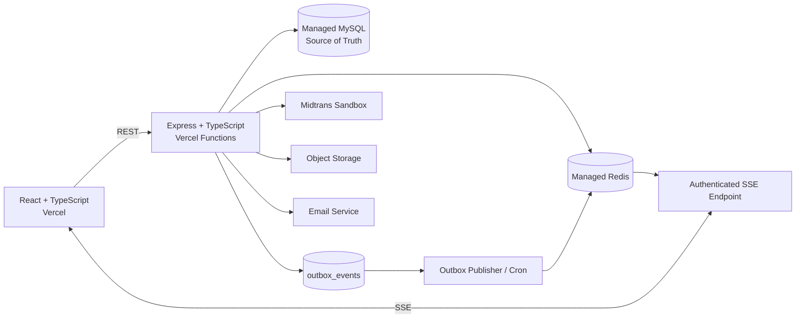
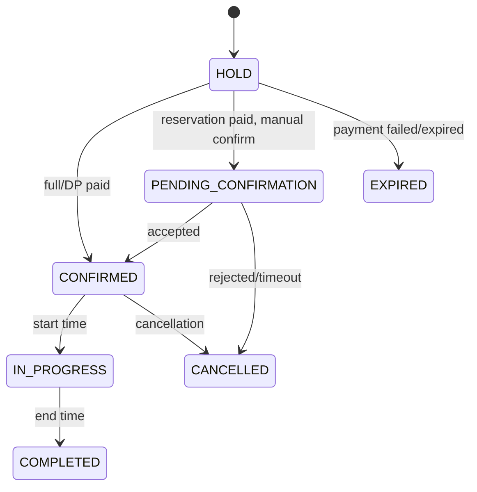
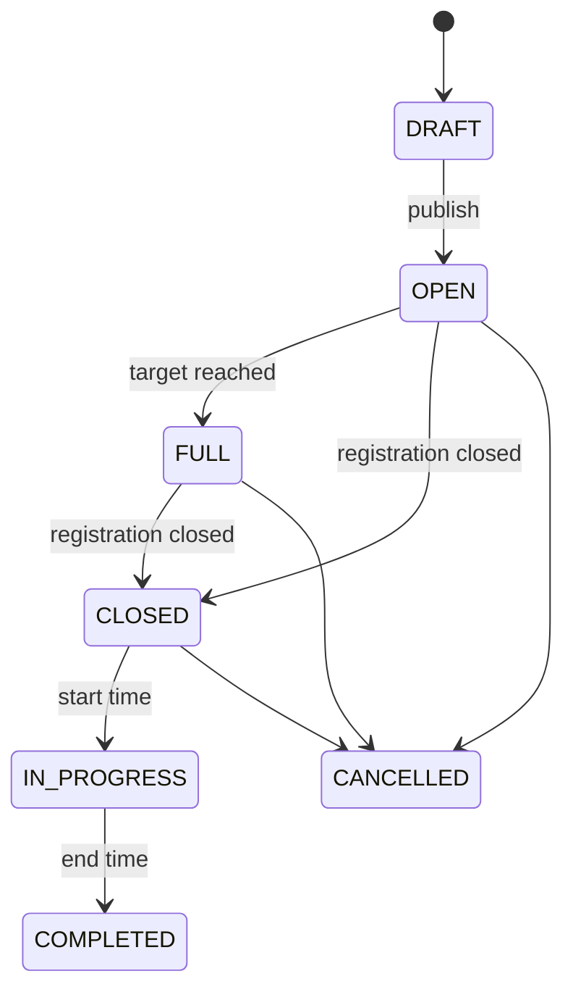

# LapanganGo Product Requirements Document (PRD)

**LapanganGo - Phase A, B1, B2, dan B3**

Spesifikasi produk, halaman, state machine, real-time, acceptance criteria, dan quality gate.

| Fase | Fokus |
|---|---|
| Phase A | High-Fidelity Interactive Prototype |
| Phase B1 | Core Booking |
| Phase B2 | Finance and Operations |
| Phase B3 | Mabar and Engagement |

> [!IMPORTANT]
> **Batas penggunaan**
>
> Dokumen ini adalah baseline produk untuk prototype dan demo sandbox. Pembayaran, saldo owner, settlement, dan payout pada Phase B tidak memindahkan uang nyata serta tidak boleh diklaim production-ready.

## Kontrol Dokumen

| **Elemen**      | **Nilai**                                                                       |
|-----------------|---------------------------------------------------------------------------------|
| Pemilik dokumen | Product Owner / Product Engineering                                             |
| Versi           | 1.1                                                                             |
| Status          | Baseline implementasi disetujui                                                 |
| Rujukan bisnis  | LapanganGo BRD v1.0                                                             |
| Rujukan data    | LapanganGo ERD Phase B v1.0                                                     |
| Fase            | A Prototype; B1 Core Booking; B2 Finance & Operations; B3 Mabar & Engagement    |
| Deployment demo | React/Express pada Vercel; managed MySQL/Redis/object storage; Midtrans Sandbox |
| Release gate    | Local readiness wajib lulus sebelum staging/deploy dan QA Project Owner          |

> [!NOTE]
> **Change control**
>
> Keputusan pada baseline ini tidak diubah secara diam-diam. Perubahan scope, aturan bisnis, state transition, atau data model wajib dicatat sebagai change request beserta dampak fase, risiko, dan acceptance criteria.

## Daftar Isi

- [1. Tujuan dan Prinsip Produk](#1-tujuan-dan-prinsip-produk)
  - [1.1 Prinsip Produk](#11-prinsip-produk)
  - [1.2 Product Outcomes](#12-product-outcomes)
- [2. Arsitektur dan Sumber Kebenaran](#2-arsitektur-dan-sumber-kebenaran)
  - [2.1 Deployment Boundary](#21-deployment-boundary)
  - [2.2 Transactional Outbox](#22-transactional-outbox)
- [3. Persona, Akun, dan Authorization](#3-persona-akun-dan-authorization)
  - [3.1 Identity dan Membership](#31-identity-dan-membership)
  - [3.2 Permission Model](#32-permission-model)
  - [3.3 Primary Owner Only](#33-primary-owner-only)
- [4. Information Architecture dan Routes](#4-information-architecture-dan-routes)
  - [4.1 Customer](#41-customer)
  - [4.2 Business Workspace](#42-business-workspace)
  - [4.3 Admin Platform](#43-admin-platform)
- [5. Design System dan UX Direction](#5-design-system-dan-ux-direction)
- [6. Phase A - Prototype](#6-phase-a-prototype)
  - [6.1 Scope dan Definition of Done](#61-scope-dan-definition-of-done)
  - [6.2 Prototype User Flows](#62-prototype-user-flows)
  - [6.3 Phase A Exit Criteria](#63-phase-a-exit-criteria)
- [7. Phase B1 - Core Booking](#7-phase-b1-core-booking)
  - [7.1 Authentication dan Multi-Tenant](#71-authentication-dan-multi-tenant)
  - [7.2 Venue Catalog](#72-venue-catalog)
  - [7.3 Schedule dan Availability](#73-schedule-dan-availability)
  - [7.4 Pricing](#74-pricing)
  - [7.5 Search dan Detail Venue](#75-search-dan-detail-venue)
  - [7.6 Booking dan Attendance](#76-booking-dan-attendance)
  - [7.7 Payment Sandbox](#77-payment-sandbox)
  - [7.8 Owner/Admin Operations](#78-owneradmin-operations)
  - [7.9 B1 Critical Flow](#79-b1-critical-flow)
  - [7.10 B1 Local Readiness Gate](#710-b1-local-readiness-gate)
- [8. Phase B2 - Finance and Operations](#8-phase-b2-finance-and-operations)
  - [8.1 Commission dan Trial](#81-commission-dan-trial)
  - [8.2 Promotion](#82-promotion)
  - [8.3 Cancellation, Refund, dan Reschedule](#83-cancellation-refund-dan-reschedule)
  - [8.4 Ledger, Earning, dan Payout Simulation](#84-ledger-earning-dan-payout-simulation)
  - [8.5 Staff Permission dan Audit](#85-staff-permission-dan-audit)
  - [8.6 Notification, Review, dan Support](#86-notification-review-dan-support)
  - [8.7 B2 Finance Calculation Order](#87-b2-finance-calculation-order)
- [9. Phase B3 - Mabar and Engagement](#9-phase-b3-mabar-and-engagement)
  - [9.1 Mabar](#91-mabar)
  - [9.2 Engagement](#92-engagement)
  - [9.3 Mabar Seat Algorithm](#93-mabar-seat-algorithm)
- [10. State Machines dan Invariants](#10-state-machines-dan-invariants)
  - [10.1 Domain Status](#101-domain-status)
  - [10.2 Booking Transition Matrix](#102-booking-transition-matrix)
  - [10.3 Payment Attempt Transition Rules](#103-payment-attempt-transition-rules)
  - [10.4 Refund, Earning, dan Payout](#104-refund-earning-dan-payout)
  - [10.5 Mabar State](#105-mabar-state)
- [11. Real-Time Event Model](#11-real-time-event-model)
  - [11.1 Event Envelope](#111-event-envelope)
  - [11.2 Event Catalog](#112-event-catalog)
  - [11.3 Reconnect Strategy](#113-reconnect-strategy)
- [12. Nonfunctional Requirements](#12-nonfunctional-requirements)
  - [12.1 Accessibility dan Responsive Checklist](#121-accessibility-dan-responsive-checklist)
  - [12.2 Data Retention dan Delete](#122-data-retention-dan-delete)
- [13. Testing, QA, dan Release Gates](#13-testing-qa-dan-release-gates)
  - [13.1 Test Pyramid](#131-test-pyramid)
  - [13.2 Release Gates](#132-release-gates)
  - [13.3 Master Acceptance Criteria](#133-master-acceptance-criteria)
- [14. Observability, Analytics, dan Operations](#14-observability-analytics-dan-operations)
  - [14.1 Technical Observability](#141-technical-observability)
  - [14.2 Product Analytics Events](#142-product-analytics-events)
- [15. API dan Data Interaction Conventions](#15-api-dan-data-interaction-conventions)
  - [15.1 REST](#151-rest)
  - [15.2 Example Error](#152-example-error)
  - [15.3 Transaction Rules](#153-transaction-rules)
- [16. Seed Data, Out of Scope, dan Traceability](#16-seed-data-out-of-scope-dan-traceability)
  - [16.1 Seed Data](#161-seed-data)
  - [16.2 Out of Scope A-B3](#162-out-of-scope-a-b3)
  - [16.3 Traceability Map](#163-traceability-map)

## 1. Tujuan dan Prinsip Produk

PRD ini menerjemahkan baseline bisnis LapanganGo menjadi requirement implementasi yang dapat diuji. Dokumen mencakup prototype Phase A dan target demo terintegrasi Phase B1-B3. Setiap requirement mempunyai ID, fase, kebutuhan, serta acceptance/catatan untuk menjaga traceability.

| Kolom 1 | Kolom 2 | Kolom 3 |
| --- | --- | --- |
| **CORE INVARIANT**<br>**1 slot = 1 booking**<br>Constraint terakhir berada di MySQL. | **DELIVERY**<br>**A -> B1 -> B2 -> B3**<br>Setiap transisi melewati QA gate. | **BOUNDARY**<br>**Sandbox only**<br>Tidak ada uang atau payout nyata. |

### 1.1 Prinsip Produk

| **Prinsip**                          | **Implikasi**                                                               |
|--------------------------------------|-----------------------------------------------------------------------------|
| **Availability must be trustworthy** | UI, cache, dan event tidak boleh mengesahkan slot tanpa transaksi database. |
| **Business state is explicit**       | Booking, attendance, payment, refund, earning, dan payout dipisahkan.       |
| **Snapshot over recalculation**      | Transaksi lama memakai snapshot harga, promo, komisi, fee, dan policy.      |
| **Tenant isolation by default**      | Tenant/user/venue scope dibawa pada setiap read, write, event, dan export.  |
| **Realtime is enhancement**          | SSE meningkatkan UX; REST dan server state tetap authoritative.             |
| **Prototype before infrastructure**  | Phase A memvalidasi alur; backend baru dimulai setelah QA manual.           |
| **Local readiness before deployment** | Implementasi dan QA lokal ditutup sebelum staging atau deploy dimulai.      |
| **Sandbox is visibly sandbox**       | Tidak ada layar atau laporan yang mengesankan uang nyata.                   |
| **Scale through boundaries**         | Domain service, repository, adapter provider, outbox, dan feature-based UI. |

### 1.2 Product Outcomes

- Customer menemukan venue/slot dan menyelesaikan full, DP, atau pay-at-venue secara mandiri.

- Owner menjalankan jadwal, booking, pembayaran, staff, refund, dan laporan tanpa spreadsheet.

- Admin mengendalikan master data, verifikasi, commission, policy template, promo budget, dispute, dan audit.

- Mabar mengubah booking confirmed menjadi aktivitas komunitas tanpa oversell dan tanpa keuntungan creator.

- Engineering dapat membuktikan no double booking, idempotency, ledger explainability, dan tenant isolation.

## 2. Arsitektur dan Sumber Kebenaran



Gambar 1. Arsitektur demo Phase B.

| **Komponen**     | **Tanggung Jawab**                                                              | **Bukan Tanggung Jawab**                         |
|------------------|---------------------------------------------------------------------------------|--------------------------------------------------|
| React SPA        | UI, routing, local interaction, countdown, SSE client, refetch.                 | Menentukan booking/payment state secara mandiri. |
| Express API      | Auth, validation, domain service, transaction, authorization, provider adapter. | Menyimpan state penting di memory function.      |
| MySQL            | Source of truth, constraints, snapshots, state, ledger, outbox.                 | Realtime fan-out.                                |
| Redis            | Lock, cache, event pub/sub/stream, distributed coordination.                    | Sumber kebenaran availability/finance.           |
| SSE              | Server-to-client notification dan reconnect.                                    | Menjalankan write business command.              |
| Cron/jobs        | Expiry cleanup, outbox retry, reminder, earning release, payout simulation.     | Menjadi satu-satunya cara hold dianggap expired. |
| Midtrans Sandbox | Simulasi payment provider.                                                      | Menentukan booking lifecycle internal.           |
| Object storage   | Venue media dan private document object.                                        | Menyimpan relational metadata.                   |

### 2.1 Deployment Boundary

Bagian ini menentukan target runtime demo, bukan urutan pengerjaan. Provisioning,
staging, dan deploy hanya dimulai setelah **B1 Local Readiness Gate** pada bagian 7.10
lulus dan hasilnya dicatat. Ketersediaan provider cloud tidak boleh dipakai untuk
menandai requirement lokal selesai atau mengalihkan fokus sebelum blocker lokal nol.

```text
Urutan delivery:
- Implementasi lokal
- Automated QA dan manual QA lokal
- Local readiness accepted
- Provisioning/deploy staging
- QA staging dan Project Owner sign-off

Demo:
- Frontend React -> Vercel
- Express API / SSE / jobs -> Vercel Functions
- MySQL -> managed database
- Redis -> managed Redis
- Media -> object storage
- Payment -> Midtrans Sandbox
Future:
- Backend + worker pindah ke VPS/always-on runtime
ketika user/revenue menutup biaya.
- Domain/API/database contract tidak ditulis ulang.
```

### 2.2 Transactional Outbox

Setiap perubahan bisnis yang membutuhkan event ditulis bersama outbox event dalam transaksi MySQL yang sama. Publisher memproses outbox setelah commit, mempublikasikan ke Redis, lalu SSE memberitahu client. Client menggunakan event sebagai sinyal untuk mengambil ulang resource authoritative.

> [!IMPORTANT]
> **Critical constraint**
>
> Tidak boleh ada alur yang menulis booking lalu hanya mengandalkan publish Redis tanpa outbox. Publish gagal tidak boleh menghilangkan perubahan real-time secara permanen.

## 3. Persona, Akun, dan Authorization

| **Persona**       | **Tujuan**                                                        | **Fitur Utama**                                                                |
|-------------------|-------------------------------------------------------------------|--------------------------------------------------------------------------------|
| Customer          | Mencari, booking, membayar, mengelola booking, review, dan Mabar. | Search, checkout, Booking Saya, favorite, ticket, Mabar.                       |
| Primary Owner     | Mengendalikan organisasi dan risiko finansial.                    | Tenant, owner/member, payout account, legal data, workspace, audit.            |
| Owner / Manager   | Mengelola venue dan performa.                                     | Venue, court, schedule, price, promo, booking, finance, reports.               |
| Operational Staff | Menjalankan aktivitas harian.                                     | Calendar, offline booking, confirmation, check-in, balance due.                |
| Finance Staff     | Meninjau payment/refund/ledger/export.                            | Finance views sesuai permission.                                               |
| Admin Apps        | Mengoperasikan platform.                                          | Verification, masters, commission, promo budget, disputes, audit, integration. |

### 3.1 Identity dan Membership

```text
User identity
├── Customer capability (default)
├── Tenant Membership A
│ ├── role
│ ├── custom permissions
│ └── venue assignments
└── Tenant Membership B
Platform Admin
└── separate admin assignment and route
```

### 3.2 Permission Model

| **Layer**          | **Check**                                           |
|--------------------|-----------------------------------------------------|
| Identity           | Apakah session valid dan user aktif?                |
| Platform role      | Apakah route membutuhkan admin platform?            |
| Tenant membership  | Apakah user anggota tenant target dan status aktif? |
| Permission         | Apakah role/member memiliki action permission?      |
| Venue assignment   | Apakah resource venue termasuk assignment member?   |
| Resource invariant | Apakah state/resource ownership mengizinkan aksi?   |

### 3.3 Primary Owner Only

- Mengganti payout account.

- Memindahkan Primary Owner.

- Menghapus/menutup tenant.

- Mengubah data legal production.

- Menyetujui co-owner baru.

- Mengakses atau mengatur integration credentials.

> [!NOTE]
> **Authorization acceptance**
>
> Frontend menyembunyikan menu yang tidak diizinkan, tetapi backend harus tetap mengembalikan 403 untuk command/read yang tidak sah. Query dengan resource ID milik tenant lain tidak boleh menghasilkan data leakage.

## 4. Information Architecture dan Routes

### 4.1 Customer

| **Route**                   | **Halaman**           | **Isi**                                              |
|-----------------------------|-----------------------|------------------------------------------------------|
| /                           | Landing Page          | Hero search, recommendation sections, Mabar preview. |
| /venues                     | Cari Venue            | Filter, sorting, infinite scroll, map/list.          |
| /venues/:slug               | Detail Venue          | Gallery, facilities, courts, policy, review summary. |
| /venues/:slug/book          | Booking Lapangan      | Date, court, realtime slot grid, multi-slot.         |
| /checkout/:bookingId        | Checkout              | Snapshot, add-on, promo, full/DP/pay-at-venue.       |
| /payments/:attemptId        | Pembayaran            | Provider redirect/embed dan countdown.               |
| /payments/:attemptId/result | Hasil Pembayaran      | Verified state/pending/failure, sandbox label.       |
| /bookings                   | Booking Saya          | Filter lifecycle/payment/date.                       |
| /bookings/:id               | Detail Booking        | QR, balance, cancel, reschedule, refund status.      |
| /mabar                      | Daftar Mabar          | Search/filter/list.                                  |
| /mabar/:id                  | Detail Mabar          | Info, participants, seat, waitlist.                  |
| /mabar/create/:bookingId    | Buat Mabar            | Confirmed booking source.                            |
| /mabar/:id/manage           | Kelola Mabar          | Host controls, approval, announcement, transfer.     |
| /favorites                  | Favorit               | Venue dan Mabar.                                     |
| /history                    | Riwayat Dilihat       | Venue recently viewed.                               |
| /notifications              | Notifikasi            | In-app feed.                                         |
| /reviews                    | Review Saya           | Review eligible/submitted.                           |
| /support                    | Tiket Bantuan         | List/create/detail.                                  |
| /profile                    | Profil dan Pengaturan | Account, notification preference.                    |

### 4.2 Business Workspace

| **Route**                                         | **Workflow**                   | **Isi**                                                                        |
|---------------------------------------------------|--------------------------------|--------------------------------------------------------------------------------|
| /business/:tenant/overview                        | Beranda                        | Ringkasan, jadwal hari ini, actions, activity.                                 |
| /business/:tenant/operations/calendar             | Operasional / Kalender         | All venue, venue, atau court view.                                             |
| /business/:tenant/operations/bookings             | Operasional / Booking          | Online/offline/pending/upcoming/completed.                                     |
| /business/:tenant/operations/bookings/new-offline | Booking Offline                | Walk-in/WhatsApp/phone/social.                                                 |
| /business/:tenant/operations/check-in             | Check-in                       | QR/code and attendance.                                                        |
| /business/:tenant/operations/outstanding          | Outstanding Payment            | Balance DP dan pay-at-venue.                                                   |
| /business/:tenant/venues                          | Kelola Venue                   | List/create/private/published.                                                 |
| /business/:tenant/venues/:venueId/profile         | Profil dan Media               | Venue data, gallery, facility, add-on.                                         |
| /business/:tenant/venues/:venueId/courts          | Lapangan                       | Court and sport.                                                               |
| /business/:tenant/venues/:venueId/availability    | Ketersediaan                   | Hours, weekly, exceptions, blocks, buffer.                                     |
| /business/:tenant/venues/:venueId/pricing         | Harga                          | Base, weekday, day/time, special date, preview.                                |
| /business/:tenant/venues/:venueId/policies        | Kebijakan                      | Payment, DP, pay-at-venue, refund, reschedule, no-show.                        |
| /business/:tenant/finance                         | Keuangan / Ringkasan           | Sandbox gross, net, balance, earning.                                          |
| /business/:tenant/finance/transactions            | Transaksi                      | Payment attempts and booking finance.                                          |
| /business/:tenant/finance/refunds                 | Refund dan Sengketa            | Review/status/manual-required.                                                 |
| /business/:tenant/finance/ledger                  | Ledger                         | Double-entry explorer.                                                         |
| /business/:tenant/finance/payouts                 | Payout Simulasi                | Batch/items/status.                                                            |
| /business/:tenant/growth/promotions               | Customer & Pertumbuhan / Promo | Owner promo.                                                                   |
| /business/:tenant/growth/reviews                  | Review                         | Reply and reporting.                                                           |
| /business/:tenant/growth/support                  | Tiket                          | Related tickets.                                                               |
| /business/:tenant/growth/mabar                    | Mabar di Venue                 | Read-only operational view.                                                    |
| /business/:tenant/team                            | Tim                            | Members, invite, role, permission, assignments.                                |
| /business/:tenant/notifications                   | Notifikasi                     | Operational feed.                                                              |
| /business/:tenant/settings                        | Pengaturan                     | Organization, verification, payment, payout, notification, audit, integration. |

### 4.3 Admin Platform

| **Route**                   | **Halaman**                | **Isi**                                        |
|-----------------------------|----------------------------|------------------------------------------------|
| /admin                      | Dashboard                  | Platform KPIs, pending work, integration/cron. |
| /admin/customers            | Customer                   | Search, status, history, moderation.           |
| /admin/tenants              | Owner dan Tenant           | Review membership/business.                    |
| /admin/verifications        | Verifikasi Owner           | Approve/reject/revision simulated docs.        |
| /admin/venues               | Venue                      | Submission, active, suspended.                 |
| /admin/masters/sports       | Master Olahraga            | CRUD + active status.                          |
| /admin/masters/facilities   | Master Fasilitas           | CRUD + proposal review.                        |
| /admin/masters/scheduling   | Master Interval dan Buffer | Options and limits.                            |
| /admin/templates/payments   | Template Pembayaran        | DP/reservation/deadline options.               |
| /admin/templates/refunds    | Template Refund            | Policy and tiers.                              |
| /admin/templates/mabar      | Template Pembatalan Mabar  | Participant policy.                            |
| /admin/commissions          | Komisi dan Trial           | Default, override, effective history.          |
| /admin/promotions           | Promo Platform             | Budget and scopes.                             |
| /admin/bookings             | Booking                    | Cross-platform support view.                   |
| /admin/payments             | Pembayaran                 | Provider attempts/events.                      |
| /admin/refunds              | Refund dan Sengketa        | Decision/execution.                            |
| /admin/finance              | Ledger Platform            | Snapshot, ledger, earning.                     |
| /admin/payouts              | Payout Simulasi            | Batch and failure simulation.                  |
| /admin/reviews              | Review dan Laporan         | Moderation.                                    |
| /admin/support              | Tiket Bantuan              | Assignment and resolution.                     |
| /admin/audit                | Audit Log                  | Immutable activity explorer.                   |
| /admin/config/notifications | Konfigurasi Notifikasi     | Events/templates/options.                      |
| /admin/system               | Status Integrasi dan Cron  | Health, outbox, webhook, jobs.                 |

## 5. Design System dan UX Direction

Arah visual adalah marketplace olahraga modern, bersih, profesional, ringan, dan image-forward. 21st.dev digunakan sebagai sumber pola/source komponen, lalu dinormalisasi menjadi design system internal LapanganGo. Komponen tidak ditempel langsung tanpa review responsivitas, accessibility, dependency, dan style consistency.

| **Pattern Sumber**       | **Adaptasi LapanganGo**                                             |
|--------------------------|---------------------------------------------------------------------|
| Search-led hero          | Sport, location, date, dan CTA Cari Lapangan.                       |
| Header with search       | Search overlay, favorite, account, mobile drawer.                   |
| Photo listing card       | Venue image, sport, rating, location, price from, promo, next slot. |
| Interactive map/list     | Venue markers dan synchronized result list.                         |
| Venue gallery            | Desktop gallery; mobile carousel/lightbox.                          |
| Calendar scheduler       | Date + slot grid; contiguous multi-slot; realtime states.           |
| Checkout layout          | Booking details, add-on, promo, payment choice, price breakdown.    |
| Mobile bottom navigation | Beranda, Cari, Mabar, Booking, Profil.                              |
| Business sidebar         | Workflow groups, collapsible desktop, mobile drawer.                |
| KPI cards and data grid  | Owner/admin metrics, booking, transaction, ledger, staff.           |

| **Token**     | **Baseline**                                                                 |
|---------------|------------------------------------------------------------------------------|
| Primary       | Emerald / forest green.                                                      |
| Neutral       | Slate + off-white.                                                           |
| Attention     | Amber pending; red destructive; blue confirmed; green success.               |
| Typography    | Plus Jakarta Sans atau Inter-compatible internal selection.                  |
| Radius        | 12-16px untuk card/container; controls konsisten.                            |
| Motion        | 150-250ms; hanya feedback/transisi, bukan dekorasi berat.                    |
| Accessibility | Status selalu memakai text/icon selain warna; focus visible; keyboard-first. |

- Customer UI prioritizes imagery, availability, and clear booking CTA.

- Business/Admin UI prioritizes dense but scannable workflow, filters, action queue, and data tables.

- Tidak menggunakan 3D/particle/heavy glassmorphism pada critical flows.

- Komponen UI berada di components/ui; komponen domain berada di feature modules.

- Loading, empty, error, success, disabled, expired, reconnecting, dan stale states harus dirancang.

> [!NOTE]
> **PHASE A - High-Fidelity Interactive Prototype**
>
> Validasi alur dan desain menggunakan React + TypeScript tanpa backend.

## 6. Phase A - Prototype

### 6.1 Scope dan Definition of Done

| **ID** | **Fase** | **Kebutuhan**                                                                                                     | **Acceptance / Catatan**                                                     |
|--------|----------|-------------------------------------------------------------------------------------------------------------------|------------------------------------------------------------------------------|
| A-001  | A        | Aplikasi React + TypeScript dapat dijalankan tanpa backend.                                                       | Semua data berasal dari fixtures lokal; tidak ada network dependency bisnis. |
| A-002  | A        | Tersedia role switcher untuk Customer, Owner, Staff, dan Admin.                                                   | Pergantian role tidak memerlukan akun nyata dan dapat di-reset.              |
| A-003  | A        | Prototype responsive pada mobile, tablet, dan desktop.                                                            | Tidak ada overflow horizontal pada lebar 360px.                              |
| A-004  | A        | Customer dapat menelusuri landing, pencarian, detail venue, slot, checkout, hasil pembayaran, booking, dan Mabar. | Seluruh CTA utama menuju state/halaman yang relevan.                         |
| A-005  | A        | Owner dapat menelusuri Beranda, Operasional, Venue, Jadwal, Harga, Booking, dan ringkasan Keuangan.               | Data mock konsisten antarhalaman.                                            |
| A-006  | A        | Staff melihat subset menu sesuai permission mock.                                                                 | Menu sensitif tersembunyi dan state unauthorized tersedia.                   |
| A-007  | A        | Admin dapat menelusuri dashboard, user/tenant, venue review, olahraga, komisi, promo, refund, dan konfigurasi.    | Approve/reject/revision dapat disimulasikan.                                 |
| A-008  | A        | Prototype menyediakan loading, empty, error, success, disabled, dan validation states.                            | State tidak hanya happy path.                                                |
| A-009  | A        | Tersedia data demo dan tombol reset.                                                                              | Reset mengembalikan fixture ke baseline.                                     |
| A-010  | A        | Pembayaran, refund, saldo, payout, dan dokumen legal diberi label simulasi.                                       | Tidak ada UI yang menyiratkan uang/dokumen nyata.                            |
| A-011  | A        | Design component dinormalisasi ke token LapanganGo.                                                               | Tidak ada campuran visual 21st.dev yang tidak konsisten.                     |
| A-012  | A        | QA manual Project Owner menjadi gate Phase B1.                                                                    | Daftar temuan ditutup atau diterima sebagai known limitation.                |

### 6.2 Prototype User Flows

| **Flow**           | **Langkah**                                                                                                                             |
|--------------------|-----------------------------------------------------------------------------------------------------------------------------------------|
| Customer booking   | Landing -> search -> filter/map -> venue detail -> date/court/slot -> checkout -> payment simulation -> result -> Booking Saya. |
| Owner setup        | Role switch -> workspace -> create venue -> add court -> weekly schedule -> pricing -> preview -> submit publication.            |
| Owner operations   | Dashboard -> calendar -> pending confirmation -> booking detail -> check-in -> outstanding balance.                                |
| Admin verification | Admin -> verification queue -> review simulated docs -> revision/approve -> venue publication.                                      |
| Mabar              | Confirmed booking -> create Mabar -> publish -> participant joins -> seat/waitlist -> host manage.                                 |

### 6.3 Phase A Exit Criteria

- Semua requirement A-001 sampai A-012 lulus.

- Critical screens tersedia pada 360px, tablet, dan desktop.

- Mock data konsisten dan resettable.

- Project Owner menutup/accept seluruh temuan QA.

- Scope B1 dan known design debt dicatat sebelum backend dimulai.

> [!NOTE]
> **PHASE B1 - Core Booking**
>
> Membuat sumber kebenaran booking, payment sandbox, availability, dan operasi dasar.

## 7. Phase B1 - Core Booking

### 7.1 Authentication dan Multi-Tenant

| **ID**      | **Fase** | **Kebutuhan**                                                         | **Acceptance / Catatan**                                                        |
|-------------|----------|-----------------------------------------------------------------------|---------------------------------------------------------------------------------|
| B1-AUTH-001 | B1       | Customer dapat browse venue tanpa login.                              | Login baru diwajibkan ketika checkout atau aksi akun.                           |
| B1-AUTH-002 | B1       | Registrasi email/password meminta nama, email, telepon, dan password. | Email unik; validasi server; password tidak dicatat di log.                     |
| B1-AUTH-003 | B1       | Login Google tersedia sebagai opsi.                                   | Akun social dapat ditautkan tanpa menggandakan identitas.                       |
| B1-AUTH-004 | B1       | Mode Customer dan Workspace Bisnis tersedia dalam satu identitas.     | Context aktif terlihat jelas; route admin terpisah.                             |
| B1-AUTH-005 | B1       | Session/token disimpan secara aman.                                   | Tidak menyimpan credential sensitif di localStorage; logout mengakhiri session. |
| B1-AUTH-006 | B1       | Access check dilakukan server-side.                                   | Route/menu client bukan pengganti authorization.                                |

| **ID**     | **Fase** | **Kebutuhan**                                                                  | **Acceptance / Catatan**                                   |
|------------|----------|--------------------------------------------------------------------------------|------------------------------------------------------------|
| B1-TEN-001 | B1       | Pengguna dapat membuat tenant dalam status DRAFT.                              | Tenant belum dapat mempublikasikan venue sebelum approval. |
| B1-TEN-002 | B1       | Satu tenant memiliki tepat satu Primary Owner aktif.                           | Transfer ownership transaksional dan diaudit.              |
| B1-TEN-003 | B1       | Satu user dapat memiliki membership pada beberapa tenant.                      | Workspace switcher hanya menampilkan membership aktif.     |
| B1-TEN-004 | B1       | Admin dapat approve, reject, atau meminta revisi menggunakan dokumen simulasi. | Reason wajib; histori review tersimpan.                    |
| B1-TEN-005 | B1       | Staff dapat di-assign ke beberapa venue dalam tenant yang sama.                | Query operasional dibatasi assignment.                     |
| B1-TEN-006 | B1       | Tenant dan venue memakai status aktif/nonaktif/suspended, bukan hard delete.   | Transaksi historis tetap dapat dibaca sesuai otorisasi.    |

### 7.2 Venue Catalog

| **ID**     | **Fase** | **Kebutuhan**                                                                                                                        | **Acceptance / Catatan**                          |
|------------|----------|--------------------------------------------------------------------------------------------------------------------------------------|---------------------------------------------------|
| B1-VEN-001 | B1       | Owner dapat membuat venue sebagai private draft.                                                                                     | Preview tersedia sebelum pengajuan publikasi.     |
| B1-VEN-002 | B1       | Venue menyimpan profil, alamat administratif, koordinat, telepon, timezone, jam, aturan, parkir, indoor/outdoor, dan kontak darurat. | Field wajib divalidasi sebelum submit.            |
| B1-VEN-003 | B1       | Owner memilih olahraga dari master admin.                                                                                            | Tidak ada free-text sport pada venue/court.       |
| B1-VEN-004 | B1       | Venue dapat memiliki banyak olahraga dan banyak lapangan.                                                                            | Satu lapangan hanya satu olahraga.                |
| B1-VEN-005 | B1       | Venue memilih fasilitas master dan dapat mengelola add-on sederhana.                                                                 | Add-on tanpa inventory; snapshot pada booking.    |
| B1-VEN-006 | B1       | Foto venue tersimpan di object storage publik terkontrol.                                                                            | Validasi tipe, ukuran, jumlah; metadata di MySQL. |
| B1-VEN-007 | B1       | Owner mengajukan publikasi; admin approve/reject/revision.                                                                           | Venue hanya searchable bila APPROVED + ACTIVE.    |
| B1-VEN-008 | B1       | Admin mengelola master olahraga, fasilitas, interval, buffer, dan payment option.                                                    | Master inactive tidak mengubah transaksi lama.    |

### 7.3 Schedule dan Availability

| **ID**     | **Fase** | **Kebutuhan**                                                                             | **Acceptance / Catatan**                                   |
|------------|----------|-------------------------------------------------------------------------------------------|------------------------------------------------------------|
| B1-SCH-001 | B1       | Setiap lapangan memiliki weekly schedule.                                                 | Jam dapat berbeda per hari; timezone mengikuti venue.      |
| B1-SCH-002 | B1       | Special date exception dapat membuka, menutup, atau mengubah jam.                         | Exception mengalahkan weekly schedule.                     |
| B1-SCH-003 | B1       | Owner dapat membuat block maintenance, internal event, court closure, atau venue closure. | Block tidak boleh diam-diam menimpa booking aktif.         |
| B1-SCH-004 | B1       | Interval dipilih dari opsi admin.                                                         | Default opsi 30, 45, 60, 90, 120 menit; configurable.      |
| B1-SCH-005 | B1       | Customer dapat memilih beberapa slot berurutan.                                           | Durasi tidak melebihi batas court/platform.                |
| B1-SCH-006 | B1       | Buffer dipilih owner dari opsi admin.                                                     | Buffer ikut menutup availability.                          |
| B1-SCH-007 | B1       | Booking window dan minimum lead time configurable.                                        | Owner memilih dari pilihan platform.                       |
| B1-SCH-008 | B1       | Slot online dan offline menggunakan satu mekanisme reservation.                           | Court slot aktif tidak dapat dimiliki dua booking.         |
| B1-SCH-009 | B1       | Closure pada periode ber-booking menampilkan impacted booking.                            | Owner memilih cancel/reschedule dan customer dinotifikasi. |
| B1-SCH-010 | B1       | Availability dihitung dari MySQL source of truth.                                         | Redis/cache tidak dapat mengesahkan booking.               |

### 7.4 Pricing

| **ID**     | **Fase** | **Kebutuhan**                                                       | **Acceptance / Catatan**                                         |
|------------|----------|---------------------------------------------------------------------|------------------------------------------------------------------|
| B1-PRI-001 | B1       | Harga mendukung base, weekday/weekend, day/time, dan special date.  | Prioritas tetap: special > day/time > weekday/weekend > base. |
| B1-PRI-002 | B1       | Court-specific rule mengalahkan venue-wide fallback.                | Rule terpilih dapat dijelaskan pada preview.                     |
| B1-PRI-003 | B1       | Overlap ditolak pada level/scope/court/periode aktif yang sama.     | UI menunjukkan rule penyebab konflik.                            |
| B1-PRI-004 | B1       | Rentang waktu memakai interval \[start,end).                        | Rule berakhir 20:00 boleh diikuti rule mulai 20:00.              |
| B1-PRI-005 | B1       | Harga setiap slot dijumlahkan dan add-on ditambahkan sebelum promo. | Semua line item disimpan sebagai snapshot.                       |
| B1-PRI-006 | B1       | Harga A/B dianggap final termasuk kewajiban pajak owner.            | Tax engine tidak dihitung.                                       |
| B1-PRI-007 | B1       | Preview harga tersedia sebelum rule diaktifkan.                     | Owner dapat memeriksa beberapa tanggal dan jam.                  |

### 7.5 Search dan Detail Venue

| **ID**     | **Fase** | **Kebutuhan**                                                                                                                  | **Acceptance / Catatan**                                     |
|------------|----------|--------------------------------------------------------------------------------------------------------------------------------|--------------------------------------------------------------|
| B1-SRC-001 | B1       | Search filter mencakup nama, sport, kota/area, tanggal, jam, price, indoor/outdoor, facility, rating, payment mode, dan promo. | Filter utama terlihat; sisanya di Filter Lainnya.            |
| B1-SRC-002 | B1       | Hasil memuat 20 venue per batch dengan infinite scroll.                                                                        | Retry dan empty state tersedia.                              |
| B1-SRC-003 | B1       | Sorting mendukung relevan, terdekat, harga, rating, popularitas, dan terbaru.                                                  | Default paling relevan.                                      |
| B1-SRC-004 | B1       | Venue dapat ditampilkan pada peta dan fitur dekat saya.                                                                        | Penolakan location permission tidak memblokir manual search. |
| B1-SRC-005 | B1       | Venue card menampilkan foto, nama, lokasi, rating, sport, harga mulai, promo, dan slot terdekat.                               | Data snapshot pencarian tidak dipakai untuk checkout final.  |
| B1-SRC-006 | B1       | Detail venue menampilkan galeri, fasilitas, lapangan, kebijakan, review summary, dan schedule entry point.                     | URL dapat dibagikan.                                         |

### 7.6 Booking dan Attendance

| **ID**     | **Fase** | **Kebutuhan**                                                                    | **Acceptance / Catatan**                                  |
|------------|----------|----------------------------------------------------------------------------------|-----------------------------------------------------------|
| B1-BKG-001 | B1       | Checkout membuat booking HOLD dan reservation slot selama 10 menit.              | expires_at server authoritative; countdown client lokal.  |
| B1-BKG-002 | B1       | Full payment, DP, dan pay-at-venue tersedia sesuai setting venue.                | Metode tidak tersedia tidak dapat dipaksakan melalui API. |
| B1-BKG-003 | B1       | DP memakai persentase dari opsi admin.                                           | Booking confirmed setelah DP paid; balance_due tercatat.  |
| B1-BKG-004 | B1       | Pay-at-venue memakai reservation amount sebagai bagian dari total.               | Bukan service fee tambahan; mengurangi balance due.       |
| B1-BKG-005 | B1       | Manual confirmation timeout dipilih owner dari opsi admin, default 30 menit.     | Reject/timeout membatalkan dan refund reservation 100%.   |
| B1-BKG-006 | B1       | Booking offline dapat dibuat tanpa user customer.                                | Sumber dan creator staff tercatat; tidak dikenai komisi.  |
| B1-BKG-007 | B1       | Offline price adjustment memerlukan permission + alasan.                         | Before/after masuk audit log.                             |
| B1-BKG-008 | B1       | Customer melihat Booking Saya, detail, QR/code, payment status, dan balance due. | Data tenant lain tidak terekspos.                         |
| B1-BKG-009 | B1       | Staff dapat check-in menggunakan QR/code.                                        | Attendance terpisah dari lifecycle booking.               |
| B1-BKG-010 | B1       | No-show dapat ditandai setelah grace period owner, default 15 menit.             | Booking tetap completed secara finansial.                 |
| B1-BKG-011 | B1       | Payment late setelah slot expired tidak menghidupkan booking lama.               | Masuk refund flow; slot baru tetap sah.                   |
| B1-BKG-012 | B1       | Booking state transition tidak valid ditolak backend.                            | Semua transition mencatat actor/reason/time.              |

### 7.7 Payment Sandbox

| **ID**     | **Fase** | **Kebutuhan**                                                            | **Acceptance / Catatan**                                           |
|------------|----------|--------------------------------------------------------------------------|--------------------------------------------------------------------|
| B1-PAY-001 | B1       | Setiap attempt pembayaran disimpan terpisah.                             | DP, pelunasan, reservation, retry tidak saling menimpa.            |
| B1-PAY-002 | B1       | Provider adapter menerjemahkan status Midtrans ke status internal.       | Booking tidak membaca status provider mentah.                      |
| B1-PAY-003 | B1       | Webhook diverifikasi dan idempotent.                                     | provider_event_id/signature tidak diproses dua kali.               |
| B1-PAY-004 | B1       | Payment summary dihitung dari successful attempts dan refunds.           | UNPAID/PARTIALLY_PAID/PAID/PARTIALLY_REFUNDED/REFUNDED.            |
| B1-PAY-005 | B1       | Full/DP/reservation transaction expiry diselaraskan dengan hold.         | Expiry mismatch dipantau dan tidak menyebabkan double allocation.  |
| B1-PAY-006 | B1       | Pelunasan online mengikuti deadline option venue.                        | Jika venue hanya online: grace 30 menit lalu cancel sesuai policy. |
| B1-PAY-007 | B1       | Sandbox boundary terlihat pada checkout, result, dashboard, dan finance. | Tidak ada klaim dana nyata.                                        |

### 7.8 Owner/Admin Operations

| **ID**     | **Fase** | **Kebutuhan**                                                                                                        | **Acceptance / Catatan**                                                               |
|------------|----------|----------------------------------------------------------------------------------------------------------------------|----------------------------------------------------------------------------------------|
| B1-OPS-001 | B1       | Owner dashboard menampilkan jadwal hari ini, availability, pending confirmation, outstanding balance, dan aktivitas. | Dapat difilter tenant/venue.                                                           |
| B1-OPS-002 | B1       | Kalender menunjukkan online/offline booking, block, maintenance, hold, dan confirmed state.                          | Realtime update tanpa manual refresh.                                                  |
| B1-OPS-003 | B1       | Admin dashboard menampilkan tenant/venue pending, user, booking, sandbox volume, dan integration status dasar.       | Nilai diberi label sandbox.                                                            |
| B1-OPS-004 | B1       | Business navigation mengikuti workflow disepakati.                                                                   | Beranda, Operasional, Kelola Venue, Keuangan, Customer & Pertumbuhan, Tim, Pengaturan. |
| B1-OPS-005 | B1       | Staff memakai shell yang sama, dibatasi permission dan venue assignment.                                             | Unauthorized route menghasilkan 403 konsisten.                                         |

### 7.9 B1 Critical Flow

```text
1. Client meminta availability.
2. Client memilih contiguous slots.
3. API membuka transaction.
4. API validasi schedule, block, booking window, price, dan active reservation.
5. API menulis booking HOLD + slot reservations + price snapshot + outbox.
6. Commit.
7. API membuat Midtrans Sandbox attempt.
8. Verified webhook -> payment PAID -> booking CONFIRMED -> outbox.
9. Expired/failure -> booking EXPIRED -> reservations dilepas secara transaksional.
```

> [!WARNING]
> **B1 release blocker**
>
> B1 tidak dapat dianggap selesai bila concurrency test slot belum membuktikan maksimal satu active reservation atau webhook duplicate masih dapat menggandakan payment/transition.

> [!NOTE]
> **PHASE B2 - Finance and Operations**
>
> Menambahkan commission, promo, refund, ledger, permission, trust, dan reporting.

### 7.10 B1 Local Readiness Gate

B1 harus diselesaikan dan dibuktikan pada environment lokal sebelum provisioning,
staging, atau deploy dikerjakan. Provider eksternal boleh memakai adapter sandbox,
emulator, atau test double selama kontrak, validasi, authorization, idempotency, dan
failure path tetap diuji. Pengujian provider nyata dilakukan kemudian pada staging.

Local readiness dinyatakan lulus hanya jika:

1. Seluruh 67 requirement B1 mempunyai implementasi lokal dan status traceability yang
   dapat dibuktikan; tidak ada `missing` atau `partial` lokal.
2. Migration dapat dijalankan dari database MySQL 8 kosong dan seed realistis dapat
   dijalankan ulang tanpa fixture drift.
3. Unit, integration, security, concurrency, API contract, E2E, route smoke, formatter,
   lint, type-check, dan production build lokal lulus.
4. Lima puluh request pada slot yang sama menghasilkan maksimal satu active reservation,
   dan duplicate webhook/event tidak menggandakan state.
5. Customer, Owner, Staff, dan Admin lulus pada 360x800, 768x1024, 1024x768, dan
   1440x900 dalam light/dark mode tanpa overflow, browser error, API 5xx, atau temuan
   accessibility serius/kritis.
6. Realtime lokal memenuhi core maksimal dua detik, reconnect/resync/REST fallback
   terbukti, dan kegagalan Redis tidak membatalkan booking atau payment authoritative.
7. Bukti test, screenshot, known limitations, traceability, serta temuan QA diperbarui;
   blocker lokal berjumlah nol.
8. Project Owner meninjau hasil lokal dan menyatakan B1 siap masuk staging. Persetujuan
   ini adalah izin memulai validasi staging, bukan sign-off akhir B1.

Sebelum delapan kondisi tersebut terpenuhi, pekerjaan staging/deploy tidak menjadi
prioritas dan tidak boleh menggantikan penyelesaian defect lokal. Perubahan konfigurasi
cloud yang sudah terlanjur tersedia boleh dipertahankan, tetapi tidak dianggap sebagai
bukti local readiness.

## 8. Phase B2 - Finance and Operations

### 8.1 Commission dan Trial

| **ID**     | **Fase** | **Kebutuhan**                                                                     | **Acceptance / Catatan**                                           |
|------------|----------|-----------------------------------------------------------------------------------|--------------------------------------------------------------------|
| B2-COM-001 | B2       | Admin mengatur default commission rate melalui input.                             | Tidak hard-coded; versioned effective period.                      |
| B2-COM-002 | B2       | Admin dapat override per tenant.                                                  | Reason, start, end opsional, actor, dan audit wajib.               |
| B2-COM-003 | B2       | Trial 0% berakhir berdasarkan hari atau completed booking, mana lebih dulu.       | Limit configurable.                                                |
| B2-COM-004 | B2       | Gateway fee selama trial dapat owner-funded atau platform-subsidized per program. | Subsidy memiliki budget/period.                                    |
| B2-COM-005 | B2       | Commission base = court + eligible add-ons - owner-funded discount.               | Platform promo tidak mengurangi owner entitlement/commission base. |
| B2-COM-006 | B2       | Commission PENDING saat payment, EARNED saat completed, REVERSED saat refund.     | Snapshot rate tidak berubah.                                       |

### 8.2 Promotion

| **ID**     | **Fase** | **Kebutuhan**                                                                                                                                          | **Acceptance / Catatan**                         |
|------------|----------|--------------------------------------------------------------------------------------------------------------------------------------------------------|--------------------------------------------------|
| B2-PRO-001 | B2       | Admin dan owner dapat membuat promo sesuai scope.                                                                                                      | Owner tidak dapat menarget tenant lain.          |
| B2-PRO-002 | B2       | Promo mendukung percent/fixed, min amount, max discount, dates, hours, quota, per-user limit, first booking, payment method, tenant/venue/sport/court. | Validasi server lengkap.                         |
| B2-PRO-003 | B2       | Hanya satu code per booking dan case-insensitive.                                                                                                      | Tidak ada stacking.                              |
| B2-PRO-004 | B2       | Platform promo wajib memiliki budget, quota, max subsidy, period, allowed scopes, dan auto-stop.                                                       | Budget reservation mencegah overspend.           |
| B2-PRO-005 | B2       | Redemption dan budget usage transaksional.                                                                                                             | Concurrency tidak melebihi quota/budget.         |
| B2-PRO-006 | B2       | Promo line dan funding source disimpan di booking snapshot.                                                                                            | Perubahan promo tidak memodifikasi booking lama. |

### 8.3 Cancellation, Refund, dan Reschedule

| **ID**     | **Fase** | **Kebutuhan**                                                          | **Acceptance / Catatan**                                     |
|------------|----------|------------------------------------------------------------------------|--------------------------------------------------------------|
| B2-REF-001 | B2       | Admin membuat cancellation/refund template dan tiers.                  | Owner memilih template; tidak free-form.                     |
| B2-REF-002 | B2       | Baseline tier: >=24h 100%, 6-24h 50%, <6h 0%.                        | Perhitungan memakai timezone venue.                          |
| B2-REF-003 | B2       | Refund auto jika policy terpenuhi; owner exception; admin dispute.     | Decision actor dan reason tersimpan.                         |
| B2-REF-004 | B2       | Refund state mendukung manual-required dan failed/retry.               | Execution dipisah dari policy decision.                      |
| B2-REF-005 | B2       | Aggregate refund tidak melebihi paid amount.                           | Constraint/service invariant diuji.                          |
| B2-REF-006 | B2       | Owner cancel/system fault menghasilkan refund penuh komponen customer. | Komisi/earning reversed.                                     |
| B2-REF-007 | B2       | Reschedule satu kali, minimal 24 jam, dengan price difference.         | Slot lama baru dilepas setelah slot/payment adjustment aman. |
| B2-REF-008 | B2       | Refund eligibility setelah reschedule memakai rule lebih ketat.        | Mencegah refund laundering.                                  |
| B2-REF-009 | B2       | Late payment setelah expired diarahkan ke refund.                      | Tidak mengubah booking yang telah expired.                   |

### 8.4 Ledger, Earning, dan Payout Simulation

| **ID**     | **Fase** | **Kebutuhan**                                                                                                                                                                     | **Acceptance / Catatan**                         |
|------------|----------|-----------------------------------------------------------------------------------------------------------------------------------------------------------------------------------|--------------------------------------------------|
| B2-FIN-001 | B2       | Financial snapshot menjelaskan gross, add-on, owner/platform discount, commission, gateway fee, owner net, reservation/DP, dan tax placeholder.                                   | Immutable per booking version.                   |
| B2-FIN-002 | B2       | Ledger double-entry dan balanced per transaction.                                                                                                                                 | Posted entries tidak diedit.                     |
| B2-FIN-003 | B2       | Owner earning: PENDING -> AVAILABLE -> RESERVED_FOR_PAYOUT -> PAID_OUT / REVERSED.                                                                                             | Available setelah completed + 1 hari.            |
| B2-FIN-004 | B2       | Payout batch mingguan otomatis dan manual khusus.                                                                                                                                 | Minimum admin-configurable, default Rp100.000.   |
| B2-FIN-005 | B2       | Refund setelah payout membuat negative adjustment.                                                                                                                                | Payout dibekukan bila balance negatif.           |
| B2-FIN-006 | B2       | Dashboard finance mencakup online/offline revenue, DP, balance due, cash, discount, commission, fee, refund, held/available balance, payout, net, trends, venue/court comparison. | Semua nilai sandbox.                             |
| B2-FIN-007 | B2       | Ledger/payout simulation tidak memanggil transfer nyata.                                                                                                                          | UI dan export berlabel simulasi.                 |
| B2-FIN-008 | B2       | Transaction dispute membekukan earning terkait.                                                                                                                                   | Tiket biasa tidak membekukan.                    |
| B2-FIN-009 | B2       | CSV dan Excel export tersedia untuk booking, payment, refund, payout, promo, staff activity, dan offline booking.                                                                 | Export mengikuti timezone/filter dan permission. |

### 8.5 Staff Permission dan Audit

| **ID**      | **Fase** | **Kebutuhan**                                                                                                                                | **Acceptance / Catatan**                            |
|-------------|----------|----------------------------------------------------------------------------------------------------------------------------------------------|-----------------------------------------------------|
| B2-PERM-001 | B2       | Platform menyediakan role template: Venue Manager, Operator Booking, Kasir, Finance, Schedule Manager.                                       | Template dapat dicopy.                              |
| B2-PERM-002 | B2       | Owner dapat menyesuaikan permission per role.                                                                                                | Permission granular dan tenant-scoped.              |
| B2-PERM-003 | B2       | Member dapat diassign ke venue tertentu.                                                                                                     | Data di luar assignment ditolak.                    |
| B2-PERM-004 | B2       | Primary Owner-only action meliputi payout account, ownership transfer, tenant delete, legal data, co-owner approval, integration credential. | Tidak dapat didelegasikan tanpa change requirement. |
| B2-PERM-005 | B2       | Sensitive action mencatat before/after, actor, tenant, venue, time, IP, user-agent, reason.                                                  | Audit tidak dapat dihapus owner/staff/admin biasa.  |

### 8.6 Notification, Review, dan Support

| **ID**     | **Fase** | **Kebutuhan**                                                                        | **Acceptance / Catatan**                      |
|------------|----------|--------------------------------------------------------------------------------------|-----------------------------------------------|
| B2-NOT-001 | B2       | In-app dan email notification untuk event customer/owner yang disepakati.            | Critical notification tidak dapat dimatikan.  |
| B2-NOT-002 | B2       | Reminder option dikonfigurasi admin dan dipilih owner.                               | Default 24 jam + 2 jam.                       |
| B2-NOT-003 | B2       | Notification delivery idempotent dan preference-aware.                               | Tidak mengirim duplicate untuk event_id sama. |
| B2-REV-001 | B2       | Hanya booking COMPLETED dapat membuat satu review.                                   | Booking ownership diverifikasi.               |
| B2-REV-002 | B2       | Review berisi rating, comment, cleanliness, court quality, facility, service, value. | Foto review ditunda.                          |
| B2-REV-003 | B2       | Customer edit maksimal 7 hari; owner reply; report/moderation admin.                 | Owner tidak menghapus review.                 |
| B2-SUP-001 | B2       | Support ticket sederhana dengan category dan message thread.                         | Transaction dispute flag terkontrol.          |
| B2-SUP-002 | B2       | Admin dapat menugaskan, mengubah status, dan mencatat resolution.                    | Audit tersedia.                               |

### 8.7 B2 Finance Calculation Order

```text
Selected slot price rules
-> court price subtotal
+ eligible add-ons
= gross service value
- owner-funded promo
= commission base
x commission rate snapshot
= platform commission
- platform-funded promo subsidy (platform expense)
- gateway fee allocation
= owner entitlement / platform margin components
All values -> booking financial snapshot -> balanced ledger.
```

> [!WARNING]
> **Ledger invariant**
>
> Setiap ledger transaction harus balance debit = credit. Snapshot menjelaskan perhitungan; ledger menjelaskan pergerakan nilai. Keduanya tidak saling menggantikan.

> [!NOTE]
> **PHASE B3 - Mabar and Engagement**
>
> Mengembangkan engagement setelah core transaction dan finance stabil.

## 9. Phase B3 - Mabar and Engagement

### 9.1 Mabar

| **ID**     | **Fase** | **Kebutuhan**                                                                                                                      | **Acceptance / Catatan**                                         |
|------------|----------|------------------------------------------------------------------------------------------------------------------------------------|------------------------------------------------------------------|
| B3-MAB-001 | B3       | Customer hanya dapat membuat Mabar dari booking CONFIRMED.                                                                         | Full, DP, atau pay-at-venue diizinkan.                           |
| B3-MAB-002 | B3       | Status Mabar: DRAFT, OPEN, FULL, CLOSED, IN_PROGRESS, COMPLETED, CANCELLED.                                                        | Transition invalid ditolak.                                      |
| B3-MAB-003 | B3       | Creator dihitung satu peserta dan target <= court capacity.                                                                       | Target seats tidak dapat oversell.                               |
| B3-MAB-004 | B3       | Seat price = shared booking + shared add-ons dibagi target.                                                                        | Dikunci saat publish; creator boleh subsidi, tidak boleh profit. |
| B3-MAB-005 | B3       | Mabar gratis diizinkan.                                                                                                            | Kontribusi peserta bernilai nol.                                 |
| B3-MAB-006 | B3       | Public/private dan auto-join/approval didukung.                                                                                    | Private memakai invite code.                                     |
| B3-MAB-007 | B3       | Seat hold 10 menit dan participant contribution simulation.                                                                        | Expired hold membuka kursi.                                      |
| B3-MAB-008 | B3       | Waitlist FIFO memberi peserta pertama hold 10 menit.                                                                               | Concurrency tidak melewati target.                               |
| B3-MAB-009 | B3       | Peserta tidak penuh tidak membatalkan Mabar.                                                                                       | Creator menanggung kursi kosong.                                 |
| B3-MAB-010 | B3       | Admin membuat cancellation policy template; creator memilih.                                                                       | Removed by creator refund simulasi 100% + reason.                |
| B3-MAB-011 | B3       | Creator tidak dapat keluar tanpa transfer host atau cancel.                                                                        | Host transfer hanya ke JOINED participant.                       |
| B3-MAB-012 | B3       | Cancel booking utama membatalkan Mabar dan refund simulasi 100%.                                                                   | Participant/seat state ditutup atomik.                           |
| B3-MAB-013 | B3       | Reschedule booking utama mengubah jadwal dan meminta participant accept/exit.                                                      | Exit memperoleh refund simulasi 100%.                            |
| B3-MAB-014 | B3       | Mabar menyediakan description, rules, participant list, announcement, report, level, category, position, equipment, meeting point. | Nomor telepon tidak publik; tanpa live chat.                     |
| B3-MAB-015 | B3       | Owner hanya melihat Mabar terkait venue untuk operasional.                                                                         | Owner tidak mengubah participant/host.                           |

### 9.2 Engagement

| **ID**     | **Fase** | **Kebutuhan**                                                                            | **Acceptance / Catatan**                         |
|------------|----------|------------------------------------------------------------------------------------------|--------------------------------------------------|
| B3-ENG-001 | B3       | Customer dapat favorite venue dan Mabar.                                                 | Unique per user/resource.                        |
| B3-ENG-002 | B3       | Recently viewed venue dicatat dengan retensi terkontrol.                                 | Dapat dibersihkan/di-anonimkan.                  |
| B3-ENG-003 | B3       | Repeat booking memuat court/date preference tetapi revalidasi price/availability.        | Tidak menyalin snapshot lama sebagai harga baru. |
| B3-ENG-004 | B3       | Landing recommendation sections memakai admin picks, nearby, promo, popular, dan newest. | Tidak ada AI personalization.                    |
| B3-ENG-005 | B3       | Report Mabar/participant masuk moderation queue.                                         | Reason dan reporter tercatat.                    |

### 9.3 Mabar Seat Algorithm

```text
Join:
- lock Mabar row / seat counter
- verify OPEN and remaining capacity
- create seat hold with expires_at + 10 minutes
- commit + outbox
Complete simulation:
- verify active hold owned by user
- create/update participant JOINED
- consume hold
- update occupied seats/version
- commit + outbox
Waitlist:
- FIFO by joined_at
- when seat opens, promote first eligible entry to 10-minute hold
```

## 10. State Machines dan Invariants



Gambar 2. Booking lifecycle.

### 10.1 Domain Status

| **Domain**        | **Status**                                                                               |
|-------------------|------------------------------------------------------------------------------------------|
| Booking           | HOLD, PENDING_CONFIRMATION, CONFIRMED, IN_PROGRESS, COMPLETED, CANCELLED, EXPIRED        |
| Attendance        | PENDING, CHECKED_IN, NO_SHOW                                                             |
| Payment Attempt   | CREATED, PENDING, PAID, FAILED, EXPIRED, CANCELLED, PARTIALLY_REFUNDED, REFUNDED         |
| Payment Summary   | UNPAID, PARTIALLY_PAID, PAID, PARTIALLY_REFUNDED, REFUNDED                               |
| Refund            | REQUESTED, APPROVED, REJECTED, PROCESSING, MANUAL_REQUIRED, SUCCEEDED, FAILED, CANCELLED |
| Owner Earning     | PENDING, AVAILABLE, RESERVED_FOR_PAYOUT, PAID_OUT, REVERSED                              |
| Payout            | DRAFT, SCHEDULED, PROCESSING, SUCCEEDED, FAILED, CANCELLED                               |
| Mabar             | DRAFT, OPEN, FULL, CLOSED, IN_PROGRESS, COMPLETED, CANCELLED                             |
| Mabar Participant | PENDING_APPROVAL, PAYMENT_PENDING, JOINED, WAITLISTED, CANCELLED, REMOVED, NO_SHOW       |

### 10.2 Booking Transition Matrix

| **From**             | **Event / Guard**               | **To**               | **Side Effects**                         |
|----------------------|---------------------------------|----------------------|------------------------------------------|
| \-                   | Checkout valid + slots reserved | HOLD                 | expires_at +10m, price snapshot, outbox. |
| HOLD                 | Full/DP paid verified           | CONFIRMED            | payment summary, slot remains allocated. |
| HOLD                 | Reservation paid + manual venue | PENDING_CONFIRMATION | confirm deadline.                        |
| HOLD                 | Payment/hold expired            | EXPIRED              | release slot, outbox.                    |
| PENDING_CONFIRMATION | Owner accepts before deadline   | CONFIRMED            | audit + notification.                    |
| PENDING_CONFIRMATION | Reject/timeout                  | CANCELLED            | release slot, 100% reservation refund.   |
| CONFIRMED            | Start time / operational action | IN_PROGRESS          | attendance remains independent.          |
| CONFIRMED            | Valid cancellation              | CANCELLED            | refund decision, slot release.           |
| IN_PROGRESS          | End time                        | COMPLETED            | start earning buffer.                    |
| CONFIRMED            | End time without attendance     | COMPLETED            | attendance NO_SHOW when marked.          |

### 10.3 Payment Attempt Transition Rules

| **From**           | **Allowed To**                   | **Rule**                                                                    |
|--------------------|----------------------------------|-----------------------------------------------------------------------------|
| CREATED            | PENDING, FAILED, CANCELLED       | Provider transaction creation outcome.                                      |
| PENDING            | PAID, FAILED, EXPIRED, CANCELLED | Verified provider event/status only.                                        |
| PAID               | PARTIALLY_REFUNDED, REFUNDED     | Refund aggregate <= paid.                                                  |
| FAILED             | \-                               | Terminal; retry creates new attempt.                                        |
| EXPIRED            | \-                               | Terminal; late success handled via reconciliation/refund, not resurrection. |
| CANCELLED          | \-                               | Terminal.                                                                   |
| PARTIALLY_REFUNDED | PARTIALLY_REFUNDED, REFUNDED     | Additional refund within cap.                                               |
| REFUNDED           | \-                               | Terminal.                                                                   |

### 10.4 Refund, Earning, dan Payout

| **Domain**         | **Invariant**                                                                                    |
|--------------------|--------------------------------------------------------------------------------------------------|
| Refund             | Decision terpisah dari execution; total successful/processing refund tidak melebihi paid amount. |
| Earning            | AVAILABLE hanya setelah booking COMPLETED + buffer dan tidak ada dispute freeze.                 |
| Payout             | Payout item hanya mengambil earning AVAILABLE dan memindahkannya RESERVED_FOR_PAYOUT.            |
| Payout success     | Earning menjadi PAID_OUT; failure mengembalikan sesuai retry policy.                             |
| Post-payout refund | Membuat negative adjustment; tidak mengedit payout lama.                                         |

### 10.5 Mabar State



| **Invariant**      | **Rule**                                                              |
|--------------------|-----------------------------------------------------------------------|
| Origin             | Mabar memiliki satu booking CONFIRMED dan jadwal/court sama.          |
| Capacity           | JOINED + active seat holds tidak melebihi target seats.               |
| Price              | Seat price fixed saat publish; tidak profit; subsidy creator allowed. |
| Host               | Tepat satu host active; host keluar harus transfer/cancel.            |
| Booking cancel     | Mabar CANCELLED, seats closed, contribution simulation refunded.      |
| Booking reschedule | Event schedule updated; participants accept/exit.                     |

## 11. Real-Time Event Model

| **ID** | **Fase** | **Kebutuhan**                                                                                   | **Acceptance / Catatan**                              |
|--------|----------|-------------------------------------------------------------------------------------------------|-------------------------------------------------------|
| RT-001 | B1       | Slot HOLD/CONFIRMED/CANCELLED/EXPIRED terlihat <=2 detik setelah commit.                       | SSE + refetch authoritative resource.                 |
| RT-002 | B1       | Booking online/offline, confirmation, reschedule, cancellation, dan check-in muncul <=2 detik. | Owner/staff tidak perlu refresh.                      |
| RT-003 | B2       | Payment status UI diperbarui <=5 detik setelah verified webhook.                               | Duplicate notification tidak mengubah state dua kali. |
| RT-004 | B2       | Refund, dispute, earning, payout simulation, notification, dan KPI dapat dipush.                | Client tetap dapat refetch.                           |
| RT-005 | B3       | Seat count, waitlist, join/cancel, full state diperbarui <=2 detik.                            | Tidak oversell.                                       |
| RT-006 | B1-B3    | Client reconnect otomatis dan full resync.                                                      | Status Menghubungkan kembali terlihat.                |
| RT-007 | B1-B3    | Event duplicate/out-of-order tidak menurunkan version/state.                                    | Client/server memakai version.                        |
| RT-008 | B1-B3    | SSE channel mengautorisasi tenant/user/resource.                                                | Tidak dapat subscribe dengan menebak channel.         |
| RT-009 | B1-B3    | REST/refresh fallback tersedia bila realtime gagal.                                             | Fungsi inti tetap berjalan.                           |

### 11.1 Event Envelope

```json
{
  "eventId": "uuid",
  "eventType": "booking.updated",
  "resourceType": "booking",
  "resourceId": "uuid",
  "tenantId": "uuid-or-null",
  "version": 17,
  "occurredAt": "2026-08-25T08:00:00Z",
  "hint": {
    "bookingStatus": "CONFIRMED"
  }
}
```

### 11.2 Event Catalog

| **Event**               | **Audience**                                              | **Client Action**                 |
|-------------------------|-----------------------------------------------------------|-----------------------------------|
| court_slot.changed      | Customer viewing court/date; authorized business members. | Refetch availability range.       |
| booking.created/updated | Booking owner; tenant members with permission.            | Refetch booking/calendar queue.   |
| payment.updated         | Booking owner; finance/operational members.               | Refetch payment summary.          |
| refund.updated          | Booking owner; authorized finance/admin.                  | Refetch refund + finance.         |
| earning.updated         | Authorized finance members.                               | Refetch balance/KPI.              |
| notification.created    | Specific user.                                            | Append/refetch notification feed. |
| mabar.updated           | Host/participants/viewers based visibility.               | Refetch detail/list.              |
| mabar.seats_changed     | Mabar viewers/participants.                               | Refetch capacity/waitlist.        |

### 11.3 Reconnect Strategy

- Client menyimpan last event ID/version per stream bila didukung.

- Disconnect menampilkan status Menghubungkan kembali.

- Reconnect menggunakan exponential backoff dengan batas.

- Setelah reconnect, client melakukan full resync pada resource aktif.

- Event dengan version <= local version diabaikan.

- Authorization dievaluasi saat connect dan ketika membership berubah.

## 12. Nonfunctional Requirements

| **ID**  | **Fase** | **Kebutuhan**                                                                                    | **Acceptance / Catatan**                               |
|---------|----------|--------------------------------------------------------------------------------------------------|--------------------------------------------------------|
| NFR-001 | B1-B3    | TypeScript strict untuk frontend/backend.                                                        | Build gagal pada type error.                           |
| NFR-002 | B1-B3    | Arsitektur feature-based, business service layer, repository/data access, dan provider adapters. | Domain logic tidak berada di controller/component.     |
| NFR-003 | B1-B3    | API read p95 target <2 detik di luar cold start/provider; critical write <3 detik.             | Diukur pada demo environment.                          |
| NFR-004 | B1-B3    | 50 request concurrent untuk slot sama menghasilkan maksimal satu active reservation.             | Test evidence tersimpan.                               |
| NFR-005 | B1-B3    | Responsive minimum 360px; dua versi terbaru browser utama.                                       | Critical flow diuji.                                   |
| NFR-006 | B1-B3    | WCAG AA baseline: keyboard, focus, label, contrast, text+icon status.                            | Audit critical pages.                                  |
| NFR-007 | B1-B3    | Structured log, request ID, error tracking, health endpoint, cron/outbox monitoring.             | Tidak mencatat secret/credential.                      |
| NFR-008 | B1-B3    | MySQL migration dan seed data versioned.                                                         | Rollback/forward strategy terdokumentasi.              |
| NFR-009 | B1-B3    | Unit test price/promo/permission/state; integration booking/payment; E2E customer core.          | Gate per phase.                                        |
| NFR-010 | B1-B3    | Object media optimized; private document signed URLs.                                            | No binary blobs in MySQL.                              |
| NFR-011 | B1-B3    | Database time UTC dan venue timezone IANA.                                                       | Perhitungan policy memakai venue timezone.             |
| NFR-012 | B1-B3    | Error format konsisten dan tidak membocorkan internals.                                          | Client dapat menampilkan pesan actionable.             |
| NFR-013 | B1-B3    | Critical data soft delete/immutable sesuai lifecycle.                                            | Booking/payment/refund/ledger/audit tidak hard delete. |
| NFR-014 | B1-B3    | Sandbox labels konsisten.                                                                        | Tidak ada kebingungan uang nyata.                      |

### 12.1 Accessibility dan Responsive Checklist

- Semua actionable control dapat dicapai dan dioperasikan dengan keyboard.

- Focus tidak hilang ketika dialog/sheet ditutup.

- Form mempunyai label, help, validation summary, dan error terhubung.

- Slot state tidak hanya dibedakan oleh warna.

- Data table memiliki mobile alternative atau horizontal strategy yang disengaja.

- Map tidak menjadi satu-satunya cara memilih venue.

- Reduced-motion preference dihormati.

### 12.2 Data Retention dan Delete

| **Data**                                   | **Perilaku**                                                                        |
|--------------------------------------------|-------------------------------------------------------------------------------------|
| Venue/court/add-on                         | Soft delete atau inactive.                                                          |
| Booking/payment/refund/ledger/payout/audit | Tidak dihapus; correction melalui reversal/adjustment.                              |
| Customer deletion request                  | Account disabled lalu personal identifiers dianonimkan sesuai retention policy.     |
| Tenant closure                             | Workspace dinonaktifkan; transaksi dan legal retention tetap.                       |
| Media                                      | Object replacement/versioning; orphan cleanup terjadwal.                            |
| Outbox/inbox                               | Retensi configurable setelah processed; ID tetap tersedia untuk idempotency window. |

## 13. Testing, QA, dan Release Gates

### 13.1 Test Pyramid

| **Level**   | **Coverage Minimum**                                                                                                                               |
|-------------|----------------------------------------------------------------------------------------------------------------------------------------------------|
| Unit        | Price resolver, conflict detector, promo eligibility/budget, commission, refund tier, permission, state transition, seat price.                    |
| Integration | Slot reservation transaction, online/offline collision, payment webhook idempotency, refund cap, ledger balance, payout reservation, outbox/inbox. |
| E2E         | Browse -> full payment; DP + balance; pay-at-venue manual; offline booking; check-in; cancel/refund; owner setup; Mabar join/waitlist.            |
| Concurrency | 50 checkout attempts same slot; promo quota; platform budget; Mabar seat hold.                                                                     |
| Security    | Tenant IDOR, permission bypass, event subscription, signed URL, rate limit, secret/log leakage.                                                    |
| Manual QA   | Responsive, content clarity, workflow, empty/error/reconnect/sandbox state.                                                                        |

### 13.2 Release Gates

| **Gate**                     | **Must Pass**                                                                                           |
|------------------------------|---------------------------------------------------------------------------------------------------------|
| A -> B1                     | Prototype requirements complete; manual QA accepted; design debt logged.                                |
| B1 local readiness          | Seluruh kondisi bagian 7.10 lulus; blocker lokal nol; Project Owner menyatakan siap staging.            |
| B1 staging acceptance       | Deploy sehat; provider sandbox terverifikasi; QA staging dan realtime SLO lulus; sign-off Project Owner. |
| B1 -> B2                    | Local readiness dan staging acceptance lulus; no double booking dan tenant isolation tetap terbukti.    |
| B2 -> B3                    | Ledger balance/explainability; refund/reschedule; commission/promo; permission; export; sandbox labels. |
| B3 complete                  | Mabar capacity/seat concurrency; cancellation propagation; engagement features; full regression.        |
| Future production            | Legal/provider/KYC review; real settlement design; infra/SLA/runbook/backup/monitoring.                  |

Staging adalah tahap validasi setelah kesiapan lokal, bukan cara untuk menyelesaikan
implementasi lokal. Kegagalan staging dicatat sebagai defect environment/integration dan
tidak boleh menutupi regression lokal yang belum ditutup.

### 13.3 Master Acceptance Criteria

| **ID** | **Acceptance**                                                                |
|--------|-------------------------------------------------------------------------------|
| AC-001 | Maksimal satu booking aktif untuk court slot yang sama.                       |
| AC-002 | Online/offline booking menggunakan slot source yang sama.                     |
| AC-003 | Hold 10 menit dilepas tanpa mengandalkan cron sebagai satu-satunya mekanisme. |
| AC-004 | Webhook/event duplicate tidak menggandakan state atau ledger.                 |
| AC-005 | Customer menyelesaikan full/DP/pay-at-venue mandiri.                          |
| AC-006 | Owner mengelola operasional tanpa spreadsheet.                                |
| AC-007 | Staff dibatasi tenant, venue assignment, dan permission.                      |
| AC-008 | Tenant A tidak dapat membaca/mengubah/menerima event tenant B.                |
| AC-009 | Snapshot transaksi lama immutable terhadap config baru.                       |
| AC-010 | Refund aggregate <= paid.                                                    |
| AC-011 | Ledger menjelaskan gross hingga payout.                                       |
| AC-012 | Reschedule aman dari double booking/refund abuse.                             |
| AC-013 | Mabar tidak melewati capacity/target.                                         |
| AC-014 | Page inti responsive >=360px.                                                |
| AC-015 | Sensitive action audited.                                                     |
| AC-016 | Invalid transition rejected backend.                                          |
| AC-017 | Sandbox label tampil pada payment/finance/payout.                             |
| AC-018 | Realtime core <=2 detik; payment <=5 detik; reconnect/resync/fallback.      |

## 14. Observability, Analytics, dan Operations

### 14.1 Technical Observability

| **Signal**     | **Minimum Fields / Alert**                                                   |
|----------------|------------------------------------------------------------------------------|
| HTTP request   | request_id, route, method, status, latency, user/tenant IDs (non-sensitive). |
| Domain command | command, resource ID, actor, result, version.                                |
| Webhook        | provider event ID, verification result, mapped status, processing result.    |
| Outbox         | pending age, retry count, failed count, publish latency.                     |
| SSE            | connections, disconnect rate, reconnect, authorization failures.             |
| Cron/job       | last success, duration, processed count, failure reason.                     |
| Database       | pool/connection errors, slow queries, deadlocks, migration version.          |
| Redis          | availability, command errors, lock contention.                               |

### 14.2 Product Analytics Events

| **Event**              | **Key Properties**                          |
|------------------------|---------------------------------------------|
| venue_search           | filters, sort, result_count, location_mode. |
| venue_viewed           | venue_id, source_section, sport.            |
| slot_selected          | venue_id, court_id, date, slot_count.       |
| checkout_started       | payment_mode, gross, promo_attempted.       |
| booking_confirmed      | payment_mode, tenant_id, venue_id, sandbox. |
| booking_cancelled      | actor, reason, lead_time, refund_rate.      |
| owner_action_completed | action_type, venue_scope.                   |
| mabar_published        | visibility, target, seat_price, free.       |
| mabar_joined           | approval_mode, waitlist, simulated.         |

> [!IMPORTANT]
> **Privacy**
>
> Analytics tidak boleh memuat password, token, full payment payload, document URL private, atau unnecessary personal data. Event property mengikuti data minimization.

## 15. API dan Data Interaction Conventions

### 15.1 REST

| **Area**               | **Convention**                                                                                 |
|------------------------|------------------------------------------------------------------------------------------------|
| Base path              | /api/v1                                                                                        |
| IDs                    | Opaque UUID/ULID; tidak mengandalkan sequential ID sebagai authorization.                      |
| Error                  | { code, message, details?, requestId } dengan HTTP status konsisten.                           |
| Pagination             | Cursor untuk infinite lists; limit default 20.                                                 |
| Date/time              | ISO-8601 UTC; timezone venue ditampilkan eksplisit.                                            |
| Money                  | Integer minor/unit rupiah sesuai keputusan data model; tidak memakai floating point.           |
| Idempotency            | Idempotency-Key untuk command payment/refund/payout/critical create.                           |
| Optimistic concurrency | resource version / updated_at guard pada edit config sensitif.                                 |
| Filtering              | Whitelist parameter; tenant scope tidak berasal dari query client tanpa membership validation. |
| Audit reason           | Required field pada price override, rejection, manual refund, sensitive change.                |

### 15.2 Example Error

```json
{
  "code": "SLOT_ALREADY_RESERVED",
  "message": "Slot yang dipilih sudah tidak tersedia.",
  "details": {
    "courtId": "01H...",
    "slotStartsAt": "2026-08-25T12:00:00Z"
  },
  "requestId": "req_..."
}
```

### 15.3 Transaction Rules

- Command critical membuka transaction dan mengunci/validasi rows yang relevan.

- Outbox ditulis sebelum commit.

- External provider call sebisa mungkin dipisah dari transaction DB panjang; local intent disimpan dahulu.

- Webhook/inbox provider diproses idempotent.

- State version bertambah monoton.

- Audit dibuat dalam transaksi yang sama untuk sensitive write.

## 16. Seed Data, Out of Scope, dan Traceability

### 16.1 Seed Data

| **Entity**      | **Volume Baseline**                                                   |
|-----------------|-----------------------------------------------------------------------|
| Tenant          | 3                                                                     |
| Venue           | 6                                                                     |
| Court           | 12                                                                    |
| Sport           | 8-10                                                                  |
| Customer        | 30                                                                    |
| Staff           | 8                                                                     |
| Booking         | 50                                                                    |
| Offline booking | 10                                                                    |
| Payment/refund  | Variasi full, DP, pay-at-venue, failed, expired, partial/full refund. |
| Mabar           | 3 aktif, 1 full, 1 completed.                                         |

### 16.2 Out of Scope A-B3

- Real money/payment/payout dan production sub-merchant onboarding/KYC.

- KTP/NIB/PBG/SLF asli.

- Live chat, WhatsApp, push, native apps.

- Inventory, full accounting, tax engine, external accounting.

- AI recommendation, surge pricing, multi-currency, active multilingual UI.

- Real Mabar split payment/creator transfer.

- Subscription billing, chargeback automation, production SLA, Kubernetes/microservices.

### 16.3 Traceability Map

| **Dokumen / Keputusan** | **Requirement Area**                                                   |
|-------------------------|------------------------------------------------------------------------|
| Interview 1-30          | A, B1 auth/tenant/venue/schedule/pricing.                              |
| Interview 31-60         | B1 booking/payment; B2 commission/refund/finance; B3 Mabar foundation. |
| Interview 61-80         | B2 promo/permission/add-on/offline; B1 schedule/payment settings.      |
| Interview 81-100        | B1 search/verification; B2 review/notif/support/export; NFR.           |
| Interview 101-125       | State machines; payment/refund/earning/payout; complete Mabar.         |
| Interview 126-150       | Phase gates; price conflict; routes; design; real-time; acceptance.    |
| BRD v1.0                | Business rationale, scope, risk, operating model.                      |
| ERD v1.0                | Physical/logical entities, constraints, indexes, lifecycle.            |

> [!TIP]
> **Implementation baseline**
>
> Requirement baru atau perubahan rule wajib memperoleh ID baru, fase, acceptance criteria, data impact, migration impact, dan regression scope. Requirement yang dihapus tetap tercatat sebagai deprecated, bukan dihilangkan tanpa histori.
