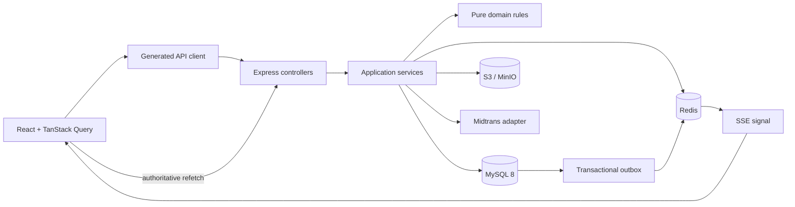
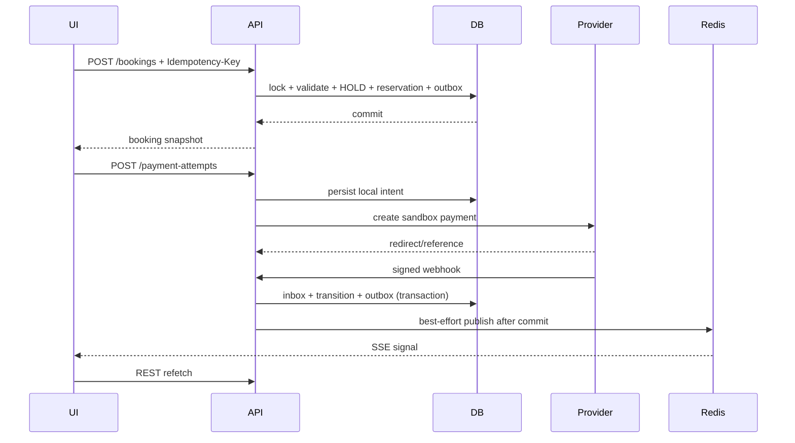

# Arsitektur Phase B1

Phase B1 memakai npm workspace dengan tiga boundary: `frontend` untuk presentasi,
`packages/api-client` untuk kontrak OpenAPI, dan `backend` untuk aturan aplikasi
serta adapter. MySQL adalah sumber kebenaran. Redis tidak pernah mengesahkan
booking atau payment.

## Dependency rule

- Controller memvalidasi transport dan meneruskan command.
- Application service mengatur transaction dan authorization-aware workflow.
- Domain helper menyimpan invariant tanpa bergantung Express, Drizzle, atau React.
- Repository/provider adapter menghadap infrastruktur.
- React component menggunakan API client; tidak ada `fetch` langsung pada feature.

## Booking, payment, dan realtime

